# FlexBox 完全指南
其实对于如何布局ui，让某个元素居中一直让我很头疼，今天看到了这个flexBox，这个旨在提供一个更有效的方式来布置，调整元素在一个容器中分布的空间，改变元素的宽度/高度还有顺序，以最好滴填充可用空间（其实主要是为了适应所有类型的显示设备）。<br>
flexbox布局与方向无关，并不是常规的布局（基于垂直块和给予水平块的内联块）。<br>
**这里要着重说明的一点** ❕ flexbox布局适用于应用程序的组件和小规模布局，而Grid布局则适用于更大规模的布局。接下来会有grid布局的介绍[]()<br>
### 基础知识和术语
container和items<br>
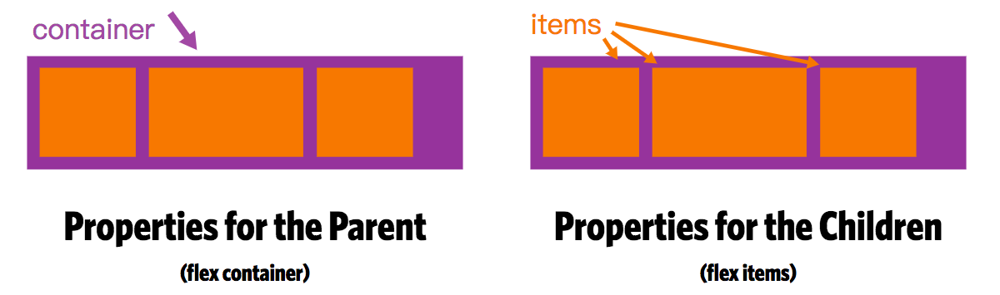<br>
* flex container
#### display
```css
.container{
  display:flex;
}
```
CSS列对flex容器没有影响<br>
#### flex-direction
这里建立了主轴，从而定义了flex项放置在flex容器中的方向。Flexbox是单向布局概念。可以将弹性项目视为主要布置在水平行或垂直列中。
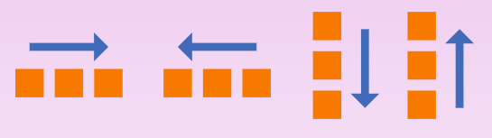<br>
```css
.container{
  flex-direction:row|row-reverse|column|column-reverse;
}
```
* row（默认）: 从左到右 ltr；从右到左rtl<br>
* row-reverse: 从左到右 ltr；从右到左rtl<br>
* column: 同样row，但从上到下<br>
* column: 同样row-reverse 但从下到上<br>
效果代码：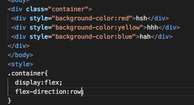    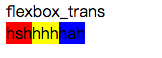<br>

#### flex-wrap
默认情况下，flex都会尝试适合一行。您可以更改它并允许项目根据需要使用此属性进行换行。<br>
```css
.container{
  flex-wrap:nowrap|wrap|wrap-reverse;
}
```
* nowrap(默认值)：所有弹性项目都在一行上<br>
* wrap：flex项目将从上到下包裹到多行。<br>
* wrap-reverse: flex将从下到上包裹多行。<br>
#### flex-flow(parent flex container元素)
这个简写了flex-direction和flex-wrap属性，他们共同定义了flex容器的主轴和交叉轴。默认是 `row nowrap`<br>
```css
.container{
  flex-flow: row nowrap;
}
```
#### justify-content
这定义了沿主轴对齐。<br>
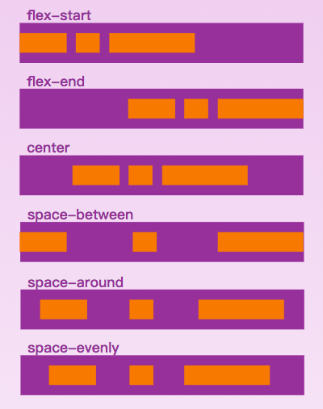
```css
.container{
  justify-content:flex-start ...
}
```
* flex-start （默认值）：项目朝向起始行打包
* flex-end：物品被打包到终点线
* center：项目沿着线居中
* space-between：物品均匀分布在线上; 第一项是在起始行，最后一项是在结束行
* space-around：项目均匀分布在行周围，空间相等。请注意，在视觉上空间不相等，因为所有项目在两侧都有相等的空间。第一个项目将在容器边缘上有一个空间单位，但在下一个项目之间有两个单位的空间，因为下一个项目有自己适用的间距。
* space-evenly：项目是分布的，以便任何两个项目之间的间距（和边缘的空间）相等。
#### align-items
这定义了如何沿着当前行的横轴布置flex的默认行为。可以视为`justify-content`横轴的版本（垂直于主轴）。<br>
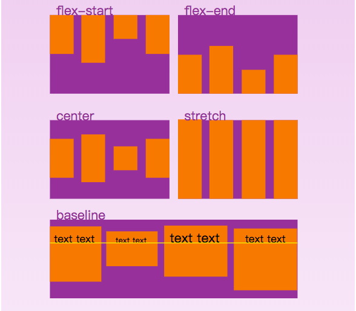<br>
```css
.container{
  align-items:flex-start;
}
```
* flex-start：项目的交叉开始边缘放置在交叉起始线上
* flex-end：项目的跨端边距边缘放在十字线上
* center：项目以横轴为中心
* baseline：项目已对齐，例如其基线对齐
* stretch （默认）：拉伸以填充容器（仍然遵循最小宽度/最大宽度）
#### align-content
当横轴上有额外空间时，这会对齐flex容器的线条，类似于justify-content在主轴内对齐各个项目的方式。<br>
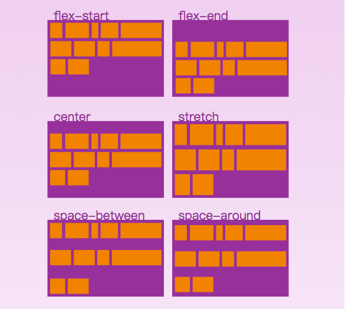
```css
.container{
  align-content:flex-start;
}
```
* flex-start：行打包到容器的开头
* flex-end：行打包到容器的末尾
* center：行包装到容器的中心
* space-between：线条均匀分布; 第一行是容器的开头，而最后一行是在最后一行
* space-around：线条均匀分布，每条线周围的空间相等
* stretch （默认值）：线条拉伸以占用剩余空间

* flex items
#### order
默认情况下，flex按源顺序排列，该order属性控制它们在flex容器中显示顺序。<br>
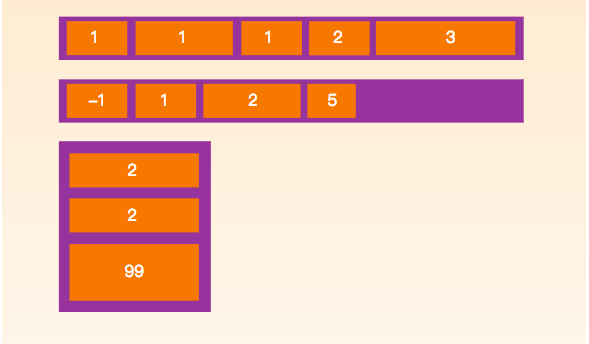<br>
```css
.item {
  order: <integer>; /* default is 0 */
}
```
#### flex-grow
这定义了Flex在必要时增长的能力。它接受一个number值作为一个比例。规定了项目应占用的Flex容器内可用的空间<br>
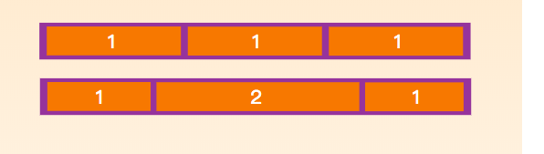<br>
```css
.item {
  flex-grow: <number>; /* default 0 */
}
```
如果所有的items含有flex-grow，并且设置为1，那么剩下的空间将平均分配给其他所有的子元素。如果有一个子元素的值是2，就会平均分给这个元素两倍之前的空间。<br>
不支持负数<br>
####flex-shrink
定义了flex item的伸缩性。
```css
.item {
  flex-shrink: <number>; /* default 1 */
}
```
不支持负数<br>
#### flex-basis
定义元素在分配剩余空间之前的默认大小。
```css
.item {
  flex-basis: <length> | auto; /* default auto */
}
```
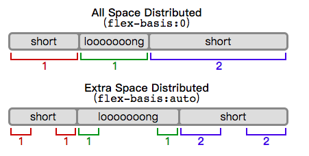<br>
#### flex
缩写
```css
.item {
  flex: none | [ <'flex-grow'> <'flex-shrink'>? || <'flex-basis'> ]
}
```
#### align-self
默认每项对齐<br>
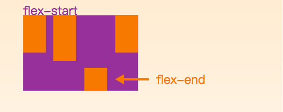<br>
```css
.item {
  align-self: auto | flex-start | flex-end | center | baseline | stretch;
}
```
吃几个🌰 吧<br>
完美居中
```css
.parent {
  display: flex;
  height: 300px; /* Or whatever */
}

.child {
  width: 100px;  /* Or whatever */
  height: 100px; /* Or whatever */
  margin: auto;  /* Magic! */
}
```
随窗口移动
```css
@import "compass/css3";

.flex-container {
  padding: 0;
  margin: 0;
  list-style: none;

  display: -webkit-box;
  display: -moz-box;
  display: -ms-flexbox;
  display: -webkit-flex;
  display: flex;

  -webkit-flex-flow: row wrap;  <========
  justify-content: space-around; <=========
}

.flex-item {
  background: tomato;
  padding: 5px;
  width: 200px;
  height: 150px;
  margin-top: 10px;

  line-height: 150px;
  color: white;
  font-weight: bold;
  font-size: 3em;
  text-align: center;
}
```
```html
<div>
<ul class="flex-container">
  <li class="flex-item">1</li>
  <li class="flex-item">2</li>
  <li class="flex-item">3</li>
  <li class="flex-item">4</li>
  <li class="flex-item">5</li>
  <li class="flex-item">6</li>
</ul></div>
```
网站顶部做一个右对齐导航，但是又想在小型屏幕单柱控制。
```css
@import "compass/css3";

.navigation {
  list-style: none;
  margin: 0; 
  
  background: deepskyblue;
  
  display: -webkit-box;
  display: -moz-box;
  display: -ms-flexbox;
  display: -webkit-flex;
  display: flex;
  
  -webkit-flex-flow: row wrap; <==================
  justify-content: flex-end; <===================
}

.navigation a {
  text-decoration: none;
  display: block;
  padding: 1em;
  color: white;
}

.navigation a:hover {
  background: darken(deepskyblue, 2%);
}

@media all and (max-width: 800px) {
  .navigation {
    justify-content: space-around; <===========小屏幕
  }
}

@media all and (max-width: 600px) {
  .navigation {
    -webkit-flex-flow: column wrap; <========== 小屏幕
    flex-flow: column wrap; <=========== 小屏幕
    padding: 0;
  }
  
  .navigation a { 
    text-align: center; 
    padding: 10px;
    border-top: 1px solid rgba(255,255,255,0.3); 
    border-bottom: 1px solid rgba(0,0,0,0.1); 
  }

  
  .navigation li:last-of-type a {
    border-bottom: none;
  }
}
```
```html
<ul class="navigation">
  <li><a href="#">Home</a></li>
  <li><a href="#">About</a></li>
  <li><a href="#">Products</a></li>
  <li><a href="#">Contact</a></li>
</ul>
```
布局自定义
```css
.wrapper {
  display: flex;  
  flex-flow: row wrap;
  font-weight: bold;
  text-align: center;
}

.wrapper > * {
  padding: 10px;
  flex: 1 100%;
}

.header {
  background: tomato;
}

.footer {
  background: lightgreen;
}

.main {
  text-align: left;
  background: deepskyblue;
}

.aside-1 {
  background: gold;
}

.aside-2 {
  background: hotpink;
}

@media all and (min-width: 600px) {
  .aside { flex: 1 auto; }
}

@media all and (min-width: 800px) {
  .main    { flex: 3 0px; }
  .aside-1 { order: 1; } 
  .main    { order: 2; }
  .aside-2 { order: 3; }
  .footer  { order: 4; }
}

body {
  padding: 2em; 
}
```
```html
<div class="wrapper">
  <header class="header">Header</header>
  <article class="main">
    <p>Pellentesque habitant morbi tristique senectus et netus et malesuada fames ac turpis egestas. Vestibulum tortor quam, feugiat vitae, ultricies eget, tempor sit amet, ante. Donec eu libero sit amet quam egestas semper. Aenean ultricies mi vitae est. Mauris placerat eleifend leo.</p>  
  </article>
  <aside class="aside aside-1">Aside 1</aside>
  <aside class="aside aside-2">Aside 2</aside>
  <footer class="footer">Footer</footer>
</div>
```
效果

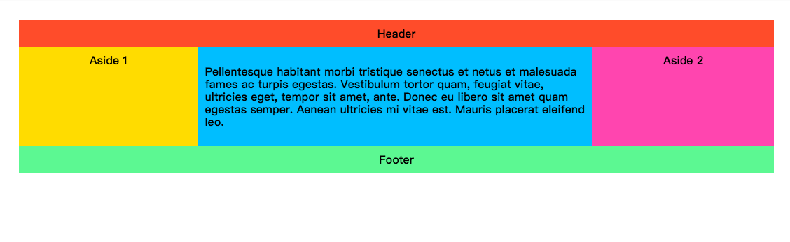
## 前缀flexbox
适应供应商的变化
```css
@mixin flexbox() {
  display: -webkit-box;
  display: -moz-box;
  display: -ms-flexbox;
  display: -webkit-flex;
  display: flex;
}

@mixin flex($values) {
  -webkit-box-flex: $values;
  -moz-box-flex:  $values;
  -webkit-flex:  $values;
  -ms-flex:  $values;
  flex:  $values;
}

@mixin order($val) {
  -webkit-box-ordinal-group: $val;  
  -moz-box-ordinal-group: $val;     
  -ms-flex-order: $val;     
  -webkit-order: $val;  
  order: $val;
}

.wrapper {
  @include flexbox();
}

.item {
  @include flex(1 200px);
  @include order(2);
}
```
