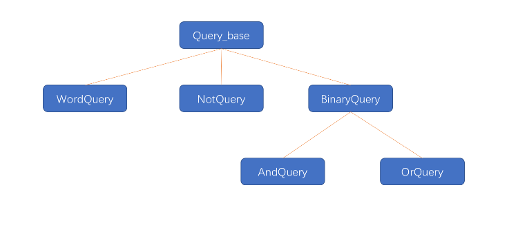

# 面向对象程序设计
面向对象在很多语言都用得比较多。<br>
面向对象程序设计基于三个基本概念：数据抽象、继承和动态绑定。在class那一章节，已经介绍了数据抽象的知识，这次我们介绍继承和动态绑定。<br>
继承和动态绑定对程序的编写有两方面的影响：<br>
a.我们可以更容易地定义与其他类相似但不完全相同的新类；<br>
b.在使用这些彼此相似的类编写程序时，我们可以在一定程度上忽略掉它们的区别。<br>
## OOP:概述
面向对象程序设计(object-oriented programming)的核心思想是数据抽象、继承和动态绑定。<br>
通过使用 **数据抽象** ，我们可以将类的接口与实现分离；<br>
使用 **继承** ，可以定义相似的类型并对其相似关系建模；<br>
使用 **动态绑定** ，可以在一定程度上忽略类似的区别，而以统一的方式使用它们的对象。<br>
##### 继承
**通过继承(inheritance)联系在一起的类构成一种层次关系。**<br>
通常在层次关系的根部有一个 **基类（base class）**，其他类则直接或间接地从基类继承而来，这些继承得到的类称为 **派生类（derived class）**<br>
基类负责定义在层次关系中所有类共同拥有的成员，而每个派生类定义各自特有的成员。<br>
在C++语言中，基类将类型相关的函数与派生类不做改变直接继承的函数区分对待。对于某些函数，基类希望它的派生类各自定义适合自身的版本，此时基类就将这些函数声明为 **虚函数（virtual function）**。
```cpp
class Quote{
  public:
  std::string isbn() const;
  virtual double net_price(std::size_t n) const;
}
```
派生类必须通过使用 **类派生列表(class derivation list)** 明确指出它是从哪个（哪些）基类继承而来的。类派生列表的形式是：首先一个冒号，后面紧跟以逗号分隔的基类列表，其中每个基类前面可以有访问说明符：
```cpp
class Bulk_quote:public Quote{
  public:
  double net_price(std::size_t) const override;
}
```
因为Bulk_quote在它的派生列表中使用了public关键字，**因此我们完全可以把Bulk_quote的对象当成Quote的对象来使用。**<br>
派生类必须在其内部对所有重新定义的虚函数进行声明。派生类可以在这样的函数之前加上`virtual`关键字，但是并不是非得这么做。**C++11新标准允许派生类显式地注明它将使用哪个成员函数改写基类的虚函数，具体措施是在该函数的形参列表之后增加一个`override`关键字。**<br>
##### 动态绑定
通过使用 **动态绑定(dynamic binding)**，我们能用同一段代码分别处理`Quote`和`Bulk_quote`的对象。
```cpp
// 计算并打印销售给定数量的某种书籍所得费用
double print_total(ostream &os,const Quote &item, size_t n){
  // 根据传入item形参的对象类型调用Quote::net_price
  // 或者Bulk_quote::net_price
  double ret = item.net_price(n);
  os<< ...
}
```
动态绑定有时又称为 **运行时绑定(run-time binding)**<br>
📒 在C++语言中，当我们使用基类的引用（或指针）调用一个虚函数时将发生动态绑定。<br>
## 定义基类和派生类
#### 定义基类
```cpp
class Quote{
  public:
  Quote() = default;
  Quote(const std::string &book,double sales_price):bookNo(book),price(sales_price){}
  std::string isbn() const { return bookNo; }
  // 返回给定数量的书籍的销售总额
  // 派生类负责改写并使用不同的折扣计算算法
  virtual double net_price(std::size_t n) const { return n*price; }
  virtual ~Quote() = default; // 对析构函数进行动态绑定
  private:
  std::string bookNo;
  protected:
  double price = 0.0;
}
```
记住作为继承关系中根节点通常会定义一个虚析构函数。<br>
📒 基类通常都应该定义一个虚析构函数，即使该函数不执行任何实际操作也是如此。<br>
##### 成员函数与继承
派生类需要对虚函数这些操作提供自己的新定义以 **覆盖(override)** 从基类继承而来的旧定义。<br>
在C++语言中，基类必须将它的两种成员函数区分开来：<br>
a. 一种是基类希望其派生类进行覆盖的函数（常常将其定义为虚函数(virtual)，当我们使用指针或引用调用虚函数时，该调用将被动态绑定。） <br>
b. 基类希望派生类直接继承而不要改变的函数。<br>
基类通过在其成员函数的声明语句之前加上关键字`virtual`使得该函数执行动态绑定。<br>
@ 任何构造函数之外的非静态函数都可以是虚函数。<br>
@ 关键字`virtual`只能出现在类内部的声明语句之前而不能用于类外部的函数定义。<br>
@ 如果基类把一个函数声明成虚函数，则该函数在派生类中隐式地也是虚函数。<br>
成员函数如果没有被声明为虚函数，则 **其解析过程发生在编译时而非运行时。**<br>
##### 访问控制与继承
派生类可以继承定义在基类中的成员，但是派生类的成员函数不一定有权访问从基类继承而来的成员。（和其他使用基类的代码一样，派生类能访问公有成员，而不能访问私有成员。）<br>
不过在某些时候，基类中还有这样一种成员，基类希望它的派生类有权访问该成员，同时禁止其他用户访问。我们用 **受保护的(protected)** 访问运算符说明这样的成员。<br>
❓ 什么是虚成员？<br>
对于某些函数，基类希望它的派生类各自定义适合自身的版本，此时基类就将这些函数声明成虚函数。<br>
❓ protected 访问说明符与private有何区别？<br>
@ protected:基类和其派生类还有友元可以访问。<br>
@ private:只有基类本身和友元可以访问<br>
#### 定义派生类
派生类必须通过使用 **类派生列表(class derivation list)** 明确指出它是从哪个（哪些）基类继承而来的。<br>
**public、protected和private。**<br>
派生类必须将其继承而来的成员函数中需要覆盖的那些重新声明，因此，我们的Bulk_quote类必须包含一个net_price成员：
```cpp
class Bulk_quote:public Quote{
  public:
  Bulk_quote() = default;
  Bulk_quote(const std::string&,double,std::size_t,double);
  // 覆盖基类的函数版本以实现基于大量购买的折扣政策
  double net_price(std::size_t) const override;
  private:
  std::size_t min_qty = 0; // 适用折扣政策的最低购买量
  double discount = 0.0; // 以小数表示折扣额
};
```
我们能将公有派生类型的对象绑定到基类的引用或指针上。<br>
大多数类都只继承自一个类，这种形式的继承被称作“单继承”，它构成了本章的主题。<br>
##### 派生类中的虚函数
派生类经常（但不总是）覆盖它继承的虚函数。如果派生类没有覆盖其基类中的某个虚函数，则该虚函数的行为类似于其他的普通成员，派生类会直接继承其在基类中的版本。<br>
派生类可以在它覆盖的函数前使用`virtual`关键字，但不是非得这么做。<br>
在形参列表后面、或者在const成员函数的const关键字后面、或者在引用成员函数的引用限定符后面添加一个关键字override。<br>
##### 派生类对象及派生类向基类的类型转换
一个派生类对象包含多个组成部分：一个含有派生类自己定义的（非静态）成员的子对象，以及一个与该派生类继承的基类对应的子对象，如果有多个基类，那么这样的子对象也有多个。因此，一个Bulk_quote对象将包含四个数据元素：它从Quote继承而来的bookNo和price数据成员，以及Bulk_quote自己定义的min_qty和discount成员。<br>
因为在派生类对象中含有与其基类对应的组成部分，所以我们能把派生类的对象当成基类对象来使用，而且我们也能将基类的指针或引用绑定到派生类对象中的基类部分上。<br>
甘难明，举个🌰咯
```cpp
Quote item; // 基类对象
Bulk_quote bulk; // 派生类对象
Quote *p = &item; // p 指向Quote对象
p = &bulk; // p指向bulk的Quote部分
Quote &r = bulk; // r绑定到bulk的Quote部分
```
这种转换通常称之为 **派生类到基类（derived-to-base）**类型转换。和其他类型转换一样，编译器会隐式地执行派生类到基类的转换。<br>
意味着，我们可以把派生类对象或者派生类对象的引用用在需要基类引用的地方；<br>
也可以把派生类对象的指针用在需要基类指针的地方。<br>
##### 派生类构造函数
尽管派生类对象中含有从基类继承而来的成员，但是派生类并不能直接初始化这些成员。和其他创建了基类对象的代码一样，派生类也必须使用基类的构造函数来初始化它的基类部分。<br>
📒 每个类控制它自己的成员初始化过程。<br>
派生类对象的基类部分与派生类对象自己的数据成员都是在构造函数的初始化阶段执行初始化操作的。类似我们初始化成员的过程，派生类构造函数同样是通过构造函数初始化列表来将实参传递给基类构造函数的。<br>
**首先初始化基类的部分，然后按照声明的顺序依次初始化派生类的成员。**<br>
##### 派生类使用基类的成员
派生类可以访问基类的公有成员和受保护成员
```cpp
double Bulk_quote::net_price(size_t cnt) const{
  if(cnt >= min_qty)
      return cnt * (1-discount)*price;
  else
  return cnt * price;
}
```
目前只需要了解派生类的作用域嵌套在基类的作用域之内。<br>
**关键概念：遵循基类的接口**<br>
每个类负责定义各自的接口。要想与类的对象交互必须使用该类的接口，即使这个对象是派生类的基类部分也是如此。<br>
因此，派生类对象不能直接初始化基类的成员。尽管从语法上来说我们可以在派生类构造函数体内给它的公有或受保护的基类成员赋值，但是最好不要这么做。和使用基类的其他场合一样，派生类应该遵循基类的接口，并且通过调用基类的构造函数来初始化那些从基类中继承而来的成员。<br>
##### 继承与静态成员
如果基类定义了一个静态成员，则在整个继承体系中 **只存在该成员的唯一定义** 。不论从基类中派生出来多少个派生类，对于 **每个静态成员来说都只存在唯一的实例。**<br>
```cpp
class Base{
  public:
  static void statmem();
};
class Derived:public Base{
  void f(const Derived&);
};
```
**静态成员遵循通用的访问控制规则，** 如果基类中的成员是private的，则派生类无权访问它。假设某静态成员是可访问的，则我们既能通过基类使用它也能通过派生类使用它
```cpp
void Derived::f(const Derived &derived_obj){
  Base::statmem(); // ☑️ ：Base定义了statmem
  Derived::statmem(); // ☑️ ：Derived继承了statmem
  // ☑️ ：派生类的对象能访问基类的静态成员
  derived_obj.statmem(); // 通过Derived对象访问
  statmem(); // 通过this对象访问
}
```
##### 派生类的声明
声明派生类
```cpp
class Bulk_quote:public Quote; // ❌ 派生列表不能在这里出现
class Bulk_quote; // ☑️ 
```
派生列表以及与定义有关的其他细节必须与类的主体一起出现。<br>
##### 被用作基类的类
如果我们想将某个类用作基类，则该类必须已经定义而非仅仅声明
```cpp
class Bulk_quote:public Quote{...}
```
派生类中包含并且可以使用它从基类继承而来的成员，为了使用这些成员，派生类当然要知道它们是什么。因此该规定还有一层隐含的意思，即一个类不能派生它本身。<br>
一个类是基类，同时它也可以是一个派生类。<br>
```cpp
class Base{ // ...}
class D1:public Base{ // ...}
class D2:public D1{ // ...}
```
Base是D1的 **直接基类（direct base）** ，同时是D2的 **间接基类（indirect base）** 。直接基类出现在派生列表中，而间接基类由派生类通过其直接基类继承而来。<br>
每个类都会继承直接基类的所有成员。对于一个最终的派生类来说，它会继承其直接基类的成员；该直接基类又含有其基类的成员；以此类推直至继承链的顶端。<br>
总结： 最终的派生类将包含它的直接基类的子对象以及每个间接基类的子对象。<br>
##### 防止继承的发生
不希望其他类可以继承，C++新标准提供了一个关键字 `final`。<br>
```cpp
class NoDerived final{ //...} // 不作为基类
class Last final : public Base{ // ...} // 不能继承Last
```
#### 类型转换与继承
⚠️ **理解基类和派生类之间的类型转换是理解C++语言面向对象编程的关键所在**<br>
通常情况下，如果我们想把引用或指针绑定到一个对象上，则引用或指针的类型应与对象的类型一致，或者对象的类型含有一个 **可接受的const类型转换规则。** 存在继承关系的类是一个重要的例外：我们可以将基类的指针或引用绑定到派生类对象上。例如，我们可以用`Quote&`指向一个`Bulk_quote`对象，也可以把一个`Bulk_quote`对象的地址赋给一个`Quote*`<br>
可以将基类的指针或引用绑定到派生类对象上有一层极为重要的含义：当使用基类的引用（或指针）时，实际上我们并不清楚该引用（或指针）所绑定对象的真实类型。**该对象可能是基类的对象，也可能是派生类的对象。**<br>
📒 和内置指针一样，智能指针类也支持派生类向基类的类型转换，这意味着我们可以将一个派生类对象的指针存储在一个基类的智能指针内。<br>
##### 静态类型和动态类型
当我们使用存在继承关系的类型时，必须将一个变量或其他表达式的 **静态类型(static type)** 与该表达式表示对象的 **动态类型(dynamic type)** 区分开来。❓表达式的静态类型在编译时总是已知的，它是变量声明时的类型或表达式生成的类型；动态类型则是变量或表达式表示的内存中的对象的类型。动态类型直到运行时才可知。<br>
🌰 
```cpp
double ret = item.net_price(n);
```
我们知道item的静态类型是Quote&，它的动态类型则依赖于item绑定的实参，动态类型直到运行时调用该函数时才知道。如果我们传递一个`Bulk_quote`对象给`print_total`，则item的静态类型将与它的动态类型不一致。如前所述，item的静态类型是`Quote&`，而在此例中它的动态类型则是`Bulk_quote`。<br>
**如果表达式既不是引用也不是指针，则它的动态类型永远与静态类型一致** 。例如，Quote类型的变量永远是一个Quote对象，我们无论如何都不能改变该变量对应的对象的类型。<br>
📒 基类的指针或引用的静态类型可能与其动态类型不一致，读者一定要理解其中的原因。<br>
##### 不存在从基类向派生类的隐式类型转换......
之所以存在派生类向基类的类型转换是因为每个派生类对象都包含一个基类部分，而基类的引用或指针可以绑定到该基类部分上。一个基类的对象既可以以独立的形式存在，也可以作为派生类对象的一部分存在。<br>
**不存在从基类向派生类的自动类型转换**
```cpp
Quote base;
Bulk_quote* bulkp = &base; // ❌ 不能将基类转换成派生类
Bulk_quote& bulkRef = base; // ❌ 不能将基类转换成派生类
```
试想一下，如果上述赋值合法，我们就会用bulkp或bulkRef访问base中本不存在的成员。<br>
##### ......在对象之间不存在类型转换
派生类向基类的自动类型转换只对指针或引用类型有效，在派生类类型和基类类型之间不存在这样的转换。<br>
初始化，执行构造函数；赋值操作。调用赋值运算符。这些成员通常都包含一个参数，该参数的类型是类类型的const的版本的引用。<br>
因为以上构造，赋值接受引用作为参数，所以派生类向基类的转换允许我们给基类的拷贝/移动操作传递一个派生类的对象。这些操作不是虚函数。当我们给基类的构造函数传递一个派生类对象时，实际运行的构造函数是基类中定义的那个，显然该构造函数只能处理基类自己的成员。类似的，如果我们将一个派生类对象赋值给一个基类对象，则 **实际运行的赋值运算符也是基类中定义的那个** ，该运算符同样只能处理基类自己的成员。<br>
```cpp
Bulk_quote bulk; // 派生类对象
Quote item(bulk); // 使用Quote::Quote(const Quote&)构造函数
item = bulk; // 调用Quote::operator=(const Quote&)
```
当构造item时，运行Quote的拷贝构造函数。
⚠️ 当我们用一个派生类对象为一个基类对象初始化或赋值时，只有该派生类对象中的基类部分会被拷贝、移动或赋值，它的派生类部分将被忽略掉。<br>
❓ 静态类型和动态类型的定义<br>

关键概念：存在继承关系的类型之间的转换规则，三点<br>
@ 从派生类向基类的类型转换只对指针或引用类型有效。<br>
@ 基类向派生类不存在隐式类型转换<br>
@ 和任何其他成员一样，派生类向基类的类型转换也可能会由于访问受限而变得不可行。<br>
尽管自动类型转换只对指针或引用类型有效，但是继承体系中的大多数类仍然（显式或隐式地）定义了拷贝控制成员。因此，我们通常能将一个派生类对象拷贝、移动或赋值给一个基类对象。不过需要注意的是，这种操作只处理派生类对象的基类部分。<br>

## 虚函数
如前所述，在C++语言中，当我们使用基类的引用或指针调用一个虚成员函数时会执行动态绑定。因为我们直到运行时才能知道到底调用了哪个版本的虚函数，所以所有虚函数都必须有定义。必须为每个虚函数提供定义，不管他是否被用到了，这是因为，编译器也无法确定到底会使用哪个虚函数。<br>
##### 对虚函数的调用可能在运行时才被解析
当某个虚函数通过指针或引用调用时，编译器产生的代码直到运行时才能确定应该调用哪个版本的函数。被调用的函数是与绑定到指针或引用上的对象的动态类型相匹配的那个。<br>
很难明咧！举个🌰 吧：
```cpp
Quote base("222222",20);
print_total(cout,base,10); // 这里就说明了绑定的动态类型到Quote版本，所以调用的是Quote::net_price
Bulk_quote derived('2222333',50,5,.19);
print_total(cout,derived,10); // 这里调用的就是Bulk_quote::net_price，解释同理
```
动态绑定只有当我们通过指针或引用调用虚函数时才会发生。
```cpp
base = derived; // 把derived的Quote部分拷贝给base
base.net_price(20); // 调用Quote::net_price
```
当我们通过一个具有普通类型（非引用非指针）的表达式调用虚函数时，在编译时就会将调用的版本确定下来。<br>
@ **C++的多态性**<br>
OOP的核心思想时 **多态性(polymorphism)** 。我们把具有继承关系的多个类型称为多态类型，因为我们能使用这些类型的“多种形式”而无须在意它们的差异。引用或指针的静态类型与动态类型不同这一事实正是C++语言支持多态性的根本所在。<br>
📒 当且仅当对通过指针或引用调用虚函数时，才会在运行时解析该调用，也只有在这种情况下对象的动态类型才有可能与静态类型不同。<br>
##### 派生类中的虚函数
当我们在派生类中覆盖某个虚函数时，可以再一次使用`virtual`关键字指出该函数的性质。然而这么做并非必须，因为一旦某个函数被声明成虚函数，则在所有派生类中它都是虚函数。<br>
一个派生类的函数如果覆盖了某个继承而来的虚函数，则它的形参类型必须与被它覆盖的基类函数完全一致。<br>
同样，派生类中虚函数的返回类型也必须与基类函数匹配。该规则存在一个例外，当类的虚函数返回类型是类本身的指针或引用时，上述规则无效。也就是说，如果D由B派生得到，则基类的虚函数可以返回可以返回B* 而派生类的对应函数可以返回D*，只不过这样的返回类型要求从D到B的类型转换是可访问的。
```cpp
class B{
  virtual B* vribfun()
}
class D:public B{
  virtual D* virbfun()
}
```
基类中虚函数在派生类中隐含地也是一个虚函数。当派生类覆盖了某个虚函数时，该函数在基类中的形参必须与派生类中的形参严格匹配。<br>
##### final和override说明符
派生类如果定义了一个函数和一个基类中虚函数的名字相同但是形参列表不同，这仍然是合法的行为。编译器认为新定义的这个函数与基类中原有的函数是相互独立的。这时，派生类的函数并没有覆盖掉基类中的版本。<br>
在调试中发现这种错误是很困难的。<br>
在新标准中我们可以使用`override`关键字来说明派生类中的虚函数。如果我们使用了`override`标记了某个函数，但该函数并没有覆盖已存在的虚函数，此时编译器会 **报错。**<br>
还能把某个函数指定为 `final`，如果我们已经把函数定义成`final`了，则之后任何尝试覆盖该函数的操作都将引发错误:
```cpp
struct D2:B{
  // 从B继承f2()和f3()，覆盖f1(int)
  void f1(int) const final; // 不允许后续的其他类覆盖f1(int)
}；
struct D3:D2{
  void f2(); // ☑️ 覆盖从间接基类B继承而来的f2
  void f1(int) const; // ❌ D2已经将f2声明成final
}
```
`final`和`override`说明符出现在形参列表（包括任何const或引用修饰符）以及尾置返回类型。<br>
##### 虚函数与默认实参
和其他函数一样，虚函数也可以拥有默认实参。如果某次函数调用使用了默认实参，则该实参值由本次调用的静态类型决定。<br>
换句话说，如果我们通过基类的引用或指针调用函数，则使用基类中定义的默认实参，即使实际运行的是派生类中的函数版本也是如此。此时，传入派生类函数的将是基类函数定义的默认实参。如果派生类函数依赖不同的实参，则程序结果将与我们的预期不符。<br>
💡 如果虚函数使用默认实参，则基类和派生类中定义的默认实参最好一致。<br>
##### 回避虚函数的机制
在某些情况下，我们希望对虚函数的调用不要进行动态绑定，而是强迫其执行虚函数的某个特定版本。使用作用域运算符可以实现这一目的
```cpp
// 强行调用基类定义的函数版本而不敢baseP的动态类型到底是什么
double undiscounted = baseP -> Quote::net_price(42);
```
该调用将在编译时完成解析。<br>
📒 通常情况下，只有成员函数（或友元）中的代码才需要使用作用域运算符来回避虚函数的机制。<br>
⚠️ 如果一个派生类虚函数需要调用它的基类版本，但是没有使用作用域运算符，则在运行时该调用将被解析为对派生类版本自身的调用，从而导致无限递归。<br>
```cpp
virtual void debug() const;
```
❓ 有必要将一个成员函数同时声明成 override 和 final 吗？为什么？<br>
有必要。override 的含义是重写基类中相同名称的虚函数，final 是阻止它的派生类重写当前虚函数。
## 抽象基类
##### 纯虚函数
**纯虚函数(pure virtual funciton)** 无须定义，通过在函数体的位置（即声明语句的分号之前）书写=0就可以将一个虚函数说明为纯虚函数。<br> 
```cpp
// 用于保存折扣值和购买量的类，派生类使用这些数据可以实现不同的价格策略
class Disc_quote:public Quote{
  public:
  Disc_quote() = default;
  Disc_quote(const std::string& book, double price, std::size_t qty, double disc):Quote(book,price),quantity(qty),discount(disc){}
  double net_price(std::size_t) const = 0;
  protected:
  std::size_t quantity = 0; // 折扣适用的购买量
  double discount = 0.0; // 表示折扣的小数值
}；
```
⚠️ 我们也可以为纯虚函数提供定义，不过函数体必须定义在类的外部。也就是说，我们不能在类的内部为一个=0的函数提供函数体。<br>
##### 含有纯虚函数的类是抽象基类
含有（或者未经覆盖直接继承）纯虚函数的类是 **抽象基类（abstract base class）**。 抽象基类负责定义接口，而后续的其他类可以覆盖该接口。我们 **不能（直接）创建一个抽象基类的对象**。因为Disc_quote将net_price定义成了纯虚函数，所以我们不能定义Disc_quote的对象。我们可以定义Disc_quote的派生类的对象，前提是这些类覆盖了net_price函数<br>
所以， **抽象基类，没有对象！**<br>
##### 派生类构造函数只构造它的直接基类
Bulk_quote继承Disc_quote
```cpp
// 当同一书籍的销量超过某个值时启用折扣
// 折扣的值是一个小于1的正的小数值，以此来降低正常销售价格
class Bulk_quote:public Disc_quote{
  public:
  Bulk_quote() = default;
  Bulk_quote(const std::string& book, double price, std::size_t qty, double disc):Disc_quote(book,price,qty,disc){}
  // 覆盖基类中的函数版本以实现一种新的折扣策略
  double net_price(std::size_t) const override;
};
```
这个版本的Bulk_quote的直接基类是Disc_quote，间接基类是Quote。每个Bulk_quote对象包含三个子对象：一个（空的）Bulk_quote部分、一个Disc_quote子对象和一个Quote子对象。<br>
如前所述，每个类各自控制其对象的初始化过程。因此，即使Bulk_quote没有自己的数据成员，它也仍然需要原来一样提供一个接受四个参数的构造函数。该构造函数将它的实参传递给Disc_quote的构造函数，随后Disc_quote的构造函数继续调用Quote的构造函数。先是Quote，然后Disc_quote，最后是Bulk_quote。<br>
**关键概念：重构**<br>
在Quote的继承体系增加Dsic_quote类是重构（refactoring)的一个典型示例。<br>
重构，负责重新设计类的体系以便将操作和/或数据从一个类移动到另一个类中。对于面向对象的应用程序来说，重构是一种很普遍的现象。<br>
⚠️ 即使我们改变了整个继承体系，那些使用了Bulk_quote或Quote的代码也无须进行任何改动。不过一旦类被重构（或以其它方式被改变），就意味着我们必须重新编译含有这些类的代码了。<br>
## 访问控制与继承
每个类分别控制自己的成员初始化过程，与之类似，每个类还分别控制着其成员对于派生类来说是否 **可访问（accessible）**。
##### 受保护的成员 proteced
一个类使用protected关键字来声明那些它希望与派生类分享但是不想被其他公共访问使用的成员。protected说明符可以看做是public和private中和后的产物。<br>
@ 和私有成员类似，受保护的成员对于类的用户来说是不可访问的。<br>
@ 和公有成员类似，受保护的成员对于派生类的成员和友元来说是可访问的。<br>
@ 派生类的成员或友元只能通过派生类对象来访问基类的受保护成员。**派生类对于一个基类对象中的受保护成员没有任何访问特权。**<br>
理解最后一个规则，举个🌰 ：
```cpp
class Base{
  protected:
  int prot_mem; // protected 成员
};
class Sneaky:public Base{
  friend void clobber(Sneaky&); // 能访问Sneaky::prot_mem
  friend void clobber(Base&); // 不能访问Base::prot_mem
  int j; // j默认是private
}；
// ☑️ clobber能访问Sneaky对象的private和protected成员
void clobber(Sneaky &s) { s.j = s.prot_mem = 0;}
// ❌ clobber不能访问Base的protected成员
void clobber(Base &b) { b.prot_mem = 0; }
```
派生类的成员和友元只能访问派生类对象中的基类部分的受保护成员；<br>
对于普通的基类对象中的成员不具有特殊的访问权限。<br>
##### 公有、私有和受保护继承
某个类对其继承未来的成员的访问权限受到两个因素 影响：一是在基类中该成员的访问说明符，二是在派生类列表中的访问说明符。
```cpp
class Base{
  public:
     void pub_mem();
  protected:
     void pro_mem();
  private:
     void pri_mem();
};
struct Pub_Derv:public Base{
  // 仅可访问public
};
struct Pro_Derv:protected Base{

};
struct Pri_Derv:private Base{
  // private不影响派生类的访问权限
}
```
对基类成员的访问权限只与基类中的访问说明符有关。Pub_Derv和Pri_ Derv都能访问受保护的成员pro_mem，同时它们都不能访问私有成员pri_mem。<br>
派生类说明符的目的是控制派生类用户（包括派生类的派生类在内）对于基类成员的访问权限
```cpp
Pub_Derv d1; // 继承自Base成员是public
Pri_Derv d2; // 继承自Base的成员是private
d1.pub_mem(); // ☑️
d2.pub_mem(); // ❌
```
在Pri_Derv中，Base的成员是私有的，因此类的用户不能调用pub_mem。<br>
派生类说明符还可以控制继承自派生类的新类的访问权限
```cpp
struct Derived_from_Publi:public Pub_Derv{
  // ✅ 仍然是protected
  int use_base() { return prot_mem; }
};
struct Derived_from_Private:public Pri_Derv{
  // ❌ Base::pro_mem在Pri_Derv中是private的
  int use_base() { return prot_mem; }
}
```
Pro_Derv，受保护继承，Base中的所有公有成员在新定义的类中都是受保护的。Pro_Derv的用户（对象）不能访问pub_mem，但是Pro_Derv的成员和友元可以访问那些继承而来的成员。<br>
##### 派生类向基类转换的可访问性
派生类向基类的转换是否可访问由使用该转换的代码决定，同时派生类的派生访问说明符也会有影响。假定D继承自B:<br>
@ 只有当D公有地继承B时，用户代码才能使用派生类向基类的转换；如果D继承B的方式是受保护的或者私有的，则用户代码不能使用该转换。<br>
@ 不论D以什么方式继承B，D的成员函数和友元都能使用派生类向基类的转换；派生类向其直接基类的类型转换对于派生类的成员和友元来说永远是可访问的。<br>
@ 如果D继承B的方式时公有的或者受保护的，则D的派生类的成员和友元可以使用D向B的类型转换；反之，如果D继承B的方式是私有的，则不能使用。<br>
💡 对于代码中的某个给定节点来说，如果基类的公有成员是可访问的，则派生类向基类的类型转换也是可访问的；反之不行。<br>
**关键概念：类的设计与受保护的成员**<br>
##### 友元与继承
就像友元关系不能传递一样，友元关系同样也不能继承。基类的友元在访问派生类成员时不具有特殊性，类似的，派生类的友元也不能随意访问基类的成员。
```cpp
class Base{
  // 添加friend声明，其他成员与之前的版本一致
  friend class Pal; // Pal在访问Base的派生类时不具有特殊性
};
class Pal{
  public:
  int f(Base b){ return b.pro_mem; } // ✔️ Pal是Base的友元
  // 对基类的访问权限由基类本身控制，即使对于派生类的基类部分也是如此
  int f3(Sneaky s){ return s.pro_mem; }// ✔️ Pal是Base的友元
};
```
Pal是Base的友元，所以Pal能够访问Base对象的成员，这种可访问性包括了Base对象内嵌在其派生类对象中的情况。<br>
当一个类将另一个类声明为友元时，这种友元关系只对做出声明的类有效。对于原来那个类来说，其友元的基类或者派生类不具有特殊的访问能力。<br>
```cpp
// D2对Base的protected和private成员不具有特殊的访问能力
class D2:public Pal{
  public:
  int mem(Base b){ return b.pro_mem; } // ❌ 友元关系不能继承
}
```
📒 不能继承友元关系；每个类负责控制各自成员的访问权限。<br>
##### 改变个别成员的可访问性
有时我们需要改变派生类继承的某个名字的访问级别，听过使用using声明可以达到这一目的。<br>
```cpp
class Base{
  public:
  std::size_t size() const { return n; }
};
class Derived:private Base{ // ⚠️ private继承
  public:
   // 保持对象尺寸相关的成员的访问级别
    using Base::size;
  protected:
    using Base::n;
}
```
因为Derived使用了私有继承，所以继承而来的成员size和n(在默认情况下)是Derived的私有成员。然而，我们使用using声明语句改变了这些成员的可访问性。改变之后，Derived的用户将可以使用size成员，而Derived的派生类将能使用n。<br>
通过在类的内部使用using声明语句，我们可以将该类的直接或间接基类中的任何可访问成员（例如，非私有成员）标记出来。using声明语句中名字的访问权限由该using声明语句之前的访问说明符来决定。也就是说，如果一条using声明语句出现在类的private部分，则该名字只能被类的成员和友元访问；protected，则该名字对于成员、友元和派生类是可访问的；public，类的所有用户都能访问它。<br>
📒 派生类只能为那些它可以访问的名字提供using声明。<br>
##### 默认的继承保护级别
默认情况下，使用`class`关键字定义的派生类是私有继承的；而使用`struct`关键字定义的派生类是公有继承的:<br>
```cpp
class Base{}
struct D1:Base{ } // 默认public继承
class D2:Base{} // 默认private继承
```
唯一的差别就是默认成员访问说明符及默认派生访问说明符<br>

## 继承中的类作用域
每个类定义自己的作用域，在这个作用域内我们定义类的成员。当存在继承关系时，派生类的作用域嵌套在其基类的作用域之内。**如果一个名字在派生类的作用域内无法正确解析，则编译器将继续在外层的基类作用域中寻找该名字的定义。**<br>
类似冒泡查找，不断往上查找。<br>
##### 在编译时进行名字查找
一个对象、引用或指针的静态类型决定了该对象的哪些成员是可见的。即使静态类型与动态类型可能不一致（当使用基类的引用或指针时会发生这种情况），但是我们能使用哪些成员仍然是由静态类型决定的。
```cpp
class Disc_quote:public Quote{
  public:
  std::pair<size_t,double> discount_policy() const{ return {quantity,discount};}
  ...
}
```
pair的返回值是一对的。<br>
我们只能通过Dsic_quote及其派生类的对象、引用或指针使用discount_policy:
```cpp
Bulk_quote bulk;
Bulk_quote *bulkP = &bulk; // 静态类型与动态类型一致
Quote *itemP = &bulk; // 静态类型与动态类型不一致
bulkP->discount_policy(); // ✅ bulkP的类型是Bulk_quote*
itemP->dicount_policy(); // ❌ itemP的类型是Quote*
```
尽管在bulk中确实含有一个名为discount_policy的成员，但是该成员对于itemP却是不可见的。itemP的类型是Quote的指针，意味着对discount_policy的搜索将从Quote开始。显然Quote不包含名为discount_policy的成员，所以我们无法通过Quote的对象、引用或指针调用discount_policy。<br>
##### 名字冲突与继承
和其他作用域一样，派生类也能重用定义在其直接基类或间接基类中的名字， **此时定义在内层作用域（即派生类）的名字将隐藏定义在外层作用域（即基类）的名字**。
```cpp
struct Base{
  Base():mem(0){}
  protected:
  int mem;
};
struct Derived:Base{ // 默认public继承
  Derived(int i):mem(i){} // 用i初始化Derived::mem
  // Base::mem进行默认初始化
  int get_mem() { return mem; } // 返回Derived::mem 覆盖基类Base的mem
  protected:
  int mem; // 隐藏基类中的mem
}
```
📒 派生类的成员将隐藏同名的基类成员<br>
##### 通过作用域运算符来使用隐藏的成员
我们可以通过作用域运算符来使用一个被隐藏的基类成员
```cpp
struct Derived:Base{
  int get_base_mme(){ return Base::mem;}
  ...
}
```
💡 除了覆盖继承而来的虚函数之外，派生类最好不要重用其他定义在基类中的名字。<br>
**关键概念：名字查找与继承**<br>
@ 首先确定静态类型<br>
@ 静态类型中查找
@ 检查虚函数还是非虚函数
##### 一如往常，名字查找先于类型检查
如前所述，声明在内层作用域的函数并不会重载声明在外层作用域的函数。因此，定义派生类中的函数也不会重载其基类中的成员。和其他作用域一样，如果派生类（即内层作用域）的成员与基类（即外层作用域）的某个成员同名，则派生类将在其作用域内隐藏该基类成员。即使派生类成员和基类成员的形参列表不一致，基类成员也仍然会被隐藏掉
```cpp
struct Base{
  int memfcn();
};
struct Derived:Base{
  int memfcn(int); // 隐藏基类的memfcn
};
Derived d; Base b;
b.memfcn(); // 调用Base::memfcn
d.memfcn(10); // 调用Derived::memfcn
d.memfcn(); // ❌ 
d.Base::memfcn(); // 调用Base::memfcn
```
##### 虚函数与作用域
假如基类与派生类的虚函数接受的实参不同，则我们就无法通过基类的引用或指针调用派生类的虚函数了。
```cpp
class Base{
  public:
  virtual int fcn();
};
class D1:public Base{
  public:
  // 隐藏基类的fcn，这个fcn不是虚函数
  // D1继承了Base::fcn() 的定义
  int fcn(int); // 形参列表与Base中的fcn不一致
  virtual void f2(); // 是一个新的虚函数，在Base中不存在
};
class D2:public D1{
  public:
  int fcn(int); // 是一个非虚函数，隐藏了D1::fcn(int)
  int fcn();  // 覆盖了Base的虚函数fcn
  void f2();  // 覆盖了D1的虚函数f2
}
```
##### 通过基类调用隐藏的虚函数
```cpp
Base bobj; D1 d1obj;D2 d2obj;
Base *bp1 = &bobj, *bp2 = &d1obj, *bp3 = &d2obj;
bp1->fcn(); // 虚调用，将在运行时调用Base::fcn
bp2->fcn(); // 虚调用，将在运行时调用Base::fcn
bp3->fcn(); // 虚调用，将在运行时调用D2::fcn
D1 *d1p = &d1obj;D2 *d2p = &d2obj;
bp2->f2(); // ❌ Base中没有名为f2的成员
d1p->f2(); // 虚调用，将在运行时调用D1::f2
d2p->f2(); // 虚调用，将在运行时调用D2::f2
```
前三条调用语句是通过基类的指针进行的，因为fcn是虚函数，所以编译器产生的代码将在运行时确定使用虚函数的哪个版本。判断的依据是该指针所绑定对象的真实类型。<br>
调用语句中，在bp2的例子中，实际绑定的对象是D1类型，而D1并没有覆盖那个不接受实参的fcn，所以通过bp2进行的调用将在运行时解析为Base定义的版本。<br>
接下来的三条调用语句是通过不同类型的指针进行的，每个指针分别指向继承体系中的一个类型。因为Base类中没有f2()，所以第一条语句是非法的，即使当前的指针碰巧指向了一个派生类对象也无济于事。<br>
##### 覆盖重载的函数
和其他函数一样，成员函数无论是否是虚函数都能被重载。派生类可以覆盖重载函数的0个或多个实例。<br>
**为重载成员提供一条using声明语句，就无须覆盖基类中的每一个重载版本**。using 声明语句指定一个名字而 **不指定形参列表** ，所以一条基类成员函数的using声明语句就可以把该函数的所有重载实例添加到派生类作用域中。此时，派生类只需要定义其特有的函数就可以了，而无须为继承而来的其他函数重新定义。<br>
类内using声明的一般规则同样适用于重载函数的名字，基类函数的每个实例在派生类中都必须是可访问的。对派生类没有重新定义的重载版本的访问实际上是对using声明点的访问。<br>
## 构造函数与拷贝控制
创建、拷贝、赋值和销毁。如果一个类（基类或派生类）没有定义拷贝控制操作，则编译器将为它合成一个版本。当然这个合成版本也可以定义成被删除的函数。<br>
#### 虚析构函数
继承关系对基类拷贝控制最直接的影响是基类通常应该定义的一个虚析构函数，这样我们就能动态分配继承体系中的对象了。<br>
如前所述，当我们`delete`一个动态分配的对象的指针时 **将执行析构函数**。如果该指针指向继承体系中的某个类型，则有可能出现 **指针的静态类型与被删除对象的动态类型不符** 的情况。<br>
举个🌰 如果我们`delete`一个`Quote*`类型的指针，则该指针有可能实际指向了一个`Bulk_quote`类型的对象。如果这样的话，编译器就必须清楚它应该执行的是Bulk+quote的析构函数。和其他函数一样，我们通过在基类中将析构函数定义成虚函数以确保执行正确的析构函数版本。
```cpp
class Quote{
  public:
  // 如果我们删除的是一个指向派生类对象的基类指针，则需要虚析构函数
  virtual ~Quote() = default; // 动态绑定析构函数
}
```
和其他虚函数一样，析构函数的虚属性也会被继承。因此，无论`Quote`的派生类使用合成的析构函数还是定义自己的析构函数，都将是虚析构函数。只要基类的析构函数是虚函数，就能确保当我们delete基类指针时将运行正确的析构函数版本。<br>
```cpp
Quote *itemP = new Quote; // 静态类型和动态类型一致
delete itemP; // 调用Quote的析构函数
itemP = new Bulk_quote; //静态类型与动态类型不一致
delete itemP; //  调用Bulk_quote的析构函数
```
⚠️ 如果基类的析构函数不是虚函数，则delete一个指向派生类对象的基类指针将产生未定义的行为。<br>
一个基类总是需要析构函数，而且它能将析构函数设定为虚函数。
##### 虚析构函数将阻止合成移动操作
基类需要一个虚析构函数这一事实还会对基类和派生类的定义产生另外一个间接的影响；如果一个类定义了析构函数，即使它通过=default的形式使用了合成的版本，编译器也不会为这个类合成移动操作。<br>
❓ 哪种类需要虚析构函数？虚析构函数必须执行什么样的操作？<br>
基类通常应该定义一个虚析构函数<br>
## 合成拷贝控制与继承
基类或派生类的合成拷贝控制成员的行为与其他合成的构造函数、赋值运算符或析构函数类似：它们对类本身的成员依次进行初始化、赋值或销毁的操作。此外，这些合成的成员还负责使用直接基类中对应的操作对一个对象的直接基类部分进行初始化、赋值或销毁的操作。🌰 ：
@ 合成的Bulk_quote默认构造函数运行Disc_quote的默认构造函数，后者又运行Quote的默认构造函数。<br>
@ Quote的默认构造函数将bookNo成员默认初始化为空字符串，同时使用类内初始值将price初始化为0。<br>
@ Quote的构造函数完成后，继续执行Disc_quote的构造函数，它使用类内初始值的初始化qty和discount。<br>
@ Disc_quote的构造函数完成后，继续执行Bulk_quote的构造函数，但是它什么具体工作也不做。<br>
类似的，合成的Bulk_quote拷贝构造函数使用（合成的）Disc_quote拷贝构造函数，后者又使用（合成的）Quote拷贝构造函数。其中，Quote拷贝构造函数拷贝bookNo和price成员；Disc_quote拷贝构造函数拷贝qty和discount成员。<br>
⚠️ 无论基类成员是合成的版本（如Quote继承体系的例子）还是自定义的版本都没有太大影响。唯一的要求是相应的成员应该可以访问并且不是一个被删除的函数。<br>
在我们的Quote继承体系中，所有类都使用合成的析构函数。其中，派生类隐式地使用而基类通过将其虚析构函数定义成=default而显式地使用。一如既往，合成的析构函数体是 **空的** ，其隐式的析构部分负责销毁类的成员。对于派生类的析构函数来说，它除了销毁派生类自己的成员外，还负责销毁派生类的直接基类；该直接基类又销毁它自己的直接基类，以此类推直至继承链的顶端。<br>
总结一下： 🌈  **构造从基类到派生类！析构从派生类到基类！**<br>
Quote因定义了析构函数而不能拥有合成的移动操作，因此当我们移动Quote对象时实际使用的是合成的拷贝操作。如我们即将看到的那样，Quote没有移动操作意味着它的派生类也没有 (**爸爸没有的，你别想有**) <br>
##### 派生类中删除的拷贝控制与基类的关系
就像其他任何类的情况一样，基类或派生类也能出于同样的原因将其合成的默认构造函数或者任何一个拷贝控制成员定义成被删除的函数。此外，某些定义基类的方式也可能导致有的派生类成员成为被删除的函数：<br>
@ 如果基类中的默认构造函数、拷贝构造函数、拷贝赋值运算符或析构函数是被删除的(`=delete`)函数或者不可访问、则派生类中对应的成员将是被删除的，原因是编译器不能使用基类成员来执行派生类对象基类部分的构造、赋值或销毁操作。<br>
@ 如果在基类中有一个不可访问或删除掉的析构函数，则派生类中合成的默认和拷贝构造函数将是被删除的，因为编译器无法销毁派生类对象的基类部分。<br>
@ 和过去一样，编译器将不会合成一个删除掉的移动操作。当我们使用`=default`请求一个移动操作时，**如果基类中的对应操作是删除的或不可访问的，那么派生类中该函数将是被删除的，原因是派生类对象的基类部分不可移动** 。同样， **如果基类的析构函数是删除的或不可访问的，则派生类的移动构造函数也将是被删除的。**<br>
说了那么多，吃个🌰 吧
```cpp
class B{
  public:
  B();
  B(const B&) = delete;
  ...
};
class D:public B{
  // 没有声明任何构造函数
};
D d; // ✅ : D的合成默认构造函数使用B的默认构造函数
D d2(d); // ❌ D的合成拷贝构造函数是被删除的
D d3(std::move(d)); // ❌ 隐式地使用D的被删除的拷贝构造函数
```
实际编程中，如果在基类中没有默认、拷贝或移动构造函数，则一般情况下派生类也不会定义相应的操作<br>
##### 移动操作与继承
如前所述，大多数基类都会定义一个虚析构函数。因此在默认情况下， **基类通常不含有合成的移动操作，而且它的派生类中也没有合成的移动操作。**<br>
一旦Quote定义了自己的移动操作，那么它必须同时显式地定义拷贝操作
```cpp
class Quote{
  public:
  Quote() = default; // 对成员依次进行默认初始化
  Quote(const Quote&) = default; // 对成员依次拷贝
  Quote(Quote&&) = default; // 对成员依次拷贝
  Quote& operator=(const Quote&) =default; // 拷贝赋值
  Quote& operator=(Quote&&) = default; // 移动赋值 右引用
  virtual ~Quote() = default;
  ...
}
```
❓ 我们为什么为Disc_quote定义一个默认构造函数？如果去除掉该构造函数的话会对Bulk_quote的行为产生什么影响?<br>
> 因为Disc_quote的默认构造函数会运行Quote的默认构造函数，而Quote默认构造函数会完成成员的初始化工作。如果去掉该构造函数，Bulk_quote的默认构造函数无法完成Disc_quote的初始化工作。<br>
## 派生类的拷贝控制成员
派生类构造函数在其初始化阶段中 **不但要初始化派生类自己的成员，还负责初始化派生类对象的基类部分** 。因此 **派生类的拷贝和移动构造函数在拷贝和移动自有成员的同时，也要拷贝和移动基类部分的成员** 。类似的，派生类赋值运算符也必须为其基类部分的成员赋值。<br>
和构造函数及赋值运算符不同的是，析构函数只负责销毁派生类自己分配的资源。如前所述，对象的成员是被隐式销毁的；类似的，派生类对象的基类部分也是自动销毁的。<br>
⚠️ 当派生类定义了拷贝或移动操作时，该操作负责拷贝或移动包括基类部分成员在内的整个对象。<br>
##### 定义派生类的拷贝或移动构造函数
当为派生类定义拷贝或移动构造函数时，我们通常使用对应的基类构造函数初始化对象的基类部分：
```cpp
class Base{// ... };
class D:public Base{
  public:
  // 默认情况下，基类的默认构造函数初始化对象的基类部分
  // 要想使用拷贝或移动构造函数，我们必须在构造函数初始值列表中
  // 显式地调用该构造函数
  D(const D& d):Base(d){} // 拷贝基类成员，D的成员的初始值
  D(D&& d):Base(std::move(d)){} // 移动基类成员，D的成员的初始值
}；
```
初始值Base(d)将一个D对象传递给基类构造函数。Base(d)一般会匹配Base的拷贝构造函数。D类型的对象d将被绑定到该构造函数的Base&形参上。Base的拷贝构造函数负责将d的基类部分拷贝给要创建的对象。<br>
假如我们没有提供基类的初始值的话：
```cpp
// D的这个拷贝构造函数很可能是不正确的定义
// 基类部分被默认初始化，而非拷贝
D(const D& d) // 成员初始值，但是没有提供基类初始值
```
⚠️ 在默认情况下，基类默认构造函数初始化派生类对象的基类部分。如果我们想拷贝（或移动）基类部分，则必须在派生类的构造函数初始值列表中显式地使用基类的拷贝（或移动）构造函数。<br>
##### 派生类赋值运算符
与拷贝和移动构造函数一样，派生类的赋值运算符也必须显式地为其基类部分赋值：
```cpp
// Base::operator=(const Base&) 不会被自动调用
D &D::operator=(const D &rhs){
  Base::operator=(rhs); // 为基类部分赋值
  // 按照过去的方式为派生类的成员赋值
  // 酌情处理自赋值及释放已有资源等情况
  return *this;
}
```
上面的运算符首先显式地调用基类赋值运算符，令其为派生类对象的基类部分赋值。基类的运算符（应该可以）正确地处理自赋值的情况，如果赋值命令是正确的，则基类运算符将释放掉其左侧运算对象的基类部分的旧值，然后利用rhs为其赋予一个新值。随后，我们继续进行其他为派生类成员赋值的工作。<br>
⚠️ 无论的构造函数或赋值运算符是自定义的版本还是合成的版本，派生类的对应操作都能使用它们。例如，对于`Base::operator=`的调用语句将执行`Base`的拷贝赋值运算符，至于该运算符是由`Base`显式定义的还是由编译器合成的无关紧要。<br>
##### 派生类析构函数
如前所述，在析构函数体执行完成后，对象的成员会被隐式销毁。类似的，对象的基类部分也是隐式销毁的。因此，和构造函数及赋值运算符不同的是，派生类析构函数只负责销毁由派生类自己分配的资源。
```cpp
class D:public Base{
  public:
  // Base::~Base被自动调用执行
  ~D(){ ... }
}
```
❕ 对象销毁的顺序正好与其创建的顺序相反：派生类析构函数首先执行，然后是基类的析构函数，以此类推，沿着继承体系的反方向直至最后。<br>
##### 在构造函数和析构函数中调用虚函数
派生类对象的基类部分将被首先构建。当执行基类的构造函数时，该对象的派生类部分是未被初始化的状态。销毁相反。由此可见，当我们执行上述基类成员的时候，该对象处于未完成的状态。<br>
📒 如果构造函数或析构函数调用了某个虚函数，则我们应该执行与构造函数或析构函数所属类型相对应的虚函数版本。<br>
### 继承的构造函数
在C++11新标准中，派生类能够重用其直接基类定义的构造函数。尽管如我们所知，这些构造函数并非以常规的方式继承而来，但是为了方便，我们不妨姑且称其为“继承”的。一个类只初始化它的直接基类，出于同样的原因，一个类也只继承其直接基类的构造函数。类不能继承默认、拷贝和移动构造函数。如果派生类没有直接定义这些构造函数，则编译器为派生类合成他们。<br>
派生类继承基类构造函数的方式是提供了一条注明了（直接）基类名的using声明语句。
```cpp
class Bulk_quote:public Disc_quote{
  public:
  using Disc_quote::Disc_quote; // 继承Disc_quote的构造函数
  double net_price(std::size_t) const;
}
```
通常情况下，using声明语句只是令某个名字在当前作用域内可见。而当作用于构造函数时，using声明语句将令编译器产生代码。**对于基类的每个构造函数，编译器都生成一个与之对应的派生类构造函数。** 换句话说，对于基类的每个构造函数，编译器都在派生类中生成一个形参列表完全相同的构造函数。<br>
```cpp
derived(parms):base(args){}
```
其中，derived是派生类的名字，base是基类的名字，parms是构造函数的形参列表，args将派生类构造函数的形参传递给基类的构造函数。
```cpp
Bulk_quote(const std::string & book,double price, std::size_t qty,double disc):Disc_quote(book,price,qty,disc){}
```
如果派生类含有自己的数据成员，则这些成员将被默认初始化。<br>
##### 继承的构造函数的特点
和普通成员的using声明不一样，一个构造函数的using声明不会改变该构造函数的访问级别。私有是私有，受保护还是受保护，公有还是公有。<br>
一个using声明语句不能指定`explicit`或`constexpr`。如果基类的构造函数是`explicit`或者`constexpr`，则继承的构造函数也拥有相同的属性。<br>
**当一个基类构造函数含有默认实参时，这些实参并不会被继承。** 相反，派生类将获得多个继承的构造函数，其中每个构造函数分别省略掉一个含有默认实参的形参。<br>
🌰 如果基类有一个接受两个形参的构造函数，其中第二个形参含有默认实参，则派生类将获得两个构造函数：一个构造函接受两个形参（没有默认实参）另一个构造函数只接受一个形参，它对应于基类中最左侧的没有默认值的那个形参。<br>
如果基类含有几个构造函数，则除了两个例外情况，大多数时候派生类会继承所有这些构造函数。<br>
@ 第一个例外是派生类可以继承一部分的构造函数，而为其他构造函数定义自己的版本。（如果派生类定义的构造函数与基类的构造函数具有相同的参数列表，则该构造函数将不会被继承。定义在派生类中的构造函数将替换继承而来的构造函数）<br>
@ 第二个例外是默认、拷贝和移动构造函数不会被继承。这些构造函数按照正常规则被合成。（继承的构造函数不会被作为用户定义的构造函数来使用，因此，如果一个类只含有继承的构造函数，则它也将拥有一个合成的默认构造函数。）<br>
## 容器与继承
当我们使用容器存放继承体系中的对象时，通常必须采取间接存储的方式。因为不允许在容器中保存不同类型的元素，所以我们不能把具有继承关系的多种类型的对象直接存放在容器中。<br>
🌰  
```cpp
vector<Quote> basket;
basket.push_back(Quote("sss")); // ✅ 但是只能把对象的Quote部分拷贝给basket
basket.push_back(Bulk_quote("eee",50,10,.25)); // 调用Quote定义的版本
cout << basket.back().net_price(15) << endl;
```
basket的元素是Quote对象，因此当我们向该vector中添加一个Bulk_quote对象时，它的派生类部分将被忽略。<br>
⚠️  **当派生类对象被赋值给基类独享时，其中的派生类部分将被“切掉”，因此容器和存在继承关系的类型无法兼容。**<br>
所以容器只能是一个类型的对象。<br>
##### 在容器中放置（智能）指针而非对象
当我们希望在容器中存放具有继承关系的对象时，我们实际上存放的通常是基类的指针（更好的选择时智能指针）。和往常一样， **这些指针所指对象的动态类型可能是基类类型，也可能是派生类类型**。
```cpp
vector<shared_ptr<Quote>> basket;
basket.push_back(make_shared<Quote>("ssss",50));
basket.push_back(make_shared<Bulk_quote>("ssss",50,10,.25)); // 调用Quote定义的版本
cout << basket.back()->net_price(15) << endl;
```
因为basket存放着shared_ptr，所以我们必须解引用basket.back()的返回值以获得运行net_price的对象。 **实际调用的net_price版本依赖于所指对象的动态类型。**<br>
❓ 定义一个存放 Quote 对象的 vector，将 Bulk_quote 对象传入其中。计算 vector 中所有元素总的 net_price。
```cpp
#include <iostream>
#include <string>
#include <vector>
#include <memory>

#include "quote.h"
#include "bulk_quote.h"
#include "limit_quote.h"
#include "disc_quote.h"


int main()
{
	/**
	* @brief ex15.28   outcome == 9090
	*/
	std::vector<Quote> v;
	for (unsigned i = 1; i != 10; ++i)
		v.push_back(Bulk_quote("sss", i * 10.1, 10, 0.3));

	double total = 0;
	for (const auto& b : v)
	{
		total += b.net_price(20);
	}
	std::cout << total << std::endl;

	std::cout << "======================\n\n";

	/**
	* @brief ex15.29   outccome == 6363
	*/
	std::vector<std::shared_ptr<Quote>> pv;

	for (unsigned i = 1; i != 10; ++i)
		pv.push_back(std::make_shared<Bulk_quote>(Bulk_quote("sss", i * 10.1, 10, 0.3)));

	double total_p = 0;
	for (auto p : pv)
	{
		total_p += p->net_price(20);
	}
	std::cout << total_p << std::endl;

	return 0;

}
```
### 编写Basket类
```cpp
class Basket{
  public:
  // Basket使用合成的默认构造函数和拷贝控制成员
      void add_item(const std::shared_ptr<Quote> &sale){
      item.insert(sale);} // 打印每本书的总价和购物篮中所有书的总价
      double total_receipt(std::ostream&) const;
  private:
  // 该函数用于比较shared_ptr，multiset成员会用到它
  static bool compare(const std::shared_ptr<Quote> &lhs, const std::shared_ptr<Quote> &rhs){ return lhs->isbn() < rhs.isbn();}
  // multiset保存多个报价，按照compsre成员排序
  std::multiset<std::shared_ptr<Quote>,decltype(compare)*> items{compare}; // 定义了一个指向Quote对象的shared_ptr的multiset。
  // 这个multiset将使用一个与compare成员类型相同的函数来对其中的元素进行排序。 items
  };
}
```
我们的类使用一个multiset来存放交易信息，这样我们就能保存同一本书的多条交易记录，而且对于一本给定的书籍，它的所有交易信息都保存在一起。<br>
multiset 的元素是shared_ptr。因为shared_ptr没有定义小于运算符，所以为了对元素排序我们必须提供自己的比较运算符。所以我们定义了一个名为compare的私有静态成员，该成员负责比较shared_ptr所指的对象的isbn。我们初始化multiset，通过类内初始值调用比较函数。<br>
##### 定义Basket成员
Basket类只定义两个操作。第一个成员是我们在类的内部定义的add_item成员，该成员接受一个指向动态分配的Quote的shared_ptr，然后将这个shared_ptr放置在multiset中。第二个成员的名字是total_receipt，它负责将购物篮的内容逐项打印成清单，然后返回购物篮中所有的物品的总价格：
```cpp
double Basket::total_receipt(ostream &os) const{
  double sum = 0; // 保存实时计算出的价格
  // iter 指向ISBN相同的一批元素中的第一个
  // upper_bound返回的一个迭代器，该迭代器指向这批元素的尾后位置
  for(auto iter = items.cbegin(); iter != items.cend();iter = items.upper_bound(*iter)){
    // 我们知道当前的Basket中至少又一个该关键字的元素
    // 打印该书籍对应的项目
    sum += print_total(os,**iter,items.count( *iter ));
  }
  os << "Total Sale: " << sum << endl; // 打印最终的总价格
  return sum;
}
```
这里的for循环比较有趣，与通常的循环语句依次读取每个元素不同，我们直接令iter指向下一个关键字，调用upper_bound函数可以令我们跳过与当前关键字相同的所有元素。 **对于`upper_bound`函数来说，它返回的是一个迭代器，该迭代器指向所有与iter关键字相等的元素中最后一个元素的下一位置。** 因此，我们得到的迭代器或者指向集合的末尾，或者指向下一本书籍。<br>
在print_total中，实参包括一个用于写入数据的ostream、一个待处理的Quote对象和一个计数值。当我们解引用iter后将得到一个指向准备打印的对象的shared_ptr。为了得到这个对象，必须解引用该shared_ptr。因此，**iter是一个Quote对象（或Quote的派生类的对象）。我们使用multiset的count成员来统计在multiset中有多少元素的键值相同（即ISBN相同）。<br>
如我们所知，print_total调用了虚函数net_price，因此最终的计算结果依赖于**iter的动态类型。
#### 隐藏指针
Basket的用户仍然必须处理动态内存，原因是add_item需要接受一个shared_ptr参数。因此，用户不得不按照如下形式编写：
```cpp
Basket bsk;
bsk.add_item(make_shared<Quote>("123",45));
bsk.add_item(make_shared<Bulk_quote>("345",45,3,.15));
```
重新定义add_item，令其负责处理内存分配。
```cpp
void add_item(const Quote& sale); // 拷贝给定的对象
void add_item(QUote&& sale); // 移动给定的对象
```
唯一的问题是add_item不知道要分配的类型。当add_item进行内存分配时，她将拷贝（或移动）它的sale参数。在某处可能会有`new Quote(sale)`，这表达式的工作可能不正确：new表达式为我们请求的类型分配内存，因此这条表达式将分配一个Quote类型的对象并且拷贝sale的Quote部分。然而，sale实际指向的可能是Bulk_quote对象，此时，该对象将被迫切掉一部分。<br>
#### 模拟虚拷贝
为了解决上述问题，我们给Quote类添加一个虚函数，该函数将申请一份当前对象的拷贝。
```cpp
class Quote{
  public:
  // 该虚函数返回当前对象的一份动态分配的拷贝
  // 这些成员使用的引用限定符
  virtual Quote* clone() const&{return new Quote(*this);}
  virtual Quote* clone() && {return new Quote(std::move(*this));}
  ...
};
class Bulk_quote:public Quote{
  Bulk_quote* clone() const & { return new Bulk_quote(*this);}
  Bulk_quote* clone() && { return new Bulk_quote(std::move(*this));}
  ...
};
```
因为我们拥有add_item的拷贝和移动版本，所以我们分别定义clone的左值和右值版本。每个clone元素分配当前类型的一个新对象，其中const左值引用成员将它自己拷贝给新分配的对象；右值引用成员则将自己移动到新数据中。
```cpp
class Basket{
  public:
  void add_item(const Quote& sale){ // 拷贝
    items.insert(std::shared_ptr<Quote>(sale.clone()));
  }
  void add_item(Quote&& sale){ // 移动
    items.insert(std::shared_ptr<Quote>(std::move(sale).clone()));
  }
  ...
}
```
我们的clone是一个虚函数。sale的动态类型（通常）决定了到底运行Quote的函数还是Bulk_quote的函数。无论我们是拷贝还是移动数据，clone都返回一个新分配的对象的指针，该对象与clone所属的类型一致。我们把一个shared_ptr绑定到这个对象上，然后调用insert将这个新分配的对象添加到items中。<br>
⚠️ 因为shared_ptr支持派生类向基类的类型转换，所以我们能把shared_ptr<Quote>绑定到Bulk_quote*上。<br>
### 文本查询程序再探
#### 面向对象的解决方案
操作：<br>
* eval，接受一个TextQuery对象并返回一个QueryResult，eval函数使用给定的TextQuery对象查找与之匹配的行。
* rep，返回基础查询的string表示形式，eval函数使用rep创建一个表示匹配结果的QueryResult，输出运算符使用rep打印查询表达式。
**关键概念：继承与组合**<br>
当我们令一个类公有地继承另一个类时，派生类应当反映与基类的“是一种（Is A）”关系。在设计良好的类体系当中，公有派生类的对象应该可以用在任何需要基类对象的地方。<br>
类型之间的另一种常见关系是“有一个（Has A）“关系，具有这种关系的类暗含成员的意思。<br>
##### 抽象基类
Query_base，整个查询继承体系的根节点。<br>
<br>
##### 将层次关系隐藏于接口类中
`Query q = Query("fiery")&Query("bird")|Query("wind");`如下所述，其隐含的意思是用户层代码将不会直接使用这些继承的类；相反，我们将定义一个名为Query的接口类，由它负责隐藏整个继承体系。Query类将保存一个Query_base指针，该指针绑定到Query_base的派生类对象上。Query类与Query_base类提供的操作是相同的：eval用于求查询的结果，rep用于生成查询的string版本，同时Query也会定义一个重载的输出运算符用于显示查询。<br>
用户将通过Query对象的操作间接地创建并处理Query_base对象。我们定义Query对象的三个重载运算符以及一个接受string参数的Query构造函数，这些函数动态分配一个新的Query_base派生类的对象：<br>
* &运算符生成一个绑定到新的AndQuery对象上的Query对象。
* |运算符生成一个绑定到新的OrQuery对象上的Query对象。
* ~运算符生成一个绑定到新的NotQuery对象上的Query对象。
* 接受string参数的Query构造函数生成一个新的WordQuery对象。
##### 理解这些类的工作机理
一旦对象树构建完成后，对某一条查询语句的求值（或生成表示形式的）过程基本上就转换为沿着箭头方向依次对每个对象求值（或显示）的过程（由编译器为我们组织管理）。<br>
#### Query_base类和Query类
定义一个抽象基类
```cpp
class Query_base{
  friend class Query;
  protected:
  using line_no = TextQuery::line_no; // 用于eval函数
  virtual ~Query_base() = default;
  private:
  // eval返回与当前Query匹配的QueryResult
  virtual QueryResult eval(const TextQuery&) const = 0;
  // rep是表示查询的一个string
  virtual std::string rep() const = 0;
};
```
eval和rep都是纯虚函数，因此Query_base是一个抽象基类。所有对Query_base的使用都需要通过Query对象，因为Query需要调用Query_base的虚函数，所以我们将Query声明成Query_base的友元。<br>
受保护的成员line_no将在eval函数内部使用。类似的，析构函数也是受保护的，因为它将（隐式地）在派生类析构函数中使用。<br>
##### Query类
