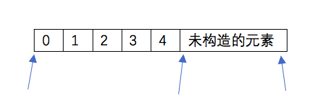

<br>
# 拷贝控制
**类是C++的核心概念**第七章涵盖了使用类的所有基本知识：类作用域、数据隐藏以及构造函数，还介绍了类的一些重要特性：成员函数、隐式this指针、友元以及const、static和mutabe成员。在这一部分，将延伸类的相关话题的讨论，将介绍拷贝控制、重载运算符、继承和模版<br>

如前所述，C++中，我们通过定义构造函数来控制在类类型的对象初始化时做什么。类还可以控制在对象拷贝、赋值、移动和销毁时做什么。在这方面，C++与其他语言不同，其他很多语言都没有给予类设计者控制这些操作的能力。在拷贝控制将介绍新标准的两个重要概念：右值引用和移动操作<br>
运算符重载，这种机制允许内置运算符作用于类类型的运算对象。这样我们创建的类型直观上就可以像内置类型一样使用，运算符重载是C++借以实现这一目的的方法之一<br>
**类可以重载的运算符中有一种特殊的运算符--函数调用运算符**对于重载了这种运算度的类，我们可以“调用”其对象，就好像它们是函数一样。新标准库中提供了一些设施，使得不同类型的可调用对象可以以一种一致的方式来使用。在类型转换章节中将介绍一种特殊类型的类成员函数----转换运算符。这些运算符定义了类类型对象的隐式转换机制。编译器应用这种转换机制的场合与原因都与内置类型转换是一样的。<br>


这一章的内容非常重要，要好好看！<br>
本章中我们将学习类如何控制该类型对象拷贝、赋值、移动或销毁时做什么。类通过一些特殊的成员函数控制这些操作，包括：**拷贝构造函数、移动构造函数、拷贝赋值运算符、移动赋值运算符以及析构函数。**<br>
当定义一个类时，我们显示地或隐式地指定在此类型的对象拷贝、移动、赋值和销毁时做什么。一个类通过定义五种特殊的成员函数来控制这些操作，包括：拷贝构造函数、拷贝赋值运算符、移动构造函数、移动赋值运算符和析构函数。<br>
@拷贝和移动构造函数定义了当同类型的另一个对象初始化本对象时做什么。<br>
@拷贝和移动赋值运算符定义了将一个对象赋予同类型的另一个对象时做什么。<br>
@析构函数定义了当此类型对象销毁时做什么。<br>
我们称这些操作为拷贝控制操作<br>
@如果一个类没有定义所有这些拷贝控制成员，编译器会自动为它定义缺失的操作。因此，很多类会忽略这些拷贝控制操作。但是，对一些类来说，依赖这些操作默认定义会导致灾难。通常，实现拷贝控制操作最困难的地方是首先认识到什么时候需要定义这些操作。<br>
## 拷贝、赋值与销毁
拷贝构造函数、拷贝赋值运算符和析构函数作为开始
## 拷贝构造函数
@如果一个构造函数的第一个参数是自身类型的引用，且任何额外参数都有默认值，则此构造函数是拷贝构造函数
```cpp
class Foo{
public:
    Foo(); //默认构造函数 
    Foo(const Foo&); //拷贝构造函数
    //...
};
```
拷贝构造函数的第一个参数必须是一个引用类型！拷贝构造函数在几种情况下都会被隐式地使用。因此，拷贝构造函数通常不应该是explicit<br>
**合成拷贝构造函数**
如果我们没有为一个类定义拷贝构造函数，编译器会为我们定义一个。与合成默认构造函数不同，即使我们定义了其他构造函数，编译器也会为我们合成一个拷贝构造函数。<br>
@合成拷贝构造函数是缺省的拷贝构造函数<br>
@合成拷贝构造函数就等同于对所有成员变量进行一次赋值操作<br>
@对于基础类，都最好实现构造函数，拷贝构造函数，析构函数<br>
对某些类来说，合成拷贝构造函数用来阻止我们拷贝该类类型的对象。而一般情况，合成的拷贝构造函数会将其参数的成员逐个拷贝到正在创建的对象中。编译器从给定对象中依次将每个非static成员拷贝到正在创建的对象中。<br>
每个成员的类型决定了它如何拷贝：
@对类类型的成员，会使用其拷贝构造函数来拷贝；<br>
@内置类型的成员则直接拷贝。虽然我们不能直接拷贝一个数组，但合成拷贝构造函数会逐元素地拷贝一个数组类型的成员。如果数组元素是类类型，则使用元素的拷贝构造函数来进行拷贝。<br>
举个：
```cpp
class Sales_data{
public:
    Sales_data(const Sales_data&); //其他成员和构造函数的定义，如前，与合成的拷贝构造函数等价的拷贝构造函数的声明
private:
    std::String bookNo;
    int units_sold = 0;
    double revenue = 0.0;
};
//与Sales_data 的合成的拷贝构造函数等价
Sales_data::Sales_data(const Sales_data &orig):
bookNo(orig.bookNo),  //使用string的拷贝构造函数
units_sold(orig.units_sold), //拷贝orig.units_sold
revenue(orig.revenue){} //拷贝orig.revenue
```
## 拷贝构造函数
```cpp
string dots(10,'.'); //直接初始化
string s(dots);  //直接初始化
string s2 = dots; //拷贝初始化
string nines = string(100,'9'); //拷贝初始化
```
@当使用直接初始化时，我们实际上是要求编译器使用普通的函数匹配来选择与我们提供的参数最匹配的构造函数。<br>
@当我们使用拷贝初始化时，我们是要求编译器将右侧运算对象拷贝到正在创建的对象中，如果需要的话还要进行类型转换。<br>
@拷贝初始化通常使用拷贝构造函数来完成。但是，如果一个类有一个移动构造函数，则拷贝初始化有时会使用移动构造函数而非拷贝构造函数来完成。<br>
**拷贝构造函数发生的情况**
@用=定义变量时会发生<br>
@将一个对象作为实参传递给一个非引用类型的形参<br>
@从一个返回类型为非引用类型的函数返回一个对象<br>
@用花括号列表初始化一个数组中的元素或一个聚合类中的成员<br>
**但凡涉及赋值，都用拷贝构造函数完成**<br>
@某些类类型还会对它们所分配的对象使用拷贝初始化。例如当我们初始化标准库容器或是调用其insert或push成员时，容器会对其元素进行拷贝初始化。与之相对，用emplace成员创建的元素都进行直接初始化。<br>
## 参数和返回值
在函数调用过程中，具有非引用类型的参数要进行拷贝初始化。类似的，当一个函数具有非引用的返回类型时，返回值会被用来初始化调用方的结果。<br>
拷贝构造函数被用来初始化非引用类类型参数。为了调用拷贝构造函数，我们必须拷贝它的实参，但为了拷贝实参，我们有需要掉哟个拷贝构造函数，如此无限循环。<br>
## 拷贝初始化的限制
如前所述，如果我们使用的初始化值要求通过一个explicit的构造函数来进行类型转换，那么使用拷贝初始化还是直接初始化就不是无关紧要的了<br>
**编译器可以绕过拷贝构造函数**<br>
在拷贝初始化过程中，编译器可以（但不是必须的）跳过拷贝/移动构造函数，直接创建对象。即，编译器被允许<br>
```cpp
string null_oo("0000000");
class Hasptr{
public:
    HasPtr(const string &s = string()):ps(new string(s)),i(0){}
private:
    string *ps;
    int i;
};

HasPtr::HasPtr(const HasPtr &ptr):ps(new string(*(ptr.ps))), i(ptr.i){}
```
## 拷贝赋值运算符
与控制其对象如何初始化一样，类也可以控制其对象如何赋值：<br>
```cpp
Sales_data trans,accum;
trans = accum; // 使用Sales_data的拷贝赋值运算符
```
与拷贝构造函数一样，如果类未定义自己的拷贝赋值运算符，编译器会为它合成一个<br>
## 重载赋值运算符
重载运算符本质上是函数，其名字由operator 关键字后接表示要定义的运算符符号组成。因此，赋值运算符就是一个名为operator=的函数。类似于任何其他函数，运算符函数也有一个返回类型和一个参数列表<br>
重载运算符的参数表示运算符的运算对象。某些运算符，包括赋值运算符，必须定义为成员函数。如果一个运算符是一个成员函数，其左侧运算对象就绑定到隐式的this参数。对于一个二元运算符。例如赋值运算符，其右侧运算对象作为显式参数传递。<br>
拷贝赋值运算符接受一个与其所在类相同类型的参数：<br>
```cpp
class Foo{
public:
Foo& operator=(const Foo&); //赋值运算符
//...
};
```
为了与内置类型的赋值保持一致，赋值运算符通常返回一个指向其左侧运算对象的引用。另外值得注意的是，标准库通常要求保存在容器中的类型要具有赋值运算符，且其返回值是左侧运算对象的引用。<br>
## 合成拷贝赋值运算符
与处理拷贝构造函数一样，如果一个类未定义自己的拷贝赋值运算符，编译器会为它生成一个合成拷贝赋值运算符。类似拷贝构造函数，对于某些类，合成拷贝赋值运算符用来禁止该类型对象的赋值。如果拷贝赋值运算符并非出于此目的，它会将右侧运算对象的每个非static成员赋予左侧运算对象的对应成员，这一工作是通过成员类型拷贝赋值运算符来完成的。对于数组类型的成员，逐个赋值数组元素。合成拷贝赋值运算符返回一个指向其左侧运算对象的引用。<br>
举个：
```cpp
Sales_data& Sales_data::operator=(const Sales_data &rhs){
bookNo = rhs.bookNo; //调用string::operator=
units_sold = rhs.units_sold; //使用内置的int赋值
revenue = rhs.revenue; //使用内置的double赋值
return *this; //返回一个此对象的引用
}
```
❓拷贝赋值运算符是什么 ：是一个名为operator=的函数<br>
❓什么时候使用它 ：当赋值运算发生时就会用到它<br>
❓合成拷贝赋值运算符完成什么工作：可以用来禁止该类型对象的赋值<br>
❓什么时候会生成合成拷贝赋值运算符：如果一个类为定义自己的拷贝赋值运算符，编译器会为它生成一个合成拷贝赋值运算符<br>
为HasPtr编写赋值运算符。类似拷贝构造函数，赋值运算符应该将对象拷贝到ps指向的位置<br>

```cpp
#ifndef ex13_8_h
#define ex13_8_h

#include <string>
class HasPtr{
public:
    HasPtr(const string& s = string()):ps(new string()),i(0){}
    HasPtr(const HasPtr& hp):ps(new string(*hp.ps)),i(hp.i){}
    HasPtr& operator=(const HasPtr& hp){
        string *new_ps = new string(*hp.ps);
        delete ps;
        ps = new_ps;
        i = hp.i;
        return *this;
}
private:
    string *ps;
    int i;
};
#endif
```
## 析构函数
析构函数执行与构造函数相反的操作：@构造函数初始化对象的非static数据成员，还可能做一些其他工作；<br>
@析构函数释放对象使用的资源，并销毁对象的非static数据成员。<br>
析构函数是类的一个成员函数，名字由波浪号接类名构成。他没有返回值，也不接受参数：<br>
```cpp
class Foo{
public:
    ~Foo(); //
};
```
由于析构桉树不接受参数，因此它不能被重载。对一个给定类，只会有唯一一个析构函数<br>
析构函数完成什么工作<br>
如同构造函数有一个初始化部分和一个函数题，析构函数也有一个函数体和一个析构部分。在一个构造函数中，成员的初始化是在函数体执行之前完成的，且按照他们在类中出现的顺序进行初始化。在一个析构函数中，首先执行函数体，然后销毁成员。成员按初始化顺序的逆序销毁<br>
在对象最后一次使用之后，析构函数体可执行类设计者希望执行的任何收尾工作。通常，析构函数释放对象在生存期分配的所有资源<br>
在一个析构函数中，不存在类似构造函数中初始化列表的东西来控制成员如何销毁，析构部分是隐式的。成员销毁时发生什么完全依赖于成员的类型。@销毁类类型的成员需要执行成员自己的析构函数。内置类型没有析构函数，因此销毁内置类型成员什么都不需要做<br>
隐式销毁一个内置指针类型的成员不会delete它所指向的对象<br>
与普通指针不同，智能指针是类类型，所以具有析构函数<br>
因此，与普通指针不同，智能指针成员在析构阶段会被自动销毁<br>
**什么时候会调用析构函数**
@变量在离开其作用域时被销毁<br>
@当一个对象被销毁时，其成员被销毁<br>
@容器（无论是标准库容器还是数组）被销毁时。其元素被销毁<br>
@对于动态分配的对象，当对指向它的指针应用delete运算符时被销毁<br>
@对于临时对象，当创建它的完整表达式结束时被销毁<br>
由于析构函数自动运行，我们的程序可以按需要分配资源，而（通常）无须担心何时释放这些资源<br>
```cpp
{//新作用域
Sales_data *p = new Sales_data; //p是一个内置指针
auto p2 = make_shared<Sales_data>(); //p2是一个shared_ptr
Sales_data item(*p); //拷贝构造函数将*p拷贝到item中
vector<Sales_data> vec; //局部对象
vec.push_back(*p2); //拷贝p2指向的对象
delete p; //对p指向的对象执行析构函数
} //退出局部作用域；对item、p2和vec调用析构函数
//销毁p2会递减其引用计数；如果引用计数变为0，对象被释放
//销毁vec会销毁它的元素
```
其他Sales_data 对象会在离开作用域时被自动销毁。shared_ptr的析构函数会递减p2指向的对象的引用计数。<br>
在所有情况下，Sales_data的析构函数都会隐式地销毁bookNo成员。销毁bookNo会调用string的析构函数，它会释放用来保存ISBN的内存<br>
@当指向一个对象的引用或指针离开作用域时，**析构函数不会执行**<br>
## 合成析构函数
当一个类未定义自己的析构函数时，编译器会为它定义一个合成析构函数。类似拷贝构造函数和拷贝赋值运算符，对于某些类，合成析构函数被用来阻止改类型的对象被销毁。如果不是这种情况，合成析构函数的函数体为空<br>
```cpp
class Sales_data{
public:
~Sales_data(){}
};
```
@认识到析构函数体自身并不直接销毁成员是非常重要的。成员在析构函数体之后隐含的析构阶段中被销毁。在整个对象销毁过程中，析构函数体是作为成员销毁步骤之外的另一部分而进行的<br>
## 三/五法则
三个基本操作可以控制类的拷贝操作：拷贝构造函数、拷贝赋值运算符和析构函数<br>
**第一：需要析构函数的类也需要拷贝和赋值操作**<br>
@当我们决定一个类是否要定义它自己版本的拷贝控制成员时，一个基本原则是首先确定这个类是否需要一个析构函数。<br>
如果一个类需要自定义析构函数，几乎可以肯定它也需要自定义拷贝赋值运算符和拷贝构造函数<br>
**第二：需要拷贝操作的类也需要赋值操作，反之亦然（无论是需要拷贝构造函数还是需要拷贝赋值运算符都不必然意味着也需要析构函数）**

假定numbered是一个类，它有一个默认构造函数，能为每个对象生成一个唯一的序号，保存在名为mysn的数据成员中。假定numbered使用合成的拷贝控制成员，并给定函数：<br>
```cpp
void f(numbered s) { cout<< s.mysn <<endl; }
```
则下面代码输出什么内容？<br>
numbered a,b = a, c=b;
f(a);f(b);f(c);
输出三个一样的数 //对所有成员进行一次赋值操作<br>
假定numbered定义了一个拷贝构造函数，能生成一个新的序列号。这会改变上一题中调用的输出结果嘛？如果改变，为什么？新的输出是什么<br>
会！三个不同的数，并不是a,b,c中的数<br>
如果f中的参数是const numbered&,将会怎样？这会改变输出的结果嘛？如果会改变，为什么？新的输出结果是什么<br>
输出a,b,c<br>
## 使用=default
我们可以通过将拷贝控制成员定义为=default来显式地要求编译器生成合成的版本<br>
```cpp
class Sales_data{
public:
Sales_data() = default;
Sales_data(const Sales_data&) = default;
Sales_data& operator=(const Sales_data &);
~Sales_data() = default;
};

Sales_data& Sales_data::operator=(const Sales_data&) = default;
```
当我们在类内用=default修饰成员的声明时，合成的函数将隐式地声明为内敛的。如果我们不希望合成的成员是内联函数，应该只对成员的类外定义用=default，就像对拷贝赋值运算符所做的那样<br>
## 阻止拷贝
@大多数类应该定义默认构造函数、拷贝构造函数和拷贝赋值运算符，无论是隐式地还是显式地<br>
## 定义删除的函数
在新标准下，我们可以通过将拷贝构造函数和拷贝赋值运算符定义为删除的函数来阻止拷贝。删除的函数是这样一种函数：我们虽然声明了他们，但不能以任何方式使用它们。在函数的参数列表后面加上=delete来指出我们希望将它定义为删除的：<br>
```cpp
struct noCopy{
    NoCopy() = default; //使用合成的默认构造函数
    NoCopy(const NoCopy&) = delete; //阻止拷贝
    NoCopy &operator=(const NoCopy&) = delete; //阻止赋值
    ～NoCopy() = default; // 使用合成的析构函数
};
```
**析构函数不能是删除的成员**
⚠️对于析构函数已删除的类型，不能定义该类型的变量或释放指向该类型动态分配对象的指针<br>
**合成的拷贝控制成员可能是删除的。**<br>
如前所述，如果我们未定义拷贝控制成员，编译器会为我们定义合成的版本。类似的，如果一个类为定义构造函数，编译器会为其合成一个默认构造函数。对某些类来说，编译器将这些合成的成员定义为删除的函数：<br>
@如果类的某个成员的析构函数是删除的或不可访问的，则类的合成析构函数被定义为删除的<br>
@如果类的某个成员的拷贝构造函数是删除的或不可访问的，则类的合成拷贝构造函数被定义为删除的。如果类的某个成员的析构函数是删除的或不可访问的，则类合成的拷贝构造函数也被定义为删除的<br>
@如果类的某个成员的拷贝赋值运算符是删除的或不可访问的，或是类有一个const的或引用成员，则类的合成拷贝赋值运算符被定义为删除的<br>
@如果类的某个成员的析构函数是删除的或不可访问的，或是类有一个引用成员，它没有类内初始化器，或是类有一个const成员，他们有类内初始化器且其类型为显式定义默认构造函数，则该类的默认构造函数被定义为删除的<br>
这些规则的含义：如果一个类有数据成员不能默认构造、拷贝、赋值或销毁，则对应的成员函数将被定义为删除的<br>
本质上，当不可能拷贝、赋值或销毁类成员时，类的合成拷贝控制成员就被定义为删除的<br>
## private拷贝控制
在新标准发布之前，类是通过将其拷贝构造函数和拷贝赋值运算符声明为private的来阻止拷贝<br>
```cpp
class PrivateCopy{
PrivateCopy(const PrivateCopy&);
PrivataCopy &operator=(const PrivateCopy&);
public:
PrivateCopy() = default;//使用合成的默认构造函数
~PrivateCopy(); // 用户可以定义此类型的对象，但是无法拷贝它
```
希望阻止拷贝的类应该使用=delete来定义它们自己的拷贝构造函数和拷贝赋值运算符，而不应该将它们声明为private<br>
❓定义一个Employee类，它包含雇员的姓名和唯一的雇员证号。为这个类定义默认构造函数，以及接受一个表示雇员姓名的string的构造函数。每个构造函数应该通过递增一个static数据成员来生成一个唯一的证号<br>
```cpp
class Employee{
public:
    Employee();
    Employee(const string& name);
    Employee(const Employee&) = delete;
    Employee& operator=(const Employee&)=delete;
    const int id() const{ return id_;}
private:
    string name_;
    int id_;
    static int s_increment;
};

int Employee::s_increment = 0;
Employee::Employee(){
    id_ = s_increment++;
}
Employee::Employee(const string& name){
    id_ = s_increment++;
    name_ = name;
}
#endif
```

## 拷贝控制和资源管理
通常，管理类外资源的类必须定义拷贝控制成员。<br>
为了定义拷贝构造函数，拷贝赋值运算符以及析构函数，这些成员，我们首先必须确定此类型对象的拷贝语义。一般来说，有两种选择：可以定义拷贝操作，使类的行为看起来像一个值或者像一个指针<br>
@类的行为像一个值，意味着它应该也有自己的状态。当我们拷贝一个像值的对象时，副本和愿对象是完全独立的。改变副本不会对原对象有任何影响，反之亦然。<br>
@行为像指针的类则共享状态。当我们拷贝一个这种类的对象时，副本和原对象使用相同的底层数据。改变副本也会改变原对象，反之亦然<br>
```cpp
class HasPtr{
public:
HasPtr(const std::string &s = std::string()):ps(new std::string(s)),i(0){}
HasPtr(const HasPtr&):ps(new string(*hp.ps)),i(hp.i){};
HasPtr& operator=(const HasPtr &hp){
auto new_p = new string(*hp.ps);
delete ps;
ps = new_p;
i = hp.i;
return *this;
}
~HasPtr(){
delete ps;
}
private:
string *ps;
int i;
};
```

## 行为像值的类
为了提供类值的行为，对于类管理的资源，每个对象都应该拥有一份自己的拷贝。这意味着对于ps指向的string，每个HasPtr对象都必须有自己的拷贝。为了实现类值的行为，HasPtr需要<br>
@定义一个拷贝构造函数，完成string的拷贝，而不是拷贝指针
@定义一个析构函数来释放string
@定义一个拷贝赋值运算符来释放对象当前的string。并从右侧运算对象拷贝string
**类值版本**
```cpp
class HasPtr{
    public:
        HasPtr(const string &s = string()):ps(new string(s)),i(0){} //对ps指向的string，每个HasPtr对象都有自己的拷贝
        HasPtr(const HasPtr &p):ps(new string(*p.ps)),i(p.i){}
        HasPtr& operator=(const HasPtr &);
        ~HasPtr(){delete ps;}
    private:
        string *ps;
        int i;
}
```
我们的类足够简单，在类内就已定义了除赋值运算符之外的所有成员函数。第一个构造函数接受一个（可选的）string参数。
**类值拷贝赋值运算符**
赋值运算符通常组合了析构函数和构造函数的操作。<br>
类似析构函数，赋值操作会销毁左侧运算对象的资源。<br>
类似拷贝构造函数，赋值操作会从右侧运算对象拷贝数据<br>
*非常重要一点*
这些操作是以正确的顺序执行的，即使将一个对象赋予它自身，也保证正确。而且，如果可能，我们编写的赋值运算符还应该是异常安全的---当异常发生时，能将左侧运算对象置于一个有意义的状态<br>
举个🌰
通过先拷贝右侧运算对象，我们可以处理自赋值情况，并能保证在异常发生时代码也是安全的。在完成拷贝后，我们释放左侧运算对象的资源，并更新指针指向新分配的string<br>
```cpp
HasPtr& HasPtr::operator=(const HasPtr &rhs){
    auto newp = new string(*rhs.ps); //拷贝底层string
    delete ps; //释放旧内存
    ps = newp; //从右侧运算对象拷贝数据到本对象
    i = rhs.i;
    return *this; //返回本对象
}
```
*在这个赋值运算符中，非常清楚，我们首先进行了构造函数的工作：newp的初始化器等价于HasPtr的拷贝构造函数中的ps的初始化器。接下来与析构函数一样，我们delete当前ps指向的string。然后就只剩下拷贝指向新分配的string的指针，以及从rhs拷贝int值到本对象了*
**key Concept**
当你编写赋值运算对象时，两点要记住<br>
@ 如果将一个对象赋予他自身，赋值运算符必须能正确工作<br>
@ 大多数赋值运算符组合了析构函数和拷贝构造函数的工作<br>
一个好的模式是先将右侧运算对象拷贝到一个局部临时对象中。当拷贝完成后，销毁左侧运算对象的现有成员就是安全的了。一旦左侧运算对象的资源被销毁，就只剩下将数据从临时对象拷贝到左侧运算对象的成员中了<br>
❓若本节的HasPtr版本为定义析构函数，将会发生什么？若未定义拷贝构造函数，将会发生什么？<br>
*未定义析构函数，将会发生内存泄漏。 若未定义拷贝构造函数，将会拷贝指针的值，指向同一个地址*<br>
❓假定希望定义 StrBlob 的类值版本，而且希望继续使用 shared_ptr，这样我们的 StrBlobPtr 类就仍能使用指向vector的 weak_ptr 了。你修改后的类将需要一个拷贝的构造函数和一个拷贝赋值运算符，但不需要析构函数。解释拷贝构造函数和拷贝赋值运算符必须要做什么。解释为什么不需要析构函数<br>
*拷贝构造函数和拷贝赋值运算符要重新动态分配内存。因为 StrBlob 使用的是智能指针，当引用计数为0时会自动释放对象，因此不需要析构函数。*
```cpp
#ifndef ex13_26_h
#define ex13_26_h

#include <vector>
#include <string>
#include <initializer_list>
#include <memory>
#include <exception>

using std::vector; using std::string;

class ConstStrBlobPtr;

class StrBlob
{
public:
	using size_type = vector<string>::size_type;
	friend class ConstStrBlobPtr;

	ConstStrBlobPtr begin() const;
	ConstStrBlobPtr end() const;

	StrBlob() :data(std::make_shared<vector<string>>()) {}
	StrBlob(std::initializer_list<string> il) :data(std::make_shared<vector<string>>(il)) {}

	// copy constructor
	StrBlob(const StrBlob& sb) : data(std::make_shared<vector<string>>(*sb.data)) {}
	// copyassignment operators
	StrBlob& operator=(const StrBlob& sb);

	size_type size() const { return data->size(); }
	bool empty() const { return data->empty(); }

	void push_back(const string &t) { data->push_back(t); }
	void pop_back()
	{
		check(0, "pop_back on empty StrBlob");
		data->pop_back();
	}

	std::string& front()
	{
		check(0, "front on empty StrBlob");
		return data->front();
	}

	std::string& back()
	{
		check(0, "back on empty StrBlob");
		return data->back();
	}

	const std::string& front() const
	{
		check(0, "front on empty StrBlob");
		return data->front();
	}
	const std::string& back() const
	{
		check(0, "back on empty StrBlob");
		return data->back();
	}

private:
	void check(size_type i, const string &msg) const
	{
		if (i >= data->size()) throw std::out_of_range(msg);
	}

private:
	std::shared_ptr<vector<string>> data;
};

class ConstStrBlobPtr
{
public:
	ConstStrBlobPtr() :curr(0) {}
	ConstStrBlobPtr(const StrBlob &a, size_t sz = 0) :wptr(a.data), curr(sz) {} // should add const
	bool operator!=(ConstStrBlobPtr& p) { return p.curr != curr; }
	const string& deref() const
	{ // return value should add const
		auto p = check(curr, "dereference past end");
		return (*p)[curr];
	}
	ConstStrBlobPtr& incr()
	{
		check(curr, "increment past end of StrBlobPtr");
		++curr;
		return *this;
	}

private:
	std::shared_ptr<vector<string>> check(size_t i, const string &msg) const
	{
		auto ret = wptr.lock();
		if (!ret) throw std::runtime_error("unbound StrBlobPtr");
		if (i >= ret->size()) throw std::out_of_range(msg);
		return ret;
	}
	std::weak_ptr<vector<string>> wptr;
	size_t curr;
};

ConstStrBlobPtr StrBlob::begin() const // should add const
{
	return ConstStrBlobPtr(*this);
}
ConstStrBlobPtr StrBlob::end() const // should add const
{
	return ConstStrBlobPtr(*this, data->size());
}

StrBlob& StrBlob::operator=(const StrBlob& sb)
{
	data = std::make_shared<vector<string>>(*sb.data);
	return *this;
}


#endif // !ex13_26_h
```
## 定义行为像指针的类
对于行为类似指针的类，**我们需要为其定义拷贝构造函数和拷贝赋值运算符，来拷贝指针成员而不是它所指向的string。<br>**
我们的类仍然需要自己的*析构函数*来释放接受string参数的构造函数分配的内存。但是在本例中，析构函数不能单方面地释放关联的string。只有当最后一个指向string的HasPtr销毁时，它才可以释放string。<br>
**令一个类展现类似指针的行为的最好的方法是使用shared_ptr来管理类中的资源**。拷贝（或赋值）一个shared_ptr会拷贝（赋值）shared_ptr所指向的指针。<br>
shared_ptr类自己记录有多少用户共享它所指向的对象。当没有用户使用对象时，shared_ptr类负责释放资源<br>
但是有时，我们希望直接管理资源。在这种情况下，使用引用计数就很有用了。（*为了说明引用计数如何工作，我们将重新定义HasPtr，令其行为像指针一样，但我们不使用shared_ptr，而是设计自己的引用计数。*）

### 引用计数
@引用计数的工作方式
除了初始化对象外，每个构造函数（拷贝构造函数除外）还要创建一个引用计数，用来记录有多少对象与正在创建的对象共享状态。当我们创建一个对象时，只有一个对象共享状态，因此将次计数器初始化为1.<br>
**拷贝构造函数不分配新的计数器，而是拷贝给定对象的数据成员，包括计数器。**拷贝构造函数递增共享的计数器，指出给定对象的状态又被一个新用户所共享。<br>
**析构函数递减计数器，指出共享状态的用户少了一个。如果计数器变为0，则析构函数释放状态。<br>**
拷贝赋值运算符递增右侧运算对象的计数器，递减左侧运算对象的计数器。如果左侧运算对象的计数器变为0，意味着它的共享状态没有用户了，**拷贝赋值运算符就必须销毁状态。<br>**
#### 唯一的难题
确定在哪里存放引用计数。计数器不能直接作为HasPtr 对象的成员：
```cpp
HasPtr p1("haha");
HasPtr p2(p1); //p1和p2指向相同的string
HasPtr p3(p1); // p1、p2和p3都指向相同的string
```
❓如果引用计数保存在每个对象中，当创建p3时我们应该如何正确更新它呢？可以递增p1中的计数器并将其拷贝到p3中，但如何更新p2中的计数器？<br>
如何解决这个问题呢？💡将计数器保存在动态内存中。当创建一个对象时，我们也分配一个新的计数器。当拷贝或赋值对象时，我们拷贝指向计数器的指针。使用这种方法，副本和原对象都会指向相同的计数器。<br>
### 定义一个使用引用计数的类
尝试编写HasPtr版本:
```cpp
class HasPtr{
	public:
	// 构造函数分配新的string和新的计数器，将计数器置为1.
	HasPtr(const string &s = string()):ps(new string(s)),i(0),use(new size_t(1));
	// 拷贝构造函数拷贝所有三个数据成员，并递增计数器
	HasPtr(const HasPtr &p):ps(p.ps),i(p.i),use(p.use){++*use;}
	HasPtr& operator=(const HasPtr&);
	~HasPtr();
	private:
	string *ps;
	int i;
	size_t *use; //用来记录有多少个对象共享*ps的成员
}
```
### 类指针的拷贝成员“篡改”引用计数
当拷贝一个HasPtr时，我们将拷贝ps本身，而不是ps指向的string。当我们进行拷贝时，还会递增该string关联的计数器。<br>
析构函数不能无条件地delete ps---可能还有其他对象指向这块内存。析构函数应该递减引用计数，指出共享string的对象少了一个。如果计数器变为0，则析构函数释放ps和use指向的内存：🌰
```cpp
HasPtr::~HasPtr(){
	if(--*use == 0){
		delete ps;
		delete use;
	}
}
```

拷贝赋值运算符与往常一样执行类似拷贝构造函数和析构函数的工作。即，它必须递增右侧运算对象的引用计数（即，拷贝构造函数的工作），并递减左侧运算对象的引用计数，在必要时释放使用的内存（即，析构函数的工作）<br>
```cpp
HasPtr& HasPtr::operator=(const HasPtr &rhs){
	++*rhs.use;
	if(--*use == 0){
		delete ps;
		delete use;
	}
   	ps = rhs.ps; // 将数据从rhs拷贝到本对象
	i = rhs.i;
	use = rhs.use;
	return *this; //返回本对象
}
```

📒 给定以下类，为其实现一个默认构造函数和必要的拷贝控制成员
```cpp
class TreeNode{
	public:
	TreeNode():value(string()),count(1){};
	TreeNode(const TreeNode& tn):value(tn.value),count(tn.count),left(tn.left),right(tn.right){
     ++count;
	}
	TreeNode& operator=(const TreeNode &tn);
	~TreeNode(){
		if(--count == 0){
			if(left){
				delete left;
				left = nullptr;
			}
			if(right){
				delete right;
				right = nullptr;
			}
		}
	};
	private:
	   string value;
	   int count;
	   TreeNode *left;
	   TreeNode *right;
}

TreeNode& TreeNode::operator=(const TreeNode &tn){
	++tn.count;
	if(--count == 0){
			if(left){
				delete left;
				left = nullptr;
			}
			if(right){
				delete right;
				right = nullptr;
			}
		}
	value = tn.value
	left = tn.left;
	right = tn.right;
	count = tn.count;
	return *this;
}
// 记住啦，衰仔！呢度
class BinStrTree{
	public:
	BinStrTree():root(new TreeNode()){}
	BinStrTree(const BinStrTree &bst):root(new TreeNode(*bst.root)){}
	BinStrTree& operator=(const BinStrTree &bst);
	~BinStrTree(){delete root;}
	private:
	TreeNode *root;
}
BinStrTree& BinStrTree::operator=(const BinStrTree &bst){
	TreeNode *new_root = new TreeNode(*bst.root);
	delete root;
	root = new_root;
	return *this;
}
```
## 交换操作
除了定义拷贝控制成员，管理资源的类还通常定义一个名为swap的函数。对于那些与重排元素顺序的算法一起使用的类，定义swap是非常重要的。这类算法在需要交换两个元素时会调用swap<br>
如果一个类定义了自己的swap，那么算法将使用类自定义版本。否则，算法将使用标准库定义的swap。
### 编写自己的swap函数
```cpp
class HasPtr{
	friend void swap(HasPtr&, HasPtr&);
};
inline void swap(HasPtr &lhs,HasPtr &rhs){
	using swap;
	swap(lhs.ps,rhs.ps); //交换指针，而不是string数据
	swap(lhs.i,rhs.i); // 交换int成员
}
```
swap的函数体对给定对象的每个数据成员调用swap。我们首先swap绑定rhs和lhs的对象的指针成员，然后是int成员。<br>
📒 与拷贝控制成员不同，swap并不是必要的。但是，对于分配了资源的类，定义swap可能是一种很重要的优化手段。<br>
### swap函数应该调用swap，而不是std::swap
本🌰，数据成员是内置类型的，而内置类型是没有特定版本的swap的，所以本例中，对swap的调用会调用标准std::swap<br>
但是，如果一个类的成员有自己类型特定的swap函数，调用std::swap就是错误的。
```cpp
void swap(HasPtr &lhs,HasPtr &rhs){
	using swap;
	swap(lhs.ps,rhs.ps); //交换指针，而不是string数据
	swap(lhs.i,rhs.i); // 交换int成员
}
```
每个swap调用应该都是未加限定的。即，每个调用都应该是swap，而不是std::swap
### 在赋值运算符中使用swap
定义swap的类通常用swap来定义他们的赋值运算符。**拷贝并交换**将左侧运算对象与右侧运算对象的一个副本进行交换：
```cpp
// 注意 rhs是按值传递的，意味着HasPtr的拷贝构造函数
// 将右侧运算对象中的string拷贝到rhs
HasPtr& HasPtr::operator=(HasPtr rhs){
	// 交换左侧运算对象和局部变量rhs的内容
	swap(*this,rhs); //rhs现在指向本对象曾经使用的内存
	return *this; // rhs被销毁，从而delete了rhs中的指针
}
```
在这个版本的赋值运算符中，参数并不是一个引用，我们将右侧运算对象以传值方式传递给了赋值运算符。因此，rhs右侧运算对象的一个副本。参数传递时拷贝HasPtr的操作会分配该对象的string的一个新副本。<br>
在赋值运算符的函数体中，我们调用swap来交换rhs和*this中的数据成员。这个调用将左侧运算对象中原来保存的指针存入rhs中，并将rhs中原来的指针存入*this中。因此，在swap调用之后，*this中的指针成员将指向新分配的string---右侧运算对象中string的一个副本。<br>

当赋值运算符结束时，rhs被销毁，HasPtr的析构函数将执行。此析构函数delete rhs 现在指向的内存，即，释放掉左侧运算对象中原来的内存。<br>**自动处理了自赋值情况且天然就是异常安全的**
❓解释swap(HasPtr&,HasPtr&)中对swap调用不会导致递归循环。<br>
其实这是三个不同的函数，参数类型不一样，所以不会导致递归循环。<br>
❓为你的HasPtr类定义一个<运算符，并定义一个HasPtr的vector。为这个vector添加一些元素，并对他执行sort。注意何时会调用swap<br>
```cpp
bool operator<(const HasPtr& rhs, const HasPtr& lhs){
	return *rhs.ps < *lhs.ps;
}
```
❓类指针的 HasPtr 版本会从 swap 函数收益吗？如果会，得到了什么益处？如果不是，为什么？<br>
不会。类值的版本利用swap交换指针不用进行内存分配，因此得到了性能上的提升。类指针的版本本来就不用进行内存分配，所以不会得到性能提升。<br>

## 拷贝控制示例🌰
虽然通常来说分配资源的类更需要拷贝控制，但资源管理并不是一个类需要定义自己的拷贝控制成员的唯一原因。一些类也需要拷贝控制成员的帮助来进行薄记工作或其他操作<br>
📒 拷贝赋值运算符通常执行拷贝构造函数和析构函数中也要完成的工作。这种情况下，公共的工作应该放在private的工具函数完成<br>
```cpp
// Message
class Message{
	friend class Folder;
	public:
	// folders 被隐式初始化为空集合
	explicit Message(const string &str = ""):contents(str){}
	// 拷贝控制成员，用来管理指向本Message的指针
	Message(const Message&); // 拷贝构造函数
	Message& operator=(const Message&); // 拷贝赋值运算符
	~Message(); //析构函数
	void save(Folder&);
	void remove(Folder&);
	private:
    string contents; // 消息文本
	set<Folder*> folders; // 包含本Message的Folder
	// 拷贝构造函数、拷贝赋值运算符和析构函数所使用的工具函数将本Message添加到指向参数的Folder中
	void add_to_Folders(const Message&);
	// 从folders中的每个Folder中删除本Message
	void remove_from_Folders();
};

class Folder{
    friend void swap(Message&, Message&);
	friend void swap(Folder&, Folder&);
	friend class Message;
    public:
	Folder() = default;
	Folder(const Folder&);
	Folder& operator=(const Folder&);
	~Folder();
	void print_debug();
    private:
	std::set<Message*> msgs;
	void add_to_Message(const Folder&);
	void remove_to_Message();
	void addMsg(Message* m) { msgs.insert(m); }
	void remMsg(Message *m) { msgs.erase(m); }
};
void swap(Folder&, Folder&);
// save and remove
void Message::save(Folder &f){
	folders.insert(&f);
	f.addMsg(this);
}

void Message::remove(Folder &f){
	folders.erase(&f);
	f.remMsg(this);
}
// 当我们拷贝一个Message时，得到的副本与 原Message出现在相同的Folder中。因此，我们必须遍历Foloder指针的set，对每个指向原Message的Folder添加一个指向新Message的指针。拷贝构造函数和拷贝赋值运算符都需要做这个工作。
void Message::add_to_Folders(const Message &m){
	for(auto f:m.folders) // 对每个包含m的Folder
	    f->addMsg(this);  // 向该Folder添加一个指向本Message的指针
}

// Message的拷贝构造函数拷贝给定对象的数据成员
Message::Message(const Message &m):contents(m.contents),folders(m.folders){
	add_to_Folders(m);
}
// 调用add_to_Folders将新创建的Message的指针添加到每个包含原Message的Folder中

// 析构函数
// 当一个Message被销毁时，我们必须从指向此Message的Folder中删除它。
void Message::remove_from_Folders(){
	for(auto f:folders)
	f->remMsg(this);
}
Message::~Message(){
	remove_from_Folders();
}
// 拷贝赋值运算符
// 从左侧运算对象的folders中删除此Message的指针，然后再将指针添加到右侧运算对象的folders中，从而实现了自赋值
Message& Message::operator=(const Message &rhs){
	remove_from_Folders(); // 更新已有的Folder
	contents = rhs.contents; //从rhs拷贝消息内容
	folders = rhs.folders; //从rhs拷贝Folder指针
	add_to_Folders(rhs);
	return *this;
}
// 两遍扫描folders中每个成员来正确处理Folder指针
void swap(Message &lhs, Message &rhs){
	using std::swap;
	for(auto f:lhs.folders)
	f->remMsg(&lhs);
	for(auto f:rhs.folders)
	f->remMsg(&rhs);
    swap(lhs.folders, rhs.folders);
	swap(lhs.contents, rhs.contents);
	for(auto f:lhs.folders) // 对每个包含lhs的Folder
	    f->addMsg(&lhs);  // 向该Folder添加一个指向本Message的指针
	for(auto f:rhs.folders) // 对每个包含rhs的Folder
	f->addMsg(&rhs);  // 向该Folder添加一个指向本Message的指针
	
}
```
❓为什么Message成员save和remove的参数是一个Folder&？为什么不将参数定义为Folder或是const Folder&？<br>
❕因为save和remove要更新指定的Folder<br>
❓我们并未使用拷贝交换方式来设计Message的赋值运算符。你认为原因是什么？<br>
❕对于动态分配内存个的例子来说，拷贝交换方式是一种简洁的设计。而这里的Message类并不需要动态分配内存，用拷贝交换方式只会增加实现的复杂度。<br>

## 动态内存管理类
某些类需要在运行时分配可变大小的内存空间。这种类通常可以（并且如果它们确实可以的话，一般应该）使用标准库容器来保存他们的数据。<br>
但是，这一策略并不是对每个类都适用；某些类需要自己进行内存分配。这些类一般来说必须定义自己的拷贝成员来管理所分配的内存。<br>
### 简化StrVec类的设计
使用allocator来获得原始内存。由于allocator分配的内存是未构造的，我们将在需要添加新元素时用allocator的construct成员在原始内存中创建对象。类似的，当我们需要删除一个元素时，我们将使用destroy成员来销毁元素。<br>
每个StrVec有三个指针成员指向其元素所使用的内存：<br>
@elements, 指向分配的内存中的首元素<br>
@first_free,指向最后一个实际元素之后的位置。<br>
@cap,指向分配的内存末尾之后的位置<br>

各箭头从左往右分别是elements,first_free,cap。<br>
除了这些指针外，StrVec还有一个名为alloc的静态成员，其类型为allocator<string>。alloc成员会分配StrVec使用的内存。<br>
**四个工具函数：**<br>
@ alloc_n_copy 会分配内存，并拷贝一个给定范围中的元素<br>
@ free会销毁构造的元素并释放内存<br>
@ chk_n_alloc 保证StrVec至少容纳一个新元素的空间。如果没有空间添加新元素，chk_n_alloc会调用reallocate来分配更多内存<br>
@ reallocate在内存用完时为StrVec分配新内存<br>
### StrVec类定义
```cpp
class StrVec{
	public:
	StrVec():elements(nullptr),first_free(nullptr),cap(nullptr){}
	StrVec(const StrVec&);
	// StrVec(initializer_list<sting>);// 13.40
	StrVec &operator=(const StrVec&);
	~StrVec();
	void push_back(const string&);
	size_t size() const{ return first_free - elements; }
	size_t capacity() const {return cap-elements;}
	string *begin() const { return elements; }
	string *end() const { return first_free; }
	// ...
	private:
	static allocator<string> alloc; //分配元素
	// 被添加元素的函数所使用
	// void range_initialize(const sting*,const string*); // 13.40
	void chk_n_alloc() { if(size()==capacity()) reallocate();}
	// 工具函数，被拷贝构造函数、赋值运算符和析构函数所使用
	pair<string*, string*> alloc_n_copy(const string*, const string*);
	void free();
	void reallocate();
	string *elements;
	string *first_free;
	string *cap;
};
// 使用construct
void StrVec::push_back(const string& s){
	chk_n_alloc();
	alloc.construct(first_free++, s);
}
// alloc_n_copy成员，类似vector，StrVec类有类值行为。当我们拷贝或赋值StrVec时，必须分配独立的内存，并从原StrVec对象拷贝元素至新对象
// alloc_n_copy 成员会分配足够的内存来保存给定范围的元素，并将这些元素拷贝到新分配的内存中。此函数返回一个指针的pair，两个指针分别指向新空间的开始位置和拷贝的尾后的位置:
pair<string *, string*> StrVec::alloc_n_copy(const string *b, const string *e){
	// 分配空间保存给定范围中的元素
	auto data = alloc.allocate(e-b);
	// 初始化并返回一个pair，该pair由data和uninitialized_copy的返回值构成,uninitialized_copy(b,e,data)返回的是一个指针，指向最后一个构造元素之后的位置
	return { data, uninitialized_copy(b,e,data)};
}
// free 成员 for循环调用allocator的destory成员，从构造的尾元素开始，到首元素为止，逆序销毁所有元素:
void StrVec::free(){
	// 不能传递给deallocate一个空指针，如果elements为0，函数什么也不做
	if(elements){
		//逆序销毁旧元素
		for(auto p = first_free; p!=elements;)
		alloc.destory(--p);
		alloc.deallocate(elements, cap-elements);
	}
} // destory函数会运行string的析构函数。string的析构函数会释放string自己分配的内存空间
// 另一种写法
void StrVec::free(){
    for_each(elements, first_free,[this](string &rhs){ alloc.destory(&rhs);});
}
// 实现拷贝控制成员
StrVec::StrVec(const StrVec &s){
    // 调用alloc_n_copy分配空间以容纳与(s中一样多的元素
	auto newdata = alloc_n_copy(s.begin(),s.end());
	elements = newdata.first;
	first_free = cap = newdata.second;
}
// 析构函数
StrVec &StrVec(){free();}
// 拷贝赋值运算符
StrVec &StrVec::operator=(const StrVec &rhs){
	// 调用alloc_n_copy分配内存，大小与rhs中元素占用空间一样多
	auto data = alloc_n_copy(ths.begin(),rhs.end());
	free();
	elements = data.first;
	first_free = cap = data.second;
	return *this;
}
```
当我们用allocator分配内存时，必须记住内存是未构造的。为了使用此原始内存，我们必须调用construct，在此内存中构造一个对象。传递给construct的第一个参数必须是一个指针，指向调用allocate所分配的未构造的内存空间。剩余参数确定用哪个构造函数来构造对象。<br>
一旦元素被销毁，我们就调用deallocate来释放本StrVec对象分配的内存空间。我们传递给deallocate的指针必须时之前某次allocate调用所返回的指针。因此在调用deallocate之前我们首先检查elements是否为空。<br>
### 在重新分配内存的过程中移动而不是拷贝元素
reallocate成员函数应该做什么?<br>
@ 一个新的、更大的string数组分配内存。<br>
@ 在内存空间的前一部分构造对象，保存现有元素。<br>
@ 销毁原内存空间中的元素，并释放这块内存<br>
为一个StrVec重新分配内存空间会引起从旧内存空间到新内存空间逐个拷贝string。<br>
由于string的行为类似值，每个string对构成它的所有字符都会保存自己的一份副本。拷贝一个string必须为这些字符分配内存空间，而销毁一个string必须释放所占用的内存。<br>
### 移动构造函数和std::move
有一些标准库类，包括string，都定义了所谓的“移动构造函数”。关于string的移动构造函数如何工作的细节，以及有关实现的任何其他细节，目前尚未公开❕<br>
A. 但是，我们知道，移动构造函数通常是将资源从给定对象“移动”而不是拷贝到正在创建的对象。而且我们知道标准库保证“移后源” **string仍然保持一个有效的、可析构的状态。**<br>
对于string，😯我们可以想象每个string都有一个指向char数组的指针。可以假定string的移动构造函数进行了指针的拷贝，而不是为字符分配内存空间然后拷贝字符。<br>
B. 名为move的标准库函数，它定义在utility头文件中。两点<br>
B.1 当reallocate在新内存中构造string时，它必须调用move来表示希望使用string的移动构造函数。如果它漏掉了move调用，将会使用string的拷贝构造函数。<br>
B.2 我们通常不为move提供一个using声明。当我们使用move时，直接调用std::move而不是move
### reallocate成员
我们每次重新分配内存时都会将StrVec的容量加倍。如果StrVec为空，我们将分配容纳一个元素的空间：
```cpp
void StrVec::reallocate(){
	// 分配当前大小的两倍的内存空间
	auto newcapacity = size()?2*size():1;
	// 分配新内存
	auto newdata = alloc.allocate(newcapacity);
	// 将数据从旧内存移动到新内存
	auto dest = newdata; // 指向新数组中下一个空闲位置
	auto elem = elements; // 指向旧数组中的下一个元素
	for(size_t i = 0; i != size(); ++i)
	    alloc.construct(dest++,std::move(*elem++)); // 这里要注意时std::move❕
	free();// 一旦我们移动完元素就释放旧内粗空间
	// 更新我们的数据结构，执行新元素
	elements = newdata;
	first_free = dest;
	cap = elements + newcapacity;
}
```
由于我们使用了移动构造函数，这些string管理的内存将不会被拷贝。相反，我们构造的每个string都会从elem指向的string那里接管内存的所有权。<br>
```cpp
// 编写自己的string类
#include <memory>
class String{
	public:
	String():String(""){}
	String(const char*);
	String(const String&);
	String& operator=(const String&);
	~String();
	const char* c_str() const {return elements;}
	size_t size() const {return end-elements;}
	size_t lenght() const{return end-elements+1;}
	private:
	std::pair<char*, char*> alloc_n_copy(const char*,const char*);
	void range_initializer(const char*, const char*);
	void free();
	private:
	char *elements;
	char *end;
	std::allocator<char> alloc;
}
```
实现自己的String类
```cpp
#include <algorithm>
#include <iostream>

std::pair<char*,char*> String::alloc_n_copy(const char* b, const char* e){
     auto str = alloc.allocate(e-b);
	 return {str,std::uninitialized_copy(b,e,str)};
}

void String::range_initializer(const char* first, const char* last){
	auto newstr = alloc_n_copy(first,last);
	elements = newstr.first;
	end = newstr.second;
}

String::String(const char* s){
	char *s1 = const_cast<char*>(s);
	while(*s1){
		++s1;
	}
	range_initializer(s,++s1);
}

String::String(const String& rhs){
	range_initializer(rhs.elements,rhs,end);
	cout<<"copy construct"<<endl;
}

void String::free(){
	if(elements){
		std::for_each(elements,end,[this](char &c){alloc.destory(&c);});
		alloc.deallocate(elements, end-elements);
	}
}

String::~String(){
	free();
}

String& String::operator=(const String& rhs){
	auto newstr = alloc_n_copy(rhs.elements,rhs,end);
	free();
	elements = newstr.first;
	end = newstr.second;
	std::cout<<"copy-assignment"<<std::endl;
	return *this;
}
```

## 对象移动
新标准的一个最主要的特性是可以移动而非拷贝对象的能力。如我们所见，很多情况下都会发生对象拷贝。在某种情况下，对象拷贝后就立即被销毁了。这种情况下，移动而非拷贝对象会大幅度提升性能。<br>
在重新分配内存的过程中，从旧内存将元素拷贝到新内存是不必要的，更好的方式是移动元素。<br>
使用移动而不是拷贝的另一个原因源于IO类或unique_ptr这样的类。这些类都包含不能被共享的资源（如指针或IO缓冲）。因此，这些类型的对象不能拷贝但可以移动。<br>
新标准中，我们可以用容器保存不可拷贝的类型，只要它们能被移动即可。<br>
📒 标准库容器、string和shared_ptr类既支持移动也支持拷贝。IO类和unique_ptr类可以移动但不能拷贝。<br>
### 右值引用
为了支持移动操作，新标准引入了一种新的引用类型---**右值引用。**
所谓右值引用就是必须绑定到右值的引用。**通过&&而不是&来获得右值引用。<br>
右值引用又一个重要的性质---只能绑定到一个将要销毁的对象。因此我们可以自由地将一个右值引用的资源“移动”到另一个对象中。<br>
左值和右值是表达式的属性。一些表达式生成或要求左值，而另外一些则生成或要求右值。**一般而言，一个左值表达式表示的是一个对象的身份，而一个右值表达式表示的是对象的值。**<br>
类似任何引用，一个右值引用也不过是某个对象的另外一个名字而已。<br>
对于常规引用（为了与右值引用区分开来，我们可以称之为**左值引用**)。我们不能将其绑定到要求转换的表达式、字面常量或是返回右值的表达式。<br>
右值引用有着完全相反的绑定特性：我们可以将一个右值引用绑定到这类表达式上，但不能将一个右值引用直接绑定到一个左值上：<br>
🌰<br>
```cpp
int i=42;
int &r = i; // 正确，r引用i
int &&rr = i; // 错误，不能将一个右值引用绑定到一个左值上
int &r2 = i*42 // 错误，i*42是一个右值
const int &r3 = i*42; // 将一个const的引用绑定到一个右值上
int &&rr2 = i*42; // 将rr2绑定到乘法结果上
```
**返回左值引用的函数，连同赋值、下标、解引用和前置递增/递减运算符，都是返回左值的表达式的🌰。<br>**
**返回非引用类型的函数，连同算术、关系、位以及后置递增/递减运算符，都生成右值。我们不能将一个左值引用绑定到这类表达式上，但我们可以将一个const的左值引用或者一个右值引用绑定到这类表达式上。<br>**
### ❓什么是左值：左值持久，右值短暂
左值有持久的状态。右值要么是字面常量，要么是表达式求值过程中创建的临时对象。<br>
右值引用只能更新绑定到临时对象：<br>
@ 所引用的对象将要被销毁<br>
@ 该对象没有其他用户<br>
意味着使用右值引用的代码可以自由地接管所引用的对象的资源。<br>
📒 右值引用指向将要被销毁的对象。因此，我们可以从绑定到右值引用的对象‘窃取’状态。
### 变量是左值
变量可以看作只有一个运算对象而没有运算符的表达式。<br>
类似其他任何表达式，变量表达式也有左值/右值属性。<br>
**变量表达式都是左值**<br>
📒 变量是左值，因此我们不能将一个右值引用直接绑定到一个变量上，即使这个变量是右值引用类型也不行。<br>
### 标准库move函数
虽然不能将一个右值引用直接绑定到一个左值上，但我们可以显式地将一个左值转换为对应的右值引用类型。我们还可以通过调用一个名为move的新标准库函数来获得绑定到左值上的右值引用，此函数定义在头文件utility中。<br>
```cpp
int &&rr1 = 42;
int &&rr2 = rr1; //错误：表达式rr1是左值！
int &&rr3 = std::move(rr1); //正确： 转换为对应的右值引用类型
int f();
vector<int> vi(100);
int&& r1 = f();
int& r2 = vi[0];
int& r3 = r1;
int&& r4 = vi[0] * f();
```
move调用告诉编译器，我们有一个左值。但我们希望像一个右值一样处理它。<br>
📒 我们可以销毁一个移后源对象，也可以赋予它新值，但不能使用一个移后源对象的值。<br>
### 移动构造函数和移动赋值运算符
移动构造函数和移动赋值运算符类似对应的拷贝操作，但它们从给定对象“窃取” 资源而不是拷贝资源。<br>
类似拷贝构造函数，移动构造函数的第一个参数是该类型的☝️一个引用。不同于拷贝构造函数，这个引用参数在移动构造函数中是一个右值引用。**与拷贝构造函数一样，任何额外的参数都必须有默认实参**<br>
除了完成资源移动，移动构造函数还必须确保移后源对象处于这样一个状态---销毁它是无害的。<br>
特别是，一旦资源完成移动，源对象必须不再指向被移动的资源---这些资源的所有权已经归属新创建的对象。<br>
举个🌰：
```cpp
StrVec::StrVec(StrVec &&s) noexcept //移动操作不应抛出任何异常
:elements(s.elements), first_free(s.first_free),cap(s.cap){ //成员初始化器接管s中的资源
	s.elements = s.first_free = s.cap = nullptr; // 令s进入这样的状态---对其运行析构函数是安全的。
}
```
与拷贝构造函数不同，移动构造函数不分配任何新内存；它接管给定的StrVec中的内存。在接管内存之后，它将给定对象中的指针都置为nullptr。<br>
### 移动操作、标准库容器和异常
noexcept通知标准库不抛出异常。
```cpp
class StrVec{
	public:
	StrVec(StrVec&&) noexcept;
};

StrVec::StrVec(StrVec &&s) noexcept:...
```
📒 不抛出异常的移动构造函数和移动赋值运算符必须标记为noexcept<br>
### 移动赋值运算符
移动赋值运算符执行与析构函数和移动构造函数相同的工作。与移动构造函数一样，如果我们的移动赋值运算符不抛出任何异常，我们就应该将它标记为noexcept。类似拷贝赋值运算符，移动赋值运算符必须正确处理自赋值：
```cpp
StrVec &StrVec::operator=(StrVec &&rhs) noexcept{
	//直接检测自赋值
	if(this != &rhs){
		free(); // 释放已有元素
		elements = rhs.elements; // 从rhs接管资源
		first_free = rhs.first_free;
		cap = rhs.cap;
		// 将rhs置于可析构状态
		rhs.elements = rhs.first_free = rhs.cap = nullptr;
	}
	return *this;
}
```
关键是我们不能在使用右侧运算对象的资源之前就释放左侧运算对象的资源（可能是相同的资源）
### 移后源对象必须可析构
从一个对象移动数据并不会销毁此对象，但有时在移动操作完成后，源对象会被销毁。因此当我们编写一个移动操作时，必须确保移后源对象进入一个可析构的状态。<br>
除了将移后源对象置为析构安全的状态之外，移动操作还必须保证对象仍然时有效的。一般来说，对象有效就是指可以安全地为期赋予新值或者可以安全地使用而不依赖其当前值。<br>
另一方面，移动操作对移后源对象中留下的值没有任何要求。因此我们的程序不应该依赖于移后源对象中的数据。<br>
### 合成的移动操作
编译器也会合成移动构造函数和移动赋值运算符。<br>
值得⚠️的是，如果一个类定义了自己的拷贝构造函数、拷贝赋值运算符或者析构函数，编译器就不会为它合成移动构造函数和移动赋值运算符。<br>
如果一个类没有移动操作，通过正常的函数匹配，类会使用对应的拷贝操作来替代移动操作。<br>
⚠️ 只有当一个类没有定义任何自己版本的拷贝控制成员，且类的每个非static数据成员都可以移动时，编译器才会为它合成移动构造函数或移动赋值运算符。编译器可以移动内置类型的成员。如果一个成员是类类型，且该类有对应的移动操作，编译器也能移动这个成员
```cpp
struct X{
	int i; //内置类型可以移动
	std::string s; // string定义了自己的移动操作
};
struct hasX{
	X mem; // X有合成的移动操作
}
X x,x2 = std::move(x); //使用合成的移动构造函数
hasX hx,hx2 = std::move(hx); // 使用合成的移动构造函数
```
🏷️ 只有当一个类没有定义任何自己版本的控制成员，且它的所有数据成员都能移动构造或移动赋值时，编译器才会为它合成移动构造函数或移动赋值运算符。<br>
与拷贝操作不同，移动操作永远不会隐式定义为删除的函数。但是，如果我们显式地要求编译器生成=default的移动操作，且编译器不能移动所有成员，则编译器会将移动操作定义为删除的函数。<br>
除了一个重要例外，什么时候将合成的移动操作定义为删除的函数遵循与定义删除的合成拷贝操作类似的原则。<br>
@ 与构造函数不同，移动构造函数被定义为删除的函数的条件是：🈶️ **类成员未定义自己的拷贝构造函数且编译器不能为其合成移动构造函数。移动赋值运算符的情况类似。<br>**
@ 如果🈶️ 类成员的移动构造函数或移动赋值运算符被定义为删除的或是不可访问🉐️。<br>
@ 类似拷贝构造函数，如果类的析构函数被定义为删除的或不可访问的，则类的移动构造函数被定义为删除的。<br>
@ 类似拷贝赋值运算符，如果🈶️ 类成员是const的或是引用，则类的移动赋值运算符被定义为删除的。<br>
🌰 ：假定Y是一个类，它定义了自己的拷贝构造函数但未定义自己的移动构造函数:
```cpp
struct hasY{
	hasY() = default;
	hasY(hasY&&) = default;
	Y mem; //hasY将又一个删除的移动构造函数
}；
hasY hy,hy2 = std::move(hy); // 🙅 错误：移动构造函数是删除的。
```
编译器可以拷贝了类型为Y的对象，但不能移动它们。类hasY显式地要求一个移动构造函数，但编译器无法为其生成。因此，hasY会有一个删除的移动构造函数。如果hasY忽略了移动构造函数的声明，则编译器根本不能为它合成一个。<br>
如果移动操作可能被定义为删除的函数，编译器就不会合成它们。<br>
移动操作和合成的拷贝控制成员间还有最后一个相互作用关系：<br>
💡 一个类是否定义了自己的移动操作对拷贝操作如何合成有影响。如果类定义了一个移动构造函数和/或一个移动赋值运算符，则该类的合成拷贝构造函数和拷贝赋值运算符会被定义为删除的。<br>
📒 定义了一个移动构造函数或移动赋值运算符的类必须也定义自己的拷贝操作。否则，这些成员默认地被定义为删除的。<br>
### 移动右值，拷贝左值···
```cpp
StrVec v1,v2;
v1=v2; // v2是左值；使用拷贝赋值
StrVec getVec(istream &); // getVec返回一个右值
v2 = getVec(cin);// getVec(cin) 是一个右值；使用移动赋值
``` 
### 但如果没有移动构造函数，右值也被拷贝
❓ 如果一个类又一个拷贝构造函数但未定义移动构造函数，会发生什么呢？<br>
在此情况下，编译器不会合成移动构造函数，这意味着此类将有拷贝构造函数但不会有移动构造函数。<br>
如果一个类没有移动构造函数，函数匹配规则保证该类型的对象会被拷贝，即使我们试图通过调用move来移动他们时也是如此:<br>
```cpp
class Foo{
	public:
	Foo() = default;
	Foo(const Foo&); // 拷贝构造函数
	// 其他成员定义，但Foo未定义移动构造函数
};
Foo x;
Foo y(x);// 拷贝构造函数；x是一个左值
Foo z(std::move(x)); // 拷贝构造函数，因为未定义移动构造函数。 返回一个绑定到x的Foo&&
```
一般情况下，拷贝构造函数满足对应的移动构造函数的要求：它会拷贝给定对象，并将原对象置于有效状态。实际上，拷贝构造函数甚至不会改变原对象的值。<br>
### 拷贝并交换赋值运算符和移动操作
如果我们为HasPtr添加一个移动构造函数，它实际上也会获得一个移动赋值运算符：<br>
```cpp
class HasPtr{
	public:
	// 添加的移动构造函数
	HasPtr(HasPtr &&p) noexcept:ps(p.ps),i(p.i){p.ps = 0;}
	// 赋值运算符既是移动赋值运算符，也是拷贝赋值运算符
	HasPtr& operator=(HasPtr rhs){swap(*this,rhs); return *this; }
};
```
上述类添加了一个移动构造函数，它接管了给定实参的值。构造函数体将给定的HasPtr的指针置为0，从而确保销毁移后源对象是安全的。此函数不会抛出异常，因此我们将其标记为noexcept。<br>
现在我们观察一下赋值运算符。此运算符有一个非引用参数，这意味着此参数要进行拷贝初始化。依赖于实参的类型，拷贝初始化要么使用拷贝构造函数，要么使用移动构造函数---左值被拷贝，右值被移动。因此，单一的赋值运算符就实现了拷贝赋值运算符和移动赋值运算符两种功能。<br>
例如假定hp和hp2都是HasPtr对象：
```cpp
hp = hp2; // hp2 是一个左值；hp2通过拷贝构造函数来拷贝
hp = std::move(hp2); // 移动构造函数移动hp2
```
在第一个赋值中，右侧运算对象是一个左值，因此移动构造函数是不可行的。rhs将使用拷贝构造函数来初始化。拷贝构造函数将分配一个新string，并拷贝hp2指向的string。<br>
在第二个赋值中，我们调用std::move将一个右值引用绑定到hp2上。在此情况下，拷贝构造函数和移动构造函数都是可行的。但是，由于实参是一个右值引用，移动构造函数是精确匹配的。移动构造函数从hp2拷贝指针，而不会分配任何内存。<br>
不管使用的是拷贝构造函数还是移动构造函数，赋值运算符的函数体都swap两个运算对象的状态。交换HasPtr会交换两个对象的指针（及int）成员。在swap之后，rhs中的指针将指向原来左侧运算对象所拥有的string。当rhs离开作用域时，这个string将被销毁<br>
### Message类的移动操作
移动构造函数和移动赋值运算符都需要更新Folder指针.
```cpp
void Message::move_Folders(Message *m){
	folders = std::move(m->folders); // 使用set的移动赋值运算符
	for(auto f : folders){ // 对每个Folder
		f->remMsg(m); // 从Folder中删除旧Message
		f->addMsg(this); //将本Message添加到Folder中
	}
	m->folders.clear(); // 确保销毁m是无害的
}
```
以上代码值得⚠️ 的是：向set插入一个元素可能会跑出一个异常---向容器添加元素的操作要求分配内存，意味着可能会抛出一个bad_alloc异常。<br>
Message的移动构造函数调用move来移动contents，并默认初始化自己的folders成员：
```cpp
Message::Message(Message &&m):contents(std::move(m.contents)){
	move_Folders(&m); // 移动folders并更新Folder指针
}
```
移动赋值运算符直接检查自赋值情况：
```cpp
Message& Message::operator=(Message &&rhs){
	if(this != &rhs){ // 直接检查自赋值情况
		remove_from_Folders();
		contents = std::move(rhs.contents); // 移动赋值运算符
		move_Folders(&rhs); // 重置Folders指向本Message
	}
	return *this;
}
```
与任何赋值运算符一样，移动赋值运算符必须销毁左侧运算对象的旧状态。
### 移动迭代器
uninitialized_copy替换StrVec的reallocate成员来构造新分配的内存：**它对元素进行拷贝操作。**<br>
**新标准库中定义了一种移动迭代器适配器（move iterator）**。一个移动迭代器通过改变给定迭代器的解引用运算符的行为来适配此迭代器。<br>
一般来说，一个迭代器的解引用运算符返回一个指向元素的左值。**与其他迭代器不同，移动迭代器的解引用运算符生成一个右值引用。**<br>
标准库移动迭代器make_move_iterator函数将一个普通迭代器转换为一个移动迭代器。此函数接受一个迭代器参数，返回一个移动迭代器。<br>
移动迭代器支持正常的迭代器操作。<br>我们可以将一对移动迭代器传递给算法。特别的，可以将移动迭代器传递给unitialized_copy
```cpp
void StrVec::reallocate(){
	auto newcapacity = size()?2*size():1;
	auto first = alloc.allocate(newcapacity);
	auto last = unitialized_copy(make_move_iterator(begin()),make_move_iterator(end()),first);
	free();
	elements = first;
	first_free = last;
	cap = elements+newcapacity;
}
```
unitialized_copy对输入序列中的每个元素调用construct来将元素“拷贝”到目的位置。此算法使用迭代器的解引用运算符从输入序列中提取元素。由于我们传递给它的是移动迭代器，因此解引用运算符生成的是一个右值引用，这意味着construct将使用移动构造函数来构造元素。<br>
⚠️ 不要随意使用移动操作。学到这里才叫人不要随意使用移动操作，这的😯 多么痛的领悟......<br>
由于一个移后源对象具有不确定的状态，对其调用std::move是危险的。当我们调用move时，必须绝对确认移后源对象没有其他用户。<br>
❓如果我们为 HasPtr 定义了移动赋值运算符，但未改变拷贝并交换运算符，会发生什么？编写代码验证你的答案。
```cpp
	error: ambiguous overload for 'operator=' (operand types are 'HasPtr' and 'std::remove_reference<HasPtr&>::type { aka HasPtr }')
	hp1 = std::move(*pH);
	^
```
## 右值引用和成员函数
允许移动的成员函数通常使用与拷贝/移动构造函数和赋值运算符相同的参数模式---☝️ 一个版本接受一个指向const的左值引用，第二个版本接受一个指向非const的右值引用。<br>
定义了push_back的标准库容器提供了两个版本：一个🈶️ 一个右值引用参数，而另一个版本🈶️ 一个const左值引用。<br>
```cpp
void push_back(const X&); // 拷贝，绑定到任意类型的X
void push_back(X&&); // 移动，只能绑定到类型X的可修改的右值
```
作为一个具体的🌰 :
```cpp
class StrVec{
	public:
	void push_back(const std::string&); // 拷贝，绑定到任意类型的X
    void push_back(string&&); // 移动，只能绑定到类型X的可修改的右值
};
void StrVec::push_back(const string& s){
	chk_n_alloc();
	alloc.construct(first_free++,s); // 在first_free 指向的元素中构造s的副本
}
void StrVec::push_back(string &&s){
	chk_n_alloc(); //如果需要的话为StrVec重新分配内存。
	alloc.construct(first_free++,std::move(s));
}
```
### 右值和左值引用成员函数
通常我们在一个对象上调用成员函数，而不管该对象是一个左值还是一个右值。<br>
阻止允许向右值赋值,强制使用左侧运算对象（即，this指向的对象）是一个左值。<br>
在参数列表后放置一个引用限定符：
```cpp
class Foo{
	public:
	Foo &operator=(const Foo&) &; // 限定只能向可修改的左值赋值
}
Foo &Foo::operator=(const Foo &rhs) &{
	return *this;
}
```
引用限定符可能是&或&&，分别指出this可以指向一个左值或右值。类似const限定符，引用限定符只能用于（非static） 成员函数，且必须同时出现在函数的声明和定义中。<br>
&**用于左值**，&&**用于右值**<br>
一个函数可以同时用const和引用限定。在此情况下，引用限定符必须跟随在const限定符之后。
### 重载和引用函数
综合引用限定符和const来区分一个成员函数的重载版本。<br>
🌰：
```cpp
class Foo{
	public:
	Foo sorted() &&;
	Foo sorted() const &;
	private:
	vector<int> data;
}

Foo Foo::sorted() &&{
	sort(data.begin(),data.end());
	return *this;
}
Foo Foo::sorted() const &{
	Foo ret(*this);
	sort(ret.data.begin(),ret.data.end()); // 不能改变原对象，因此就需要在排序前拷贝data
	return ret;
};
```
如果我们定义两个或两个以上具有同名和相同参数列表的成员函数，就必须对所有函数都加上引用限定符，或者都不加。<br>
❓为你的 StrBlob 添加一个右值引用版本的 push_back。
```cpp
void push_back(string &&s) { data->push_back(std::move(s)); }
```
❓如果 sorted 定义如下，会发生什么
```cpp
Foo Foo::sorted() const & {
	Foo ret(*this);
	return ret.sorted();
}
```
会产生递归并且最终溢出。
0909 13章完❕
