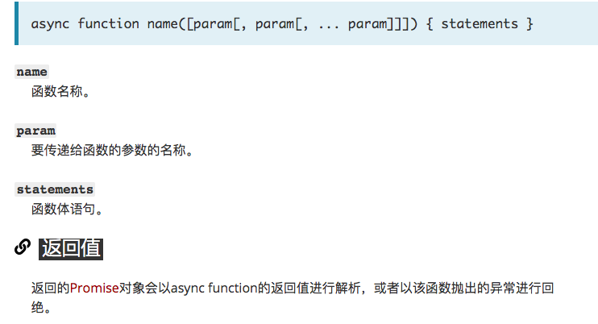
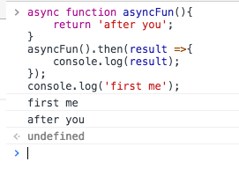
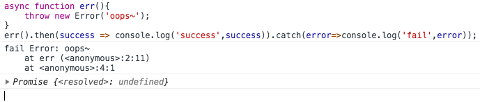

## 好文好读，async/await，解决回调
先介绍一下语法<br>
<br>
然后我们稍微描述一下<br>
### 描述
当调用一个async函数时，会返回一个Promise对象。当这个async函数返回一个值时，Promise的resolve方法会负责传递这个值；当async函数抛出异常时，Promise的reject方法也会传递这个异常值。<br>
async函数可能会有await表达式，这会使async函数暂停执行，等待表达式中的Promise解析完成后继续执行async函数并返回解决结果<br>
⚠️ await关键字仅仅在async function中有效。如果在async function函数体外使用await，你会得到一个语法错误❌（SyntaxError）<br>
📒 其实async/await的用途是简化使用promises异步调用的操作，并对一组Promises执行某些操作。正如Promises类似于结构化回调，async/await类似于组合生成器和promises。<br>
## async是啥？
看一个截图吧<br>
<br>
async声明的function就表示这是一个异步函数，返回的是一个promise对象，状态为resolved，参数是return的值。就是hello,async<br>
那么接下来又看一个截图吧<br>
<br>
这里首先是first然后是after。<br>
综上所述，async定义的函数内部会默认返回一个promise对象，如果函数内部抛出异常或者是返回reject，都会使函数的promise状态为reject。<br>
那么，如果失败态呢？我们尝试抛出一个失败态。
<br>
这里看到我们的函数内部，我们故意抛出了一个异常，返回reject，at err，asycn收到之后就去catch，catch就打印出来了。<br>
如果async函数接受到返回的值，发现不是异常或者reject，则判定成功，这里可以return各种数据类型的值，false,NaN,undefined...都是resolve。<br>
但是返回如下结果，就会判定失败reject:<br>
@ 内部含有直接使用并且未声明的变量或函数。<br>
@ 内部抛出一个错误`throw new Error` 或者返回 `reject`状态 `return Promise.reject('failure')`<br>
@ 函数方法执行出错...
在async使用上，必须将结果返回，不然不管执行`reject`还是`resolved`的值都为`undefine`，建议使用箭头函数<br>
```js
async function PromiseError(){
    return Promise.reject('error,promise');
}
// correct ，必须将reject状态return出去
```
## await是啥？
异步等待（async wait)。任何async函数都会默认返回promise，并且这个rpmise解析的值都将会示这个函数的返回值，而async函数必须等待内部所有的await命令的Promise对象执行完，才会发生状态改变。<br>
打个比方：await是美女，async是老司机，老司机必须等美女齐了再开车<br>
就是说，必须等所有的await函数执行完毕后，才会告诉promise，我成功了还是失败了，执行then或者catch<br>
```js
async function awaitReturn(){
    return await 'a';
};
awaitReturn().then(success => console.log('success',success)).catch(error => console.log('fail',error));
```
在这个函数里，有一个await函数，async会等到`await 'a'`这一步执行完了才会返回`promise`状态，毫无疑问，判定`resolved`。<br>
很多人以为await会一直等待之后的表达式执行完之后才会继续执行后面的代码，实际上await是一个让出线程的标志。await后面的函数会先执行一遍，然后就会跳出整个`async`函数来执行后面js栈的代码。等本轮事件循环执行完之后又会跳回到async函数中等待`await`后面的表达式的返回值，如果返回值为非promise则继续执行async函数后面的代码，否则将返回的`promise`放入`Promise`队列。<br>
举个🌰 
```js
const timeoutFn = function(timeout){
    return new Promise(function(resolve){
        return setTimrout(resolve,timeout);
    });
}
async function fn(){
    await timeoutFn(1000);
    await timeoutFn(2000);
    return 'complete';
}
fn().then(success => console.log(success));
```
这个🌰，要执行函数内所有的await函数才会返回状态，结构是执行完毕三秒后才会弹出`complete` <br>
@ 正常情况下，await命令后面跟着的是Promise，如果不是的话，也会被转换成一个立即resolve的Promise<br>
```js
function timeout(time){
    return new Promise(function(resolve){
        return setTimeout(function(){ 
                    return resolve(time + 200)
               },time);
    })
}

function first(time){
    console.log('第一次延迟了' + time );
    return timeout(time);
}
function second(time){
    console.log('第二次延迟了' + time );
    return timeout(time);
}
function third(time){
    console.log('第三次延迟了' + time );
    return timeout(time);
}

// A.
function start(){
    console.log('START');
    const time1 = 500;
    first(time1).then(time2 => second(time2) )
                .then(time3 => third(time3)  )
                .then(res => {
                              console.log('最后一次延迟' + res );
                              console.timeEnd('END');
                             })
};
start();
// B.效果同A
async function start() {
    console.log('START');
    const time1 = 500;
    const time2 = await first(time1);
    const time3 = await second(time2);
    const res = await third(time3);
    console.log(`最后一次延迟${res}`);
    console.log('END');
}
start();
```
但是要是await报错？怎么拌？（凉拌炒鸡蛋，好吃不好看）<br>
那就返回reject咯...<br>
```js
let last;
async function throwError() {  
    await Promise.reject('error');    
    last = await '没有执行'; 
}
throwError().then(success => console.log('成功', last))
            .catch(error => console.log('失败',last))
```
上面一旦reject，就立即停止往下执行，导致last不报错。其实这里可以用try/catch一下<br>
```js
let last;
async function throwError() {  
    try{  
       await Promise.reject('error');    
       last = await '没有执行'; 
    }catch(error){
        console.log('has Error stop');
    }
}
throwError().then(success => console.log('成功', last))
            .catch(error => console.log('失败',last))
```
下面看一个🌰：
```js
function testSometing() {
    console.log("testSomething");
    return "return testSomething";
}

async function testAsync() {
    console.log("testAsync");
    return Promise.resolve("hello async");
}

async function test() {
    console.log("test start...");

    const testFn1 = await testSometing();
    console.log(testFn1);

    const testFn2 = await testAsync();
    console.log(testFn2);

    console.log('test end...');
}

test();

var promiseFn = new Promise((resolve)=> { 
                    console.log("promise START...");
                    resolve("promise RESOLVE");
                });
promiseFn.then((val)=> console.log(val));

console.log("===END===")
```
观众们可以回去尝试一下这段代码<br>
下面我们解释一下<br>
首先test()就肯定打印出test start...<br>
然后 await，先执行testSometing()，打印test Someting，但是return就不会返回，说好了，跑完await，跳出去async，再跳回来在执行返回值.<br>
之后因为await会让出线程就会去执行后面的。testAsync是async的，所以执行完毕就会返回resolve，就会叫promiseFn打印出‘promise START'。<br>
紧接着，会把Promise resolve("promise RESOLVE");放到Promise队列，继续执行打印===END===。<br>
OK，本轮事件循环执行结束后，就跳到async中，test()函数，等待之前await后面表达式的返回值，因为testSometng()不是async函数，所以返回的是一个字符串"return test Someting"。<br>
然后，test()继续走啊走，执行到testFn2()，再跳出test()，打印testAsync,此时，事件循环就到了Promise的队列，执行promiseFn.then((val)=> console.log(val));打印promise RESOLVE<br>
后来，又跳回到test函数继续执行console.log(testFn2)返回值，打印‘hello async‘，最后打印test end...<br>

好了，更多尝试请自便，这一种❤新的编写异步代码的新方法。建立在promise之上，非阻塞。<br>

