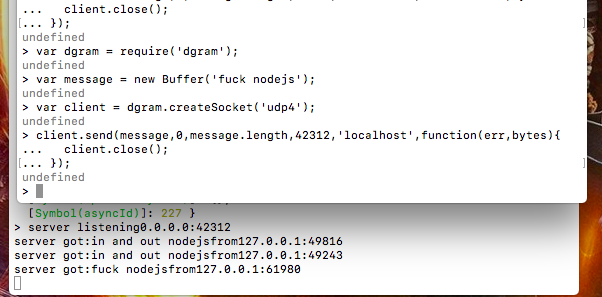
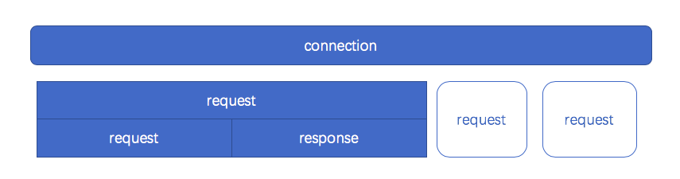
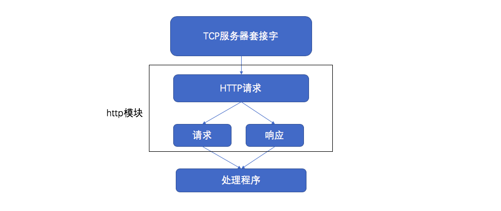

# 网络编程
Node提供了net、dgram、http、https这四个模块，分别用于处理TCP、UDP、HTTP、HTTPS适用于服务器端和客户端。<br>
## 构建TCP服务
目前大多数应用都是基于TCP搭建而成的。<br>
### TCP
TCP->传输控制协议（Transfer，Control，Protocol）。 <br>
OSI模型->七层->物理层(网路物理硬件)->数据链路层（网络特有的链路接口）->网络层（IP）->传输层（TCP/UDP）->会话层（通信链接/维持会话）->表示层（加密/解密 .etc）->应用层（HTTP,SMTP,IMAP .etc）<br>
TCP是面向链接的协议，其显著的特征是在传输之前需要3次握手形成会话，如图
<br>
只有会话形成之后，服务器端和客户端之间才能互相发送数据。在创建会话的过程中，服务器端和客户端分别提供一个 **套接字**， 这两个套接字共同形成一个链接。服务器端与客户端则通过套接字实现两者之间链接的操作。<br>
### 创建TCP服务器端
```js
var net = require('net');
undefined
var server = net.createServer(function(socket){
... socket.on('data',function(data){
..... socket.write('hello');
..... });
... socket.on('end',function(){
....... console.log('oout');
....... });
... socket.write('welcome');
... });

server.listen(9999,function(){
  console.log('server bound');
});
```
我们通过net.createServer(listener)即可创建一个TCP服务器，listener是链接事件connection的侦听器。
```js
var server = net.createServer();
server.on('connection',function(socket){
  // new connection
});
server.listen(9999);
```
### TCP服务的事件
代码分为服务器事件和事件。<br>
#### 服务器事件
对于通过net.createServer()创建的服务器而言，它是一个EventEmitter实例。<br>
* listening:在调用server.listen()绑定端口或者Domain Socket后触发，简洁写法为 `server.listen(port,listeningListener)`，通过listen()方法的第二个参数传入。<br>
* connection: 每个客户端套接字连接到服务器端时触发，简洁写法为通过`net.createServer()`，最后一个参数传递。<br>
* close: 当服务器关闭时触发，在调用server.close()后，服务器将停止接受新的套接字链接，但保持当前存在的链接，等待所有链接都断开后，会触发该事件。<br>
* error: 当服务器发生异常时，将会触发该事件。比如侦听一个使用中的端口，将会触发一个异常，如果不侦听error事件，服务器将会抛出异常<br>
#### 连接事件
服务器可以同时与多个客户端保持🔗 连接，对于每个连接而言是经典的可写可读Stream对象。Stream对象可以用于服务器端和客户端之间的通信，既可以通过data事件从一端读取另一端发来的数据，也可以通过write()方法从一端向另一端发送数据。<br>
* data: 当一端调用write()发送数据时，另一端会触发事件，事件传递的数据即是write()发送的数据。<br>
* end: 当连接中的任意一端发送了FIN数据时，将会触发该事件。<br>
* connect: 该事件用于客户端，当套接字与服务器端🔗 连接成功时会被触发。<br>
* drain: 当任意一端调用write()发送数据时，当前这端会触发该事件。<br>
* error: 当异常发生时，触发该事件。<br>
* close: 当套接字完全关闭时，触发该事件。<br>
* timeout: 当一定时间后连接不再活跃时，该事件将会被触发，通知用户当前该连接已经被闲置了。<br>
另外，由于TCP套接字是可写可读的Stream对象，可以利用pipe()方法巧妙地实现管道操作。<br>
```js
var net = require('net');
var server = net.createServer(function(socket){
  socket.write('Echo server\r\n');
  socket.pipe(socket);
});
server.listen(1337,'127.0.0.1');
```
⚠️ TCP针对网络中的小数据包有一定的优化策略： **Nagle算法**。如果发送一个字节的内容而不优化，网络中将充满只有极少数有效数据的数据包，将十分浪费网络资源。<br>
Nagle，要求缓冲区的数据达到一定数量或者一定时间后才将其发出，所以小数据包将会被Nagle算法合并，以此来优化网络。这种优化虽然使网络带宽被有效地使用，但是数据有可能被延迟发送。<br>
在Node中，由于TCP默认启用了Nagle算法，可以调用socket.setNoDelay(true)去掉Nagle算法，使得write()可以立即发送数据到网络中。<br>
⚠️ 尽管网络的一端调用write()会触发另一端的data事件，但是并不意味着每次write()都会触发一次data事件，在关闭掉Nagle算法后，另一端可能会将接收到的多个小数据包合并，然后只触发一次data事件。<br>
### 构建UDP服务
用户数据包协议，与TCP一样同属于网络传输层。UDP与TCP最大的不同时UDP不是面向🔗 连接的。TCP中连接一旦建立，所有的会话都基于连接完成，客户端如果要与另一个TCP服务通信，需要另创建一个套接字来完成连接。但在UDP中，一个套接字可以与多个UDP服务通信，他虽然提供面向事务的简单不可靠信息传输服务，在网络差的情况下存在丢包严重的问题，但是由于它无需连接，资源消耗低，处理快速且灵活，所以常常应用在那种偶尔丢一两个数据包也不会产生重大影响的场景，比如音频线、视频等。UDP目前应用很广泛，DNS即是基于它实现的。<br>
#### 创建UDP套接字
创建套接字十分简单，UDP套接字一旦创建，既可以作为客户端发送数据，也可以作为服务器端接收数据。
```js
var dgram = require('dgram');
var socket = dgram.createSocket('udp4');
```
#### 创建UDP服务器端
若想让UDP套接字接收网络消息，只要调用dgram.bind(port,[address])方法对网卡和端口进行绑定即可。
```js
var dgram = require('dgram');
var server = dgram.createSocket('udp4');
server.on('message',function(msg,rinfo){
  console.log('server got:'+msg+'from'+rinfo.address+':'+rinfo.port);
});

server.on('listening',function(){
  var address = server.address();
  console.log('server listening'+address.address+':'+address.port);
});
server.bind(42312);
```
#### 创建UDP客户端
接下来我们创建一个客户端与服务器端进行对话
```js
var dgram = require('dgram');
var message = new Buffer('fuck nodejs');
var client = dgram.createSocket('udp4');
client.send(message,0,message.length,42312,'localhost',function(err,bytes){
  client.close();
});
```
显示为
<br>
当套接字对象用在客户端时，可以调用send()方法发送消息到网络中。`socket.send(buf,offset,length,address,[callback])`<br>
buffer,buffer的偏移，buffer的长度，目标端口，目标地址，发送完成后的回调。与TCP套接字的write相比，send方法的参数列表相对复杂，但是它更灵活的地方在于可以随意发送数据到网络中的服务器端，而TCP如果要发送数据给另一个服务器端，则需要重新通过套接字构造新的连接。<br>
#### UDP套接字事件
UDP套接字相对于TCP套接字使用起来更简单，它只是一个EventEmitter的实例，而非Stream的实例<br>
* message: 当UDP套接字侦听网卡端口后，接收到信息时触发该事件，触发携带的数据为消息Buffer对象和一个远程地址信息。<br>
* listening: 当UDP套接字开始侦听时触发该事件。<br>
* close: 调用close()方法时触发该事件，并不再触发message事件。如需再次触发message事件，重新绑定即可。<br>
* error: 当异常发生时触发该事件，如果不侦听，异常将直接抛出，使进程退出。<br>
### 构建HTTP服务
TCP与UDP都属于网络传输层协议，如果要构造高效的网络应用，就应该从传输层进行着手。<br>
但是HTTP和SMTP已经绰绰有余了，Node提供了基本的http和https模块用于HTTP和HTTPS的封装。<br>
实现一个HTTP服务器
```js
var http = require('http');
http.createServer(function(req,res){
  res.writeHead(200,{'Content-type':'text/plain'});
  res.end('hello,world\n');
}).listen(1337,'127.0.0.1');
```
这一段代码能维持的并发量和QPS都是不容小觑。
#### HTTP
应用层协议。在HTTP的两端是服务器和浏览器，即著名的B/S模式。
##### HTTP报文
```
bogon:~ mrtrans$ curl -v http://127.0.0.1:1337
* Rebuilt URL to: http://127.0.0.1:1337/  // syn
*   Trying 127.0.0.1...
* TCP_NODELAY set // syn&ack
* Connected to 127.0.0.1 (127.0.0.1) port 1337 (#0) // TCP三次🤝 握手 // ack
> GET / HTTP/1.1 
> Host: 127.0.0.1:1337
> User-Agent: curl/7.54.0
> Accept: */*           // 客户端向服务器端发送请求报文
> 
< HTTP/1.1 200 OK
< Content-type: text/plain
< Date: Sat, 13 Oct 2018 00:46:20 GMT
< Connection: keep-alive
< Transfer-Encoding: chunked
< 
hello,world          // 向客户端发送请求报文
* Connection #0 to host 127.0.0.1 left intact // 结束会话
```
HTTP是基于请求响应式的。处理HTTP请求和发送HTTP响应。<br>
报文内容都包含两个部分：报文头和报文体。<br>
##### http模块
Node的http模块包含对HTTP处理的封装。在Node中，HTTP服务继承自TCP服务器（net模块），它能够与多个客户端保持🔗 连接，由于其采用事件驱动的形式，并不为每一个🔗 连接创建额外的线程或进程，保持很低的内存占用，所以能实现高并发。<br>
HTTP服务和TCP服务的区别在于，在开启keepalive后，一个TCP会话可以用于多次请求和响应。TCP服务以connection为单位进行服务，HTTP服务以request为单位进行服务。http模块即是将connection到request的过程进行了封装。如图<br>
<br>
除此之外，http模块将🔗 连接所用套接字的读写抽象为ServerRequest和ServerResponse对象，他们分别对应请求和响应操作。<br>
在请求产生的过程中，http模块拿到🔗 连接中传来的数据，调用二进制模块http_parser进行解析，在解析完请求报文的报头后，触发request事件，调用用户的业务逻辑。<br>
<br>
处理程序对应到示例中的代码就是响应Hello World这部分
```js
function(req,res){
  res.writeHead(200,{'Content-Type':'text/plain'});
  res.end('hello,world\n');
}
```
##### http请求
对于TCP🔗 连接的读操作，http模块将其封装为ServerRequest对象。让我们再次查看前面的请求报文，报文头部将会通过http_parser进行解析<br>
```
> GET / HTTP/1.1
> Host: www.baidu.com
> User-Agent: curl/7.54.0
> Accept: */*
```
报文投第一行GET/HTTP/1.1 被解析之后分解为如下属性。<br>
* req.method 属性:值为GET，是为请求方法，常见的请求方法有GET、POST、DELETE、PUT、CONNECT等几种。<br>
* req.url属性: 值为/。<br>
* req.httpVersion属性:值为1.1<br>
其余报头是很规律的Key:Value格式，被解析后放置在req.headers属性上传递给业务逻辑以供调用。
```js
headers:{
  'User-Agent':'',
  host:'www.baidu.com',
  accept:'*/*'
},
```
报文体部分则抽象为一个只读流对象，如果业务逻辑需要读取报文体中的数据，则要在这个数据流结束后才能进行操作。<br>
```js
function(req,res){
  // console.log(req.headers)
  var buffers = [];
  req.on('data',function(trunk){
    buffers.push(trunk);
  }).on('end',function(){
    var buffer = Buffer.concat(buffers);
    res.end('hello,world');
  });
}
```
这种写法比较奇特，需要琢磨一下！有emit，有on<br>
HTTP请求对象和HTTP响应对象是相对较底层的封装，现行的Web框架如Connect和Express都是在这两个对象的基础上进行高层封装完成的。<br>
##### HTTP响应
再来看看HTTP响应对象。HTTP响应相对简单一些，它封装了对底层🔗 连接的写操作，可以将其看成一个可写的流对象。它影响响应报文头部信息的API为res.setHeader()和res.writeHead()<br>
```js
res.writeHead(200,{'Content-Type':'text/plain'});
```
setHeader步骤：
```js
< HTTP/1.1 200 OK
< Content-Type: text/plain
```
可以调用setHeader进行多次设置，但只有调用writeHead后，报头才会写入到连接中
```js
< Date:Sat,...
< Connection: keep-alive
< Transfer-Encoding: chunked
```
报文体部分则是调用res.write()和res.end()方法实现，后者与前者的差别在于res.end()会调用write()发送数据，然后发送信号告知服务器这次响应结束。<br>
响应结束后，HTTP服务器可能会将当前的连接用于下一个请求，或者关闭连接。值得注意的是，报头是在报文体发送前发送的，一旦开始了数据的发送，writeHead()和setHeader()将不再生效。这由协议的特性决定的。<br>
⚠️ 无论服务器端在处理业务逻辑时是否发生异常，务必在结束时调用res.end()结束请求，否则客户端将一直处于等待的状态。<br>
sure，你也可以同构延迟res.end()的方式实现客户端与服务器端之间的长链接，但结束时 **务必关闭连接**<br>
##### HTTP服务的事件
如同TCP服务一样，HTTP服务器也抽象了一些事件以供应用层使用，同样典型的是，服务器也是一个EventEmitter实例。<br>
* connection事件:在开始HTTp请求和响应前，客户端与服务器端需要建立底层的TCP连接，这个连接可能因为开启了keep-alive，可以在多次请求响应之间使用；当这个连接建立时，服务器触发一次connection事件。<br>
* request事件: 建立TCP连接后，http模块底层将在数据流中抽象出HTTP请求和HTTP响应，当请求数据发送到服务器端，在解析出HTTP请求头后，将会触发该事件；在res.end()后，TCP连接可能将用于下一次请求响应。<br>
* close事件: 与TCP服务器的行为一致，调用server.close()方法停止接受新的连接，当已有的🔗 连接都断开时，触发该事件；可以给server.close()传递一个回调函数来快速注册该事件。<br>
* checkContinue事件: 某些客户端在发送较大的数据时，并不会将数据直接发送，而是先发送一个头部带Expect:100-continue的请求到服务器，服务器会触发checkContinue事件；如果没有为服务器监听这个事件，服务器将会自动响应客户端100 continue的状态码，表示接受数据上传；如果不接受数据的较多时，响应客户端400 Bad Request拒绝客户端继续发送数据即可。⚠️ 当该事件发生时不会触发request事件，两个事件之间互斥。当客户端收到100 Continue后重新发起请求时，才会触发request事件。<br>
* connect事件: 当客户端发起CONNECT请求时触发，而发起CONNECT请求通常在HTTP代理时出现；如果不监听该事件，发起该请求的连接将会关闭。<br>
* upgrade事件: 当客户端要求升级连接🔗的协议时，需要和服务器端协商，客户端会在请求头中带上Upgrade字段，服务器端会在接收到这样的请求时触发该事件。参考后文WebSocket。如果不监听该事件，发起该请求的连接将会关闭。<br>
* clientError: 连接的客户端触发error事件时，这个错误会传递到服务器端，此时触发该事件。<br>
#### HTTP客户端
在对服务器端的实现进行了描述后，HTTP客户端的原理基本不用再描述，因为他就是服务器端服务模型的另一部分，处于HTTP的另一端，在整个报文的参与中，报文头和报文体由它产生。同时http模块提供了一个底层API:http.request（options,connect)，用于构造HTTP客户端
```js
var options = {
  hostname:'127.0.0.1',
  port:1336,
  path:'/',
  mothed:'GET'
};
var req = http.request(options,function(res){
  res.setEncoding('utf-8');
  res.on('data',function(chunk){
    console.log(chunk);
  });
});
req.end();
```
其中options参数决定了这个HTTP请求头中的内容。选项包括host、hostname、port、localAddress、socketPath、method、path、headers、auth<br>
报文体中的内容由请求对象的write()和end()方法实现：通过write()方法向连接中写入数据，通过end()方法告知报文结束。它与浏览器中的Ajax调用几近相同，一个异步的网络请求。<br>
##### HTTP响应
触发response事件，传递一个响应对象以供操作ClientResponse
##### HTTP 代理
如同服务器端的实现一般，http提供的ClientRequest对象也是基于TCP层实现的，在keepalive的情况下，一个底层会话连接可以多次用于请求。为了重用TCP连接，http模块包含一个默认的客户端代理对象http.globalAgent。<br>
http.globalAgent 对每个服务器端（host+port）创建的连接进行了管理，默认情况下，通过ClientRequest对象对同一个服务器端发起的HTTP请求最多可以创建5个连接。<br>
实质上，它是一个连接池。调用HTTP客户端同时对一个服务器发起10次HTTP请求时，其实质只有5个请求处于兵法状态，后续的请求需要等待某个请求完成服务后才真正发出。这与浏览器对同一个域名有下载链接数的限制是相同的行为。<br>
所以，如果你在服务器端通过ClientRequest调用网络中的其他HTTP服务，记得关注代理对象对网络请求的限制。一旦请求量过大，连接限制将会限制服务性能。如果需要改变可以在options中传递agent选项。<br>
默认情况下，请求会采用全局的代理对象，默认连接数限制为5<br>
```js
var agent = new http.Agent({
  maxSocket:10
});
var options = {
  ...
  agent:agent
};
```
也可以设置agent选项为false值，以脱离连接🔗 池的管理，使得请求不受并发的限制。<br>
Agent对象的sockets和requests属性分别表示当前连接🔗 池中使用中的连接数和处于等待状态的请求数，在业务中监视这两个值有助于发现业务状态的繁忙程度。<br>
##### HTTP客户端事件
* response: 与服务器端的request事件对应的客户端在请求发出后得到服务器端响应时，会触发该事件。<br>
* socket: 当底层连接🔗 池中建立的连接分配给当前请求对象时，触发该事件。<br>
* connect: 当客户端向服务器端发起CONNECT请求时，如果服务器端响应了200状态码，客户端将会触发该事件。<br>
* upgrade: 客户端向服务器端发起Upgrade请求时，如果服务器端响应了101 Switching Protocols状态，客户端将会触发该事件。<br>
* continue: 客户端向服务器端发起Expect:100-continue头信息，以试图发送较大数据量，如果服务器端响应100 Continue状态，客户端将触发该事件。<br>
### 构建WebSocket服务
提到Node，不能错过的是WebSocket协议，它与Node之间的配合简直堪称完美。<br>
* WebSocket客户端基于事件的编程模型与Node中自定义事件相差无几。<br>
* WebSocket实现了客户端与服务器端之间的长连接，而Node事件驱动的方式十分擅长与大量的客户端保持高并发连接。<br>
WebSocket与传统HTTP有如下好处<br>
* 客户端与服务器端只建立一个TCP连接，可以使用更少的连接<br>
* WebSocket服务器端可以推送数据到客户端，这远比HTTP请求响应模式更灵活、更高效。<br>
* 有更轻量级的协议头，减少数据传送量。<br>
```js
var socket = new WebSocket('ws://127.0.0.1/updates');
socket.onopen = function(){
  setInterval(function(){
    if(socket.bufferedAmount == 0)
      socket.send(getUpdateData());
  },50);
};
socket.onmessage = function(event){
  ...
};
```
实现每50毫秒向服务器发送一次数据，同时可以通过onmessage()方法接收服务器端传来的数据。实现双向通信。WebSocket协议主要有两部分： **握手和数据传输**<br>
#### WebSocket握手
`Sec-WebSOcket-key: dGsljkldfjaddd==` 随机生成的Base64编码的字符串。然后通过sha1安全散列算法计算粗结果后，在进行Base64编码，最后返回给客户端
```js
var crypto = request('crypto');
var val = crypto.createHash('sha1').update(key).digest('base64');
```
应用层使用websocket协议需要告知客户端`conneciton:upgrade`更换协议，并在使用`Sec-WebSocket-Key,Sec-WebSocket-Protocol,Sec-WebSocket-Version`指定更换协议，并直接对websocket进行解析`var websocket = function(url){} websocket.prototype.onopen = funciton(){} ..`
但是现在应用已经将WebSocket封装起来了，可以直接`require('ws')`即可实现websocket编程，通信。<br>
#### 小结
在所有的WebSocket服务器端实现中，没有比Node更贴切WebSocket的使用方式了。<br>
* 基于事件的编程接口<br>
* 基于JavaScript，以封装良好的WebSocket实现，API与客户端可以高度相似。<br>
另外，Node基于事件驱动的方式使得它对应WebSocket这类长连接的应用场景可以轻松地处理大量并发请求。尽管Node没有内置WebSocket的库，但是社区的ws模块封装了WebSocket的底层实现。socket.io即是在它 的基础上实现的。<br>
### 网络服务与安全
SSL(Secure Sockets Layer),IETF将其标准化TLS(Transport Layer Security)<br>
Node提供了三个模块用于网络安全，分别为crypto,tls,https。<br>
crypto(用于加密解密)，SHA1,MD5等加密算法。<br>
tls提供与net模块类似的功能，区别在于他建立在TLS/SSL加密的TCP连接上<br>
https，完全与http模块接口一致。区别在于它建立于安全的连接之上。<br>
#### TLS/SSL
是一个公钥/私钥的结构，它是一个非对称的结构，每个服务器端和客户端都有自己的公私钥。公钥用来加密要传输的数据，私钥用来解密接收到的数据。<br>
公钥和私钥时配对的，通过公钥加密的数据，只有通过私钥才能解密，所以在建立安全传输之前，客户端和服务器端之间需要互换公钥。<br>
客户端发送数据时要通过服务器端的公钥进行加密，服务器端发送数据时则需要客户端的公钥进行加密，如此才能完成加密解密的过程。<br>
Node在底层采用的是openssl实现了TLS/SSL的，为此要生成公钥和私钥可以通过openssl完成<br>
私钥
```js
$ openssl genrsa -out server.key 1024
Generating RSA private key, 1024 bit long modulus
............................++++++
.....................................................++++++
e is 65537 (0x10001)
```
```js
bogon:~ mrtrans$ openssl genrsa -out client.key 1024
Generating RSA private key, 1024 bit long modulus
..........++++++
......++++++
e is 65537 (0x10001)
```
然后通过他们生成公钥
```js
$ openssl rsa -in server.key -pubout -out server.pem
writing RSA key
```
```js
openssl rsa -in client.key -pubout -out server.pem
writing RSA key
```
##### 数字证书防止伪造公钥
数字证书中包含了服务器的名称和主机名、服务器的公钥、签名颁发机构的名称、来自签名颁发机构的签名。在建立连接前，会通过证书中的签名确认收到的公钥是来自目标服务器的，从而产生信任关系。（营业执照关系）<br>
CA(Certificate Authority)<br>
通过采用自签名证书来构建安全网络。
```js
openssl genrsa -out ca.key 1024
openssl req -new 0key ca.key -out ca.csr
openssl x509 -req -in ca.csr -signkey ca.key -out ca.crt // 获取签名证书
```
先获取证书再请求！
#### TLS服务
options包含私钥，证书
#### HTTPS服务
HTTPS服务就是工作在TLS/SSL上的HTTP。<br>
##### 准备证书
需要用到私钥和签名证书。
##### 创建HTTPS服务
创建HTTPS服务只比HTTP服务多一个选项配置，就是options多证书和私钥。<br>
```
curl -k https://... // 让curl工具忽略掉证书的验证
```
```
curl --cacert keys/ca.crt https://... //告知CA证书使之完成对服务器证书的验证
```
##### HTTPS客户端
多私钥和证书的参数
### 总结
Node基于事件驱动和非阻塞设计。在分布式环境中尤其能发挥它的特长，基于事件驱动可以实现与大量的客户端进行连接，非阻塞设计则让它可以更好地提升网络的响应吞吐。Node提供了相对底层的网络调用，以及基于事件的编程接口，使得开发者在这些模块上十分轻松地构建网络应用。<br>

