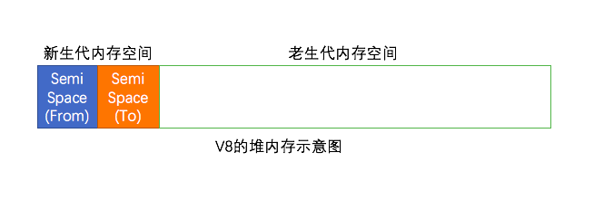
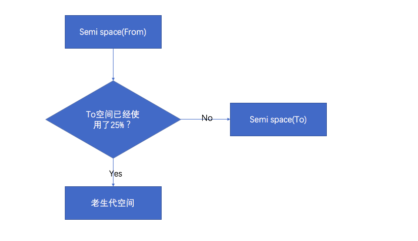
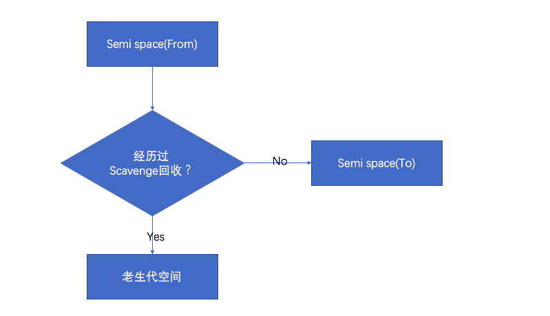

# 内存控制
基于无阻塞、事件驱动建立的Node服务，具有内存消耗低的优点，非常适合处理海量的网络请求。<br>
这一章算是正式迈进服务器编程的领域了，内存控制正式在海量请求和长时间运行的前提下进行探讨的。<br>
上一章节介绍了Node是如何利用CPU和I/O这两个服务器资源，本章介绍在Node中如何合理高效地使用内存。<br>
### V8的垃圾回收机制与内存限制
与java一样，由垃圾回收机制来进行自动内存管理，这使得开发者不需要像C/C++程序员那样在编写代码的过程中时刻关注内存的分配和释放问题。<br>
其实，对于性能敏感的服务端程序，内存管理的好坏、垃圾回收状况是否优良，都会对服务构成影响。<br>
**而在Node中，这一切都与Node的JavaScript执行引擎V8息息相关。**<br>
#### V8的内存限制
在Node中通过JavaScript使用内存时就会发现只能使用部分内存（64位系统约1.4GB，32位系统约0.7GB）。在这样的限制下，将会导致Node无法直接操作大内存对象，比如无法将一个2GB的文件读入内存中进行字符串分析处理，即使物理内存有32GB。这样，在单个Node进程的情况下，计算机的内存资源无法得到充足的使用。<br>
问题的主要原因：Node基于V8构建，所以Node中使用的JavaScript对象基本上都是通过V8自己的方式来进行分配和管理的。
#### V8的对象分配
在V8中，所有的JavaScript对象都是 **通过堆来进行分配的**。Node提供了V8中内存使用量的查看方式
```js
node
> process.memoryUsage();
{ rss: 21725184,
  heapTotal: 7684096,
  heapUsed: 4949968,
  external: 8752 }
```
memoryUsage()返回3个属性，heapTotal和heapUsed是V8的堆内存使用情况，前者是已申请到的堆内存，后者是当前使用的量。<br>
<br>
当我们在代码中声明变量并赋值时，所使用对象的内存就分配在堆中。如果已申请的堆空闲内存不够分配新的对象，将继续申请堆内存，直到堆的大小超过V8的限制为止。<br>
至于V8为何要限制堆的大小，原因两个<br>
表层：V8最初为浏览器而设计，不太可能遇到用大量内存的场景，对于网页，V8限制值已经绰绰有余。<br>
深层：V8的垃圾回收机制的限制。官方说法，以1.5GB的垃圾回收堆内存为例，V8做一次小的垃圾回收需要50ms以上，做一次非增量式的垃圾回收甚至需要1秒以上。这是垃圾回收中引起js线程暂停执行的时间，在这样的时间花销下，应用的性能和响应能力都会直线下降。因此，直接限制堆内存是一个好选择。<br>
当然限制也可以打开，`node --max-old-space-size=1700 xx.js`或`node --max-new-space-size=1024 xx.js` 更改内存大小<br>
#### V8的垃圾回收机制
介绍下V8用到的各种垃圾回收算法。<br>
1. V8 主要的垃圾回收算法
V8的垃圾回收策略主要基于 **分代式垃圾回收机制**。在自动垃圾回收的演变过程，人们发现没有一种垃圾回收算法能够胜任所有的场景。<br>
因为在实际应用中，对象的生存周期长短不一，不同的算法只能针对特定情况具有最好的效果。为此，统计学在垃圾回收算法的发展中产生了较大的作用，现代的垃圾回收算法中按对象的存活时间将内存的垃圾回收进行不同的分代，然后分别对不同分代施以更高效的算法。<br>
* V8的内存分代
新生代和老生代。新生代中的对象为存活时间较短的对象，老生代中的对象为存活时间较长或常驻内存的对象。<br>
|新生代的内存空间|☁️ ☁️☁️☁️☁️☁️☁️☁️☁️☁️老生代的内存空间☁️☁️☁️☁️☁️☁️☁️☁️☁️☁️☁️☁️|<br>
V8堆的整体大小就是新生代所用内存空间加上老生代的内存空间。--max-old-space-size可设置老生代内存空间的最大值，--max-new-space-size设置新生代的内存空间大小。<br>
以上两个命令需要在启动时就指定。这意味着V8使用的内存没有办法根据使用情况自动扩充，当内存分配过程中超过极限值时，就会引起进程出错。<br>
对于新生代内存，它由两个`reserved_semispace_size_`所构成。按机器位数不同，`reserved_semispace_size_`在64位系统和32位系统上分别16MB和8MB。所以新生代内存的最大值在64位系统和32位系统上分别为32MB和16MB。<br>
V8堆内存的最大保留空间可以从下面的代码中看出来，其公式为4*reverved_semispace_size_+max_old_generation_size_:
* Scavenge算法
在分代的基础上，新生代中的对象主要通过Scavenge算法进行垃圾回收。在Scavenge的具体实现中，主要采用了Cheney算法。<br>
Cheney算法是一种采用复制的方式实现的垃圾回收算法。它将堆内存一分二，每一部分空间称为semispace。在这两个semispace空间中，只有一个处于使用中，另一个处于闲置状态。处于使用状态的semispace空间称为From空间，处于闲置状态的空间称为To空间。当我们分配对象时，先是在From空间中进行分配。当开始进行垃圾回收时，会检查From空间中的存活对象，这些存活对象将被复制到To空间中，而非存活对象占用的空间将会被释放。完成复制后，From空间和To空间的角色发生对换。简而言之，在垃圾回收的过程中，就是通过将存活对象在两个semispace空间之间进行复制。<br>
Scavenge的缺点是只能使用堆内存的一半，这是由划分空间和复制机制所决定的。但Scavenge由于只复制存活的对象，并且对于生命周期短的场景存活对象只占少部分，所以它在时间效率上有优异的表现。<br>
所以Scavenge是典型的牺牲空间换取时间的算法，所以无法大规模地应用到所有的垃圾回收中。但可以发现，Scavenge非常适合应用在新生代中，因为新生代中对象的生命周期较短，恰恰适合这个算法。<br>
所以V8的堆内存示意图<br>
<br>
实际使用的堆内存是新生代中的两个semispace空间大小和老生代所用内存大小之和。<br>
当一个对象经过多次复制依然存活时，它将会被认为是生命周期较长的对象。这种较长的周期的对象将会被移动到老生代中，采用新的算法进行管理。**对象从新生代中移动到老生代中的过程称为晋升。**<br>
对象的晋升的条件主要有两个，一个是对象是否经历过Scavenge回收，一个是To空间的内存占用比超过限制。<br>
晋升流程<br>
<br>
to空间内存占用比<br>
<br>
如果占比过高，会影响后续的内存分配。<br>
* V8在老生代中主要采用Mark-Sweep & Mark-Compact相结合的方式进行辣鸡回收
对于老生代中的对象，由于存活对象占较大比重，再采用Scavenge的方式会有两个问题：
> 一个是存活对象较多，复制存活对象的效率将会很低。
> 另一个问题依然是浪费一半的空间的问题
Mark-Sweep是标记清楚的意思，它分为标记和清除两个阶段。与Scavenge相比，Mark-Sweep并不将内存空间划分为两半，所以不存在浪费一般空间的行为。<br>
与Scavenge复制活着的对象不同，Mark-Sweep在标记阶段遍历堆中所有对象，并标记活着的对象，在随后的清除阶段中，只清除没有被标记的对象。<br>
可以看出，Scavenge只复制活着的对象，而Mark-sweep只清理死亡对象。活对象在新生代中只占小部分，死亡对象在老生代中只占小部分，这就是两种回收方式能高效处理的原因。<br>
Mark-Sweep清除后，内存空间会出现不连续的状态。这种内存碎片会对后续的内存分配造成问题，因为很可能出现需要分配一个大对象的情况，这时所有的碎片空间都无法完成此次分配，就会提前触发辣鸡回收，而这次回收是不必要的。<br>
所以为了解决上面所说的问题，提出了Mark-Compact。


