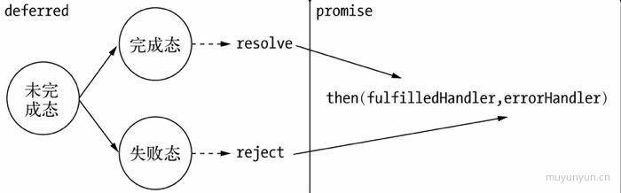
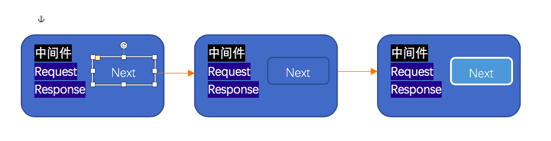

## Node简介
首先这本书我看了一遍，所以我现在基本上是二刷，这一次我会详细做一些笔记，并且会运行一个web应用去验证一些代码段，进行异步以及同步编程的示例操作。同时大部分会去做摘录一些重要的语句去做记忆。<br>
**为什么叫node?**
起初，Ryan Dahl称他的项目为Web.js，就是一个web的服务器，但是项目的发展竟然变成了构建网络应用的一个基础框架，由此，在node的基础上可以构建更多的东西，像服务器、客户端、命令行工具等。Node发展为一个强制不共享任何资源的单线程、单进程系统，包含十分适宜的网络的库，为构建大型分布式应用程序提供基础设施，其目标也是成为一个构建快速，可伸缩的网络应用平台。他自身非常简单，通过通信协议来组织许多Node，非常容易通过扩展来达成构建大型网络应用的目的。每一个Node都构成这个网络应用的一个节点。<br>

## Node特点
**异步 I/O**
```js
$.post('url',{title:'nodejs is the best'},function (data){
    console.log('got this');
});
console.log('end post');
```
在这里，其实熟悉异步的用户会知道，got this是在end post之后输出的。在调用$.post()后，后续代码是被立即执行的，而got this的执行时间是不被预期的。我们只知道它将在这个异步请求结束后执行，但并不知道具体的时间点。其实在异步调用中，对于结果值的捕获始终遵循一个原则就是"Don't call me, I will call you"。<br>
那么在node中，异步IO也很常见。例如读取文件<br>
```js
var fs = require('fs');
fs.readFile('/path',function(err,file){
     console.log('read finish');
});
console.log('go read');
```
读出来就是先go read 再read finish<br>
其实在node中，绝大多数的操作都以异步的方式进行调用。在Node中，我们可以语言层面很自然地进行并行I/O操作。
事件与回调函数<br>
通过一个例子来解释一下事件<br>
```js
var http = require('http');
var querystring = require('querystring');

http.createServer(function(req,res){
var postData = '';
req.setEncoding('utf-8');

req.on('data',function(chunk){
postData += chunk;
});
req.on('end',function(){
res.end(postData);
});
}).listen(8080);
console.log('server open');
```
在这里，运行后服务端会启动，这里我们在前端再构建ajax发送事件，后端就会获取，这里我们就只需要关心请求成功时执行相应的业务逻辑即可。
**单线程**
Node保持了Javascript在浏览器中单线程的特点。 而且在Node中，javascript与其余线程是无法共享任何状态的。<br>
好处： 不用像多线程编程那样处处在意状态的同步问题，这里没有死锁的存在，也没有线程上下文交换所带来的性能上的开销。<br>

## 模块机制
js经历了 工具->组件->框架->应用 <br>
CommonJS模块规范<br>
1. 模块引用<br>
```js
var math = require('math');
```
2.模块定义<br>
//math.js
```js
exports.add = function(){
var sum = 0,i=0,args = arguments, l=args.length;
while(i<1){
sum += args[i++];
}
return sum;
};
//mathRequire.js
var math = require('./math');

exports.increment = function(val){
return math.add(val,3);
};
```
## Node的模块实现
Node中引入模块需要经历如下3个步骤<br>
1. 路径分析<br>
2. 文件定位<br>
3. 编译执行<br>
Node中，模块分为两类：一类是Node提供的模块，称为核心模块；另一类是用户编写的模块，称为文件模块<br>
核心模块部分在Node源码的编译过程中，编译进了二进制执行文件<br>
文件模块则是在运行时动态加载，需要完整的路径分析、文件定位、编译执行过程，速度比核心模块慢<br>
**优先从缓存加载**
Node引用的模块都会进行缓存，以减少二次引入时的开销，不同的地方在于，浏览器仅仅缓存文件，而Node缓存的是编译和执行之后的对象<br>
require()方法对相同模块的二次加载都一律采用缓存优先的方式，这是第一优先级。不同之处在于核心模块的缓存检查先于文件模块的缓存检查。<br>
**路径分析和文件定位**
*模块标识符分析*
核心模块，如 http,fs,path等<br>
.或..开始的相对路径<br>
以/开始的绝对路径文件模块<br>
非路径形式的文件模块，如自定义connect模块<br>
**核心模块**
核心模块的优先级仅次于缓存加载<br>
路径形式的文件模块<br>
自定义模块 最慢<br>
模块路径是Node在定位文件模块的具体文件时制定的查找策略，具体表现为一个路径组成的数组。<br>
生成规则<br>
1.当前文件目录下的node_modules<br>
2.父目录下的node_modules<br>
3.父目录的父目录下的node_modules<br>
4.沿路径向上逐级递归，直到根目录下的node_modules<br>

## 模块编译
每个文件模块都是一个对象<br>
对于不同的文件扩展名，其载入方法也有所不同<br>
1. .node文件。用C/C++编写的扩展文件，通过dlopen()方法加载最后编译生成的文件<br>
2. .js文件。 通过fs模块同步读取文件后编译执行<br>
3. .json文件。 通过fs模块同步读取文件后，用JSON.parse()解析返回结果<br>
4. .其余都.js文件载入<br>
每一个编译成功的模块都会将其文件路径作为索引缓存在module._cache对象上，以提高二次引用性能<br>
根据不同的文件扩展名，Node会调用不同的读取方式。<br>
1.javascript模块的编译<br>
事实上，在编译的过程中，Node对获取的JavaScript文件内容进行了头尾包装。在头部添加了（function(exports,require,module,__filename,__dirname){\n, 在尾部添加了\n});<br>
一个正常的Javascript文件会被包装成如下的样子：<br>
```js
      (function(exports,require,module,__filename,__dirname){
                var math = require('math');
                exports.area = function(radius){
                    return Math.PI * radius*radius;
       };
});
```
这样每个模块文件之间都进行了作用域隔离。包装之后的代码会通过vm原生模块的runInThisContext()方法执行（类似eval，只是明确上下文，不污染全局），返回一个具体的function对象。最后将当前模块对象exports属性、require()方法、module（模块对象自身），以及在文件定位中得到的完整文件路径和文件目录作为参数传递给这个function()执行。<br>
至此，require、exports、module的流程已经完整，这就是Node对CommonJS模块规范的实现。<br>
2.C/C++ 模块的编译<br>
3. JSON文件的编译<br>
2.3 核心模块<br>
*javascipt核心模块的编译过程*
**1.转存为C/C++ 代码**<br>
Node采用了V8附带的js2c.py工具，将所有内置的JavaScript代码（src/node.js和lib/*.js) 转换成C++里的数组，生成node_natives.h头文件
```js
namespace node{
    const char node_native[] = {47,47,..};
    ..
    struct _native{
         const char *name;
         const char *source;
         size_t source_len;
   };
    static const struct _native natives[] = {
              {"node",node_native,sizeof(node_native)-1},
              {"dgram",dgram_native,sizeof(dgram_native)-1},
               ...
   };
}
```
**2. 编译JavaScript核心模块**
lib目录下的所有模块文件也没有定义require、module、exports这些变量。在引入Javascript 核心模块的过程中，也经历了头尾包装的过程，然后才执行和导出了 exports对象。<br>
与文件模块有区别的地方在于：获取源代码的方式（核心模块是从内存中加载的）以及缓存执行结果的位置<br>

## 编写核心模块
**C/C++扩展模块**
Javascript 的一个典型弱点就是位运算。只有double型的数据类型，在进行位运算的过程中，需要将double型转换为int型。效率不高
其中*nix下通过g++/gcc等编译器编译为动态链接共享对象文件(.so)<br>
### 前提
GYP项目生成工具<br>
V8引擎C++库： 自身由C++写成，可以实现Js与C++的相互调用<br>
libuv库： Node能够实现跨平台的一个诀窍就是它的libuv库。这个库是夸平台的一层封装，通过它去调用一些底层操作，比自己在各个平台下编写实现高效得多。libuv封装的功能包括事件循环、文件操作等。<br>
### Node内部库
其他库<br>
编写<br>
普通的扩展模块与内建模块的区别在于无须将源代码编译进Node，而是通过dlopen()方法动态加载。所以在编写普通的扩展模块时，无须将源代码写进node命名空间，也不需要头文件。<br>
```js
exports.sayHello = function(){
    return 'hello world';
};
```
新建hello目录作为自己的项目位置，编写hello.cc并将其存储到src目录下。
```js
#include <node.h>
#include <v8.h>
using namespace v8;
Handle<Value> SayHello(const Arguments& args){
    Handle scope;
    return scope.Close(String::New("Hello world"));
}

void  Init_Hello(Handle<Object> target){
    target->Set(String::NewSymbol("sayHello"),FunctionTemplate::New(SayHello)->GetFunction());
}
NODE_MODULE(hello,Init_Hello)//调用该方法将注册方法定义到内存中
```
C/C++扩展模块与内建模块的套路一样，将方法挂载在target对象上，然后通过NODE_MODULE声明即可<br>
C/C++扩展模块的编译 GYP工具使用<br>
C/C++扩展模块加载<br>
### 模块调用栈
Javascript核心模块主要扮演的职责有两类：一类是作为C/C++内建模块的封装层和桥接层，供文件模块调用；一类是纯粹的功能模块，不需要与底层打交道。<br>
### 包与NPM
**异步I/O**<br>
web的含义是网，Node的表现就如它的名字一样，是网络中灵活的一个节点。<br>
**为什么要异步I/O**<br>
1. 用户体验。<br>
浏览器中Javascript在单线程上执行，与UI渲染共用一个线程。
**异步并发**
getData('from_db',function(result){});
getData('from_remote_db',function(result){});
只有后端能快速响应资源，才能让前端的体验变好。
2.资源分配<br>
假设业务场景中有一组互不相关的任务需要完成，现行的主流方法<br>
**单线程串行一次执行**<br>
**多线程并行完成**<br>
多线程的代价在于创建线程和执行期线程上下文切换的开销较大。<br>
单线程性能略差，容易阻塞<br>
Node方案：利用单线程，远离多线程死锁、状态同步等问题；利用异步I/O，让单线程远离阻塞，以更好地利用CPU<br>
示意图

### 异步I/O实现现状
操作系统内核对于I/O只有两种方式：阻塞与非阻塞。阻塞特点调用之后一定要等到系统内核层面完成所有操作后，调用才结束。<br>
阻塞I/O造成CPU等待I/O，浪费等待时间，CPU的处理能力不能得到充分利用。为了提高性能，内核提供了非阻塞I/O。非阻塞I/O的差别为调用之后会立即返回。<br>
**轮询**<br>
轮询确认非阻塞I/O是否完成数据获取<br>
read,
select,
poll,
epoll.该方案是linux下效率最高的I/O事件通知机制，在进入轮询的时候如果没有检查到I/O事件，将会进行休眠，直到事件发生将它唤醒。真实利用了事件通知、执行回调的方式，而不是遍历查询，所以不会浪费cpu，执行效率高。//视图会晚点画出。

### 理想的非阻塞I/O
我们期望的完美的异步I/O应该是应用程序发起非阻塞调用，无须通过遍历或者事件唤醒等方式轮询，可以直接处理下一个任务，只需在I/O完成后通过信号或回调将数据传递给应用程序即可。<br>

Linux下存在这样一种方式，它原生提供的一种异步I/O方式（AIO）就是通过信号或回调传递数据的<br>
### 现实中的异步I/O
@通过让部分线程进行阻塞I/O或者非阻塞I/O加轮询技术来完成数据获取，让一个线程进行计算处理，通过线程之间的通信将I/O得到的数据进行传递，这样就轻松实现了异步I/O<br>
libeio实际上依然采用线程池与阻塞I/O模拟异步I/O。<br>
我们时常提到Node是单线程，这里的单线程仅仅知识JavaScript执行在单线程中罢了。在Node中，无论是*nix还是Windows平台，内部完成I/O任务的另有线程池。
Node的异步I/O<br>
**1.事件循环**<br>
首先，我们着重强调一下Node自身的执行模型——事件循环，正是它使得回调函数十分普遍。<br>
在进程启动时，Node便会创建一个类似与while(true)的循环，每执行一次循环体的过程我们称之为Tick。<br>
每个tick的过程就是查看是否有事件待处理，如果有，就取出事件及其相关的回调函数<br>

## 异步编程
有异步IO，必有异步编程<br>
高阶函数
```js
points.sort(function(a,b){
return b-a;
});
```
通过改动sort()方法的参数，可以决定不同的排序方式，从这里可以看出高阶函数的灵活性<br>
结合node提供的最基本的事件模块可以看到，事件的处理方式正是基于高阶函数的特性来完成的。<br>
```js
var emitter = new events.EventEmitter();
emitter.on('event_foo',function(){
alert("hahah");
});
```
高阶函数es5 forEach().map(),reduce(),reduceRight(),filter(),every(),some()<br>
### 偏函数用法
偏函数用法是指创建一个调用另外一部分--参数或变量已经预置的函数--的函数的用法。<br>
为了解决重复定义的问题，我们引入一个新函数，这个函数可以如工厂一样批量创建一些类似的函数。<br>
```js
var isType = function(type){
return function(obj){
return toString.call(obj) == '[object'+type+']';
}
}
var isString = isType('String');
var isFunction = isType('function');
```
通过指定部分参数来产生一个新的定制函数的形式就是偏函数。<br>
### 异步编程的优势与难点
**优势：**
NOde带来的最大特性莫过于基于事件驱动的非阻塞I/O模型。非阻塞I/O可以使CPU与I/O并不相互依赖等待，让资源得到更好的利用。对于网络应用而言，并行带来的想象空间更大，延展而开的是分布式和云。并行使得各个单点之间能够更有效地组织起来。<br>


Node是为了解决编程模型中阻塞I/O的性能问题的，采用了单线程模型，这导致Node更像一个处理I/O密集问题的能手，而CPU密集型则取决于关键的能耐如何。<br>
@建议，对CPU的耗用不超过10ms，或者将大量的计算分解为诸多的小量计算，通过setImmediate()进行调度。只要合理利用node的异步模型与V8的高性能，就可以充分发挥CPU和I/O资源的优势。<br>
**难点**
Node令异步编程如此风行，这也是异步编程首次大规模出现在业务层面。它借助异步I/O模型及V8高性能引擎，突破单线程的性能瓶颈，让JavaScript在后端达到使用价值。另一方面，它也统一了前后端JavaScript的编程模型。<br>
**1.难点一：异常处理**<br>
try...catch(e) 异步编程并不适用。异步I/O的实现主要包含两个阶段：提交请求和处理结果。这两个阶段中间有事件循环的调度，两者彼此不关联。异步方法则通常在第一个阶段提交请求后立即返回，因为异常并不一定发生在这个阶段，try/catch的功效在此处不会出现任何作用<br>
Node在处理异常上形成了一种约定，将异常作为回调函数的第一个实参传回，如果为空值，则表明异步调用没有异常抛出。<br>
```js
async(function(err,result){});
```
**遵循一些原则**<br>
1. 必须执行调用者传入的回调函数<br>
2.正确传递回异常供调用者判断<br>
```js
var async = function(callback){
process.nextTick(function(){
var results = dosomething;
if(error){
return callback(errors);
}
```

在异步方法的编写中，另一个容易犯的错误是对用户传递的回调函数进行异常捕获。
```js
try{
req.body = JSON.parse(buf,options,reviver);
callback();
}catch(err){
err.body = buf;
err.status = 400;
callback(err);
}
```
**难点二.嵌套过深**<br>
**难点三.阻塞代码**<br>
**难点四.多线程编程**<br>
**难点五.异步转同步**<br>
解决方案
@事件发布/订阅模式 事件监听器模式是一种广泛用于异步编程的模式，是回调函数的事件化。
```js
emitter.on("event1",function(message){
console.log(message);
});//订阅 订阅事件就是一个高阶函数的应用。事件发布/订阅模式可以实现一个事件与多个回调函数的关联，这些回调函数又称为事件侦听器
// 事件侦听器模式也是一种钩子机制，利用钩子导出内部数据或状态给外部的调用者
emitter.emit("event1","I am message");
``` 
@Promise/Deferred模式
@流程控制库
继承events模块
```js
> var events = require('events');
undefined
> function Stream(){
... events.EventEmitter.call(this);
... }
undefined
> util.inherits(Stream,events.EventEmitter);
undefined
> 
```
Node在util模块中封装了继承的方法，所以此处可以很便利地调用。
利用事件队列解决雪崩问题
在时间订阅/发布模式中，通常也有一个once方法，通过它添加的侦听器只能执行一次，在执行后就会将它与事件的关联移除。这个特性常常可以帮助我们过滤一些重复性的事件相应。
雪崩问题：高访问量、大并发量的情况下缓存失效的情景，此时大量的请求同时涌入数据库中，数据库无法同时承受如此大的查询请求，进而往前影响到网站整体的响应速度。
```js
var proxy = new events.EventEmitter();
var status = "ready" //引入状态锁
var select = function(callback){
    proxy.once('selected',callback); //利用once方法，将所有请求的回调都压入时间队列中，利用执行一次就会将监视器移除的特点，保证每一个回调都会被执行一次
    if(status === "ready"){
        status = "pending";
        db.select('SQL',function(results){
               proxy.emit('selected',results);
               status = 'ready';
});
}
```
};//此处可能因为存在侦听器过多引发的警告，需要调用setMaxListeners(0)移除掉警告，或者设更大的警告阀值
多异步之间的协作方案
事件发布/订阅模式有着它的优点。利用高阶函数的优势，侦听器作为回调函数可以随意添加和删除，它帮助开发者轻松处理随时可能添加的业务逻辑。
@可以隔离业务逻辑，保持业务逻辑单元的职责单一。
```js
var count = 0;
var results = {};
var done = function(key,value){
    results[key] = value;
    count ++;
    if(count == 3){
        render(results);
};

fs.readFile(template_path,"utf-8",function(err,template){
    done("template",template);
});
db.query(sql,function(err,data){
done("data",data);
});
l1on.get(function(err,resources){
done("resources",resources);
});
```
由于多个异步场景中回调函数的执行并不能保证顺序，且回调函数之间互相没有任何交集，所以需要借助一个第三方函数和第三方变量来处理异步协作的结果。@通常，我们把这个用于检测次数的变量叫做哨兵变量。
```js
var after = function(times,callback){
    var count = 0,results = {};
return function(key,value){
    results[key] = value;
    count++;
    if(count === times){
        callback(results);
}
};
};
var done = after(times.render);
```
利用发布订阅方式来完成多对多的方案
```js
var emitter = new events.Emitter();
var done = after(times.render);
emitter.on("done",done);
emitter.on("done",other);

fs.readFile(template_path,"utf-8",function(err,template){
    emitter.emit("done","template",template);
});
db.query(sql,function(err,data){
 emitter.emit("done","data",data);
});
l1on.get(function(err,resources){
 emitter.emit("done","resources",resources);
});
```
另一个方案则是来自笔者自己写的EventProxy模块，它是对事件订阅/发布模式的扩充，可以自由订阅组合事件。由于依旧采用的是事件订阅/发布模式，与Node非常契合
```js
var proxy = new EventProxy();
proxy.all("template","data","resources",function(template,data,resources){
//TODO
});
fs.readFile(template_path,"utf-8",function(err,template){
    proxy.emit("template",template);
});
db.query(sql,function(err,data){
 proxy.emit("done","data",data);
});
l1on.get(function(err,resources){
 proxy.emit("resources",resources);
});
```
EventProxy 提供了一个al()方法来订阅多个事件，当每个事件被触发之后，侦听器才会执行<br>
tail()方法： 侦听器在满足条件时执行一次后，如果组合事件中的某个事件被再次触发，侦听器会用最新的数据继续执行<br>
all()方法： 侦听器在满足条件之后只会执行一次<br>
EventProxy提供了after() 方法来实现事件在执行多少次后执行侦听器的单一事件组合订阅方式<br>
```js
proxy.after("data",10,function(datas){}); //执行10次data事件后，执行侦听器。
```
### EventProxy原理
EventProxy来自于Backbone的事件模块，Backbone的事件模块是Model、View模块的基础功能，在前端有广泛的使用。它在每个非all事件触发时都会触发一次all事件
```js
trigger : function(eventName){
    var list,calls,ev,callback,args;
    var both = 2;
    if(!(calls = this._callbacks)) return this;
    while(both --){
    ev = both ? eventName: 'all'；
   ...
   ```
EventProxy则是将all当做一个事件流的拦截层，在其中注入一些业务来处理单一事件无法解决的异步处理问题。类似的扩展方法还有all(),tail(),after(),not()和any()<br>
EventProxy的异常处理<br>
EventProxy在事件发布/订阅模式的基础上还完善了异常处理<br>
EventProxy实践过程<br>
```js
exports.getContent = function(callback){
var ep = new EventProxy();
ep.all('tpl','data',function(tpl,data){
callback(null,{
template:tpl,
data:data
});
});
ep.fail(callback);
fs.readFile('template.tpl','utf-8',ep.done('tpl'));
db.get('some sql',ep.done('data'));
};
```
### Promise/Deferred模式
使用事件的方式时，执行流程需要被预先设定。即便时分之，也需要预先设定，这就是发布/订阅模式的运行机制所决定的。
**普通的Ajax调用**
```js
$.get('/api',{
    success:onSuccess,
    error:onError,
    complete
});
```
在上面的异步调用中，必须严谨地设置目标。那么是否有一种先执行异步调用，延迟传递处理的方式呢？
**Promise/Deferred模式
```js
$.get('api').success(onSuccess).error(onError).complete(onComplete);
```
这使得即使不调用success()、error()等方法，Ajax也会执行，这样的调用方式比预先传入回调让人觉得舒适一些。<br>
在原始的API中，一个事件只能处理一个回调，而通过Deferred对象，可以对事件加入任意的业务处理逻辑。<br>
```js
$.get('/api').success(onSuccess).success(onSuccess1);
```
异步的广度使用使得回调、嵌套出现，但是一旦出现深度的嵌套，就会让编程的体验变得不愉快，而Promise/Deferred模式在一定程度上缓解了这个问题。<br>
Promises/A\B\C\D相继出现<br>
### 1.Promises/A<br>
Promise/Deferred模式其实包含两部分，即Promise和Deferred。<br>
Promises/A的行为<br>
**Promise操作对单个异步操作做出了这样的抽象定义**<br>
@Promise操作只会处在3中状态的一种：未完成态、完成态和失败态<br>
@Promise的状态只会出现从未完成态或失败态转化，不能逆反。完成态和失败态不能相互转化<br>
@Promise的状态一旦转化，就不能被更改
<br>
在API的定义上。Promise/A提议是比较简单的。一个Promise对象只要具备then()方法即可。但是对于then方法，要求如下：<br>
@接受完成态、错误态的回调方法。在操作完成或出现错误时，将会调用对应方法<br>
@可选地支持progress事件回调作为第三个方法<br>
@then() 方法只接受function对象，其余对象将被忽略<br>
@then() 方法继续返回Promise对象，以实现链式调用<br>
then方法定义如下：
```js
then(fulfilledHandler,errorHandler,progressHandler)
```
为了演示Promises/A提议，这里我们尝试通过继承Node的events模块来完成一个简单的实现
```js
var Promise = function(){
    EventEmitter.call(this);
};

util.inherits(Promise,EventEmitter);
Promise.prototype.then = function(fulfillHandler,errorHandler,progressHandler){
    if(typeof fulfillHandler === 'function'){
        this.once('success',fulfillHandler);
    }
        if(typeof errorHandler === 'function'){
        this.once('success',errorHandler);
    }
        if(typeof progressHandler === 'function'){
        this.once('success',progressHandler);
    }
    return this;
};
```
这里看到then()方法所做的事情是将回调函数存放起来。为了完成整个流程，还需要触发执行这下回调函数的地方，实现这些功能的对象通常被称为Deferred,即延迟对象<br>
```js
var Deferred = function(){
    this.state = 'unfulfilled';
    this.promise = new Promise();
};

Deferred.prototype.resolve = function(obj){
    this.state = 'fulfilled';
    this.promise.emit('success',obj);
};

Deferred.prototype.reject = function(err){
    this.state = 'failed';
    this.promise.emit('error',err);
};

Deferred.prototype.progress = function(data){
    this.promise.emit('progress',data);
};
```
这里的方法之间的对应关系如图
<br>
其中完成态为resolve，失败态为reject<br>
利用Promise/A提议的模式，我们可以对一个典型的相应对象进行封装
```js
res.setEncoding('utf-8');
res.on('data',function(chunk){
    console.log('BODY:'+chunk);
});

res.on('end',function(){
    //Done
});
res.on('error',function(err){
    //Error
});
```
上述代码可转化为：
```js
res.then(function(){},function(err){},function(chunk){});
``` 
要实现上述褥子简单的API，只需要简单地改造一下即可
```js
var promisify = function(res){
    var deferred = new Deferred();
    var result = '';
    res.on('data',function(chunk){
        console.log('BODY:'+chunk);
        deferred.progress(chunk);
    });

    res.on('end',function(){
        deferred.resolve(result);
        //Done
    });
    res.on('error',function(err){
        deferred.reject(err)
        //Error
    });
    return deferred.promise;
}
```
这里返回deferred.promise的目的是为了不让外部程序调用resolve()和reject()方法，更改内部状态的行为交由定义者处理。
```js
promisify(res).then(function(){},...)
```
Promise/Deferred整体关系示意图如下<br>


**Promise参考文档**<br>
https://juejin.im/post/5a31d21e5188257dd239a7cc
**深入理解Promise和Deferred**<br>
https://www.jianshu.com/p/0e1c9bec17ad
与事件发布/订阅模式相比，Promise/Deferred模式的API接口和抽象模型都十分简洁，从图中可以看出，它将业务不可变的部分封装在Deferred部分，将可变部分交给了Promise。<br>
Q模块是Promise/A规范的一个实现，可以通过npm install q进行安装使用。<br>

```js
/**
* Create a Node-style callback that will resolve or reject the deferred
* promise.
*@ return a nodeback
*/
defer.prototype.makeNodeResolver = function(){
    var self = this;
    return function(error,value){
        if(error){
            self.reject(error);
        }else if(arguments.length > 2){
            self.resolve(array_slice(arguments,1));
        }else{
            self.resolve(value);
        }
    };
};
```
可以看到这里是一个高阶函数的使用，makeNodeResolver返回一个Node风格的回调函数。对于fs.readFile()的调用，将会演化为
```js
var readFile = function(file,encoding){
    var deferred = Q.defer();
    fs.reafFile(file,encoding,deferred.makeNodeResolver());
    return deferred.promise;
}
```
定义之后的调用如下
```js
readFile('foo.txt','utf-8').then(function(data){
    // success case
},function(err){
    // failed case
});
```
Promise通过封装异步调用，实现了正向用例和反向用例的分离以及逻辑处理延迟，这使得回调函数相对优雅。<br>
Q通过Promise()可以实现延迟处理，以及通过多次调用then()附加更多结果处理逻辑.<br>
@ Promise 需要封装，但是强大，具有很强的侵入性。<br>
@ 纯粹的函数则较为轻量，但功能相对弱小。<br>
#### Promise中的多异步协作
多个异步调用
```js
Deferred.prototype.all = function(promise){
    var count = promises.length;
    var that = this;
    var results = [];
    promises.forEach(function(promise,i){
        promise.then(function(data){
            count--;
            results[i] = data;
            if(count === 0){
                that.resolve(results);
            }
        },function(err){
            that.reject(err);
        });
    });
    return this.promise;
}
```
🌰 ：
```js
var promise1 = readFile('q.txt');
var promise2 = readFile('r.txt');
var deferred = new Deferred();
deferred.all([promise1,promise2]).then(function(results){
// success data
},function(err){
// error data
});
```
这里的all()方法抽象多个异步操作。但是有缺陷，一个失败，全盘皆输。
#### Promise的进阶知识
Promise 的秘诀其实在于对队列的操作。<br>
解决同步调用问题的答案也就是采用Deferred模式。<br>
Pyramid of Doom -- 恶魔金字塔
##### 支持序列执行的Promise
链式调用
```js
var Deferred = function(){
    this.promise = new Promise();
};

// 完成态
Deferred.prototype.resolve = function(obj){
    var promise = this.promise;
    var handler;
    while((handler = promise.queue.shift())){
        if(handler && handler.fulfilled){
            var ret = handler.fulfilled(obj);
            if(ret && ret.isPromise){
                ret.queue = promise.queue;
                this.promise = ret;
                return;
            }
        }
    }
}
// 失败态
Deferred.prototype.reject = function(err){
    var promise = this.promise;
    var handler;
    while((handler = promise.queue.shift())){
        if(handler && handler.error){
            var ret = handler.error(err);
            if(ret && ret.isPromise){
                ret.queue = promise.queue;
                this.promise = ret;
                return;
            }
        }
    }
}

// 生成回调函数
Deferred.prototype.callback = function(){
    var that = this;
    return function(err,file){
        if(err){
            return that.reject(err);
        }
        that.resolve(file);
    }
}

var Promise = function(){
    // 队列用于存储待执行的回调函数
    this.queue = [];
    this.isPromise = true;
}

Promise.prototype.then = function(fulfilledHandler,errorHandler,progressHandler){
    ...
}
```
要让Promise支持链式执行，两个步骤：<br>
@ 将所有的回调都存到执行中<br>
@ Promise 完成时，逐个执行回调，一旦检测到返回了新的Promise对象，停止执行，然后将当前Deferred对象的Promise引用改变为新的Promise对象，并将队列中余下的回调转交给它。<br>
#### 流程控制库
前面叙述了最为主流的模式---事件发布/订阅模式和Promise/Deferred模式，这些是经典的模式或者是写进了规范的解决方案。本节介绍一下非模式化的应用，虽然不规范，但是很灵活。<br>
##### 1. 尾触发与Next
除了事件和Promise外，还有一类方法是需要手工调用才能持续执行后续调用的，我们将此类方法叫做尾触发，即关键字**next**.<br>
先看一张图<br>
<br>
中间件机制使得在处理网络请求时，可以像面向切面编程一样进行过滤、验证、日志等功能，而不与具体业务逻辑产生关联，以致产生耦合。<br>
下面我们来看Connect的核心实现
```js
function createServer(){
  fucntion app(req,res){ app.handle(req,res); }
  utils.merge(app,proto);
  utils.merge(app,EventEmitter.prototype);
  app.route = '/';
  app.stack = [];
  for(var i = 0; i<arguments.length; ++i){
    app.use(arguments[i]);
  }
  return app;
};
```
这段代码通过如下代码创建了HTTP服务器的request是件处理函数：
```js
function app(req,res){app.handle(req,res);}
```
但真正的核心代码是`app.stack = [];`。stack属性是这个服务器内部维护的中间件队列。通过调用use()方法我们可以将中间件放进队列中。<br>
```js
app.use = function(route,fn){
  // some code
  this.stack.push({route:route,handle:fn});
  return this;
};
```
此时就建好处理模型了。接下来，结合Node原生http模块实现监听即可。监听函数的实现如下：
```js
app.listen = function(){
  var server = http.createServer(this);
  return server.listen.apply(server,arguments);
};
```
最终回到app.handle()方法，每一个监听到的网络请求都将从这里开始处理。
```js
app.handle = function(req,res,out){
  // some code;
  next();
}
```
原始的next()方法较为复杂，下面是简化的内容，原理十分简单：取出队列中的中间件并执行，同时传入当前方法以实现递归调用，达到持续触发的目的：
```js
function next(err){
  // ...
  // next callback
  layer = stack[index++];
  layer.handle(req,res,next);
}
```
在Connect中，尾触发十分适合处理网络请求的场景。将复杂的处理逻辑拆解为简洁、单一的处理单元，逐层次地处理请求对象和响应对象。<br>
##### 2.async
async长期占据NPM依赖榜前三。async模块提供了20多个方法用于处理异步的各种协作模式。<br>
@ **异步的串行执行**<br>
async 解决恶魔金字塔<br>
async提供了series()方法来实现一组人物的串行执行。
```js
async.series([function(callback){
  fs.readFile('a.txt','utf-8',callback);
},
function(callback){
  fs.readFile('b.txt','utf-8',callback);
}],function(err,results){
  // results => [a.txt,b.txt]
});
```
等价于
```js
fs.readFile('a.txt','utf-8',function(err,content){
  if(err){
    return callback(err);
  }
  fs.readFile('b.txt','utf-8',function(err,data){
    if(err){
      return callback(err);
    }
    callback(null,[content,data]);
  })
})
```
可以返现，series()方法中传入的函数callback()并非由使用者指定。事实上，此处的回调函数由async通过高阶函数的方式注入，这里隐含了特殊的逻辑。<br>
每个callback()执行时会将结果保存起来，然后执行下一个调用，直到结束所有调用。最终的回调函数执行时，队列里的异步调用保存的结果以数组的方式传入。这里的异常处理规则是一旦出现异常，就结束所有调用，并将异常传递给最终回调函数的第一个参数。<br>
@ **异步的并行执行**<br>
当我们需要通过并行来提升性能时，async提供了parallel()方法，用以并行执行一些异步操作。
```js
async.parallel([
  function(callback){
    fs.readFile('a.txt','utf-8',callback);
  },
  function(callback){
    fs.readFile('b.txt','utf-8',callback);
  }
],function(err,results){
  // results => [a.txt,b.txt]
});
```
等价于
```js
var counter = 2;
var results = [];
var done = function(index,value){
  results[index] = value;
  counter--;
  if(counter == 0){
    callback(null,results);
  }
};
// 只传递第一个异常
var hasErr = false;
var fail = function(err){
  if(!hasErr){
    hasErr = true;
    callback(err);
  }
};
fs.readFile('a.txt','utf-8',function(err,content){
  if(err){
    return fail(err);
  }
  done(0,content);
});
fs.readFile('b.txt','utf-8',function(err,data){
  if(err){
    return fail(err);
  }
  done(1,data);
});
```
同样，通过async编写的代码既没有深度的嵌套，也没有复杂的状态判断，它的诀窍依然来自于注入的回调函数。parallel()方法对于异常的判断依然是一旦某个异步调用产生异常就会作为第一个参数传入给最终的回调函数。只有所有的异步调用都正常完成时，才会将结果以数组的方式传入。<br>
EventProxy的方案
```js
var EventProxy = require('eventproxy');
var proxy = new EventProxy();
proxy.all('content','data',function(content,data){
  callback(null,[content,data]);
})
proxy.fail(callback);
fs.readFile('a.txt','utf-8',proxy.done('content'));
fs.readFile('b.txt','utf-8',proxy.done('data'));
```
EventProxy 虽然基于是件发布/订阅模式设计，但也用到了与asyne相同的原理，通过特殊的回调函数来隐含返回值的处理。<br>
所不同的是，在async的框架模式下，这个回调函数由async封装后传递出来，而EventProxy则通过done()和fail()方法来生成新的回调函数。<br>
@ **异步调用的依赖处理**<br>
series() 适合无依赖的异步串行执行，但当前一个的结果是最后调用的输入时，series()方法就无法满足需求了。所幸，这种典型场景的需求，async提供了waterfall()来满足。
```js
async.waterfall([
  function(callback){
    fa.readFile('a.txt','utf-8',function(err,content){
      callback(err,content);
    });
  },
  function(arg1,callback){
    // arg1 => b.txt
     fa.readFile(arg1,'utf-8',function(err,content){
      callback(err,content);
    });
  },
  function(arg1,callback){
    // arg1 => c.txt
     fa.readFile(arg1,'utf-8',function(err,content){
      callback(err,content);
    });
  }
],function(err,result){
  // result=> d.txt
})
```
@ **自动依赖处理**<br>
async提供了一个强大的方法auto()实现复杂业务处理。异步同步自判断<br>
auto()方法根据依赖关系自动分析，以最佳的顺序执行。<br>
`async.auto(deps)`
```js
var deps = {
  function(){
  callback
  },
  function(){
    callback
  },
  ...
}
```
转换到EventProxy的实现<br>
```js
proxy.asap('sss',function(){
  proxy.emit('ss');
}).on(...)....all();
```
@ **小结**<br>
本节主要介绍async的几种常见用法。此外，async还提供了forEach、map等类ECMAScript中数组的方法。<br>
##### Step
知名流程控制库Step，比async更轻量。只有一个接口Step。npm install step<br>
```js
Step(task1,task2,task3);
```
Step接受任意数量的任务，所有任务都将会串行依次执行。<br>
```js
Step(
  function readFile1(){ fs.readFile('a.txt','utf-8',this);},function readFile2(err,content){
    fs.readFile('b.txt','utf-8',this);
  },
  function done(err,content){ console.log(content);}
);
```
Step用到了this关键字，事实上它是Step内部的一个next()方法，将异步调用的结果传递给下一个任务作为参数，并调用执行。<br>
@ **并行任务执行**<br>
那么，Step如何实现多个异步任务并行执行呢？this具有一个parallel()方法，它告诉Step，需要等所有任务完成时才进行下一个任务
```js
Step(
  function readFile(){
    fs.readFile('a.txt','utf-8',this.parallel());
    fs.readFile('b.txt','utf-8',this.parallel());
  },
  function done(err,content1,content2){
    // content1 => a
    // content2 => b
    console.log(arguments);
  }
);
```
使用parallel()的时候需要小心的是，如果异步方法的结果传回的是多个参数，Step将只会取前两个参数。
```js
var asyncCall = function(callback){
  process.nextTick(function(){
    callback(null,'result1','result2');
  });
};
```
在调用parallel()时，result2将会被丢弃。<br>
Step的parallel()方法的原理是每次执行时将内部的计数器加1，然后返回一个回调函数，这个回调函数在异步调用结束时才执行。当回调函数执行时，将计数器减1.当计数器为0时，告知Step所有异步调用结束了，Step会执行下一个方法。<br>
Step与async相同的是异常处理，一旦有一个异常产生，这个异常会作为下一个方法的第一个参数传入。<br>
@ **结果分组**<br>
Step提供的另外一个方法是group()，它类似于parallel()的效果，但是在结果传递上略有不同。
```js
Step(
  function readDir(){
    fs.readdir(__dirname,this);
  },
  function readFiles(err,results){
    if(err) throw err;
    // create a new group
    var group = this.group();
    results.forEach(function(filename){
      if(/\.js$/.test(filename)){
        fs.readFile(__dirname+"/"+filename,'utf-8',group());
      }
    });
  },
  function showAll(err,files){
    if(err) throw err;
    console.dir(files);
  }
});
```
⚠️ 这里有两次group()的调用。第一次调用是告知Step要并行执行，第二次调用的结果将会生成一个回调函数，而回调函数接受的返回值将会按组存储。<br>
parallel()传递给下一个任务的结果的形式
```js
function(err,result1,result2),...;
```
group()则是
```js
function(err,results);
```
##### wind
wind的前身是jscex，为Js提供了一个monadic扩展，能够显著提高一些常见场景下的异步编程体验。<br>
异步变成有时需要面临的场景非常特殊，下面用一个冒泡排序来了解wind的特殊之处。<br>
```js
var compare = function(x,y){
  return x-y;
};
var swap = function(a,i,j){
  var t = a[i];
  a[i] = a[j];
  a[j] = t;
};
var bubbleSort = function(array){
  for(var i = 0; j < array.length - i - 1; j++){
    if(compare(array[i],array[j+1])>0){
      swap(array,j,j+1);
    }
  }
};
```
setTimeout()是一个异步方法，在执行后，将立即返回。所以难点在于<br>
@ 动画执行时无法停止排序算法的执行<br>
@ 排序算法的继续执行将会启动更多动画<br>
因此逐步的动画将难以实现，而 **wind**可以解决这个问题，并具有独特的魅力。
```js
var compare = function(x,y){
  return x - y;
};
var swapAsync = eval(Wind,compile("async",function(a,i,j){
  $await(Wind.Async.sleep(20)); // 暂停20毫秒
  var t = a[i];a[i]=a[j];a[j]=t;
  paint(a); // 重绘数组
}))；
var bubbleSort = eval(Wind.compile("async",function(array){
  for(var i =0;i<array.length;i++){
    for(var j =0;i<array.length-i-1;j++){
      if(compare(array[j],array[j+1])>0){
        $await(swapAsync(array,j,j+1));
      }
    }
  }
}));
```
这段代码实现了暂停20毫秒、绘制动画、继续排序的效果。这里虽然介入了异步方法，但是并没有如同其他异步流程控制库那样变得异步化，逻辑并没有因为异步被拆分。<br>
@ eval(Wind.compare("async",function(){}));<br>
@ $await();<br>
@ Wind.Async.sleep(20);<br>
* **异步任务定义**<br>
eval()函数在业界一向是一个需要谨慎对待的函数，因为他能访问上下文和编译器，可能导致上下文混乱。大多数利用eval()函数的人都不能把握好它的用法。但是在wind的世界里，巧妙地利用了eval()访问上下文的特性。Wind.compile()会将普通的函数进行编译，然后交给eval()执行。换言之，`eval(Wind.compile("async",function(){}))`;定义了异步任务。`Wind.Async.sleep()`则内置了对setTimeout()的封装。<br>
* $await()与任务模型<br>
在定义完异步方法后，wind提供了$await()方法实现等待完成异步方法。但事实上，他并不是一个方法，也不存在于上下文中，只是一个等待的占位符，告知编译器这里需要等待。<br>
$await()接受的参数是一个任务对象，表示等待任务结束后才会执行后续操作。每一个异步操作都可以转化为一个任务，wind正是基于任务模型实现的。
```js
var wind = require("wind");
var Task = Wind.Async.Task;

var readFileAsync = function(file, encoding){
  return Task.create(function(t){
    fs.readFile(file,encoding,function(err,file){
      if(err){
        t.complete('failure',err);
      }else{
        t.complete('success',file);
      }
    });
  });
};
```
除了通过`eval(Wind.compile("async",function(){}));`定义任务外，正式的任务创建方法为`Task.create()`。执行`readFileAsync()`进行偏函数转换得到真正的任务。异步方法在执行结束时，可以通过complete()传递failure或success信息，告知任务执行完毕。如果为failure则可以通过try/catch捕获异常。 **这略微有些打破前述try/catch无法捕获回调函数中异常的定论**。
```js
var task = readFileAsync('file.txt','utf-8');
```
感受一下wind的风采
```js
var serial = eval(Wind.compile("async",function(){
  var file1 = $await(readFileAsync('file1.txt','utf-8'));
  console.log(file1);
  var file2 = $await(readFileAsync('file2.txt','utf-8'));
  console.log(file2);
  try{
    var file3 = $await(readFileAsync('file3.txt','utf-8'));
  }catch(err){
    console.log(err);
  }
}));
serial.start();
```
输出如下
```js
file1
file2
[error]
```
异步方法在js中通常会立即返回，但在wind中做到了不阻塞cpu但阻塞代码的目的。<br>
并行方法处理：
```js
var parallerl = eval(Wind.compile("async",function(){
  var result = $await(Task.whenAll({
    file1:readFileAsync('file1.txt','utf-8'),
    file2:readFileAsync('file2.txt','utf-8')
  }));
  console.log(result.file1);
  console.log(result.file2);
}));
parallel().start();
```
wind提供了whenAll()来处理并发，通过$await关键字将等待配置的所有任务完成后才向下继续执行。<br>
* 异步方法转换辅助函数
近同步编程的体验需要我们将异步方法任务化。<br>
辅助转换
```js
Wind.Async.Binding.fromCallback;
Wind.Async.Binding.fromStandard;
```
node中异步方法调用有两种。
A. 无异常调用，通常只有一个参数返回
```js
fs.exists("filepath",function(exists){
  // 存在？ 
})
```
而fromCallback用于转换这类异步调用为wind中的任务。<br>
B. 带异常的调用，遵循规范将返回参数列表的第一个参数作为异常标示
```js
fs.readFile('file1.txt',function(err,data){
  // err 标示异常
})
```
而fromStandard就是用于转换这类异步调用到wind中的任务。<br>
是故
```js
var readFileAsync = Wind.Async.Binding.fromStandard(fs.readFile);
```
5. 流程控制小结<br>
事件发布/订阅模式相对算是一种较为原始的方式，Promise/Deferred模式贡献了一个非常不错的异步任务模型的抽象。而上述的这些异步流程控制方案与Promise/Deferred模式的思路不同，Promise/Deferred的重头在于封装异步的调用部分，流程控制库则显得没有模式，将处理的重点放置在回调函数的注入上。从自由度来讲，async,Step这些流程控制要相对灵活。EventProxy库主要借鉴事件发布/订阅模式和流程控制库通过高阶函数生成回调函数的方式实现。<br>
### 异步并发控制
在陆续介绍的各种异步编程方法里，解决的问题无外乎保持异步的性能优势，提升编程体验，但是这里有一个过犹不及的案例。<br>
```js
for(var i = 0,i<100;i++){
  async();
}
```
这里利用异步发起了并行调用，如果并发量过大，下层服务器将吃不消。如果是对文件系统进行大量并发调用，操作系统的文件描述符数量将会被瞬间用光，并抛出错误：
```js
Error:EMFILE,too many open files
```
可看出，异步I/O的显著差距：同步I/O因为每个I/O都是彼此阻塞，在循环体中，总是一个接着一个调用，不会出现耗用文件描述符太多的情况，同时性能也是低下的；对于异步I/O，虽然并发容易实现，需要控制。尽管是要压榨底层系统的性能，但还是需要给予一定的过载保护，以防止过犹不及。<br>
#### bagpipe的解决方案
对既有的异步API添加过载保护，写出bagpipe模块<br>
* 通过一个队列来控制并发量。
* 如果当前活跃（指调用发起但未执行回调）的异步调用量小于限定值，从队列中取出执行。
* 如果活跃调用达到限定值，调用暂时存放在队列中。
* 每个异步调用结束时，从队列中取出新的异步调用执行。
bagpipe的API主要暴露了一个push()方法和full事件
```js
var Bagpipe = require('bagpipe');
// 设定最大并发数为10
var bagpipe = new Bagpipe(10);
for(var i = 0; i<100; i++){
  bagpipe.push(async,function(){
    // 异步回调执行
  });
}
bagpipe.on('full',function(length){
  console.warn('length:',length);
});
```
这里的实现细节类似于前文的smooth()。push()方法依然是通过函数变换的方式实现，假设第一个参数是方法，最后一个参数是回调函数，其余为其他参数
```js
/**
* 推入方法，参数。最后一个参数为回调函数
* @param{Function} menthod
* @param{Mix} args 参数列表，最后一个参数为回调函数
*/
Bagpipe.prototype.push = function(method){
  var args = [].slice.call(arguments,1);
  var callback = args[args.length - 1];
  if(typeof callback !== 'function'){
    args.push(function(){});
  }
  if(this.options.disabled || this.limit < 1){
    method.apply(null,args);
    return this;
  }
  // 队列长度也超过限制值时
  if(this.queue.length < queueLength || !this.options.refuse){
    this.queue.push({
      method:method,
      args:args
    });
  }else{
    var err = new Error('Too much async call in queue');
    err.name = 'Too Much';
    callback(err);
  }
  if(this.queue.length > 1){
    this.emit('full',this.queue.length);
  }
  this.next();
  return this;
};
// 继续执行队列中的后续动作
Bagpipe.prototype.next = function(){
  var that = this;
  if(that.active < that.limit && that.queue.length){
    var req = that.queue.shift();
    that.run(req.method, req.args);
  }
};
```
next()方法主要判断活跃调用的数量，如果正常，将调用内部方法run()来执行真正的调用。
```js
Bagpipe.prototype.run = function(method,args){
  var that = this;
  that.active++;
  var callback = args[args.length-1];
  var timer = null;
  var called = false;
    // inject logic
  args[args.length - 1] = function(err){
    // anyway,clear the timer
    if(timer){
      clearTimeout(timer);
      timer = null;
    }
    // if timeout,dont execute
    if(!called){
      that._next();
      callback.apply(null,arguments);
    }else{
    // pass the outdated error
      if(err){
        that.emit('outdated',err);
      }
    }
  };
  var timeout = that.options.timeout;
  if(timeout){
    timer = setTimeout(function(){
    // set called as true
      called = true;
      that._next();
    // pass the exception
      var err = new Error(timeout + 'ms timeout');
      err.name = 'BagpipeTimeoutError';
      err.data = {
        name:method.name,
        method:method.toString(),
        args:args.slice(0,-1)
      };
      callback(err);
    },timeout);
  }
  method.apply(null,args);
};
```
用户传入的回调函数被真正执行前，被封装替换过。这个封装的回调函数内部的逻辑将活跃值的计数器减1后，主动调用next()执行后续等待的异步调用。<br>
* 拒绝模式
事实上，bagpipe还有一些深度的使用方式。对于大量的异步调用，也需要分场景进行区分，因为涉及并发控制，必然会造成部分调用需要进行等待。如果调用需要有实时方面的需求，那么需要快速返回，因为等到方法被真正执行时，可能已经超过了等待事件，即使返回了数据，也没有意义了。<br>
这种场景下，需要快速失败，让调用方尽早返回，而不用浪费不必要的等待时间。bagpipe为此支持了拒绝模式<br>
拒绝模式的使用只要设置下参数即可
```js
// 设定最大并发数为10
var bagpipe = new Bagpipe(10,{
  refuse:true
});
```
在拒绝模式下，如果等待的调用队列也满了之后，新来的调用就直接返给它一个队列太忙的拒绝异常。<br>
* 超时控制
造成队列拥塞的主要原因是异步调用耗时太久，调用产生的速度远远高于执行的速度。超时控制就是为异步调用设置一个时间阀值，如果异步调用没有在规定时间内完成，我们先执行用户传入的回调函数，让用户得到一个超时异常，以尽早返回。然后让下一个等待队列中的调用执行。<br>
```js
// 设定最大并发数为10
var bagpipe = new Bagpipe(10,{
  timeout:3000
});
```
* 小结
异步调用的并发限制在不同场景下的需求不同：
* 非实时场景下，让超出限制的并发暂时等待执行已经可以满足需求
* 实时场景下，需要更细粒度、更合理的控制
#### async的解决方案
parallelLimit()，用于处理异步调用的限制
```js
async.parallelLimit([
  function(callback){
    fs.readFile('file1.txt','utf-8',callback);
  },
  function(callback){
    fs.readFile('file2.txt','utf-8',callback);
  }
],1,function(err,results){
  // todo
})
```
parallelLimit()与parallel()类似，但多了一个用于限制并发数量的参数，使得任务只能同时并发一定数量，而不是无限制并发。<br>
缺陷:<br>
parallelLimit()无法动态地增加并行任务。为此，async提供了queue()方法来满足该需求
```js
var q = async.queue(function(file,callback){
  fs.readFile(file,'utf-8',callback);
},2);
q.drain = function(){
  // 完成了队列中的所有任务
};
fs.readdirSync('.').forEach(function(file){
  q.push(file,function(err,data){
    // TODO
  });
});
```
bagpipe更灵活，可以添加任意类型的异步任务，也可以动态添加异步任务，同时还能够在实时处理场景中加入拒绝模式和超时控制。（这波广告打🉐️ 好）<br>
敬请期待 第五章 内存控制 😁 <br>


