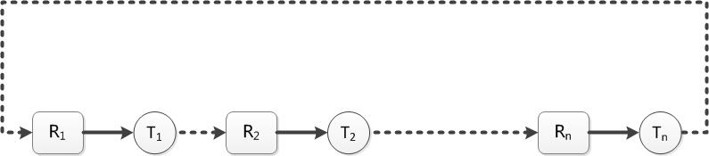
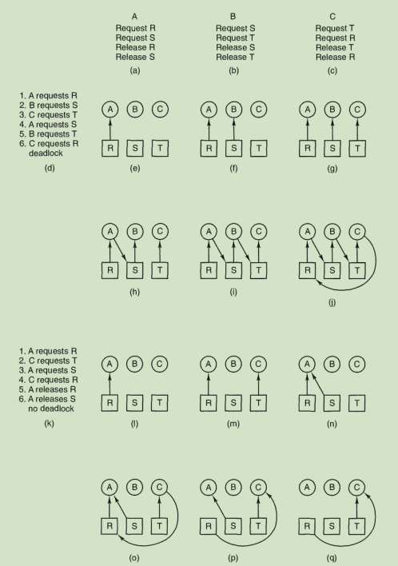
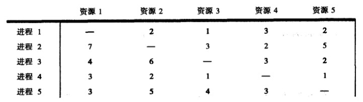
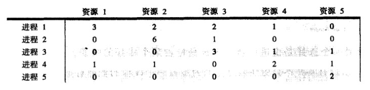
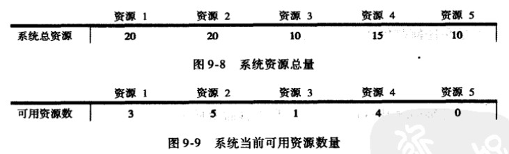
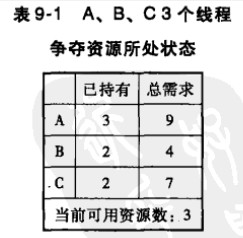
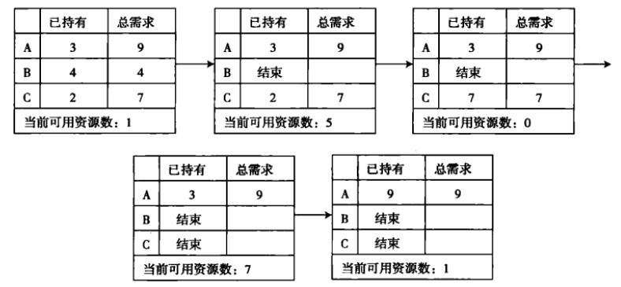
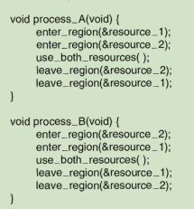

## 死锁🔒
在多道程序系统中，由于多个进程的并发执行，改善了系统资源的利用率并提高了系统的处理能力。然而，多道进程的并发执行也带来了新的问题->死锁🔒。所谓死锁是指多个进程因竞争资源而造成的一种僵局(互相等待)，若无外力作用，这些进程都将无法向前推进。 

#### 资源 抢占一般都不会引起死锁
什么是资源？把需要排他性使用的对象称为资源。资源可以是硬件(CPU、内存、磁盘等)，也可以是软件(锁，信号量等) 

资源分为两类: 可抢占和不可抢占资源 
* 可抢占资源: 可以从拥有它的进程中抢占而不产生副作用
* 不可抢占资源: 不引起相关的计算失败的情况下，无法把它从占有它的进程处抢占过来

抢占是一种抢凳子游戏一样的行为，在进程和线程调度时就提高了这个概念，那时是进程或者线程可以抢占CPU，即抢占式调度。存储器也可以抢占例如内存换页。一般来说， **可抢占资源不会引起死锁，可以在进程间重新分配资源而得到解决**

#### 死锁 死锁不仅仅发生在资源上，资源死锁也只是一种但是归根结底还是因为资源问题
死锁的概念: 如果一个进程集合中，每个进程都在等待只能由该集合中其他进程才能引发的时间，那么该进程集合就是死锁的。(每个进程都一脸蒙❌地等待) 

资源死锁的四个必要条件，其中一条不成立死锁不会发生 
* 互斥条件: 进程要求对所分配的资源进行排他性控制，即在一段时间内，某资源仅为一个进程所占用。此时若有其他进程请求该资源，则请求进程只能等待⌛️
* 不可抢占条件: 进程所获🉐️的资源在未使用完毕之前，不能被其他进程强行夺走，即只能由获得该资源的进程自己来释放(只能主动释放)
* 占有和等待条件: 进程已经保持了至少一个资源，但又提出了新的资源的请求，而该资源已经被其他进程占有，此时请求进程被阻塞，但对自己的已获🉐️的资源保持不放
* 循环♻️等待条件: 存在一种进程资源的循环等待链，链得到每一个进程已获得的资源同时被链中的下一个进程所请求。即存在一种处于等待状态的进程集合{T1,T2,...,Tn}，其中Ti等待的资源被T(i+1)占有的(i=0,1,2...n-1)，Tn等待的资源被T0占有

可以通过另一个图来形象生动地展示出死锁的存在

那么处理死锁的策略是什么？
#### 处理死锁
其实可以通过打破死锁的四个必要条件之一，就可以防止死锁。说实话就是用了就要释放，该什么时候释放就释放，不要阻碍后面的进程继续使用资源 
OS应对死锁的策略可以分为两大种，四小种。 
两大种: 允许✅死锁发生(检测)和不让❌死锁发生(预防) 
四小种: 
* ✅1.假装看不见，不予理睬 ✅2.死锁发生后想办法解决
* ❌1.通过平时的仔细检点避免难题出现 ❌2.通过将发生死锁的必要条件消除杜绝死锁的发生

##### 死锁检测和恢复 后发制人
在死锁检测上，一般会利用到两个矩阵: 一个是资源分配矩阵，另一个是资源等待矩阵
资源分配矩阵

资源等待矩阵

此外还维持两个矢量:一个是系统资源总量矢量(表示系统中所有资源的总数是多少)，另一个是系统当前可用资源矢量(代表系统现在还有多少可用的资源)

有了上面的矩阵和矢量，我们就可以通过简单地矩阵运算来判断系统是否发生了死锁。例如，将上图中的资源的可用数量矩阵与资源等待矩阵的每一行相减，都会出现负值，那么该系统将要发生死锁 

##### 死锁恢复
* 利用抢占:首先可以抢占(强行抢某个线程所占用的资源，分配给别的线程)。破坏死锁条件
* 利用回滚: 周期性对进程进行检查点检查，一旦发现了死锁，就回滚到一个较早的检查点上(回滚到过去的某个状态，大家从那个状态重新来过)
* 通过杀死进程: 这个直接简单粗暴解决问题。杀死一个进程可以直接释放它所占有的资源，如果仍然不行就继续杀死其他进程，直到打破死锁

##### 死锁避免 先发制人
死锁的检测与恢复属于后发制人，这时死锁的消极后果已经产生，即使修复也浪费时间，降低效率，甚至造成了其他损失。因此，需要更加积极主动，不要等待死锁发生了再亡羊补牢，而是在运行中，小心翼翼，不让死锁发生。 
**死锁动态避免:** 在每次进行资源分配时，必须经过仔细计算，确保该资源请求批准后系统不会进入死锁或潜在的死锁状态。例如，一个资源数量有10个，当前有3个线程正在运行。每个线程需要资源的最大数和当前已经占用的资源数如下 

可以通过以下分配过程得知，存在一个资源分配顺序使得所有线程都能获得其需要的资源，从而得知当前状态是安全状态不会产生死锁。相反，如果不存在这样一个顺序，那么就有可能产生死锁 

动态避免的优点就是无需等待死锁的发生，在思索发生的时候采取先发制人的措施，断然拒绝有可能进入死锁的资源请求。但是计算一个状态是都安全并不是一件容易的事情 

**死锁的静态防止:** 清除死锁发生的土壤(死锁的四个必要条件一个都不给或去掉一个) 
* 清除资源独占条件: 一是增加资源到所有线程满足的资源需要，但这并不实际，因为资源有限的。二是将资源变为共享，但并不适合与所有资源
* 清除独占和请求条件: 一个线程必须一次请求其所需的所有资源，而不是一般情况下的请求一点资源就做一点事情。一个线程请求了所有资源了，就可以顺利执行，不会发生死锁
* 清除非抢占条件: 允许抢占资源，也就是可以从一个线程手上将资源抢夺过来🏴‍☠️
* 清除循环等待条件:出现循环等待是因为线程请求资源的顺序是随机的，所以只要约定线程对资源的使用顺序，那么死锁就不能发生

死锁策略|资源分配|各种可能模式|主要优点|缺点
|--|--|--|--|--|
死锁预防|保守，宁可资源闲置|一次请求所有资源，资源剥夺，资源按序分配|适用于做突发式处理的进程不必进行剥夺|效率低，进程初始化时间延长；不便灵活申请新资源
死锁避免|是预防和检测的折中方案(在运行时判断是否可能死锁)|寻找可能的安全允许顺序|不必进行剥夺|必须知道将来的资源需求；进程不能被长时间阻塞
死锁检测|宽松，只要允许就分配资源|定期检查死锁是否已经发生|不延长进程初始化时间，允许对死锁进行现场处理|通过剥夺解除死锁，造成损失

##### 银行家算法 引入一个安全与不安全状态的概念
如果没有发生死锁，并且即使所有的进程突然请求对资源的最大需求，也仍然存在某种调度次序，能使得每个进程运行完毕，则称该状态是安全的 

安全🔐的状态就是从安全状态出发，系统能够保证所有的进程都能完成，而不安全状态出发，没有这样的保证。 

单个资源的银行家算法: 对每一个请求进行检查，检查如果满足了这一需求是否会达到安全状态。如果能，那么满足该需求；如果不能，就推迟对这一请求的满足。 

也就是说，仿造银行发放贷款时采用的控制方式而设计的一种避免死锁发生的算法。分配资源之前，先判断系统是否安全，就是先看看你有没有能力还贷款。如果安全就分配，不安全就推迟。

例题:某系统有R1，R2，R3共3中资源，在T0时刻P0，P1，P2，P3和P4这5个进程对资源的占用和需求情况如下表1，此时系统的可用资源向量为(3,3,2)。试问： 
T0时刻系统是否存在安全序列？ 
P1请求资源：P1发出请求向量Request（1,0,2），系统是否接受该请求？请使用银行家算法检查 

表1 T0时刻的资源分配表

进程号|MAX|Allocation|Need|Available
|--|--|--|--|--|
P0|7 5 3|0 1 0|7 4 3|3 3 2        
P1|3 2 2|2 0 0|1 2 2|   	 
P2|9 0 2|3 0 2|6 0 0| 
P3|2 2 2|2 1 1|0 1 1| 
P4|4 3 3|0 0 2|4 3 1| 

这个可以计算一下，计算一下安全序列。银行家算法是一个动态避免死锁算法，通过对资源的仔细分配以避免死锁。

#### 其他
##### 两阶段加锁
这是针对数据库的一种方法，第一阶段对所有需要更新的记录📝进行  加锁，一旦某个记录已经被加锁🔒，就释放之前的锁，从头进行重试。只有当第一阶段所有获取锁🔒的行为都成功了，才进行第二阶段的更新，否则放弃所有的锁🔒。 
##### 通信死锁
常见，当进程A向B发送信息后挂起，等待B进程回复唤醒时，如果请求信息丢失，A就会被阻塞等待回复，B会阻塞等待一个向其发送命令的请求，因为发生死锁。通信死锁🔒不涉及资源，不能通过合理调度资源来避免。但是一般在TCP层就保证了可靠性，所以说通信协议会解决这个问题，包括超时重传等技术 
##### 活锁🔒 类似自旋锁
轮询(忙等待)，有时有效，因为挂起进程等待的开销很大，所以就一直轮询。参考自旋锁。

enter_region()通过轮询获取资源，假设A获得了资源1，B获得了资源2，那么两个进程都不会阻塞，而是不停地进行轮询以获取资源。两个进程总是运行完系统分配的时间片，没有阻塞但是不会取得进展。
##### 饥饿 考虑💭进程调度 没饭吃，饿死
饥饿，考虑进程调度，基于优先级的调度，如果总是有高优先级的进程就绪，那么一个低优先级的进程可能长时间无法上CPU运行。这就是饥饿现象，可以考虑通过动态优先级机制，可以动态提高长时间得不到运行的进程的优先级，从而使它可以运行。 
