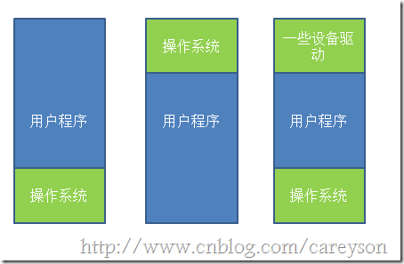
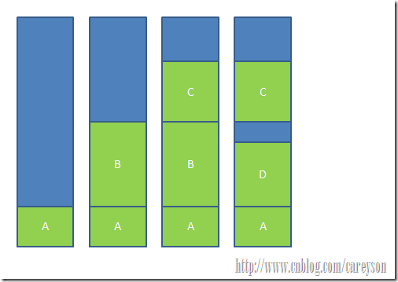
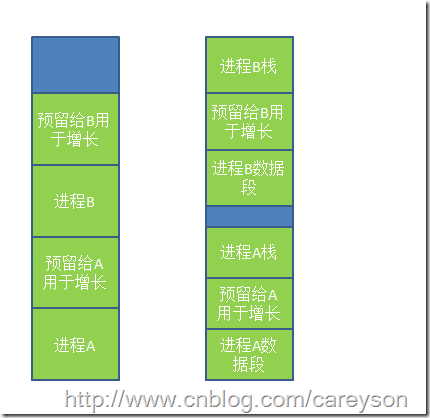
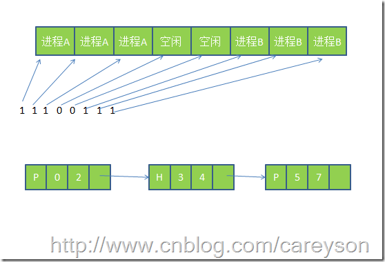
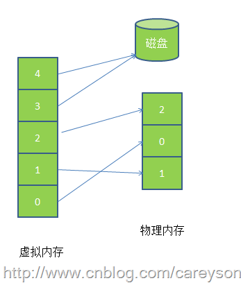

## 内存管理 RAM需要认真管理的重要资源
网上的信不过，还是自己看书来得心安。<br>
本章主要研究几个不同的存储管理方案，涵盖简单到高度复杂的方案以及优化管理内存。<br>
* 内存空间的分配与回收♻️: 由OS完成主存储器空间的分配和管理
* 地址转换: 在多道程序环境下， **程序中的逻辑地址与内存中的物理地址** 不可能一致，因此存储管理必须提供地址变换功能，把逻辑地址转换成相应的物理地址
* 内存空间扩充: 利用虚拟存储技术或自动覆盖技术，从逻辑上扩充内存
* 存储保护: 保护各道作业在各自的存储空间内运行，互不干扰

#### 无存储器抽象(没有内存抽象的年代) 最简单的存储器抽象就是根本没有抽象
早起年代并没有内存抽象的概念，程序直接访问和操作都是物理内存。比如
```
mov reg1,1000
```
这条指令会怎样？毫无想象力地将物理地址1000中的内容赋值给寄存器。这种操作方式，会带来什么呢？当然是快，但是，这种操作就不会存在多进程了，为什么？因为比如MS-DOS，必须执行完一条指令之后才能接着执行下一条指令。如果多进程的话，就直接大家都操作物理内存地址，当一个进程给内存地址1000赋值后，另一个进程也同样给内存地址赋值后，另一个进程也同样给内存地址赋值，第二个进程对内存的赋值会覆盖第一个进程所赋的值，造成两个进程崩溃或计算错误。<br>
没有内存抽象对于内存的管理通常非常简单，除去操作系统所用的内存之外，全部给用户程序使用。或是在内存中多留一片区域给驱动程序使用



图片的第一种情况操作系统存于RAM中，放在内存的低地址，第二种情况操作系统存在于ROM中，存在内存的高地址，一般老式的手机📱操作系统就是这么设计的。<br>

若这种情况下，如果操作系统可以执行多进程的话，唯一的解决方案就是和硬盘 **搞交换**， **当一个进程执行到一定程度时，整个存入硬盘，转而执行其他进程，到需要执行这个进程时，再从硬盘中取回内存，只要同一时间内存中只有一个进程就行**，这就是交换技术，其实也基本用到了就绪，运行的状态的逻辑，但是这种交换技术由于还是直接操作物理内存，依然有可能引起进程的崩溃，也就是依然没有办法保证一个进程有自己的内存，还是操作一份共享的内存，而且是赤裸裸下操作。<br>

#### 就这样到了内存抽象的年代 现代
现代的操作系统中，同一时间运行多个进程，很正常。为了解决直接操作内存带来的各种问题，引入了地址空间(Address Space)(其实就是让每个进程能够自己干自己的事情，不受干扰)，着允许每个进程拥有自己的地址。所以同时在硬件上引入了两个寄存器，基址寄存器(base register)和界址寄存器(limit register)， **第一个寄存器保存进程的开始地址，第二个寄存器保存上界，防止内存溢出。**
因此，执行`mov reg1,1000`就有了不一样的骚操作了，实际操作的物理地址并不是20，而是根据基址和偏移量算出实际的物理地址进程操作，此时操作的实际地址可能是`mov reg1,16245`。<br>
因此，上述情况下， **任何操作虚拟地址的操作都会被转换为操作物理地址。** 而每一个进程所拥有的内存地址是完全不同的，因此也使得多进程成为可能。因为每个进程都独立拥有了自己的内存。<br>

但此时还有一个问题，通常来说，内存大小不可能容纳下所有并发症执行的进程。因此，交换(Swapping)技术应运而生。这个交换和前面所讲的交换大同小异，只是现在讲的交换在多进程条件下。交换的基本思想， **将闲置的进程交换出内存，暂存在硬盘中，待执行时再交换回内存** 比如下面这个例子，当程序一开始时，只有进程A，逐渐有了进程B和进程C，此时来了进程D，但内存中没有足够的空间给进程D，因此将进程B交换出内存，分给进程D<br>



那么当进程没有足够的空间，那怎么交换？就像进程D和C之间的空间由于太小无法另任何进程继续使用，这也就是所谓的 **外部碎片**。一种方案是通过 **紧凑技术(Memory Compaction)**解决，通过移动进程在内存中的地址，使得这些外部碎片空间被填满。还有一些讨巧的方案，比如内存整理软件，原理就是申请一块超大的内存，将所有进程置换出内存，然后再释放这块内存，从而使得重新加载进程，使得外部碎片被消除。这也是为什么运行完内存整理回狂读硬盘的原因。另外，使用紧凑技术回非常消耗CPU资源，一个2G的CPU每10ns可以处理4bytes，因此多一个2G的内存进行一次紧凑可能需要好几秒的CPU时间。<br>

上面的理论都是基于进程所占的内存空间是固定的这个假设，但实际情况下， **进程往往回动态增长**，因此创建进程时分配的内存就是这个问题了，如果分配多了，就会产生内部碎片，浪费了内存，而分配少了会造成内存溢出。那么怎么解决呢？ <br>
一个解决方案是在进程创建的时候，比进程实际需要的多分配一点内存空间用于进程的增长。
* 一种是**直接多分配一点内存空间用于进程在内存中的增长** 
* 一种是直接分配多一点内存空间用于进程在内存中的增长
* 一种是将增长区分为数据段和栈(用于存放返回地址和局部变量)



当预留空间不够满足增长时，OS首先会看相邻的内存是否空闲，如果空闲则自动分配， **如果不空闲，就将整个进程移到足够容纳增长的空间内存中**，如果不存在这样的内存空间，则会将闲置的进程置换出去(也就是交出资源)<br>

当允许进程动态增长时，OS必须对内存进行更有效的管理，OS使用如下两种方法之一得知内存的使用情况1. 位图 2. 链表<br>
* 位图，将内存划分为多个大小相等的块，比如一个32K的内存1K一块就可以划分为32块，则需要32位(4字节)来表示其使用情况，使用位图将已经使用的块标为1，未使用的标为0。
* 链表，将内存按使用和未使用分为多个段进行链接🔗<br>



使用链表中的P表示进程，从0-2是进程，H表示空闲，3-4表示是空闲<br>

位图表示内存简单明了，但 **一个问题是当分配内存时必须在内存中搜索🔍大量的连续0的空间，这就十分消耗资源的操作** 。相比之下，使用链表进行此操作将会更胜一筹。为什么呢？直接查链表这个段就可以了，而不用连续的0。 更有一些OS会使用双向链表，因为当进程销毁时，邻接的往往是空内存或是另外的进程。使用双向链表使得链表之间的融合变得更加容易。<br>

利用链表管理内存的情况下，创建进程时分配什么样的空闲空间也是一个问题。当然，操作系统会有如下几个算法来对进程创建时的空间进行分配
* 临近适应算法(Next fit) -- 从当前位置开始，搜索第一个能满足进程要求的内存空间
* 最佳适应算法(Best fit) -- 搜索🔍整个链表，找到能满足进程要求最小内存的内存空间
* 最大适应算法(Worst Fit) --  找到当前内存中最大的空闲空间
* 首次适应算法(First fit) --  从链表的第一个开始，找到第一个能满足进程要求的内存空间

在这里，吐槽一下，觉得最佳适应算法比较好，但是消耗较大，要是可以的话，就尽量使用最佳适应。<br>

#### 虚拟内存(Virtual Memory) 在磁盘中找一些来用
虚拟内存是现在OS最普遍使用的一种技术。前面所讲的抽象满足了多进程的要求，但很多情况下，现有内存无法满足仅仅一个大进程的内存要求例如(游戏🎮，都是10G+级别)。早期OS曾使用(overlays)来解决这个问题，将一个程序分为多个块，基本思想是先将块0加入内存，块0执行完，将块1加入内存。依次往复，所以费力又费时。聪明的程序员就想到了虚拟内存。<br>

虚拟内存的基本思想是，将物理主存扩大到便宜、大容量的磁盘上，即将磁盘空间看作主存空间的一部分。每个进程有用独立的逻辑地址空间，内存被分为大小相等的多个块，称为 **页📃(page)** 每个页都是一段连续的地址。对于进程来看，逻辑上貌似有很多内存空间，其中一部分对应物理内存上的一块(称为页框，通常页和页框大小相等)，还有一些在内存中的对应在硬盘上。<br>



如上图可以看出，虚拟内存实际上可以比物理内存大。当访问虚拟内存时，会访问MMU(内存管理单元)区匹配对应的物理地址如图中的0，1，2(也就是说，其实虚拟内存提供的是地址)，而如果虚拟内存的页📃并不存在于物理内存中，就会产生缺页中断，从磁盘中取得缺的页放入内存，如果内存已满，还会根据某种算法将磁盘中的页换出。<br>


