## 内存管理 OS对内存的划分和动态分配
网上的信不过，还是自己看书来得心安。<br>
本章主要研究几个不同的存储管理方案，涵盖简单到高度复杂的方案以及优化管理内存。<br>
* 内存空间的分配与回收♻️: 由OS完成主存储器空间的分配和管理
* 地址转换: 在多道程序环境下， **程序中的逻辑地址与内存中的物理地址** 不可能一致，因此存储管理必须提供地址变换功能，把逻辑地址转换成相应的物理地址
* 内存空间扩充: 利用虚拟存储技术或自动覆盖技术，从逻辑上扩充内存
* 存储保护: 保护各道作业在各自的存储空间内运行，互不干扰

#### 无存储器抽象(没有内存抽象的年代) 最简单的存储器抽象就是根本没有抽象
早起年代并没有内存抽象的概念，程序直接访问和操作都是物理内存。比如
```
mov reg1,1000
```
这条指令会怎样？毫无想象力地将物理地址1000中的内容赋值给寄存器。这种操作方式，会带来什么呢？当然是快，但是，这种操作就不会存在多进程了，为什么？因为比如MS-DOS，必须执行完一条指令之后才能接着执行下一条指令。如果多进程的话，就直接大家都操作物理内存地址，当一个进程给内存地址1000赋值后，另一个进程也同样给内存地址赋值后，另一个进程也同样给内存地址赋值，第二个进程对内存的赋值会覆盖第一个进程所赋的值，造成两个进程崩溃或计算错误。<br>
没有内存抽象对于内存的管理通常非常简单，除去操作系统所用的内存之外，全部给用户程序使用。或是在内存中多留一片区域给驱动程序使用


图片的第一种情况操作系统存于RAM中，放在内存的低地址，第二种情况操作系统存在于ROM中，存在内存的高地址，一般老式的手机📱操作系统就是这么设计的。<br>

若这种情况下，如果操作系统可以执行多进程的话，唯一的解决方案就是和硬盘 **搞交换**， **当一个进程执行到一定程度时，整个存入硬盘，转而执行其他进程，到需要执行这个进程时，再从硬盘中取回内存，只要同一时间内存中只有一个进程就行**，这就是交换技术，其实也基本用到了就绪，运行的状态的逻辑，但是这种交换技术由于还是直接操作物理内存，依然有可能引起进程的崩溃，也就是依然没有办法保证一个进程有自己的内存，还是操作一份共享的内存，而且是赤裸裸下操作。<br>

#### 就这样到了内存抽象的年代 现代 分区存储管理 内存紧缩
现代的操作系统中，同一时间运行多个进程，很正常。为了解决直接操作内存带来的各种问题，引入了地址空间(Address Space)(其实就是让每个进程能够自己干自己的事情，不受干扰)，允许每个进程拥有自己的地址。所以同时在硬件上引入了两个寄存器，基址寄存器(base register)和界址寄存器(limit register)， **第一个寄存器保存进程的开始地址，第二个寄存器保存上界，防止内存溢出。**
因此，执行`mov reg1,1000`就有了不一样的骚操作了，实际操作的物理地址并不是20，而是根据基址和偏移量算出实际的物理地址进程操作，此时操作的实际地址可能是`mov reg1,16245`。<br>
因此，上述情况下， **任何操作虚拟地址的操作都会被转换为操作物理地址。** 而每一个进程所拥有的内存地址是完全不同的，因此也使得多进程成为可能。因为每个进程都独立拥有了自己的内存。<br>
##### 固定分区 易于实现，开销小，但是内存碎片造成浪费，分区总数固定，限制并发执行的程序数目
但此时还有一个问题，通常来说，内存大小不可能容纳下所有并发执行的进程。因此，交换(Swapping)技术应运而生。这个交换和前面所讲的交换大同小异，只是现在讲的交换在多进程条件下。交换的基本思想， **将闲置的进程交换出内存，暂存在硬盘中，待执行时再交换回内存** 比如下面这个例子，当程序一开始时，只有进程A，逐渐有了进程B和进程C，此时来了进程D，但内存中没有足够的空间给进程D，因此将进程B交换出内存，分给进程D<br>


因此总结了一下，交换技术存在两个重要的问题<br>
那么当进程没有足够的空间，那怎么交换？就像进程D和C之间的空间由于太小无法另任何进程继续使用，这也就是所谓的 **外部碎片**。<br>

* 空间浪费: 随着程序在内存与磁盘间的交换，内存将变得越来越碎片化，即内存将被不同程序分割成尺寸大小无法使用的小片空间
##### 内存紧凑 将各个占用分区向内存一端移动，然后将各个空闲分区合并成为一个空闲分区
一种方案是通过 **紧凑技术(Memory Compaction)**解决，通过移动进程在内存中的地址，使得这些外部碎片空间被填满。还有一些讨巧的方案，比如内存整理软件，原理就是申请一块超大的内存，将所有进程置换出内存，然后再释放这块内存，从而使得重新加载进程，使得外部碎片被消除。这也是为什么运行完内存整理回狂读硬盘的原因。另外，使用紧凑技术回非常消耗CPU资源，一个2G的CPU每10ns可以处理4bytes，因此多一个2G的内存进行一次紧凑可能需要好几秒的CPU时间。<br>

* 程序大小受限: 1. 指空间增长效率低下(由于磁盘操作耗时，交换出去再找一片更大的空间来增长程序空间的做法效率非常低) 2. 空间增长存在天花板限制(单一程序不能超过物理内存空间)

上面的理论都是基于进程所占的内存空间是固定的这个假设，但实际情况下， **进程往往回动态增长**，因此创建进程时分配的内存就是这个问题了，如果分配多了，就会产生内部碎片，浪费了内存，而分配少了会造成内存溢出。那么怎么解决呢？ <br>
##### 动态分区 动态增长，按程序初始要求分配或在执行过程中通过系统调用进行分配或改变分区大小
一个解决方案是在进程创建的时候，比进程实际需要的多分配一点内存空间用于进程的增长。
* 一种是**直接多分配一点内存空间用于进程在内存中的增长** 
* 一种是直接分配多一点内存空间用于进程在内存中的增长
* 一种是将增长区分为数据段和栈(用于存放返回地址和局部变量)


当预留空间不够满足增长时，OS首先会看相邻的内存是否空闲，如果空闲则自动分配， **如果不空闲，就将整个进程移到足够容纳增长的空间内存中**，如果不存在这样的内存空间，则会将闲置的进程置换出去(也就是交出资源)<br>

当允许进程动态增长时，OS必须对内存进行更有效的管理，OS使用如下两种方法之一得知内存的使用情况1. 位图 2. 链表<br>
* 位图，将内存划分为多个大小相等的块，比如一个32K的内存1K一块就可以划分为32块，则需要32位(4字节)来表示其使用情况，使用位图将已经使用的块标为1，未使用的标为0。
* 链表，将内存按使用和未使用分为多个段进行链接🔗<br>


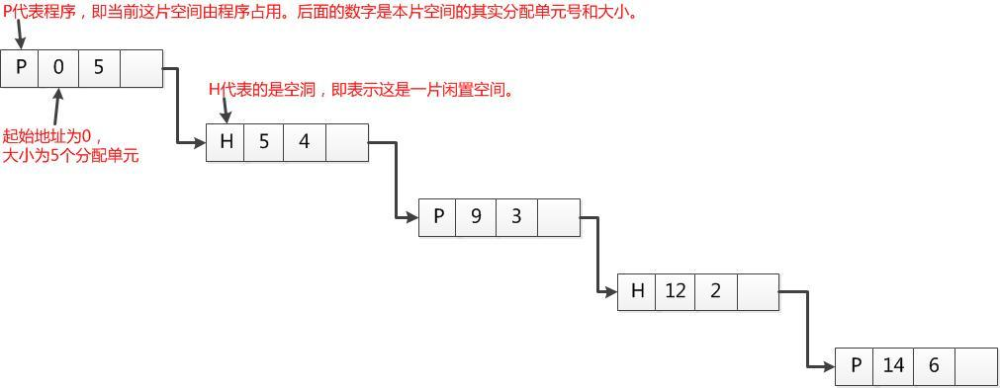

使用链表中的P表示进程，从0-2是进程，H表示空闲，3-4表示是空闲<br>

位图表示内存简单明了，但 **一个问题是当分配内存时必须在内存中搜索🔍大量的连续0的空间，这就十分消耗资源的操作** 。相比之下，使用链表进行此操作将会更胜一筹。为什么呢？直接查链表这个段就可以了，而不用连续的0。 更有一些OS会使用双向链表，因为当进程销毁时，邻接的往往是空内存或是另外的进程。使用双向链表使得链表之间的融合变得更加容易。<br>

利用链表管理内存的情况下，创建进程时分配什么样的空闲空间也是一个问题。当然，操作系统会有如下几个算法来对进程创建时的空间进行分配
* 临近适应算法(Next fit) -- 从当前位置开始，搜索第一个能满足进程要求的内存空间
* 最佳适应算法(Best fit) -- 搜索🔍整个链表，找到能满足进程要求最小内存的内存空间
* 最大适应算法(Worst Fit) --  找到当前内存中最大的空闲空间
* 首次适应算法(First fit) --  从链表的第一个开始，找到第一个能满足进程要求的内存空间

在这里，吐槽一下，觉得最佳适应算法比较好，但是消耗较大，要是可以的话，就尽量使用最佳适应。<br>

#### 虚拟内存(Virtual Memory) 在磁盘中找一些来用
虚拟内存是现在OS最普遍使用的一种技术。前面所讲的抽象满足了多进程的要求，但很多情况下，现有内存无法满足仅仅一个大进程的内存要求例如(游戏🎮，都是10G+级别)。早期OS曾使用(overlays)来解决这个问题，将一个程序分为多个块，基本思想是先将块0加入内存，块0执行完，将块1加入内存。依次往复，所以费力又费时。聪明的程序员就想到了虚拟内存。<br>

虚拟内存的基本思想是，将物理主存扩大到便宜、大容量的磁盘上，即将磁盘空间看作主存空间的一部分。 **也就是在内存容量不足时将不经常访问的内存空间中的数据写入硬盘，以增加“账面上”可用内存容量的手段**。虚拟内存的优点在于除了让程序员感觉到内存增大了，还让程序员感觉到内存速度也增快了。但是如果硬盘与主存之间谁交换过于频繁，处理速度就会下降，表面上就像卡住了，这现象称为抖动(Thrushing)。(造成死机💀的主要原因之一就是抖动)。<br>


如上图可以看出，虚拟内存实际上可以比物理内存大。当访问虚拟内存时，会访问MMU(内存管理单元)区匹配对应的物理地址如图中的0，1，2(也就是说，其实虚拟内存提供的是地址)，而如果虚拟内存的页📃并不存在于物理内存中，就会产生缺页中断，从磁盘中取得缺的页放入内存，如果内存已满，还会根据某种算法将磁盘中的页换出。<br>

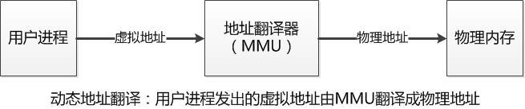

上图表示在多道编程环境下，无法将程序总是加到固定的内存地址上，也就是无法使用静态地址翻译，所以进程存的都是相对地址，这个时候，如果直接使用物理内存会怎样？用了别的进程在用的地址造成崩溃。这时候就需要地址翻译器也就是MMR，内存管理单元。在程序加载完毕之后才能计算物理地址，这就叫做动态地址翻译。<br>

介绍完分区，我们明白，分区内存管理在交换技术方面，存在着缺陷，因为分区技术为进程分配的空间是连续的，使用的地址都是物理地址，如果允许讲一个进程分散到许多不连续的空间，就可以 **避免内存紧凑，减少碎片。** 基于这一思想，通过引入进程的 **逻辑地址**，把进程地址空间与实际存储空间分离，增加存储管理的灵活性。地址空间和存储空间两个基本概念的定义
* 地址空间: 将源程序经过编译后得到的目标程序，存在于它所限定的地址范围内，这个范围称为地址空间。**地址空间是逻辑地址的集合**
* 存储空间: 指主存中一系列存储信息的物理单元的集合，这些单元的编号称为物理地址。**存储空间是物理地址的集合**

根据分配时所采用的基本单位不同，可以将离散分配的管理方式分为以下三种
分页存储管理，分段存储管理和段页式存储管理。<br>
#### 分页内存管理 解决交换系统存在的缺陷
将程序的逻辑地址空间划分为 **固定大小的页Page**。也就是我们讲的虚拟内存划分。而物理内存也划分为 **同样大小的页框(Page frame)**。程序加载时，可将任意一页放入内存中任意一个页框，这些页框不必连续，从而实现了离散分配。(这就区别了分区)。该方法 **需要CPU的硬件支持，来实现逻辑地址和物理地址之间的映射**。 在分页式存储管理方式中地址结构由两部分构成，前一部分是页号，后一部分是页内地址(位偏移量)


这个分页的方法解决了
* 空间浪费碎片化问题: 由于虚拟内存空间和物理内存空间按照某种规定的大小进行分配(页📃)，然后按照页进行内存分配，这就克服了外部碎片问题
* 解决程序大小受限问题: 程序增长有限是因为一个程序需要全部加载到内存才能运行，因此解决的办法是使得一个程序无须全部加载就可以运行。使用分页也可以解决这个问题，只需将当前需要的页面放在内存里，其他暂时不用的页面放在磁盘上，这样一个程序同时占用内存和磁盘，其增长空间就大大增加了。而且，分页之后，如果一个程序需要更多的空间，给其分配一个新页就可以了(无须将程序倒出倒进，从而提高了空间的增长效率)

⚠️但是这里有一个缺点: 要求程序全部装入内存，没有足够的内存，程序就不能执行<br>

虚拟地址的构成，对于32位寻址系统，如果页面大小是4KB，则页面号占20位，页内偏移值占12位<br>

###### 分页系统的核心是页面的翻译，即从虚拟页面到物理页面的映射(Mapping)
```c
if(虚拟页面非法、不在内存中或被保护)
{
    陷入到操作系统错误服务程序
}
else
{
    将虚拟页面号转换为物理页面号
    根据物理页面号产生最终物理地址
}
```
这个翻译过程就是由内存管理单元(MMU)完成，MMU接收CPU发出的虚拟地址，将其翻译为物理地址后发送给内存。内存管理单元按照该物理地址进行相应访问后读出或写入相关数据<br>

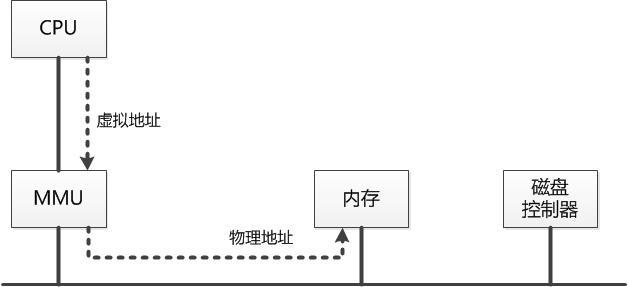

那么这个翻译是怎么实现的？查页表，对于每个程序，内存管理单元MMU都为其保存一个页表，该页表中存放的是虚拟页面到物理页面的映射。每当为一个虚拟页面📃寻找到一个物理页面之后，就在页表里增加一条记录来保留该映射关系。当然，随着虚拟页面进出物理内存，页表的内容也会不断更新变化。(逻辑页号，页内偏移地址->查进程页表，得物理页号->物理地址)。这个过程通常由处理器的硬件直接完成，不需要软件参与。通常，操作系统只需在进程切换时，把进程页表的首地址装入处理器特定的寄存器中即可。一般来说，页表存储在主存之中。这样处理器每访问一个在内存中的操作数，就要访问两次内存 **1.用来查找页表将操作数的逻辑地址变换为物理地址；2.完成真正的读写操作**<br>
这样做时间上耗费严重。为缩短查找时间，可以将页表从内存装入CPU内部的 **关联存储器**中，实现按内容查找(hash表的方法)。(任务都在CPU中完成，缩短时间)<br>

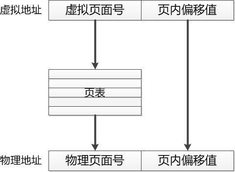

**页表的根本功能是提供从虚拟页面到物理页面的映射**。 因此，页表的记录📝条数与虚拟页面数相同，此外，内存管理单元(MMU)依赖于页表来进行一切与页面有关的管理活动，这些活动包括判断某一页面号是否在内存中，页面是否受到保护，页面是否非法空间等等。<br>

页表的一个记录所包括的内容


##### 页式管理的数据结构 OS为进程中所有的页分配页框
在页式系统中进程建立时，OS为进程中所有的页分配页框。当进程撤销时，收回所有分配给它的页框。在程序的运行期间，如果允许进程动态地申请空间，操作系统还要为进程申请的空间分配物理页框。OS为了完成这些功能必须记录系统内存中实际的页框使用情况。操作系统还要在进程切换时，正确地切换两个不同的进程地址空间到物理内存空间的映射。 **(保留进程的状态)**。这就要求操作系统要记录每个进程页表的相关信息。为了上述功能的完成，一个页式系统中，一般要采用如下的数据结构<br>

**进程页表:** 完成逻辑页号(本进程的地址空间)到物理页面号(实际内存空间，也叫块号)的映射(每个进程都有一个页表，描述该进程占用的物理页面以及逻辑排列顺序)

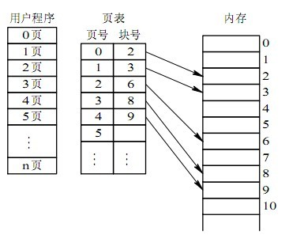

**物理页面表:** 整个系统有一个物理页面表，描述物理内存空间的分配使用状况，其数据结构可以采用位图和空闲页链表

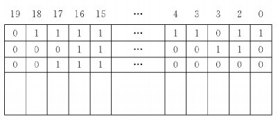

如果该页面已经被分配，则对应比特位置为1，否置为0<br>

**请求表:** 整个系统有一个请求表，描述系统内各个进程页表的位置和大小，用于地址转换也可以结合到各个进程PCB(进程控制块)

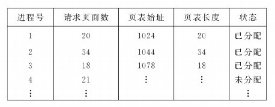

##### 分页式内存管理的优缺点
优点: 
1. 分页系统不会产生外部碎片，一个进程占用的内存空间可以不是连续的，并且一个进程的虚拟页面在不需要的时候可以放在磁盘中。<br>
2. 分页系统可以共享小的地址，即页面共享。只需要在对应给定页面的页表项里做一个相关的记录即可<br>

缺点:
1. 页表超大，占用了大量的内存空间<br>

##### 缺页中断处理 CPU发出的虚拟地址对应的页面不在物理内存，就将产生一个缺页中断，而缺页中断服务程序负责将需要的虚拟页面找到并加载到内存
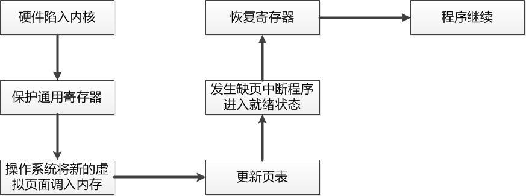

#### 页面置换算法 如果缺页中断
如果发生了缺页中断，就需要从磁盘上将需要的页面调入内存。如果内存没有多余的空间，就需要在现有的页面中选择一个页面进行替换。使用不同的页面置换算法，页面更换的顺序也会各不相同。如果挑选的页面是之后很快又要被访问的页面，那么系统将很快再次产生缺页中断，因为磁盘访问速度远远低于内存当问速度，缺页中断的代价是非常大的。因此，挑选哪个页面进行置换不是随随便便的事情，而是有要求的。<br>

##### 页面置换时挑选页面的目标主要在于降低随后发生缺页中断的次数或频率
挑选的页面应当时随后相当长时间内不会被访问的页面，最好是再也不会被访问的页面。如果可能，最好选择一个没有修改过的页面，这样替换时就无须将被替换页面的内容写回磁盘，从而进一步加快缺页中断的响应速度。<br>
##### 随机更换算法 随机的效果相当差 公平
在需要替换页面的时候，产生一个随机页面号，从而替换与该页面号对应的物理页面。遗憾的时，随机选出的被替换的页面不太可能是随后相当长时间内不会被访问的页面。也就是说，这种算法难以保证最小化随后的缺页中断次数。

##### 先进先出(FIFO)算法 有点无脑，但是比随机的好 公平
更换最早进入内存的页面，其实现机制是使用链表将所有在内存中的页面按照进入时间的早晚链接起来，然后每次置换链表头上的页面就行了，而新加进来的页面则挂在链表的末端<br>

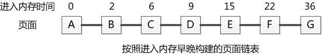

优点简单容易，缺点是如果最先加载进来的页面是经常被访问的页面，那么就可能造成被访问的页面📃替换到磁盘上，导致很快就需要再次发生缺页中断，从而降低效率。<br>

##### 第二次机会算法(Second chance) FIFO改进，重生 公平
FIFO只考虑💭进入内存的时间，不关心一个页面被访问的频率，从而有可能造成替换掉一个被经常访问的页面而造成效率低下。那么可以对FIFO进行改进。<br>
**在使用FIFO更换一个页面时，需要看一下该页面是否在最近被访问过，如果没有被访问过，则替换该页面。反之，如果最近被访问过(通过检查其访问位的取值)，则不替换该页面，而是将该页面挂到链表末端，并将该页面进入内存的时间设置为当前时间，并将其访问位清零。** 这样，对于最近被访问的页面来说，相当于重生！<br>

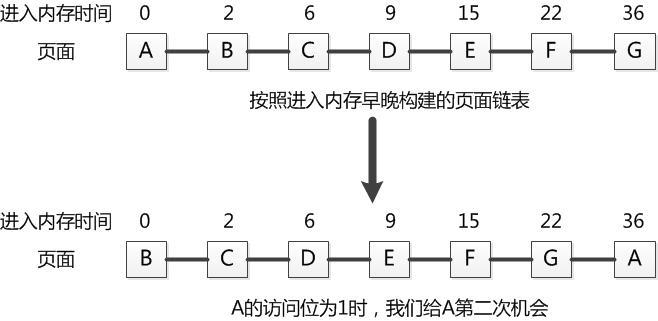

优点公平简单，容易实现。但是每次移动到链表末端需要耗费时间。此外，页面的访问位只在页面替换进行扫描时才可能清零，所以其时间局域性体现不好，访问位为1的页面可能很久以前被访问过了，时间分辨粒度太粗，从而影响页面替换的效果<br>

##### 时钟算法(Time) 改善第二次机会算法 循环队列结构 公平
时钟⏲️算法: 将页面排成一个时钟的形状，该时钟有一个针臂，每次需要更换页面时，我们从针臂所指的页面开始检查。如果当前页面的访问位为0，即从上次检查到这次，该页面没有被访问过，将该页面替换。反之，将其访问位清0⃣️，并顺时针移动指针到下一个页面。重复这个步骤，知道找到下一个访问位为0⃣️的页面。<br>

例如下图所示的一个时钟，指针指向的页面是F，因此第一个被考虑替换的页面是F。如果页面F的访问位为0，F将被替换。如果F的访问位为1，则F的访问位清零，指针移动到页面G。

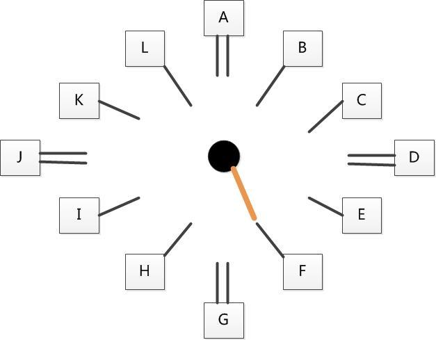

**时钟⏲️算法使用的是索引(整数指针)。** 可以直接使用页表，使用页表的好处就是无需额外空间，更大的好处是页面的访问位会定期自动清零，这样将使得时钟算法的时间分辨力度较第二次机会算法高，从而取得更好的页面替换效果<br>

缺点(怎么还有缺点？！)，过于公平，没有考虑💭到不同页面调用频率的不同，有可能换出不应该或不能换出的页面，还可能造成无限循环♻️。<br>

##### 最优更换算法 最优就没有了，只能留个理想，替换一个再也不会被访问的页面进行替换

##### NRU(最近未被使用)算法 最近一段时间内没有被访问过的页面进行替换
基于程序访问的时空局域性。因为根据时空局域性原理，一个最近没有被访问的页面在随后的时间里也不太可能被访问，而NRU的实现方式就是利用页面的访问和修改位<br>
每个页面都有一个访问位和一个修改位，凡是对页面进行读写操作时，访问位被设置为1。当进程对页面进行读写操作时，修改位设置为1.根据这两个位的状态来对页面进行分类的话，可以分成以下四种页面类型

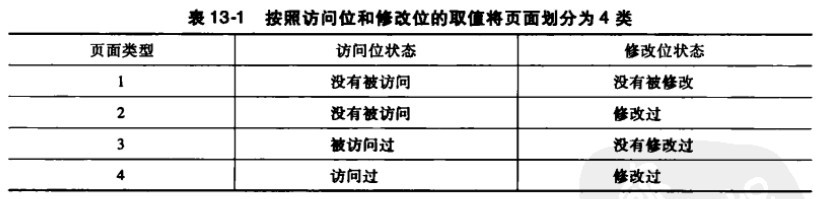

有了这个分类，NRU算法就按照这四类页面的顺序依次寻找可以替换的页面📃。如果所有页面皆被访问和修改过，那也只能从中替换掉一个页面，因此NRU算法总是会终结的。<br>

这种分类很笼统，带有随机性，所以可能替换的并不是最近没有被使用的页面

##### LRU(最近最少使用算法) 不仅考虑最近是否用过，还要考虑最近使用的频率
基于过去的数据预测未来，如果一个页面被访问的频率低，那么以后很可能也用不到<br>
LRU算法的实现必须以某种方式记录每个页面被访问的次数，这是个相当大的工作量。最简单的方式就是在页表的记录项里增加一个计数域，一个页面被访问一次，这个计数器的值就增加1。于是，当需要更换页面时，只需要找到计数域值最小的页面替换即可，该页面即是最近最少使用的页面。另一种简单实现方式就是用一个链表将所有页面链接起来，最近被使用的页面在链表头，最近未被使用的放在链表尾。在每次页面访问时对这个链表进行更新，使其保持最近被使用的页面在链表头。[LRU缓存策略算法实现](../Algorithm/singleLinkOper/singleLinkOper.cpp)<br>

LRU考虑💭周到，但是实现成本高(需要分辨出不同页面中哪个页面最近最少使用)，时间代价大，每次页面访问都需要更新记录。<br>

##### 工作集算法 由于不阔能精确地确定哪个页面最近最少使用，那就干脆不花这个力气，只维持少量的信息使得我们选出的替换页面不太可能是马上又会使用的页面即可 就是一个容器
工作集信息就是少量的信息。什么意思呢？工作集概念来源于程序访问的时空局限性，即在一段时间内，程序访问的页面将局限在一组页面集合上。例如，最近K次访问均发生在某m个页面上，那么m就是参数为k时的工作集。我们用w(k,t)来表示在时间t时k次访问所涉及的页面数量<br>

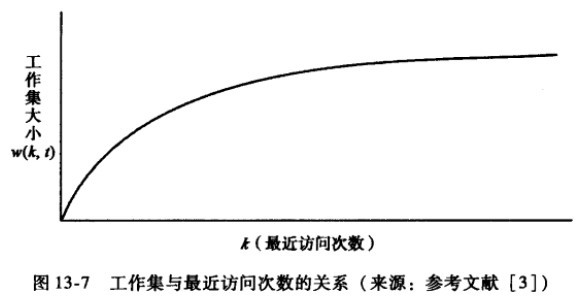

随着K的增长，w(k,t)的值也随之增长，但是当K增长到某个数值之后，w(k,t)的值将增长极其缓慢甚至接近停滞，并维持一段时间的稳定。<br>

如图，如果一个程序在内存里面的页面数与其工作集大小相等或者超过工作集，则该程序可在一段时间内不会发生缺页中断。如果其在内存的页面数小于工作集，则发生缺页中断的频率将增加，甚至发生内存抖动<br>

因此， **工作集的算法目标是维持当前的工作集的页面在物理内存里面。每次页面更换时，寻找一个不属于当前工作集的页面替换即可。**<br>
这样我们再寻找页面时只需要将页面分离为两大类即可；当前工作集内页面和当前工作集外页面。如此，只需要找到一个非当前工作集的页面，将其替换即可。<br>
优点: 实现简单，只需要在页表的每个记录增加一个虚拟时间域即可。而且，这个时间域不是每次发生访问都需要更新，而是在需要更换页面时，页面更换算法对其进行修改，因此时间成本也不大。<br>
缺点: 每次扫描页面进行替换时，有可能需要扫描整个页表。然而并不是所有页面都在内存中，因此扫描过程中的一大部分时间将是无用功。另外，由于其数据结构是线性的，会造成每次都按同样的顺序进行扫描(不公平)

##### 工作集时钟算法 结合工作集和时钟算法 商业系统采用
使用工作集算法的原理，但是将页面的扫描顺序按照时钟的形式组织起来。这样每次需要替换页面时，从指针指向的页面开始扫描，从而达到更加公平的状态。而且，按时钟组织得到页面只是在内存里面的页面，而在内存外的页面不会放在时钟圈(就减少无用功)，从而提高实现效率<br>

#### 分段式内存管理 分页系统无法解决的缺点:一个进程只能占有一个虚拟地址空间
在此种限制下，一个程序的大小至多只能和虚拟空间一样大，其所有内容都必须从这个共同的虚拟空间内分配。<br>

分段内存管理就是 **将一个程序按照逻辑单元分成多个程序段，每一个段使用自己单独的虚拟地址空间。** 对于编译器来说，我们可以给其5个段，占用5个虚拟地址空间

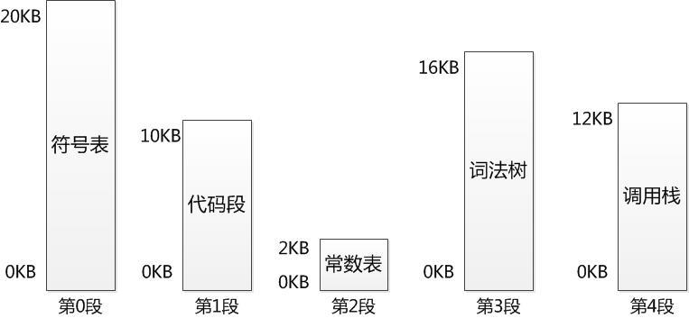

如此，一个段占用一个虚拟地址空间，不会发生空间增长时碰撞到另一个段的问题，从而避免因空间不够而造成编译失败的情况。如果某个数据结构对空间的需求超过整个虚拟空间所能提供的空间，则编译失败。不过这种概率非常非常低。<br>

就像每个进程拥有一个二维的地址空间。每个进程的每一段都可以不连续地存放在内存的不同分区中。所以因为直接是一个二维的地址空间，所以这些段根本不需要连续。而这个又能回到根本，动态分区管理方法<br>
* 为某个段分配物理内存时，可以采用首先适配方法，下次适配方法以及最佳适配法等
* 在回收某个段所占用的空间时，要注意将回收的空间与其相邻的空间合并
* 程序通过分段划分多个模块，如代码段、数据段、共享段

> 如图，这样的段可以分别编写与编译
> 可以针对不同类型的段采取不同的保护
> 可以按段为单位来进行共享，包括通过动态链接进行代码共享

##### 段式管理的数据结构
为了实现段式管理，操作系统需要如下数据结构来实现进程的地址空间到物理内存空间的映射，并跟踪物理内存的使用情况，以便在装入新的段的时候，合理地分配内存空间。<br>
* 进程段表: 描述组成进程地址空间的各段，可以是指向系统段表中表项的索引。每段都有段基址(段内地址)

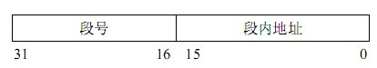

* 系统段表:系统所有占用段(已经分配的段)
* 空闲段表:内存中多有空闲段，可以结合到系统段表中

##### 段式管理的地址变换
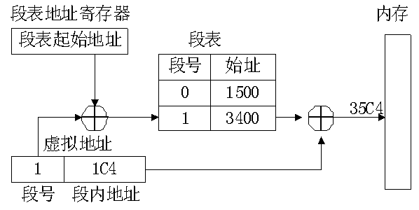

在段式管理系统中，整个进程的地址空间是二维的，即其逻辑地址由段号和段哪地址两部分组成。为了完成进程逻辑地址到物理地址的映射，处理器会查找内存中的段表，由段号得到段的首地址，加上段内地址，得到实际的物理地址。这个过程也是由处理器的硬件直接完成的，OS只需在进程切换时，将进程段表的首地址装入处理器的特定寄存器当中。这个寄存器一般被称作 **段表地址寄存器。**<br>

这样做的优点: 可以分别编写和编译源程序的一个文件，并且可以针对不同类型的段采取不同的保护，也可以按段为单位来进行共享。<br>
总的来说，段式存储管理的优点是: **没有内部碎片，外部碎片可以通过内存紧缩来消除；** 便于实现内存共享<br>
缺点与页式存储管理的缺点相同，进程必须全部装入内存。<br>
那有什么解决方法？分页呗，这问题不又回去了吗？不，这次的分页不是前面提到的直接程序进程进行分页，而是对程序里面的段进行分页，于是就形成了所谓的段页式内存管理模式。<br>

#### 段页式内存管理
段页式管理就是将程序分为多个逻辑段，在每个段里面又进行分页，即将分段和分页组🈴️起来使用。这样做的目的就是想同时获得分段和分页的好处，但又避免了单独分段和单独分页的缺陷。<br>

如果我们将每个段看做一个单独的程序，则逻辑分段就相当于同时加载多个程序。<br>

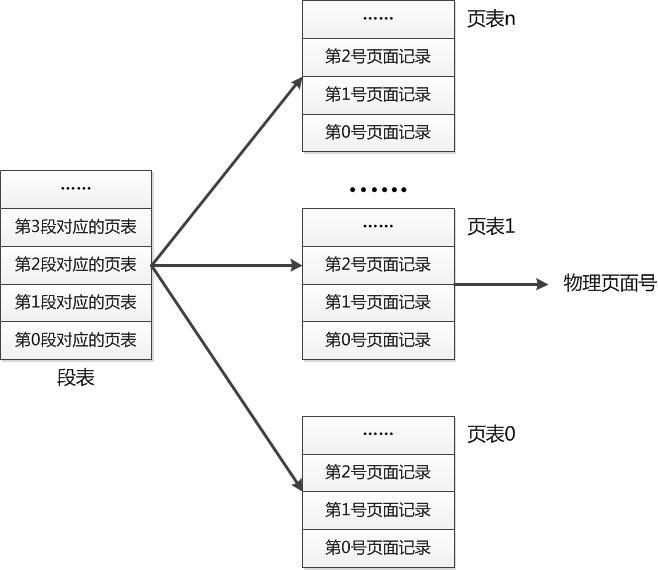

二维数组即视感。<br>
如果需要，次级页表又可以再分为两个或者多个层次，形成层次更为丰富的段页式层次结构。<br>
最后来看看这个计算机内存管理发展历史<br>

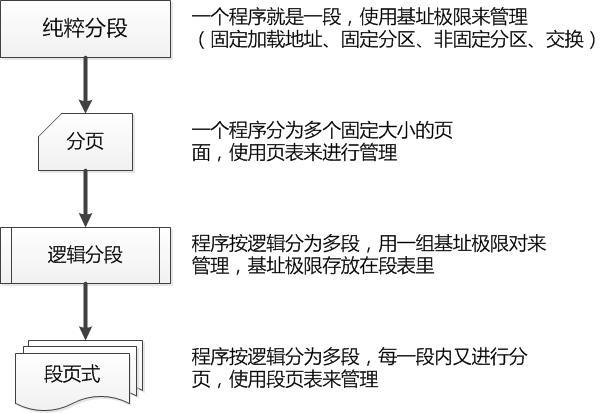

参考:<br>
[所见的是暂时的，所不见的是永远的-操作系统之哲学原理](./)