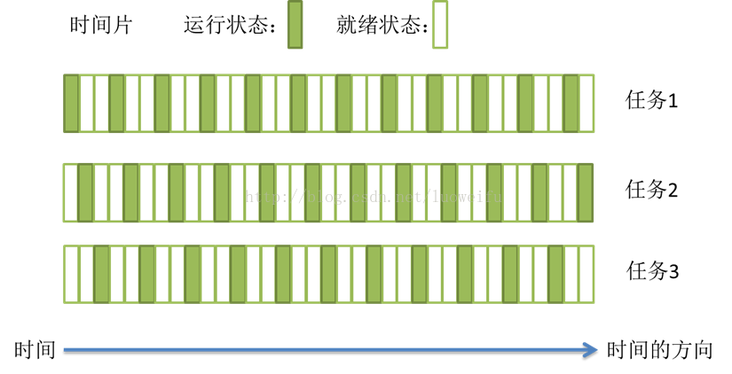
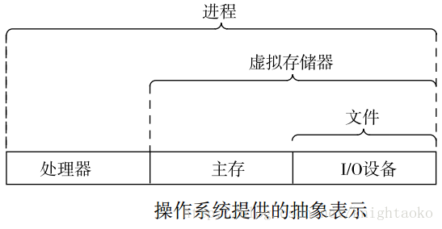
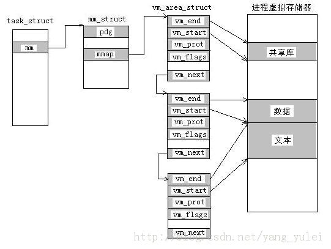
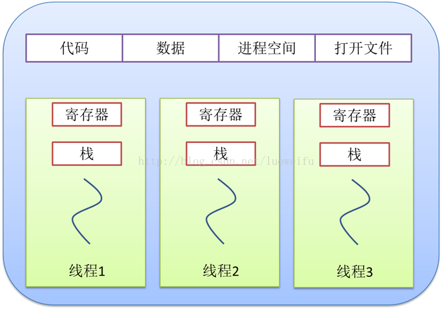
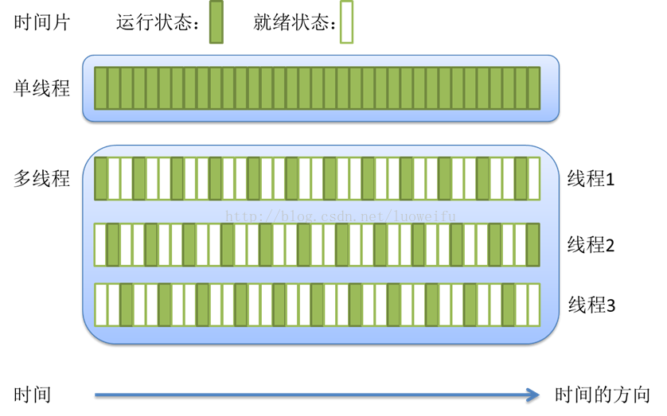
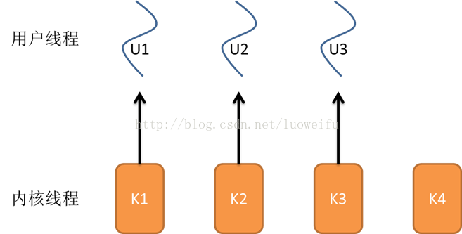
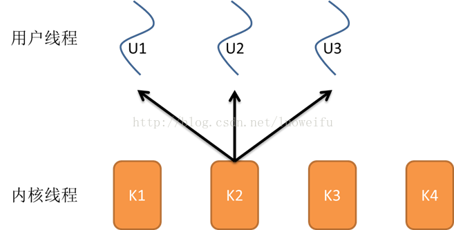
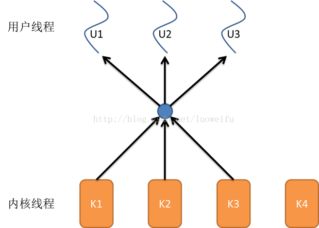

## 进程、线程与协程
什么是线程？什么又是进程？什么又是协程？每次都会被这个问题弄得抓狂。今天我们来具体聊聊，操作系统的进程与线程，以及现代工作中衍生出来的协程<br>
这次会结合具体的实际🌰，来讲解一下协程、线程以及进程之间的关系
### 任务调度 (抢占式风波，一个一个来)
什么是任务，任务就是一个具体的事情，要做好这个事情需要怎么做，需要什么材料，需要谁来做。一个任务可以由一个进程或一个线程或多线程或多个进程来完成。那么什么是任务的调度呢？在这里我们了解一下计算机操作系统任务调度的方式。是什么呢？是采用 **时间片轮转的抢占式调度方式**(这个需要记下来，后面的知识点讲解会用到)。顾名思义，一个任务执行一小段时间后强制暂停取执行下一个任务，每个任务轮流执行。(时间片有点像积分的意思，通过一个一个小的积分片段，解决打的问题(万事万物皆物理))。任务执行的一小段时间就叫做 **时间片**，任务正在执行时的状态叫 **运行状态**，任务执行一段时间后强制暂停去执行下一个任务，被暂停的任务就处于 **就绪状态**，等待下一个属于它的时间片的到来。其实一个任务在创建之后，期间只有 **运行态，就绪态，和阻塞等待状态**，到最后完成退出。由于CPU的执行效率很高，非常高，时间片非常短(积分非常短)，在各个任务之间快速地切换，给人感觉就是多个任务在"同时进行"，这就是我们所说的 **并发**。(所以其实所有高级都在搞并发，其实并发就那么回事~)。<br>
时间片轮转，任务调度示意图:<br>
<br>
这就是任务的调度情况，那么任务的调度和进程有什么关系呢？<br>
### 进程(一开始是资源分配和调度的最小基本单位，直到线程的出现)
什么是进程？在了解进程之前我们先了解一下底层关于进程的操作系统提供的抽象表示。<br>
盗了一张图，但是讲得很清楚。<br>
<br>
我们可以看到，进程是对处理器、主存和IO设备的抽象表示，而虚拟存储器是对主存和磁盘IO设备的抽象表示，而文件是对IO设备的抽象。<br>
所以我们知道进程其实是一个抽象的概念，而且线程和协程同样也是。<br>
我们知道计算机的核心是CPU，也是当年为什么intel只选择做芯片，因为缺他不可！CPU承担了所有的计算任务，而操作系统是计算机的管理者，它负责任务的调度、资源的分配和管理，统领整个计算机硬件；应用程序则是具有某种功能的程序，程序是运行于操作系统之上的。<br>
而进程，是具有一定 **独立功能的程序**在一个数据集上的 **一次动态执行的过程**，是操作系统 **进行资源分配和调度的一个独立单位**，是应用程序运行的载体。<br>
进程一般由以下三个部分组成:<br>
* 程序(做什么?):用于描述进程要完成的功能，是控制进程执行的指令集
* 数据集合(用什么做?):程序在执行时所需要的数据和工作区
* 程序控制块(谁来做?)(Program Control Block-PCB):包含进程的描述信息和控制信息，是进程的唯一标志<br>
总结下来一句话: **是谁用什么材料做什么**，这句话就很抽象，跟进程的原意一样抽象。<br>
那么程序具有什么特征？<br>
* 动态性:(This is life citcle, we only have one shot) 进程是程序的一次执行过程，是临时的，有生命周期的，是动态产生的，动态消亡的。
* 并发性:(Every process can be run together)任何进程都可以同其他进程一起并发执行
* 独立性:(Independent)进程是系统进行资源分配和调度的一个独立单位
* 结构性:(Compose by three parts)进程由程序、数据和进程控制块三部分组成。
* 异步性: 由于进程间的相互制约，使进程具有执行的间断性，即进程按各自独立的、不可预知的速度向前推进<br>
程序控制块，包含仅从的信息，控制信息，我们来看一下Linux下的一个进程的控制块结构体`task_struct`<br>
```c
struct task_struct{
    //列出部分字段
    volatitle long state;//表示进程当前的状态 ,-1表示不可运行，0表示可运行,>0表示停止
    void                *stack; //进程内核栈
    unsigned int            ptrace;

    pid_t               pid;//进程号
    pid_t               tgid;//进程组号
    struct              mm_struct *mm,*active_mm //用户空间 内核空间

    struct              list_head thread_group;//该进程的所有线程链表
    struct              list_head thread_node;
    int                 leader;//表示进程是否为会话主管
    struct              thread_struct thread;//该进程在特定CPU下的状态

    //等等字段：包括一些 表示 使用的文件描述符、该进程被CPU调度的次数、时间、父子、兄弟进程等信息
}
```
以上就是一个进程的信息，部分，当然哪些文件描述符还有进程调度次数还没列出来。但是我们现在只是了解进程，调度会在后面继续讲。<br>
早期操作系统没有线程的概念，进程是能拥有资源和独立运行的最小单位，也是程序执行的最小单位。任务调度采用的是时间片轮转的抢占式调度方式，而进程是任务调度的最小单位，每个进程有 **各自独立的一块内存**，使得各个进程之间内存地址相互隔离，我们知道，内存是共享的，那操作系统是怎么做到让每个进程之间都有各自独立的一块内存呢？我们看Linux里面的 **mm_struct**，这个结构使每个进程都能自己独占一块内存，各个进程都能在自己的地址空间活动，互不干扰。<br>
#### 虚拟存储器 Text Segment、Data Segment、BBS

虚拟存储器|表示
|:--:|:--
Text Segment|表示程序的代码段
Data Segment|表示已初始化且初值非0的全局变量和静态局部变量
BBS|表示未初始化或初始值为0的全局变量和静态局部变量
<br>

<br>
task_struct中的一个字段指向了mm_struct，它描述了虚拟存储器当前的状态，其中pdg指向了第一级页表的基地址，而mmap指向一个vm_area_structs区域结构的链表，每个vm_area_structs都描述了当前虚拟地址空间的一个区域。<br>
##### 虚拟存储器是如何使用主存作为缓存的
物理存储器和虚拟存储器都是用页来作为磁盘和内存的存储单元。<br>
因为有页表的存在，没有必要把虚拟存储器(在磁盘上)的所有页缓存在内存中，即使当CPU访问虚拟存储器中的页不存在内存中时， **系统会通过查表**，把需要的页从磁盘中拷贝到内存中(涉及页面调度算法)。<br>
### 线程LWP(直到我的出现，让问题变得简单)
随着计算机的发展，对CPU的要求越来越高，进程之间的切换开销较大，已经无法满足越来越复杂的程序要求。那为什么说切换的开销大呢？因为一个进程在执行的时候，CPU的所有寄存器中的值、进程的状态以及堆栈上的内容，在进程上下文切换时，需要保存当前进程的所有状态，即保存当前进程的上下文，包括 **文件描述符，已经运算的数据集，计算状态，资源，工作区等**，以便再次执行该进程时，能够恢复切换时的状态，继续执行，所以听着就觉得开销大🤮<br>
于是乎，聪明的程序猿🐒发明了线程。那么线程是神马🐎？<br>
* 线程(LightWeightProcess): 程序执行中一个单一的顺序控制流程，是程序执行流的最小单元，是处理器调度和分派的基本单元。<br>
一个标准的线程由线程ID，当前指令指针(PC)，寄存器集合和堆栈组成。线程是进程中的一个实体，是被系统独立调度和分派的基本单位，线程自己 **不拥有系统资源**，只拥有一点儿在运行中必不可少的资源，但它可与同属一个进程的其它线程共享进程所拥有的全部资源，共享整个虚拟地址空间(因此衍生线程安全的问题😫)。而进程由内存空间(代码、数据、进程空间、打开的文件)和一个或多个线程组成<br>
##### Linux中，线程和进程使用的是同一个结构体task_struct
Linux中，并不区分线程和进程，内核在进程任务调度时，仅仅是根据调度算法选择一个task_struct。至于这个task_struct，到底是进程还是线程，内核并不关心。<br>
属于同一个进程有一个线程组的概念，当创建一个线程时，创建一个task_struct结构体，但是这个task_struct共享进程的虚拟内存(也就是task_struct结构中的mm_struct mm字段)。正是由于多线程共享mm_struct mm<br>
<br>
2个task_struct通过指针共享一个mm_struct<br>
### 线程与进程的区别
* 线程是程序执行的最小单位，而进程是操作系统分配资源的最小单位
* 一个进程由一个或多个线程组成，线程是一个进程中代码的不同执行路线
* 进程之间相互独立，但同一个进程下的各个线程之间共享程序的内存空间(包括代码段、数据集、堆等)及一些进程级的资源(如打开文件和信号)，某进程内的线程在其他进程不可见(避免了很多问题)
* 调度和切换: 线程上下文切换比进程上下文切换要快得多得多，因为开销也小了<br>
堆: 在操作系统中是用链表来存储的<br>
<br>
#### 单线程与多线程的关系
<br>
理解了这两个概念，其实线程和进程都可以用于实现并发。<br>
#### 多线程和多进程
* 多线程之间堆内存共享，而进程相互独立，线程间通信可以直接基于共享内存来实现，比进程的常用的那些多进程通信方式更轻量。
* 上下文切换来说，不管是多线程还是多进程都涉及到寄存器、栈的保存，但是线程不需要切换页面映射(虚拟内存空间)、文件描述符等，所以线程的上下文切换也比多进程轻量
* 多进程比多线程更安全，一个进程基本不会影响另一个进程<br>
在实际的开发中，一般不同任务间（可以把一个线程、进程叫做一个任务）需要通信，使用多线程的场景比多进程多。但是多进程有更高的容错性，一个进程的crash不会导致整个系统的崩溃，在任务安全性较高的情况下，采用多进程。
#### 多线程与多核 同一时间点只有一个任务在执行？
对于单核来说，同一个时间点只有一个任务在执行是正确的，但是现在都多核了，那就不是一个说法了。<br>
那多核处理器的情况下，线程是怎样执行的呢？这就需要了解内核线程了。<br>
**多核处理器** 是指在一个处理器上集成多个运算核心从而提高计算能力，也就是有多个真正并行计算的处理核心， **每一个处理核心对应一个内核线程**。 **内核线程(Kernel Thread,KLT)** 就是直接由操作系统内核支持的线程，这种线程由内核来完成线程的切换，内核通过操作调度器对线程进行调度，并负责将线程任务映射到各个处理器上。 **一般一个处理核心对应一个内核线程**，比如单核处理器对应一个内核线程，双核处理器对应两个内核线程，四核处理器对应四个内核线程。<br>
##### 超线程技术
现代的双核四线程、四核八线程，是采用超线程技术将一个物理处理核心模拟成 **两个逻辑处理核心**，对应两个内核线程，所以在操作系统中看到的CPU数量是实际物理CPU数量的两倍。<br>
超线程技术就是利用特殊的硬件指令，把一个物理芯片模拟成两个逻辑处理核心，让单个处理器都能使用线程级并行技术，进而兼容多线程操作系统和软件，减少CPU的闲置时间，提高CPU的运行效率。这种超线程技术由处理器硬件决定，同时也需要操作系统的支持才能在计算机中表现出来。<br>
程序一般不会直接去使用内核线程，而是去使用内核线程的一种高级接口(一般使用内核线程的都是让操作系统使用)--轻量级进程(LWP)，轻量级进程就是我们通常意义上所讲的线程。由于每个轻量级进程都由一个内核线程支持，因此只有先支持内核线程，才能有轻量级进程。用户线程与内核线程的对应关系有三种模型。<br>
##### 一对一模型
一个用户线程就唯一对应一个内核线程(反过来不一定成立，一个内核线程不一定有对应的用户线程)。这样，如果CPU没有采用超线程技术，那么一个用户就唯一地映射到一个物理CPU的线程，线程之间的并发是 **真正的并发**。
* 优点：线程之间阻塞不影响其他线程，让多处理器的系统有更好的表现
* 缺点：1. os限制内核线程的数量，因此一对一模型会使用户线程的数量收到限制 2. 许多os内核线程调度时，上下文切换的开销较大，导致用户线程的执行效率下降<br>
<br>
##### 多对一模型
多个用户线程映射到一个内核线程上，线程之间的切换由用户态的代码来进行，相对于一对一模型，多对一模型的线程切换速度要快许多；此外，多对一对用户线程的数量几乎无限制。<br>
* 缺点：1. 一个线程阻塞，那么其它所有线程都无法进行 2. 多处理器系统上，处理器数量的增加对多对一模型的线程性能不会有明显的增加，因为所有的用户线程都映射到一个处理器上了。<br>

##### 多对多模型
结合上面两的优点
* 优点：1. 一个用户线程的阻塞不会导致所有线程的阻塞，因为此时还有别的内核线程被调度来执行 2. 多对多模型对用户线程的数量没有限制 3. 在多处理器的os中，多对多模型的县城也能得到一定的性能的提升，但提升幅度不如一对一模型高。<br>

#### 线程的生命周期
当线程当数量小于处理器的数量时，线程的并发是真正的并发，不同线程运行在不同的处理器上。但是当线程的数量大于处理器的数量时，线程的并发会受到一些阻碍，此时并不是真正的并发，因为此时至少有一个处理器会运行多个线程(时间片的概念)。<br>
早期进程的生命周期<br>
<br>
线程的生命周期<br>

* 创建：一个新的线程被创建，等待该线程被调用执行
* 就绪：时间片用完，此线程被强制暂停，等待下一个属于它的时间片到来
* 运行：此线程正在执行，正在占用时间片
* 阻塞：等待状态，等待某一个时间(如IO或另一个线程)执行完
* 退出：一个线程完成任务或其他终止条件发生，该线程终止进入退出状态，退出状态释放该线程所分配的资源
### 协程的基本概念
* 协程是用户模式下的轻量级线程，操作系统内核对协程一无所知
* 协程的调度完全有应用程序来控制，操作系统不管这部分的调度
* 一个线程可以包含一个或多个协程
* 协程拥有自己的寄存器上下文和栈，协程调度切换时，将寄存器上下纹和栈保存起来，在切换回来时恢复先前保运的寄存上下文和栈
* 协程能保留上一次调用时的状态，看到这里各种生成器（生成器是被阉割的协程）的概念浮现出来了。

### 同步与异步
同步: 调用一个过程时，假如过程还在执行状态，没有返回结果，那么在该过程返回之前，就不能继续做下一件事情。<br>
**穿了袜子再穿鞋**，顺序性，确定性，简易性<br>
异步: 调用一个过程时，就接着做下面的事情，不立即获得该过程的返回值。<br>
#### 实现异步: 状态，通知，回调<br>
* 状态: 即设一个共享变量(FLAG)，旧任务结束时，变量置有效值，之后旧任务结束，新任务循环检测变量是否有效。(新任务不必等，只需要适时检测判断这个状态变量是否有效也就是 **"轮询"** )
* 通知: 做完回头告诉你(新任务必须间断地等待通知，有通知就处理。等待，新任务一般处于阻塞状态)
* 回调: 把旧任务做完后要做的收尾工作交给旧任务本身，这样旧任务做完收尾工作后便结束(新任务可以不管旧任务的事情)<br>
"回调"，表示旧任务与新任务之间没有关系；通知，表示旧任务和新任务有直接联系；状态，表示旧任务和新任务有间接联系，通过状态变量<br>

