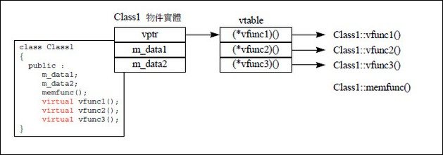
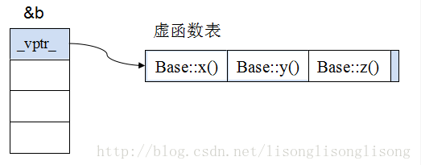
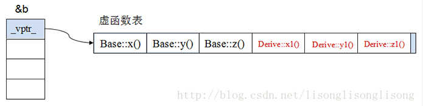
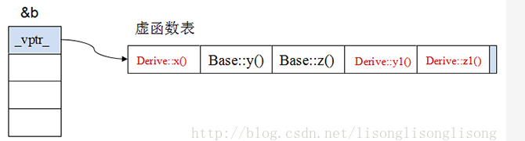
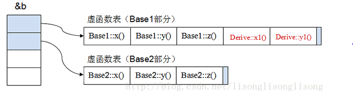
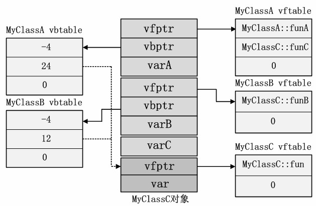

## 什么是多态，多态有什么用途。(虚函数)
先从哪里说起呢，先说一下virtual这个关键字，然后重载，然后类继承，private继承，派生类，讨论类层次，讨论虚函数表，讨论虚函数在继承中的实现，讨论虚函数的准则，讨论虚函数重载的过程，讨论底层实现，顺便了解一下inline内联函数，以上都是要讲的内容，慢慢讲。<br>
首先我先不回答这个问题，什么是多态，我们先来看看什么是函数重载。
### 函数重载 (一个简单的多态)
```cpp
#include <iostream>
using namespace std;
int func(int a,int b){
    return a+b;
}
void func(char a){
    cout << a << endl;
}
double func(double a,int b){
    return a+b;
}
int main(){
    int a = func(1,2);
    double d = func(1.22,3);
    func('a');
    cout << a << ',' << d << endl;
    return 0;
}
```
编译器会根据上下文语义来决定最适合的func执行。而我们使用同样的函数表现出不同的结果，这也叫做一个函数多种不同的形态，这也正好印证了函数指针的使用，一个函数体生成的代码，置于某块内存区域中，有自己的地址。函数指针的详细可以在上一节可调用对象查看，这里我就不再赘述。一个函数多中不同的形态，其实也可以在类中实现，但是函数重载并不会跨越作用域，除非使用using声明<br>
```cpp
struct B1{
    void func(int);
};

struct B2{
    void func(double);
};

struct D:B1,B2{
    using B1::func;
    using B2::func;
    void func(char);
};

d.func(1);
d.func('c');
d.func(1.0);
```
这样也可以实现不同类之间的函数重载，每个参数的不同都会使用调用不同的func。<br>
那么这跟cpp的多态有什么关系呢？且等我娓娓道来，我们首先构建一个类，一个类首先我们必须知道编译器为他默默生成的四个函数(拷贝构造，构造，拷贝赋值运算符以及析构函数)。那么一个类如何呈现多态呢？我们先来看看定义， **多态，是指”一种接口，多种方法“，而这些方法是在运行时确定的“**。咋一看概念好像很好懂，但是要是想彻底了解，也需要从最基本的说起。首先它是有多种方法，一种接口，这会让我们联想到派生类，一个基类，多种派生类的出现
### 派生类 (表达类层次关系)
派生类通过继承关系而来，先来看看继承又是什么关系，先来看看两个大的继承关系，实现继承与接口继承
* 实现继承：通过共享基类所提供的特性来减少实现工作量<br>

```cpp
// 一个书上的🌰，比较复杂，但是为了后面讲述类层次，先拿来用
#include <iostream>
using namespace std;
class lval_box{
    protected:
        int val;
        int low,high;
        bool changed = false;
    public:
    lval_box(int ll,int hh):val(ll),low(ll),high(hh){}
    virtual int get_value(){ changed = false;return val;}
    virtual void set_value(int i){changed = true;val = i;}
    virtual void reset_value(int i){changed = false;val = i;}
    virtual void prompt(){}
    virtual bool was_changed()const { return changed;}
    virtual ~lval_box(){};
};
```
这就是基类实现了大部分的特性，如果要继承，就可以直接使用基类函数。<br>
* 接口继承：通过一个公共基类提供的接口允许不同派生类互换使用。(常被称为运行时多态，动态多态)<br>

```cpp
#include <iostream>
using namespace std;
class lval_box{
    public:
    virtual int get_value()=0;
    virtual void set_value(int i)=0;
    virtual void reset_value(int i)=0;
    virtual void prompt()=0;
    virtual bool was_changed()=0;
    virtual ~lval_box(){};
};
```
这就是一个接口继承的公共基类，没有实现任何函数，只是提供了一个简单的纯虚函数的接口。这就方便后面的派生类实现多态了<br>
接口继承常被称为 **运行时多态或者动态多态**，模版就反了，模版所提供的类的通用性与继承无关，常被称为 **编译时多态或静态多态**。(模版多态，会在模版那一章节继续讲)。<br>
继承扯远了，先回来看看派生类
#### 最简单的派生
```cpp
struct Employee{
    string first_name,family_name;
    char middle_initial;
    string hiring_date;
    short department;
};

struct Manager:public Employee{
    list<Employee*> group;
    short level;
    //...
};
```
这就是继承关系，manager也是一个employee，继承employee的属性，并且可以将自己放入列表中。public继承就是is-a属性。这个public是一个访问说明符，待会也会细细与private，protected一起讲。<br>
对于这个is-a属性，可以由下面的🌰可以得知
```cpp
Employee *eman = new Manager();
eman->first_name = "mrtrans";
```
可以将派生类赋予基类，但是不能将基类赋予派生类，也就是说，父类可以出现的地方，子类也可以出现，但是子类出现的地方，父类不能出现。也就是说，子类是父类类型，但是父类类型不是子类。<br>
可是如果我硬是要转换呢？也可以用static_cast暴力转换，来看看这个暴力转换
```cpp
void g(){
    Employee *pe = new Employee();
    Manager *pm = static_cast<Manager*>(pe);
    pm->level = 12;
    cout << pm->level << endl;
    delete pe;
}
```
这样就暴力解决了，也是很暴力，硬生生把pe改成了manager类型。<br>
其实，当我们这样将子类赋予给父类类型的时候，发现出现了切片的现象，什么是切片现象？
##### 切片现象
切片，一个指向派生类的指针可以隐式转换为指向其公有基类的指针。这样，指针原本的指向就会转向公有基类，而子类部分的成员就会被切割掉，这就是切片。<br>
#### 复杂一点的派生 (自从复杂之后，派生的人生达到了高潮)
一个简单的派生就要涉及那么多学问，那么复杂的派生还得了？没错，不得了，复杂的派生讲的点包括，成员函数，访问控制，虚函数，虚继承，虚基类，虚析构函数，强制类型转换等<br>
##### 构造函数和析构函数 (先从你的诞生讲起)
* 构造，基类先于成员，成员先于派生(先有爸爸👨)，析构，派生类先于成员，成员先于基类(先打儿子，先欺负小的👦)
* 每个类都可以初始化其成员和基类
* 类层次中的析构函数通常是virtual的。(为什么呢？)<br>
```cpp
class Shape{
    public:
        virtual void draw();
        virtual ~Shape(){
            cout << "delete shape!" << endl;
        };
};

class Circle:public Shape{
    public:
        ~Circle(){
            cout << "delete shape?" << endl;
        }
};
int main(){
    Shape *cir = new Circle();
    delete cir;
}
```
因为Shape定义了虚函数就会有被继承的效果，而继承之后就需要构造，而构造是从基类开始的，但是析构就是从派生类开始的。在上面的🌰中， **如果操纵一个对象是通过基类提供的接口的话，那么就应该通过该接口来delete它**。所以virtual就提供了这个接口，让派生类释放基类资源。<br>
##### 类层次 (一个派生类自身也可以作为其他类的基类)
因为一个派生类自身也可以作为其他类的基类，所以衍生出类层次的概念。<br>
```cpp
class Employee{};
class Manager:public Employee{};
class Director:public Manager{};
```
称一组相关的类为类层次。大多数情况下，这是一棵树🌲，但是一般也会有图的结构<br>
例如
```cpp
class Temporary{};
class Assitant:public Employee{};
class Temp:public Temporary,public Assitant{};
class consultant:public Temporary,public Manager{};
```
这样的类层次就成为了一个有向无环图结构。<br>
##### 虚函数(virtual) 提供了接口
虚函数机制允许程序员在基类中声明函数，然后在每个派生类中重新定义这些函数。编译器和链接器会保证对象和施用于对象之上的函数之间的正确关联。
```cpp
class Employee{
    public:
        Employee(const string &name,int dept);
        virtual void print() const;
        // ... 
    private:
        string first_name,family_name;
        short department;
};
```
关键字virtual指出print()作为这个类自身定义的print()函数及其派生类中 **定义的print()函数的接口**。如果派生类中定义了此print()函数，编译器会确保对给定的Employee(is-a关系)对象调用正确的print()。<br>
为了允许一个虚函数声明能作为派生类中定义的函数的接口，派生类中函数的 **参数类型**必须与基类中声明的参数类型完全一致。
而首次声明虚函数的类必须定义它除非纯虚<br>
```cpp
void Employee::print() const{
    cout << family_name << endl;
}
```
如果派生类中的一个函数名字和参数类型与基类中的一个虚函数完全相同，则称它覆盖了虚函数的基类版本。
```cpp
class Manager:public Employee{
    public:
        ...
        void print() const;
    ...
};
void print_list(const list<Employee*>&s){
    for(auto x:s)
        x->print();
}
int main(){
    Employee e("Brown",1234);
    Manager em("Smith",123,2);
    print_list({&e,&em});
}
```
这样每次都能打印指定类型的print。无论真正使用确切Employee类型是什么，都能令Employee的函数都能得出正确的行为，这就称为多态。具有虚函数得类型称为多态类型(polymorphic type)或精确的(运行时多态类型)。Cpp为了获得运行时多态，必须调用virtual成员函数，对象必须通过指针或引用进行访问。当直接操作一个对象时，而不是通过指针或引用，编译器了解其确切的类型，从而不需要运行时多态了。<br>
再看一个🌰
```cpp
class Shape{
    public:
       virtual void draw(){
            cout << "i am shape" << endl;
        }
        virtual ~Shape(){
            cout << "delete shape!" << endl;
        };
};

class Circle:public Shape{
    public:
       void draw() override{ // override 显式说明想要进行的覆盖
       /*** 
        * virtual 可能被覆盖
        * =0 必须被覆盖
        * override 覆盖一个
        * final函数不再被覆盖(不可能被覆盖)
        *  class A final:public Node{
        *     // 所有的virtual都会被声明为final 
        * }
       ***/
            cout << "i am Circle" << endl;
        }
        void print(){
            cout << "no circle" << endl;
        }
        ~Circle(){
            cout << "delete shape?" << endl;
        }
};

Shape *cir = new Circle();
cir->draw();
delete cir;
```
由于在运行时不知道用的是哪个类型，所以需要用virtual(利用cpp多态)，要是不用virtual，那么利用基类的指针就只能总是被限制在基类函数本身，而无法获得调用在子类中被重写的函数。<br>
这里要多说一点的就是 **public继承塑模出is-a关系**，通过这样的继承，其实是在告诉编译器，每一个Manager类型对象也是一个Employee类型对象，但是反过来就不成立了。(所以在print_list中，manager类型是可以使用的，而后会讲private继承is-implemented-in-terms-of和protected继承has-a关系)。<br>
我们可以看到，要是Manager没有覆盖print虚函数，那么调用的将是Employee原来的print()。<br>
默认情况下，覆盖虚函数的函数自身也变为virtual，这样每次派生给再派生提供接口。<br>
讲到虚函数就要讲一下虚函数表。<br>
如果一个类含有虚函数，那么它就会含有一个虚函数表(vbtl)，而这个表被一个指针指向，每个虚函数都会成为这个表中的一个地址指向。<br>
<br>
每个地址都会指向每个虚函数。这就引申了一个问题，sizeof的问题。(查剑指offer)。<br>FIXME:

**⚠️类实例化的对象不含有虚函数表，类才有虚函数表，对象只有虚指针，而派生类会生成一个兼容基类的虚函数表。**<br>
* 原始基类的虚函数表 假设基类定义了三个虚函数<br>
<br>
* 单继承时的虚函数(无重写基类虚函数) 不重写<br>
<br>
Derive class继承了Base class中的三个虚函数，准确地说，该函数实体的地址被拷贝到Derive类的虚函数表，派生类新增的虚函数置于虚函数表后面，并按顺序存放。<br>
* 单继承时的虚函数(重写基类)，派生类构建自己的虚函数表的时候，修改了base::x()<br>
<br>
* 多重继承时的虚函数(Derived:public Base1,public Base2)<br>
<br>
就会有两个虚函数指针指向不同的虚函数表。<br>
```cpp
class Shape{
    public:
       virtual void draw(){
            cout << "i am shape" << endl;
        }
        virtual ~Shape(){
            cout << "delete shape!" << endl;
        };
};


class Shape2{
    public:
       virtual void draw(){
            cout << "i am shape2" << endl;
        }
        virtual ~Shape2(){
            cout << "delete shape2!" << endl;
        };
};


class Circle:public Shape,public Shape2{
    public:
        void print(){
            cout << "no circle" << endl;
        }
        ~Circle(){
            cout << "delete shape?" << endl;
        }
};
Shape *cir = new Circle();
Shape2 *cir2 = new Circle();
cir->draw();
cir2->draw();
```
然后这两个就会有不同的效果。<br>
这个过程呢？
```cpp
    Shape *b1 = (Shape*) cir2;
    b1->draw();
```
通过某个类型的指针访问某个成员时，编译器只是根据类型的定义查找这个成员所在偏移量，用这个偏移量来获取成员。所以cir2获取的成员本来就是Shape2的起始地址。所以输出的还是"i am shape2"<br>
#### 虚继承
此时，我们也可以用一个派生层次更深的返回类型覆盖基类中的虚函数。<br>


那返回类型呢？返回类型也只允许细微改变(也叫做类型的放松😌)。
#### 类型放松 只能用于返回类型是指针或引用的情况
覆盖函数的类型必须与它所覆盖的虚函数类型完全一致，但是C++吧，就觉得既然都is-a，那么可以说，如果原返回类型是Base*，那么覆盖的函数可以返回Derived*，类似的，返回的类型是Base&，那么覆盖函数可以返回Derived&。这叫协变返回。<br>
### 抽象类(纯虚函数) virtual typename func() = 0
很多情况下，基类本身生成的对象不合情理， **自身本身就是一个抽象的概念，并不能具有一个具体的对象**。所以为了抽象这个基类，cpp引入纯虚函数的概念，纯虚函数不能在基类中实现，就像我们之前说过的，虚函数一定要定义而=0就不需要了。编译器会要求在派生类中必须予以重写以实现多态性。<br>
举个🌰
```cpp
class Character_device{
    public:
        virtual int open(int opt) = 0;
        ...
        virtual ~Character_device(){}
}
```
而纯虚函数在后面的派生类中必须实现，当然，这个含有纯虚函数的类也叫做抽象类，没有具体的对象<br>
析构函数还是要有的。抽象类提供接口不暴露细节。<br>
### 访问控制 public protected private
一个类成员可以是private、protected或public的
* private，仅可以被所属类的成员函数和友元函数所使用(但是朋友总会惹来麻烦)
* protected，仅可被所属类的成员函数和友元函数以及派生类的成员函数和友元函数使用
* public，公交车🚌，谁都可以访问。<br>
emmm，举个特别一点的🌰
```cpp
template <typename T>
class List{
    public:
    void insert(T&);
    T get();
private:
    struct Link{
    T val;
    Link *next;
    };
};

template<class T>
T List<T>::get(){
    Link *p = head;
    head = p->next;
}
```
#### 访问基类控制
* public,令派生类成为基类的一个子类型。
* private，当定义一个类时将其接口限定为基类，从而可提供更强的保障。
* protected，对于进一步派生是常态。类似private派生，protected派生也用于表示实现细节。<br>
考虑💭一个类D派生自类B的情况
* 如果private B，其公有和保护成员只能被D的成员函数和友元函数使用，只有D的友元和成员可以将一个D* 转换为一个B*。
* 如果protected B，其公有和保护成员只能被D的成员函数和友元函数使用，以及D的派生类的成员函数和友元函数使用.只有D的友元和成员以及D的派生类的成员和友元可以将一个D* 转换为一个B*
* 如果public B，公有成员可以被任何函数使用，保护成员仅D及其友元以及D的派生类的成员和友元使用。任何函数都可以将一个D* 转换成一个B*。<br>
##### 55说过，明智而审慎地使用private继承
private base class继承而来的所有成员，在derived class中都会变成private属性，纵使它们在base class中原本是protected或public属性的。如上所述<br>
private意味着implemented-in-terms-of(根据某物实现出)。如果你让class D以private形式即成class B，你的用意是为了采用class B内已经备妥的某些特性，不是因为B对象和D对象存在有任何观念上的关系<br>
private继承仅仅是为了实现枝节，但是复合也有这个效果
```cpp
template <class T>
class Set{
    public:
        bool member(const T& item) const;
        void insert(const T& item);
        void remove(const T& item);
        std::size_t size() const;
    private:
        std::list<T> rep; // 用来表述Set的数据
};

template <class T>
bool Set<T>::member(const T& item) const{
    return find(rep.begin(),rep.end(),item) != rep.end();
}
```
这个就是复合，也是has-a的意思，也是根据某物实现出的意思，那么private咧？引入private继承就会将基类所有的成员都声明为private，所有的其他非派生的函数或友元函数可以使用，而如若这样
```cpp
class Timer{
    public:
        virtual void onTick() const;
        ...
}

class Widget:private Timer{
    private:
        virtual void onTick() const; // 查看Widget数据
        ...
}
```
在Timer可以调用，但是在Widget就不可以了，这样会导致接口容易被错误使用，所以不建议这种用法。但是private继承却是不会浪费空间的，而复合是需要的，所以在很在意空间的情况下，可以选择priavet但是复合也没错，所以要审慎地选择private还是复合。<br>

#### 多重继承(虚继承)与访问控制 明智而审慎地使用多重继承
多重继承上面其实也有体现，例如Circle继承了Shape，Shape2。多重继承衍生出类层次<br>
* 共享接口: 通过使用类使得重复代码较少，且代码规格同一。通常称为 **运行时多态**或者接口继承
* 共享实现: 代码量较少且实现代码的规格同一，通常称为实现继承。<br>
一个类可以综合应用接口与实现继承。<br>
我们再看一个🌰
```cpp
struct Storable{
    virtual string get_file() = 0;
    virtual void read() = 0;
    virtual void write() = 0;
    virtual ~Storable(){}
};

class Transmiitter:public Storable{
    public:
        void write() override;
};

class Receiver:public Storable{
    public:
        void write() override;
};

class Radio:public Receiver,public Transmiitter{
    public:
        string get_file() override;
        void read() override;
        void write() override;
        // ...
};
```
Storable是一个抽象类，Radio有可能有两个基类也可能有一个共享的基类。这种重复的继承会给Radio使用的时候`Radio *ptr = new Radio()`造成歧义(ambiguity)<br>
不知道调用的哪个版本，最后也就可能调用最佳匹配，但是这里没有最佳匹配的选项，这里没有选项，都是一样的函数，所以在调用的时候使用`ptr->Transmiitter::get_file();`进行显式调用。<br>
其实多重继承的意思是继承一个以上的base classes，但是base classes并不常在继承体系中又有更高级的base classes。就像这样<br>
```cpp
/***
 *       ->OutputFile->File
 * IOFile
 *       ->InputFile>File
***/
```
这就是致命钻石级多重继承模型。任何时候，如果你有一个即成体系而其中某个base classes和某个derived class之间有一条以上的相同路线，那么就会有一个问题，是否打算让base classes内的成员变量经由每一条路径被复制?假设File class里有一个成员变量fileName，这个fileName要被复制多少遍呢？所以，继承而来的，也要取其精华，去糟粕。可以使用虚基类虚继承。<br>
#### 虚继承 虚基类
令所有继承File的都变成虚继承
```cpp
class File{};
class InputFile:virtual public File{};
class OutputFile:virtual public File{};
class IOFile:public InputFile,public OutputFile{};
```
虚继承是一种机制，类通过虚继承指出它希望共享其虚基类的状态。在虚继承下，对给定虚基类，无论该类在派生层次中作为虚基类出现多少次，都只继承一个共享的基类子对象。<br>
这就很好解决了不用复制太多的成员变量。毕竟virtual始终秉承着一个观点，一个接口，你可以多种方法，始终一个接口。后面的实现都会覆盖本来的方法。<br>
##### 深入了解虚拟继承对象模型
为了解决多份拷贝的问题，引入了虚继承，看如下一个🌰
```cpp
class MyClassA:virtual public MyClass
class MyClassB:virtual public MyClass
class MyClassC:public MyClassA,public MyClassB
```
那么除了秉承这个观点还有什么呢？没错，还有一个虚基类表vbtable。虚继承的引入把对象的模型变得十分复杂，除了每个基类(MA和MB)和公共基类(M)的虚函数表指针需要记录📝外，每个虚拟继承了MyClass的父类还需要记录一个虚基类表vbtable的指针vbptr。<br>
<br>
虚基类表每一项记录📝了被继承的虚基类子对象相对于虚基类表指针的偏移量。参考[虚函数与虚继承寻踪](http://www.cnblogs.com/fanzhidongyzby/archive/2013/01/14/2859064.html)<br>
呼，虚...
