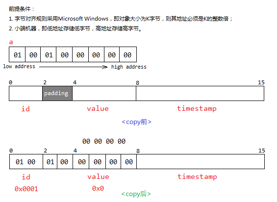

#### 不能把字符串"HELLO!"赋给数组b的语句是?
考虑💭指针，数组名是一个常量指针，要么就初始化赋值，不然后面就不能改。<br>

#### 由C++目标文件链接而成的可执行文件的缺省扩展名为 exe 这个没意义！！！

#### 函数的实参可以是常量、变量或表达式，但形参只能是变量，不可以是常量或表达式。

#### 设置断点要观察溢出，打断点在循环没用♻️

#### printf 输出%ms，如果字符串长度大于m，则按字符串实际长度从左往右全部输出，小于就补齐左补空格，右对齐

#### 8.9e 0f是非法数值常量

#### 函数参数的入栈顺序，从右到左，栈的存储是从高地址到低地址
```c
int i = 0x22222222;
char szTest[] = "aaaa";
func(i,szTest);// void func(int a,char *sz);
```
参数在栈中的形式可能为左侧为地址，右侧为数据
0x0013FCF0	0x0013FCF8<br>
0x0013FCF4	0x22222222<br>
0x0013FCF8	0x61616161<br>
栈的增长方向是从大地址到小地址，就是上面的从下往上，参数就是从右边的参数->左边参数->函数返回地址

#### 64位操作系统中定义如下结构体
```c
struct st_task
{
    uint16_t id; // 16bit
    uint32_t value; // 32bit
    uint64_t timestamp; // 64bit
};
void fool()
{
    st_task task = {};
    uint64_t a = 0x00010001;// 32bit
    memcpy(&task, &a, sizeof(uint64_t));
    printf("%11u,%11u,%11u", task.id, task.value, task.timestamp);
}
```
fool的执行结果是？1，0，0
<br>
id = 0x0001，因此为1，后面对齐补上的001去掉了。
