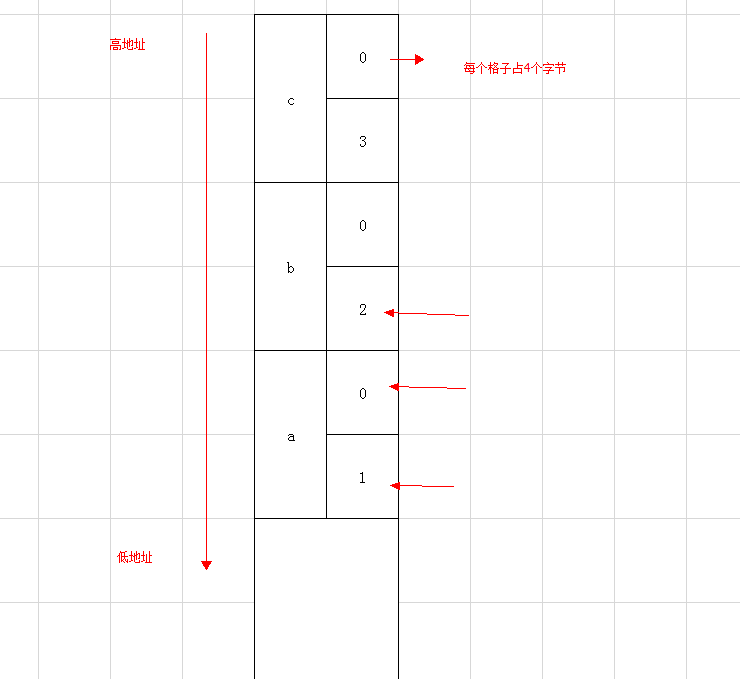

#### 函数可以嵌套声明，也可以重复声明，但是不能嵌套定义

#### heap和stack 堆是不会自动增加的大哥

#### 赋值语句是一种执行语句，必须放在函数的可执行部分

#### `#include`命令在命令处插入文本文件

#### 通过一个对象调用虚函数时，C++系统对该调用采用静态联编
* 使用对象名调用虚函数，是静态联编
* 使用基类指针调用虚函数，是动态联编

#### math.h abs的返回值
因为负数的范围比正数大一个，比如8进制，可以表示范围-128～127所以 abs(-128)可能并不能表示为128，所以只能返回原值。<br>

#### 32位 little ednian的机器上运行下面的程序
```c
#include <stdio.h>
int main(){
  long long a = 1, b = 2, c = 3; 
  printf("%d %d %d\n", a, b, c);  
  return 0;
}
```
<br>
* printf()是一个库函数，C，C++中函数的参数是从右往左入栈
* 栈的生长方向从高往低
* 小端模式是低位存储在低字节
* %d格式输出的是4个字节大小，而long long为8个字节

#### 在16位C编译系统上，以下程序的输出结果是%o 是八进制大哥
```c
void main（）
{
int y=2456；
printf ("y=│%3o│ y=│%8o│y=│%#8o│ y=│%08o│",y,y,y,y);
}
```
y=│4630│ y=│□□□□4630│ y=│□□□04630│ y=│00004630│<br>
因为y的输出是以其八进制的形式输出。

#### 函数重载返回类型，不作调用依据
* 函数参数类型和个数不同。
* 函数参数的顺序不同。<br>
返回值没有区分度，因为在调用函数的时候可以选择接收或丢弃返回值，编译器是无法区分你是要调用有相应返回值的函数还是调用无返回值的函数。返回值无法区分函数。<br>

#### ftell(fp) 得到流式文件中的当前位置

#### strcpy(p,"ABCD")的动能
将字符串"ABCD"复制到指针变量p所指向的内存单元中，其返回值是指针p所指内存单元的地址，然后计算p所指字符串的长度。

