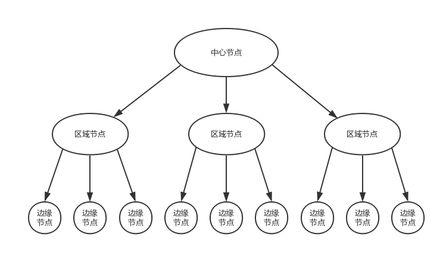
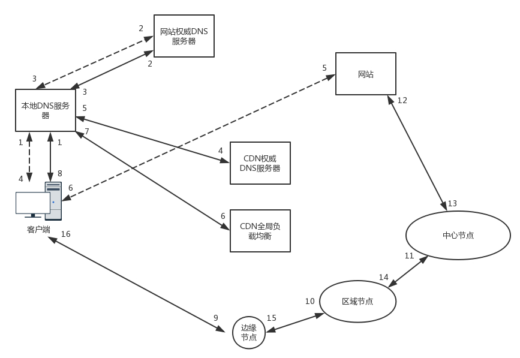
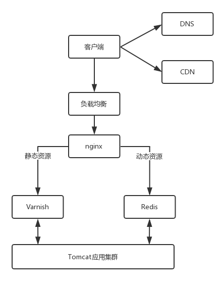

### CDN 京东建仓策略，就近配送
上一次讲到DNS服务器负责负载均衡以及IP定位，HTTPDNS服务器，各家自扫门前雪，自己搞自己的DNS策略，不用根的DNS服务器。但是每次访问可以找到最近的地方访问吗？要是HTTPDNS服务器也是指向很远的IP，那么也是让网络延迟很久呀。所以，这时候就需要CDN策略。什么意思呢？全球很多数据中心，无论在什么地方上网，临近不远的地方基本上都有数据中心。数据中心部署几台机器，形成一个缓存的集群来缓存部分数据，用户访问数据的时候，就可以就近访问。而这些数据中心，统称 **边缘节点** 
而边缘节点数目较多，但是每个集群规模较小，不可能缓存下来所有东西，因而可能无法命中，这样就会在边缘节点之上，有区域节点，规模更大，缓存数据更多，命中的概率也就更大。区域节点之上就是中心节点，规模更大，缓存数据更多，命中概率更大。如果还不命中，就只好回源网站访问了。 

**CDN的分布系统架构**。CDN系统的缓存，一层一层的，能不访问后段真正的源节点，就不访问。 
所以， **客户端如何找到相应的边缘节点进行访问呢？**
#### 基于DNS的全局负载均衡
选择一个就近的同样的运营商服务器进行访问。CDN分发网络也是一个分布在多个区域、多个运营商的分布式系统，可以用相同的思路选择最适合的边缘节点。 

与DNS访问不同，有了CDN之后，在访问一个域名，在访问权威DNS服务器上，会设置一个CNAME别名，指向另一个域名cdn.com，返回给本地的DNS服务器。
* ➡️当本地DNS服务器拿到新的域名，继续解析这个新的域名。再访问cdn.com这个权威的DNS服务器，这是CDN自己的权威DNS服务器。在这个服务器上，还会设置一个CNAME，指向另一个域名，也就是CDN网络的全局负载均衡器。
* ➡️本地DNS服务器去请求CDN的负载均衡器解析域名，全局负载均衡器会为用户选择一台合适的缓存服务器提供服务

1. 根据用户IP地址，判断那一台服务器最近
2. 用户所处运营商
3. 根据用户所请求的URL中携带的额内容名称判断哪一台服务器上有用户所需要的内通
4. 查询各个服务器当前的负载情况，判断哪一台服务器有服务能力

综合分析以上条件，全局负载均衡器会返回一台缓存服务器的IP地址。 
本地DDNS服务器缓存这个IP地址，返回给客户端，客户端访问这个边缘节点下载⏬资源。缓存服务器响应用户请求，将用户所需要的内容传送到用户终端。如果这台缓存服务器上并没有用户想要的内容，那么这台服务器就要向它的上一级缓存服务器请求内通，直至追溯到网站的源服务器将内容拉回本地。 

#### CDN可以进行多种内容缓存

CDN将静态资源缓存到离用户最近的数据中心外。越接近客户，访问性能越好，时延越低。 
CDN支持流媒体协议，拉流在边缘节点，推流也在边缘节点。 
静态页面，内容的分发往往采取拉取的方式，未命中🎯就再去上一级继续拉。流媒体则主动推流到边缘节点。 
流媒体，CDN提供预处理服务，也即文件在分发之前，经过一定的处理，例如将视频转换为不同的码流，以适应不同的网络带宽的用户需求；再如对视频进行分片，降低存储压力，也使得客户端可以选择使用不同的码率加载不同的分片。(这就是高清，标清，流畅的区别) 
流媒体需要 **防盗链**(常用http头的refer字段) 

##### 动态CDN 对应动态数据
* 生鲜超市模式(边缘计算的模式)，数据动态生成，数据的逻辑计算和存储，放在相应的边缘节点。定时从源数据同步存储数据，然后在边缘进行计算得到结果。
* 冷链运输模式(路径优化模式)。数据不在边缘计算生成，而是源站生成，但是数据的下发可通过CDN网络进行路径优化。图的最短路径规划。

