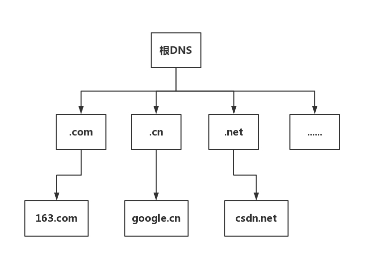
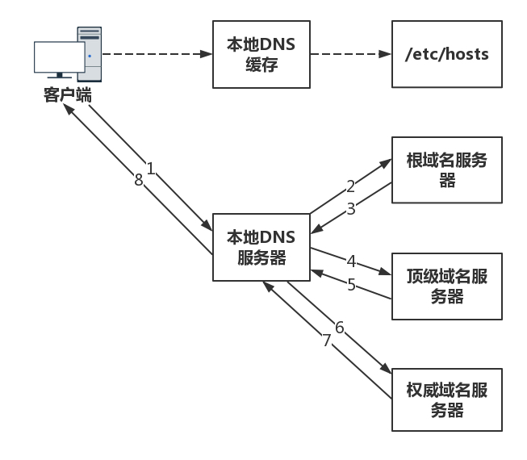
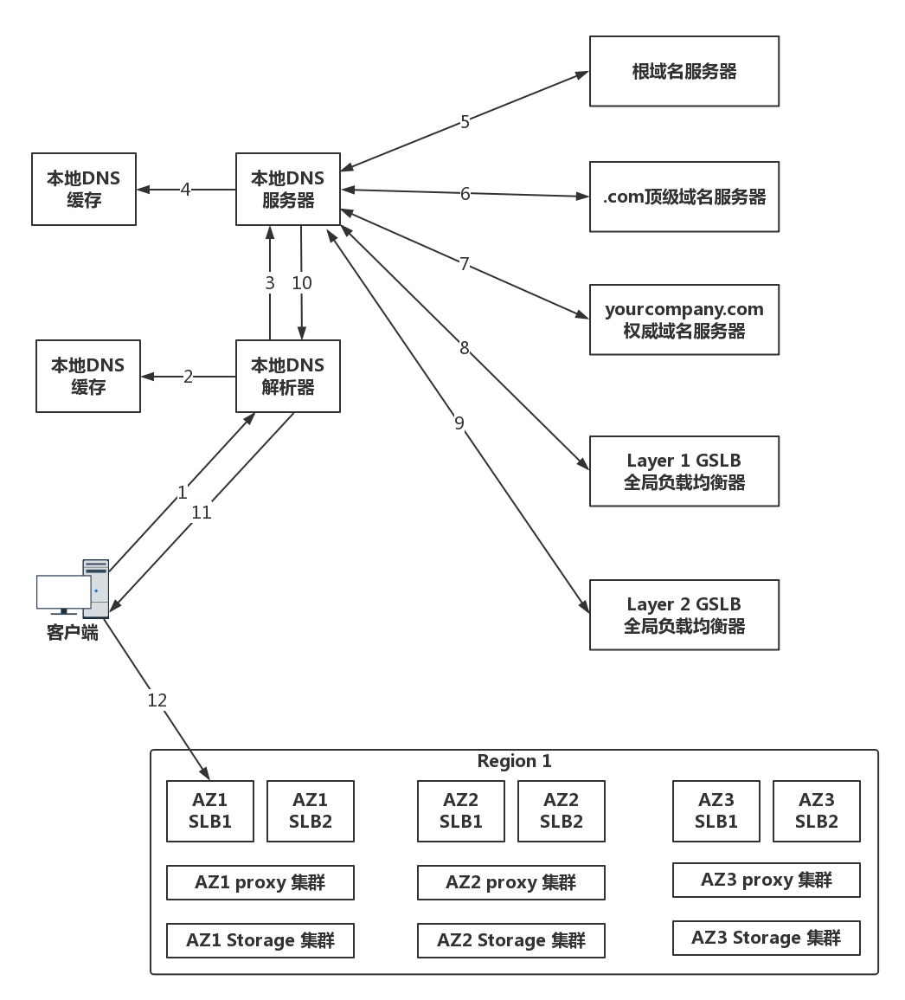
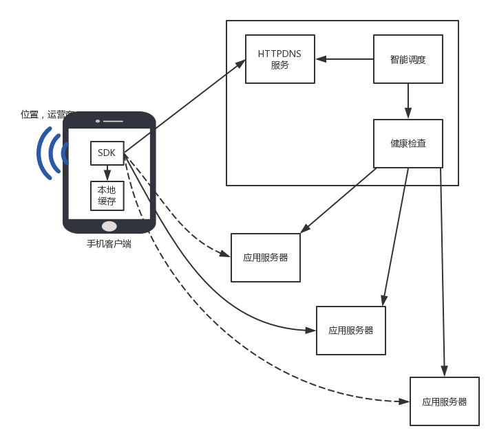
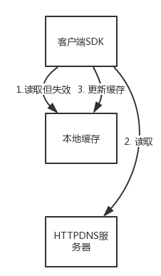
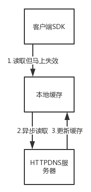
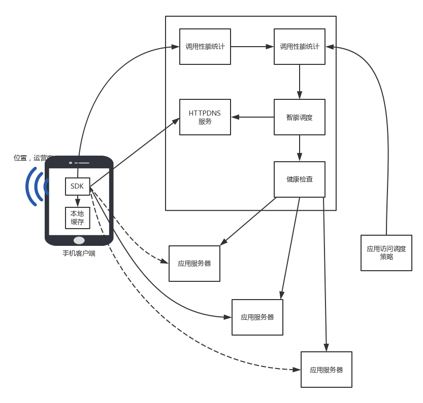

## 从DNS到HTTPDNS 一步一步优化
DNS到HTTPDNS，从静态的缓存策略，到动态缓存策略。<br>
### DNS 网络世界的地址薄 它是一个黄页
DNS(Domain Name System)，使用dig命令，重现DNS查询的过程
```
transCheungdeMacBook-Pro:Desktop transcheung$ dig baidu.com

; <<>> DiG 9.10.6 <<>> baidu.com
;; global options: +cmd
;; Got answer:
;; ->>HEADER<<- opcode: QUERY, status: NOERROR, id: 8291
;; flags: qr rd ra; QUERY: 1, ANSWER: 2, AUTHORITY: 5, ADDITIONAL: 5

;; QUESTION SECTION:
;baidu.com.			IN	A

;; ANSWER SECTION:
baidu.com.		193	IN	A	123.125.115.110
baidu.com.		193	IN	A	220.181.57.216

;; AUTHORITY SECTION:
baidu.com.		6764	IN	NS	ns3.baidu.com.
baidu.com.		6764	IN	NS	ns7.baidu.com.
baidu.com.		6764	IN	NS	ns4.baidu.com.
baidu.com.		6764	IN	NS	ns2.baidu.com.
baidu.com.		6764	IN	NS	dns.baidu.com.

;; ADDITIONAL SECTION:
dns.baidu.com.		45730	IN	A	202.108.22.220
ns2.baidu.com.		45574	IN	A	220.181.37.10
ns3.baidu.com.		45810	IN	A	112.80.248.64
ns4.baidu.com.		46217	IN	A	14.215.178.80
ns7.baidu.com.		46309	IN	A	180.76.76.92

;; Query time: 15 msec
;; SERVER: 211.162.66.66#53(211.162.66.66)
;; WHEN: Fri Mar 01 23:16:44 CST 2019
;; MSG SIZE  rcvd: 229
```

使用`+short`参数能够省略过程，直接检索出结果
```
dig +short baidu.com
220.181.57.216
123.125.115.110
```
#### DNS服务器 对应的IP地址->对应域名
DNS在日常的生活中，每个人上网都要访问，但是同时，它出了故障，整个互联网都将瘫痪。另外，上网的人分布在世界各地，如果大家都去同一个地方访问同一台服务器，时延就会非常大。因而 **DNS服务器，一定要设置成高可用、高并发和分布式的**<br>
于是就有了这样的树状层次结构<br>


* 根DNS服务器(.root): 返回顶级域DNS服务器的IP地址
* 顶级域DNS服务器(.com,.net,.cn,.edu):返回权威DNS服务器的IP地址
* 权威DNS服务器(.baidu,.alibaba,.taobao,.163.com,.google.cn,.csdn.net):返回相应主机的IP地址
* 主机名一般为子域名称，例如https://map.baidu.com中的map,https://image.baidu.com中的image


#### DNS解析流程
为了提高DNS的解析性能，很多网络都会就近部署DNS缓存服务器。<br>



查找过程:本地DNS服务器➡️根域名服务器➡️顶级域名服务器➡️权威DNS服务器(我的域名我做主)➡️权威DNS服务器将对应的IP告诉本地DNS➡️本地DNS将IP返回客户端🔙<br>

#### 负载均衡
**DNS递归查询过程**。DNS除了可以通过名称映射为IP地址，还可以做 **负载均衡**。为什么呢？以找🚾为例，他可能有很多地址，因为在全世界都有，如果一个人要去🚾，可以就近找一家，如果大家都就近找一家🚾，那么这就是负载均衡，如果都去同一家，就爆满🚽<br>
DNS可以做 **内部负载均衡**，通过解析策略，如果一个应用访问一数据库，数据库部署多份，通过配置DNS解析，每次返回的IP不同，对应不同的数据库，就可以做到负载均衡。<br>
DNS可以做 **外部负载均衡**，为了保证高可用，往往部署多个机房，每个机房都有自己的IP地址，当用户访问某个域名的时候，IP地址可以轮询访问多个数据中心，如果一个数据中心挂了，就删掉这个IP地址。
#### 🌰 DNS访问数据中心中对象存储上的静态资源


假设全国有多个数据中心，托管多个运营商，每个数据中心三个可用区(Available Zone)。对象存储通过跨可用区部署，实现高可用性。在每个数据中心中，都至少部署两个内部负载均衡器，内部负载均衡器后面对接多个对象存储的前置服务器(Proxy-server)。<br>

客户端访问一网址➡️访问本地DNS解析器➡️访问本地缓存(有就直接用)➡️(没有)请求本地DNS服务器➡️本地DNS缓存(有就返回，没有就访问根DNS服务器)➡️查找过程继续(上述)<br>

对于不需要做全局负载均衡的简单应用来讲，权威DNS服务器可以直接将域名解析为一个或多个IP地址，客户端通过简单的轮询，实现简单的负载均衡。<br>

而对于复杂的应用，尤其是跨地域跨运营商的大型应用，就需要更加复杂的 **全局负载均衡机制**，因而需要专门的设备或者服务器来做，这就是 **全局负载均衡器(GSLB,Global Server Load Balance)**<br>

例如在acompany.com的DNS服务器中，一般是 **通过配置CNAME的方式**，给object.acompany.com起一个别名，例如object.vip.acompany.com，然后告诉本地DNS服务器，让她请求GSLB解析域名，GSLB就可以在解析这个域名的过程中，通过自己的策略实现负载均衡。<br>

图中有两层GSLB，是因为分运营商和地域。希望不同的运营商的客户，可以访问相同运营商机房中的资源， **这样不跨运营商访问，有利于提高吞吐量，减少时延**<br>

第一层GSLB，通过查看请求它的本地DNS服务器所在的运营商，就知道用户所在的运营商。假设是移动，通过CNAME的方式，通过另一个别名object.yd.acompany.com，告诉本地DNS服务器去请求第二层GSLB。<br>

第二层GSLB，通过查看请求它本地DNS服务器所在地址，就知道用户所在的地理位置，然后将距离用户位置比较近的Region里面，六个 **内部负载均衡(SLB Server Load Balancer)**的地址，返回给本地DNS服务器。<br>

本地DNS服务器将结果返回给本地DNS解析器➡️本地解析器将结果缓存后，返回给客户端➡️客户端开始访问属于相同运营商的距离较近的Region1中的对象存储。(客户端得到6个IP地址，可以通过负载均衡的方式，随机或者轮询选择一个可用区进行访问。)对象存储一般会有三个备份，从而可以实现对存储读写的负载均衡。<br>

### 问题question 域名越多越好吗？
并不是，域名多不一定能缓存方便，域名解析器更多才能让你的缓存散播更广。什么意思？缓存不一定是缓存在本地，要是在域名解析器中，解析出来的主机里的缓存，这样的缓存就更广，访问就更方便。<br>

### HTTPDNS 更新DNS，通过HTTP协议
DNS有两个功能，1⃣️根据名称查到具体地址2⃣️针对多个地址做负载均衡<br>
* **DNS存在域名缓存问题**，每一次缓存都把结果缓存到自己本地，有人访问，直接返回缓存数据，这样陈年的缓存数据一直存放，要是IP地址变了，还是返回这个地址，缓存的数据不一样，这样用户就尴尬了。同时造成全局负载均衡失败，为啥，全局负载均衡是访问最近的地址，但是，因为本地缓存，可能绕远了路呀。
* **域名转发问题**，DNS服务器转发给别的营运商，访问速度慢
* **出口NAT问题**，很多机房都会配置NAT，网络地址转换，使得从这个网关出去的包，都换成新的IP地址，当然这个网关再将IP地址转换回去，对于访问🆗，但是一旦做了地址转换，权威DNS服务器就没法通过这个地址，来判断客户到底是来自哪个运营商，而且极有可能因为转换过后的地址，误判运营商，导致跨运营商访问。
* **域名更新问题**，本地DNS服务器是由不同地区、不同运营商独立部署的。对域名解析缓存的处理上，实现策略也有区别，有的会偷懒， **忽略域名解析结果的TTL时间限制**，在权威DNS服务器解析变更的时候，解析结果在全网生效的周期非常漫长。但是有时候，在DNS的切换中，场景对生效时间要求比较高。例如双机房部署的时候，跨机房的负载均衡和容灾多使用DNS来做。当一个机房出问题之后，需要修改权威DNS，将域名指向新的IP地址，但是如果更新太慢，那很多用户都会出现访问异常。
* **解析延迟问题**，递归遍历耗时多

**HTTPDNS，不走传统路线(DNS解析)，而是自己搭建基于HTTP协议的DNS服务器集群，** 分布在多个地点和多个运营商。当客户端需要DNS解析的时候， **直接通过HTTP协议进行请求这个服务器集群，得到就近的地址。**<br>

这就相当于每家基于HTTP协议，自己实现自己的域名解析，自己做一个自己的地址薄，而不使用统一的地址薄。但是默认的域名解析都是走DNS的， **因而使用HTTPDNS需要绕过默认的DNS路径。** 就不能使用默认的客户端。使用HTTPDNS。往往是手机应用，需要手机端嵌入支持HTTPDNS的客户端SDk。<br>

#### HTTPDNS工作模式
在客户端SDK里动态请求服务端➡️获取HTTPDNS服务器的IP列表➡️缓存到本地。<br>
随着不断地解析域名，SDK也会在本地缓存DNS域名解析的结果。<br>

当手机应用访问一个地址➡️本地缓存➡️HTTPDNS服务器。
请求方式
```
curl http://106.2.xxx.xxx/d?dn=c.m.163.com

{"dns":[{"host":"c.m.163.com","ips":["223.252.199.12"],"ttl":300,"http2":0}],"client":{"ip":"106.2.81.50","line":269692944}}
```
手机📱客户端自然之道手机是哪个运营商、哪个地址。由于是直接的HTTP通信，HTTPDNS服务器能够准确知道这些信息，因而可以做精准的全局负载均衡<br>



##### HTTPDNS 解析速度和更新速度的平衡(缓存设计) 只能调度(调度设计)
1⃣️HTTPDNS缓存设计<br>
解析过程通过HTTP请求。为了提高解析速度，本地也有缓存，缓存是在客户端SDK维护，过期时间以及更新时间，自己控制。<br>
HTTPDNS缓存设计策略，常用缓存设计模式(客户端，缓存，数据源)<br>
* 对于应用架构，应用->Tomcat，缓存->Redis，数据库->MySQL
* 对于HTTPDNS，手机客户端、DNS缓存、HTTPDNS服务器

对于缓存的更新、过期、不一致，根据缓存模式来解决。<br>
例如DNS缓存在内存中，也可以持久化到存储上，从而APP重启之后，能够尽快从存储中加载上次累计的经常访问的网站解析结果，就不需要每次都全部解析一边，再变成缓存。这就像Redis是基于内存的缓存，但是同样提供持久化的能力，使得重启或者主备切换的时候，数据不会完全丢失。<br>

SDK中的缓存会严格按照缓存过期时间，如果缓存没命中，或者已经过期，而且客户端不允许使用过期的记录，则会发起一次解析，保障记录是更新的。<br>

解析可以同步进行，也就是直接调用HTTPDNS的接口，返回最新的记录，更新缓存；也可以异步进行，添加一个解析任务到后台，由后台任务调用HTTPDNS的接口。<br>

**同步更新的优点是实时性好**，缺点是如果有多个请求都发现过期的时候，同时会请求HTTPDNS多次，浪费时间。<br>

Cache-Aside机制



**异步更新的优点是合并一次请求，减少HTTPDNS压力**，同时可以在即将过期的时候，创建一个任务预加载，防止过期之后再刷新，称为 **预加载**。<br>
缺点是，还没请求，客户端开始用了。没有及时更新。<br>


2⃣️HTTPDNS调度设计<br>
由于客户端嵌入了SDK，因为就不会因为本地DNS的各种缓存、转发、NAT，让权威DNS服务器误会客户端所在的位置和运营商，而可以拿到第一手资料💾。<br>
客户端SDK需要收集网络请求数据如错误率、请求时间等网络请求质量数据，并发送给统计后台，进行分析、聚合，以此查看不同的IP的服务质量。<br>
服务端，应用可以通过调用HTTPDNS的管理接口，配置不同服务质量的优先级、权重。HTTPDNS会根据这些策略综合地理位置和路线状况算出一个排序，优先访问当前那些优质的、时延低的IP地址。<br>


HTTPDNS 通过智能调度之后返回的结果，也会缓存在客户端。为了不让缓存使得调度失真，客户端可以根据不同的移动网络运营商WIFI的SSID来分维度缓存，不同的运营商或者WIFI解析出来的结果不同。<br>
