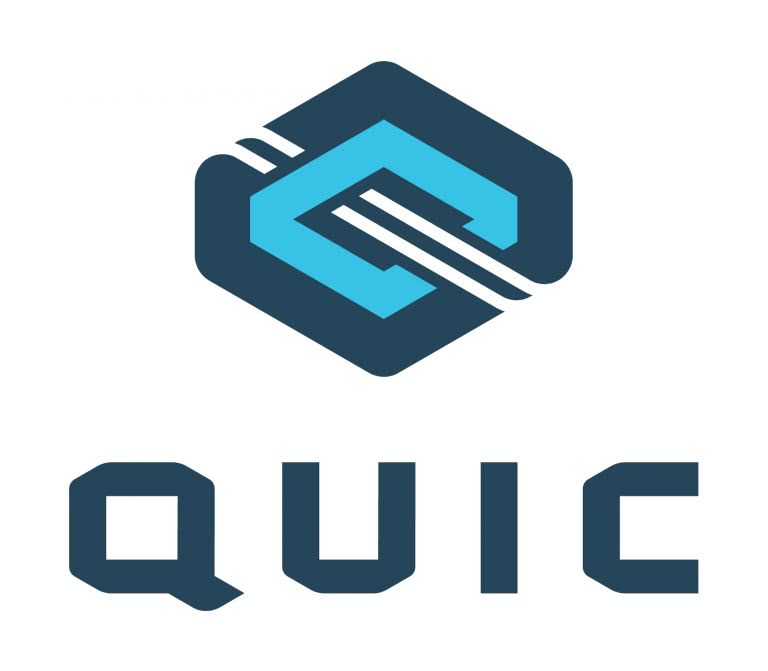
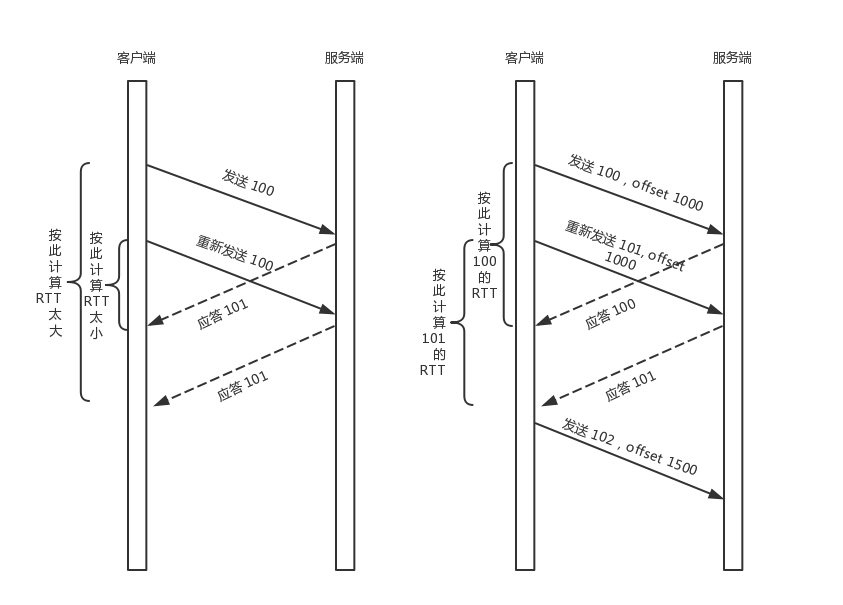
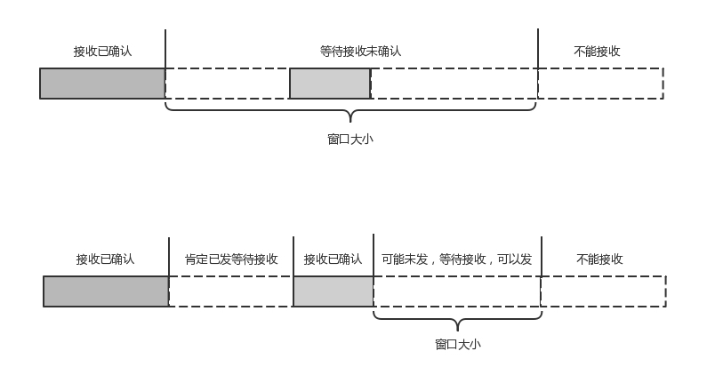

## QUIC协议"城会玩" UDP也是我的主场

HTTP2.0虽然大大增加了并发性，但是还有问题。为什么呢？我们从底层TCP继续看，因为HTTP2.0也是基于TCP协议的，TCP协议在处理包时是有严格的顺序的。其中一个包遇到问题，TCP连接需要等待这个包完成重传之后才能继续进行。虽然，HTTP2.0通过多个stream，使得逻辑上一个TCP连接上的并行内容，并行多路数据的传输，然而中间并没有关联的数据。一前一后，前面stream2的帧没有收到，后面的stream1的帧也会因此阻塞。所以，HTTP2.0基于TCP实现还是要看TCP的可靠工作。贴近TCP报文设计，但还是得遵循TCP的传输规则，丢包还是要重传，响应还是按顺序来响应。 
这就给UDP表现的机会了。
#### 自定义连接机制 UDP报文简单，自定义成为可能
一条TCP连接是由四元组标识(源IP、源端口、目的IP、目的端口)，这个在网络通信是socket的参数。一旦一个元素发生变化时，就需要断开重连，重新连接。在移动互联网的情况下，当手机信号不稳定或者在WIFI和移动网络切换时，都会导致重连，从而进行再次的三次握手🤝，导致一定的时延。 
TCP也没有办法啊，TCP要可靠呀，断了就重连呀。但是基于UDP就不同，QUIC自己的逻辑里面维护连接的机制，不再以四元组标识，而是 **以一个64位的随机数作为ID来标识(聪明)**，而且UDP是无链接的，所以当IP或者端口变化的时候，只要ID不变，就不需要重新建立连接。 
所以UDP接收包，只需要检测ID匹配就行，匹配了就交给自己的应用，不匹配就继续放回数据链路继续吓一跳。 
#### 自定义重传机制 我用UDP，爱咋地就咋地
TCP为了保证可靠性，通过使用序号和应答机制，来解决顺序问题和丢包问题。 
任何一个序号的包发过去，都要在一定的时间内得到应答，否则一旦超时，就会重发这个序号的包。那怎么样才算超时？UDP怎样超时？TCP有 **自适应重传算法**，通过采样往返时间RTT不断调整。但是这个超时的采样存在不准确，例如，发一个包，序号100，发现没有返回，再发一个包100，过一阵返回ACK101。这个时候客户端知道这个包肯定收到了，但是往返时间怎么算？ACK到达时间减去后一个100发送的时间吗？时间算断了，减去前一个100发送的时间呢？时间算长了。 

QUIC也有序列号，递增，比TCP的序列号高级。任何一个序列号的包只发送一次，下次要是在发送就➕1。例如，发一个包100，没返回，再发送就101，如果返回ACK100，就是对第一个包的响应，如果返回ACK101，就是对第二个包的响应，RTT计算就相对准确。 
但是这里就有一个问题了，怎么知道包100和包101发送的是同样的内容呢？QUIC定义了一个offset概念。QUIC既然是面向连接的，就像TCP一样，是一个数据流，发送的数据在这个数据流里面有个偏移量offset，可以通过offset查看数据发送到哪里，这样只要这个offset包没有来，就要重发，如果来了，按照offset拼接，还是能够拼成一个流 

#### 无阻塞的多路复用
有了自定义的连接和重传机制，就可以解决多路复用问题。为什么？和HTTP2.0一样，同一条QUIC连接上可以创建多个stream，来发送多个HTTP请求。但是QUIC是基于UDP的，一个连接上的多个stream之间没有依赖。这样，加入stream2丢了一个UDP包，后面跟着stream3的一个UDP包，虽然stream2的那个包需要重传，但是stream3的包不需要等待，也可以直接发给用户(通过stream2应答，告诉对端需要重传) 
#### 自定义流量控制
TCP流量控制是通过滑动窗口协议。 **QUIC的流量控制也是通过window_update**，来告诉对端他可以接受的字节数。但是QUIC的窗口是适应自己的多路复用机制的，不但在一个连接上控制窗口，还在一个连接中的每个stream控制窗口。 
还记得吗？在TCP协议中，接收端的窗口的起始点是下一个要接收并且ACK的包。即便后来的包都到了，放在缓存里面，窗口也不能右移，因为TCP的ACK机制是基于序列号的累计应答，一旦ACK了一个系列号，就说明前面的都到了，所以只要前面的没到，后面的到了也不能ACK，就会导致后面的到了，也有可能超时重传，浪费带宽。 
而QUIC的ACK是基于offset的，每个offset的包来了，进了缓存，就可以应答，应答后就不会重发，中间的空挡会等待到来或者重发即可，而窗口的起始位置为当前收到的最大的offset，从这个offset到当前的stream所能容纳的最大缓存，是真正的窗口大小。

另外还有整个连接的窗口，需要对于所有的stream的窗口做一个统计。 