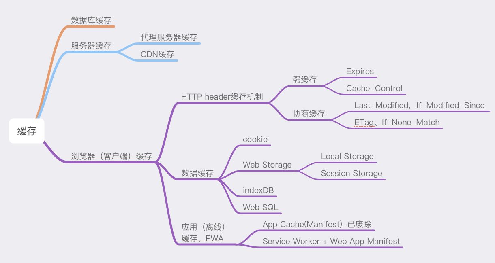
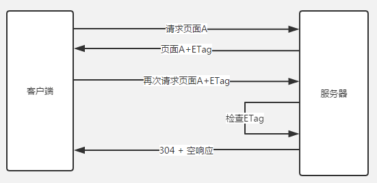
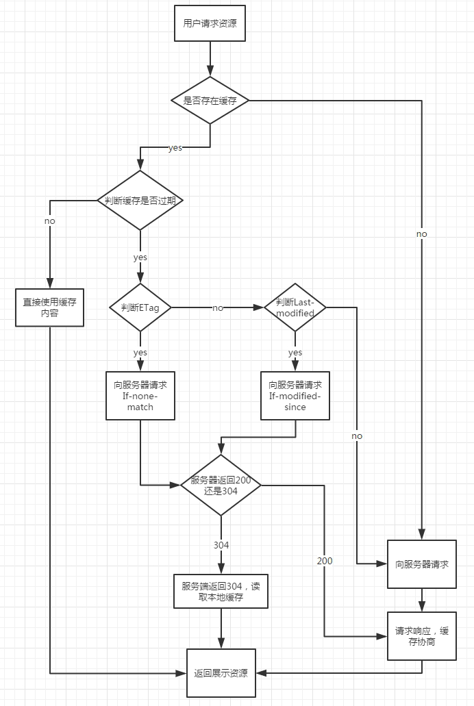
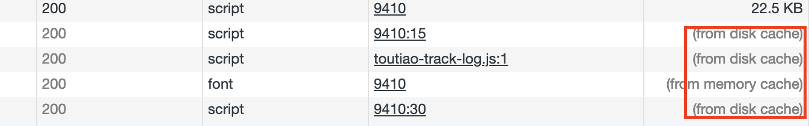
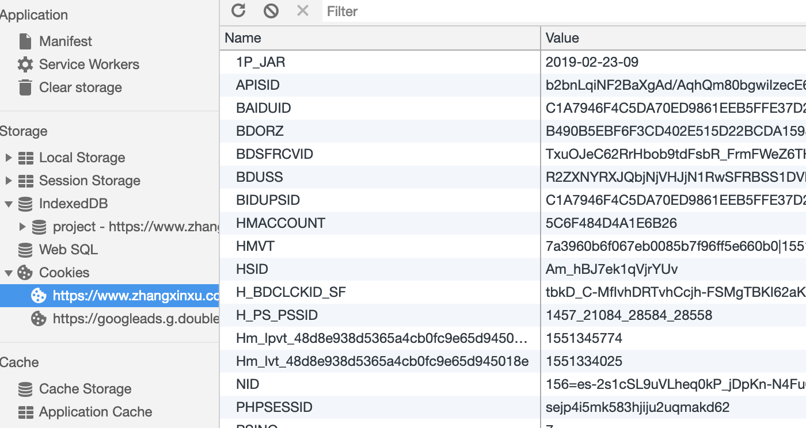

## 缓存总览:从性能优化的角度看缓存 Cache-Control


前面的状态码304说可以直接从本地获取资源，因为返回304代表资源未曾改变，浏览器直接使用本地缓存。我们知道HTTP是渣男，从来不负责任，不保存什么状态，也不会负责记录之前的请求和响应内容。<br>
那浏览器就不能依赖HTTP这个请求来做，浏览器就自己来做缓存。根据响应回来的信息，做记录📝，就是缓存，没错了，接下来就要讲讲这个缓存机制<br>
#### 缓存的作用 重用已获取的资源，减少延迟与网络阻塞，进而减少显示某个资源所用的时间
借助HTTP缓存，Web站点变得具有响应性<br>
其实我们对于页面静态资源的要求就两点
* 静态资源的加载速度
* 页面渲染速度

页面渲染速度建立在资源加载速度之上，但不同类型的加载顺序和实际也会对其产生影响，所以缓存的可操作空间非常大。<br>
缓存的作用很明显，但是对于浏览器缓存机制，是不是也会有区分呢？也就是说，对于缓存机制也会有不同，进而提升性能呢？对，没错。路由器有路由器的策略，让转发的速度可以根据路由策略而控制，性能提高。贪心算法有贪心策略，让性能不至于降低特别多。当然浏览器也会有自己的缓存策略，让自己的性能也不会至于降低。但凡涉及优化性能都会有一个策略。<br>
### 浏览器缓存机制:强缓存、协商缓存
良好的缓存策略可以降低资源的重复加载提高网页的整体加载速度，通常浏览器缓存策略分为两种:一种是强缓存，一种是协商缓存<br>
##### 基本原理
* 浏览器在加载资源的时候，根据请求头的expires和cache-control判断是否命中强缓存，则直接从缓存读取资源，不会发请求到服务器(什么是强缓存？为什么不用发请求？)
* 如果 **没有命中强缓存，浏览器一定会发送一个请求到服务器**，通过last-modified和etag验证资源是否命中协商缓存，如果命中，服务器会将这个请求返回，但是不会返回这个资源的额数据，依然是从缓存中读取资源(304)(协商发送了请求，返回304)
* 如果前面两者都没有命中，直接从服务器加载资源

为什么强缓存没有发送请求呢？
#### 强缓存 Expires与Cache-Control
Expires是http1.0提出的一个表示资源过期时间的header，描述的是一个绝对时间，由服务器返回。这个在前面谈到的实体报文首部字段有论述。Expires受限于本地时间，如果修改了本地时间，可能会造成缓存失效。<br>

```
expires: Tue, 18 Feb 2020 01:18:41 GMT
```
这就是服务器返回正文报文首部字段的expires。是服务器的预计失效时间<br>

Cache-Control出现于HTTP/1.1，优先级高于Expires，表示相对时间

```
cache-control: must-revalidate, max-age=31536000
```
咦？must-revalidate，什么鬼？这时候我们不如先了解一下cache-control整个指令的意义。<br>

##### 通过指定cache-control指令，就能操作缓存的工作机制
指令的参数是可选的，多个指令之间通过","分隔。首部字段Cache-Control指令可用于请求以及响应时。(是个通用首部字段)<br>
```
cache-control: private,must-revalidate, max-age=31536000
```

cache-control指令一览表<br>

缓存请求指令<br>

指令|参数|说明
|--|--|--|
no-cache|无|强制向源服务器再验证
no-store|无|不缓存请求或响应的任何内容
max-age=s|必须|响应的最大Age值
max-stale=s|可省略|接收已过期的响应
min-fresh=s|必须|期望在指定时间内的响应仍有效
no-transform|无|代理不可更改媒体类型
only-if-cached|无|从缓存获取资源
cache-extension|-|新指令标记(token)

缓存响应指令<br>

指令|参数|说明
|--|--|--|
public|无|可向任意方提供响应的缓存
private|可省略|仅向特定用户返回响应
no-cache|可省略|缓存前必须先确认其有效性
no-store|无|不缓存请求或响应式的任何内容
no-transform|无|代理不可更改媒体类型
must-revalidate|无|可缓存但必须再向源服务器进行确认
proxy-revalidate|无|要求中间缓存服务器对缓存的响应有效性再进行确认
max-age=s|必须|响应的最大Age值
s-maxage=s|必须|公共缓存服务器响应的最大Age值
cache-extension|-|新指令标记(token)

* 对于no-cache我有话说，no-cache，emmm，并不是说不会缓存到数据到本地，而是可以存储在本地缓存区中。只是与原始服务器进行新鲜度再验证之前，缓存不能将其提供给客户端使用。因此上面的表单中也说到，强制向源服务器再验证。<br>
* public，可以被多用户共享，包括终端，CDN等中间代理服务器。<br>
* private，只能被终端浏览器缓存，私有的，不允许中继缓存服务器进行缓存<br>

以上就是强缓存，其实就是通过cache-control的缓存指令，设立缓存策略，这个强缓存就是将缓存保存再本地，强制计算时间是否过期，要是没有就在本地取资源。<br>

#### 协商缓存 Last-Modified,If-Modified-Since和Etag,If-None-Match管理
前面提高过增强校验，在返回206的状态下，验证文件是否过期。其实这也是协商缓存的一部分。当浏览器对某个资源没有命中强缓存，也就是，时间过期，就会发送一个请求到服务器，验证协商的缓存是否命中，如果命中，返回304，Not Modified。所以协商缓存，重点在协商。<br>

##### Last-Modified、If-Modified-Since
Last-Modified表示本地文件最后修改日期，浏览器会在request header加上If-Modified-Since(上次返回Last-Modified的值)，询问服务器在该日期后资源是否有更新，有更新就将新的资源发送回来，没有，就继续用本地缓存文件。但是， **如果在本地打开缓存文件，就会造成Last-Modified被修改，所以为了避免这种情况，HTTP/1.1出现Etag**<br>
##### ETag、If-None-Match
ETag就是资源的唯一标识，就像个指纹，资源变化就会导致ETag变化，跟最后修改时间没有关系，ETag可以保证每一个资源唯一。但是如果你打开了资源，修改了，也会导致ETag改变。<br>
If-None-Match的header会将上次返回的Etag发送给服务器，询问该资源的Etag是否有更新，有变动就会发送新的资源回来<br>
那么手动更改缓存文件，导致Last-Modified修改，就会让客户端认为这个文件已经被修改了看，就重新GET。<br> TODO:



ETag的优先级比Last-Modified更高<br>

具体为什么要用ETag
* 一方面，一些文件可能会周期性修改，而他的内容并不改变，这时候我们不希望ETag认为这个文件被修改了，而重新GET
* 修改频繁，而If-Modified-Since只能检查到的粒度是s级，这种修改没有办法判断啦
* 某些服务器不能精确得到文件的最后修改时间



##### 状态码200与304
200 表示强缓存Expires/Cache-Control失效，返回新的资源文件<br>
200(from cache):强缓存Expires/Cache-Control两者都有，为国企，Cache-Control
优先Expires时，浏览器获取本地资源<br>
304(Not Modified):协商缓存Last-Modified/Etag未过期，服务端返回状态码304<br>

但是现在改成这样，磁盘(from disk cache)和内存(memory cache)两种<br>


两种缓存策略要配合使用，如果不用强缓存，协商缓存没有什么意义，大部分web服务器都默认开启协商缓存同时启用【Last-Modified，If-Modified-Since】和【ETag、If-None-Match】<br>

* 分布式系统里的多台机器的文件的Last-Modified必须保持一直，以免负载均衡到不同机器导致比对失效
* 分布式系统尽量关掉ETag(没太机器生成的Etag都会不太一样)

ok👌，缓存我们了解了，那么缓存，缓存，缓存在哪里呢？拿东西也要找个地方拿撒<br>
### 浏览器的数据库
存储的数据可能是从服务端获取到的数据，也可能是在多个页面中需要频繁使用到的数据<br>
* cookie: 一个cookie不超过4k，每个网站不超过20个cookie，所有网站cookie总和不超过300个
* localStorage:5M，除非手动清除，否则一直存在
* sessionStorage:5M，不可以跨标签访问，页面关闭就清理
* indexedDB:浏览器端数据库，无限容量，除非手动清除，否则一直存在

#### 聊聊cookie


> Cooke通过客户端记录信息确定用户身份
> Session通过在服务器端记录信息来确定用户身份

cookie存储在客户端的Cookies文件夹内📁(物理位置)<br>
cookie存储的类型限制是字符串(类型限制🚫)<br>
当前请求上下文，上下文都能访问Cookie，Cookie对每个用户来说都是独立的(状态使用范围)<br>
每个cookie都有自己的过期时间，超过过期时间就会失效(生命周期)<br>
存储在客户端，安全性差，对于敏感数据建议加密🔐后存储(安全与性能)<br>
可以方便地管理网站和用户，长久保存用户设置<br>
以上是cookie的总结点，那么cookie存储的结构是什么呢？Key-Value结构，多个key用"&"连接。<br>
要好好了解一下cookie，我们带着一个问题去看。 **浏览器禁止cookie时，服务器与客户端浏览器能否保持session连接❓**<br>
鉴于这个问题，我们来看看这两对报文<br>
第一次请求
```
Http request:

GET /cluster/index.jsp HTTP/1.1

Accept: image/gif, image/jpeg, image/pjpeg, image/pjpeg, application/x-shockwave-flash, application/vnd.ms-excel, application/vnd.ms-powerpoint, application/msword, application/x-ms-application, application/x-ms-xbap, application/vnd.ms-xpsdocument, application/xaml+xml, */*

Accept-Language: zh-cn

User-Agent: Mozilla/4.0 (compatible; MSIE 8.0; Windows NT 5.1; Trident/4.0; InfoPath.2; CIBA; .NET CLR 2.0.50727; .NET CLR 3.0.04506.648; .NET CLR 3.5.21022)

Accept-Encoding: gzip, deflate

Host: localhost:8080

Connection: Keep-Alive
```
第一次响应返回
```
Http response:

HTTP/1.1 200 OK

Server: Apache-Coyote/1.1

Set-Cookie: JSESSIONID=4918D6ED22B81B587E7AF7517CE24E25.server1; Path=/cluster

Content-Type: text/html;charset=ISO-8859-1

Content-Length: 377

Date: Tue, 02 Mar 2010 02:58:32 GMT
```
当第一次请求一个网址时的请求和响应消息，客户端没有该网址的cookie，首先看response消息，我们看到一个Set-cookie，这行其实就是在告诉客户端浏览器，把这一段cookie保存下来，根据cookie的存活时间，这段cookie信息有可能只存在在内存中，也可能保存在文件中。<br>

在这里我插一段set-cookie的属性值的说明

属性|说明
|--|--|
NAME=VALUE|赋予Cookie的名称和其值(必须项)
expires|Cookie的有效期(若不明确指明，则默认浏览器关闭前为止)
path=PATH|将服务器上的文件目录作为Cookie得到适用对象(若不能指定则默认为文档的所在文件目录)
domain=域名|作为Cookie适用对象的域名(若不指定则默认为创建cookie的服务器域名)
secure|仅在HTTPS安全通信时才会发送Cookie
HttpOnly|加以限制，使Cookie不能被JS脚本访问 安全🔐防止跨站攻击
Max-Age|在cookie失效之前需要经过的秒数


下面👇进行第二次请求和响应

```
Http request:

GET /cluster/user_details.jsp HTTP/1.1

Accept: image/gif, image/jpeg, image/pjpeg, image/pjpeg, application/x-shockwave-flash, application/vnd.ms-excel, application/vnd.ms-powerpoint, application/msword, application/x-ms-application, application/x-ms-xbap, application/vnd.ms-xpsdocument, application/xaml+xml, */*

Accept-Language: zh-cn

User-Agent: Mozilla/4.0 (compatible; MSIE 8.0; Windows NT 5.1; Trident/4.0; InfoPath.2; CIBA; .NET CLR 2.0.50727; .NET CLR 3.0.04506.648; .NET CLR 3.5.21022)

Accept-Encoding: gzip, deflate

Host: localhost:8080

Connection: Keep-Alive

Cookie: JSESSIONID=4918D6ED22B81B587E7AF7517CE24E25.server1
```
客户端包含了Cookie的值，放在HTTP请求报文中发送给服务器

```
Http response

HTTP/1.1 200 OK

Server: Apache-Coyote/1.1

Set-Cookie: JSESSIONID=4918D6ED22B81B587E7AF7517CE24E25.server1; Expires=Tue, 02-Mar-2010 22:15:38 GMT

Content-Type: text/html

Content-Length: 252

Date: Tue, 02 Mar 2010 05:35:38 GMT
```
服务器响应同样的内容。那么这两个报文告诉我们什么呢？一个用户的所有请求操作都应该属于同一个会话，而另一个用户的所有请求操作都属于另一个会话。我们知道HTTP是一个渣男，无状态的协议，一旦数据交换完毕，客户端和服务器端的连接就会关闭，再次交换新的数据就需要建立新的连接🔗。这就意味着服务器端无法从连接上跟踪会话，那怎么着？只能靠cookie。客户端请求服务器，如果需要记录该用户状态，就是用response向客户端颁发一个Cookie。客户端浏览器会把Cookie保存起来。当浏览器再请求该网站时，就会把请求的网址和Cookie一同提交给服务端。这时候，服务端检查Cookie，辨别用户的状态，服务器还可以根据需要修改Cookie的内容。<br>
cookie的内容主要包括:名字，值，过期时间，路径和域名<br>

##### session机制
session是另一种记录客户状态的机制，与不同的是Cookie保存在客户端浏览器中，而Session保存在服务器上。他也是为了无状态的协议实现状态记录📝，客户端浏览器在访问服务器的时候，服务器把客户端信息以某种形式记录在服务器上，什么形式呢？也是键值对的形式，但是可能还需要计算，也有过期时间。客户端浏览器再次访问时只需要从该Session中查找该客户的状态即可。<br>
所以JSESSIONID和真实的session对象之间的关联关系，而这个JSESSIONID字符串就是通过http协议的cookie功能实现的。<br>

那么，在浏览器禁用cookie时，会发生什么呢？无非就是cookie没有了呗，第二次请求就不会发送cookie的信息了呗。那么服务器就会认为这个请求是一个新的请求，又创建一个服务器session...如此循环♻️往复。<br>
那么，能保持session连接吗？如果按上面的来说，就是不能保持，但是有方法实现吗？很多种形式，只要服务器认你这个token即可，例如可以通过URL传，可以通过indexdb传，可以通过request body传，只要服务器可以认得，就能保证你的客户端的状态。<br>
这样就能保持session状态连接。<br>

#### Storage:localStorage、sessionStorage
* 大小:官方建议5M存储空间
* 类型:只能操作字符串，在存储之前应该使用JSON.stringfy()方法先进行一步安全转换字符串，取值时在用JSON.parse()方法再转换一次
* 存储的内通:数字，图片，json，样式，脚本...
* ⚠️数据时明文存储，毫无隐私性可言，绝对不能用于存储敏感信息
* 区别:sessionStorage临时存储在sesssion中，浏览器关闭，数据随之小事，localStorage将数据存储在本地，理论上一直有
*
另，不同浏览器无法共享localStorage和sessionStorage中的信息。同一浏览器的相同域名和端口的不同页面📃间可以共享相同localStorage，但是不同页面间无法共享sessionStorage的信息<br>

```js
// 保存数据
localStorage.setItem( key, value );
sessionStorage.setItem( key, value );
// 读取数据
localStorage.getItem( key );
sessionStorage.getItem( key );
// 删除单个数据
localStorage.removeItem( key ); 
sessionStorage.removeItem( key );
// 删除全部数据
localStorage.clear( ); 
sessionStorage.clear( );
// 获取索引的key
localStorage.key( index ); 
sessionStorage.key( index );
```
##### 监听Storage事件
可以通过监听window对象的storage事件并指定其事件处理函数，当页面中对localStorage或sessionStorage进行修改时，会触发对应的处理函数
```js
window.addEventListener('storage',function(e){
   console.log('key='+e.key+',oldValue='+e.oldValue+',newValue='+e.newValue);
})
/***
* 触发事件的时间对象（e 参数值）有几个属性：
* key : 键值。
* oldValue : 被修改前的值。
* newValue : 被修改后的值。
* url : 页面url。
* storageArea : 被修改的 storage 对象。
***/
```
#### indexedDB
[张鑫旭博客indexedDB可以了解了解](https://www.zhangxinxu.com/wordpress/2017/07/html5-indexeddb-js-example/)

**1⃣️打开数据库**<br>
```js
var DBOpenRequest = window.indexedDB.open(dbName,version);
```
打开数据库的结果是，有可能触发4种事件<br>
* success，error，upgradeneeded第一次打开该数据库，或者数据库版本发生变化，blocked上一次数据库连接还未关闭

第一次打开数据库时，会先触发upgradeneeded事件，然后触发success事件
```js
var openRequest = indexedDB.open("test",1);
var db;
// open返回一个对象，回调函数会定义在这个对象之上

openRequest.onupgradeneeded = function(e) {
    console.log("Upgrading...");
}
// 回调函数接受一个事件对象event作为参数
 
openRequest.onsuccess = function(e) {
    console.log("Success!");
    db = e.target.result; // target.result属性就指向打开的indexedDB数据库
}
 
openRequest.onerror = function(e) {
    console.log("Error");
    console.dir(e);
}
```
**2⃣️创建一个数据库存储对象**<br>
```js
var objectStore = db.createObjectStore(dbName, { 
        keyPath: 'id',
        autoIncrement: true
    });
    // objectStore是一个重要对象，可以理解为存储的对象
    // objectStore.add()可以向数据库添加数据，objectStore.delete()删除数据，objectStore.clear()可以为空，objectStore.put()可以替换数据

    objectStore.createIndex('id', 'id', {
        unique: true    
    });
    // objectStore创建数据库的主键和普通字段
    objectStore.createIndex('name', 'name');
    objectStore.createIndex('begin', 'begin');
    objectStore.createIndex('end', 'end');
    objectStore.createIndex('person', 'person');
    objectStore.createIndex('remark', 'remark');
```
**3⃣向indexedDB添加数据**<br>
数据库的操作都是基于事务(transaction)来进行，无论是添加编辑还是删除数据库，都要先建立一个事务(transaction)，才能继续下面的操作<br>

```js
// 新建一个事务
var transaction = db.transaction('project', "readwrite");
// 打开存储对象
var objectStore = transaction.objectStore('project');
// 添加到数据对象中
objectStore.add(newItem);
newItem={
  "name": "第一个项目",
  "begin": "2017-07-16",
  "end": "2057-07-16",
  "person": "张鑫旭",
  "remark": "测试测试"
}
```
**4⃣️indexedDB数据库的获取**<br>
indexedDB数据库的获取使用Cursor APIs和Key Range APIs。也就是使用“游标API”和“范围API”，具体使用可以去看文档<br>
游标🌰

```js
var objectStore = db.transaction(dbName).objectStore(dbName);
objectStore.openCursor().onsuccess = function(event) {
    var cursor = event.target.result;
    if (cursor) {
        // cursor.value就是数据对象
        // 游标没有遍历完，继续
        cursor.continue();
    } else {
        // 如果全部遍历完毕...
    }
}
```
例如查询范围
```js
// 确定打开的游标的主键范围
var keyRangeValue = IDBKeyRange.bound(4, 10);
// 打开对应范围的游标
var objectStore = db.transaction(dbName).objectStore(dbName);
objectStore.openCursor(keyRangeValue).onsuccess = function(event) {
    var cursor = event.target.result;
    // ...
}
```
其中，有bound(), only(), lowerBound()和upperBound()这几个方法，意思就是方法名字面意思，“范围内”，“仅仅是”，“小于某值”和“大于某值”。<br>

方法最后还支持两个布尔值参数，例如：
```js
IDBKeyRange.bound(4, 10, true, true)
```
取范围3-9，也就是true的时候，不能与边界相等<br>

好了，到这里，localStorage是键值永久保存在本地，sessionStorage是键值临时保存存储在session，关掉浏览器就没了，indexedDB能永久存储支持数据结构比较复杂的存储。

#### localStorage，sessionStorage和cookie的区别
共同点：都是保存在浏览器端、且同源的<br>
区别：
* cookie数据始终在同源的http请求中携带（即使不需要），即cookie在浏览器和服务器间来回传递，而sessionStorage和localStorage不会自动把数据发送给服务器，仅在本地保存。cookie数据还有路径（path）的概念，可以限制cookie只属于某个路径下

* 存储大小限制也不同，cookie数据不能超过4K，同时因为每次http请求都会携带cookie、所以cookie只适合保存很小的数据，如会话标识。sessionStorage和localStorage虽然也有存储大小的限制，但比cookie大得多，可以达到5M或更大

* 数据有效期不同，sessionStorage：仅在当前浏览器窗口关闭之前有效；localStorage：始终有效，窗口或浏览器关闭也一直保存，因此用作持久数据；cookie：只在设置的cookie过期时间之前有效，即使窗口关闭或浏览器关闭

* 作用域不同，sessionStorage不在不同的浏览器窗口中共享，即使是同一个页面；localstorage在所有同源窗口中都是共享的；cookie也是在所有同源窗口中都是共享的

* web Storage支持事件通知机制，可以将数据更新的通知发送给监听者

* web Storage的api接口使用更方便

通过缓存机制，实现离线开发，也是可能的。通过缓存机制，实现负载均衡也是可能的。后面会持续讲到CDN的，这节只是讲了静态资源的缓存，后面会持续讲解。<br>