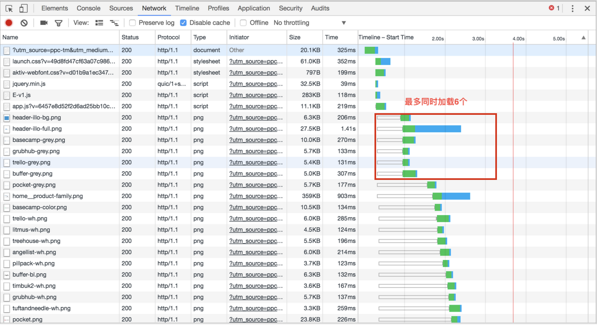
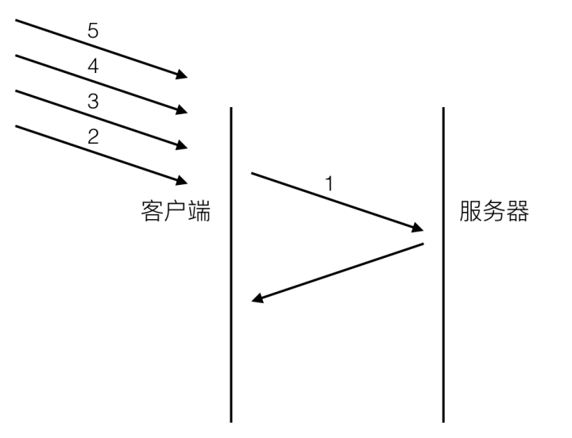
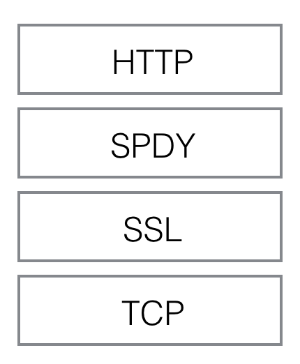
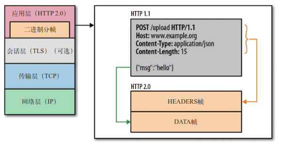
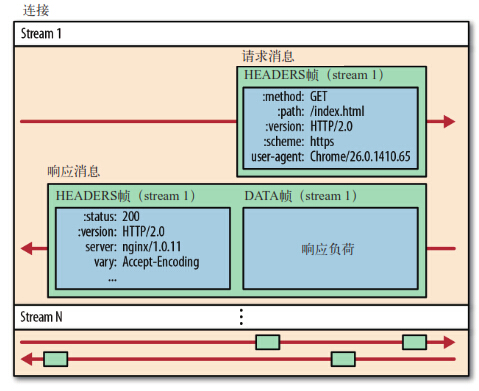
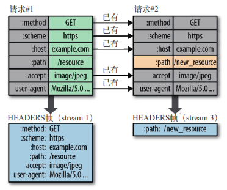
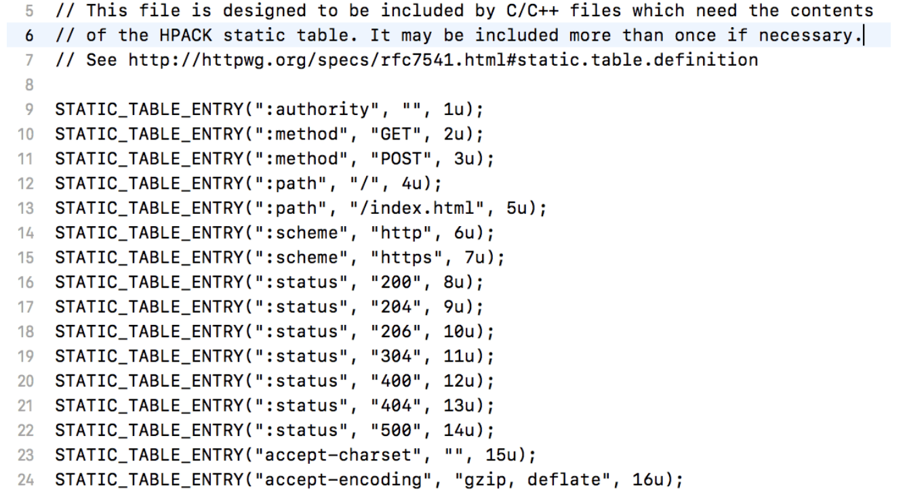
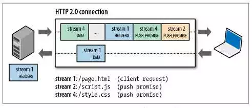
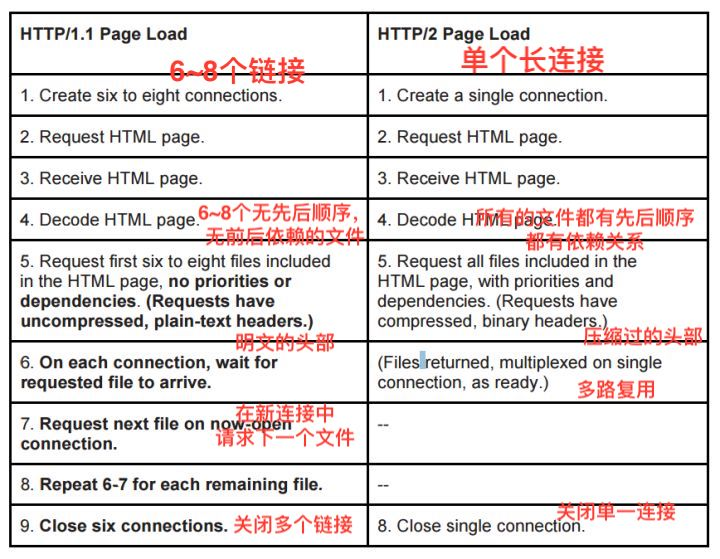

## HTTP2.0 基于流的传输 忍受够了等待
HTTP1.1是一个渣男，那HTTP2.0是不是呢？是的，也一样，同一个家族的怎么就不是了呢？那HTTP2.0怎样，更渣，同时撩好几个。<br>
HTTP协议在不断滴进化，演化到现在就有了HTTP2.0，HTTP1.1在应用层上以纯文本的形式进行通信。每次通信都要带完整的HTTP头，而且不考虑pipeline模式的话，每次一去一回，这样实时性、并发性都会存在问题。<br>
HTTP2.0进化级别渣男！在二进制帧、多路复用、请求优先级、流量控制、服务器端推送以及首部压缩🗜️等新改进。比HTTP1.1更快，秒男！为了吸引注意力，也是够牛掰滴<br>
HTTP协议站在(巨人的肩膀上)TCP协议之上，TCP作为传输层其实离应用层不愿。HTTP协议的瓶颈及其优化技巧都是基于TCP协议本身的特性。比如， **TCP建立连接时三次握手会有1.5个RTT(round-trip time)延迟**，为了避免每次都经历握手🤝带来的延迟，长链接(keep Alive)是一种方案。HTTP1.0被抱怨最多的就是 **连接无法复用**和 **head of line blocking**，产生两个问题的前提是客户端依据域名来向服务器建立连接，一般PC端浏览器会针对单个域名的server同时建立6～8个连接(考虑服务器的端口数量和线程切换开销的考虑，8个以内最适合[参考文章](https://blog.csdn.net/yishouwangnian/article/details/52788626?utm_source=blogxgwz8))，手机端的连接数则一般控制在4～6个。显然连接数并不是越多越好，因为资源的开销和整体延迟都会随之增大。<br>


**连接无法复用**会导致每次请求都经历三次握手和慢启动。三次握手在高延迟的场景下影响较明显，慢启动则对文件类大请求影响较大。<br>
**head of line blocking** 会导致带宽无法被充分利用，以及后续请求被阻塞。假设有5个请求同时发出，如下图：<br>


对于HTTP1.0的实现，在第一个请求没有受到回复之前，后续从应用层发出的请求只能排队，只有等1 response回来之后，才能逐个发出。网络畅通的时候性能影响不大，一旦请求1的request因为丢包或者超时等问题没有抵达服务器，或者response因为网络阻塞没回来，影响的就是所有后续请求了。<br>
* 解决连接无法复用有几种方案，分别是基于TCP长连接，http long-polling，http-streaming，web socket。但是这几种方案也有各自的缺陷<br>

* 解决head of line blocking的方案是http pipelining多路并行，但这种方案只适用于http1.1，而且只有幂等请求(GET、HEAD)能使用，非幂等POST就不行，因为请求关系可能会有先后依赖，response还要依次返回，遵循FIFO原则，[pipeling问题描述](https://www.chromium.org/developers/design-documents/network-stack/http-pipelining)<br>

#### SPDY开拓者，但只是google的玩具
HTTP2.0是以SPDY为原型进行讨论和标准化的。SPDY的目标就瞄准了HTTP1.x的痛点，延迟和安全性🔐。安全性是因为http是明文协议，安全性一直被业界诟病。



SPDY位于HTTP之下，TCP和SSL之上，这样可以兼容老版本的HTTP协议，同时使用已有的SSL功能。SPDY功能可以分为基础功能和高级功能，基础功能默认启动，高级功能手动启动<br>

**SPDY基础功能**<br>
* 多路复用（multiplexing）。多路复用通过多个请求stream共享一个tcp连接的方式，解决了http1.x holb（head of line blocking）的问题，降低了延迟同时提高了带宽的利用率。
* 请求优先级（request prioritization）。多路复用带来一个新的问题是，在连接共享的基础之上有可能会导致关键请求被阻塞。SPDY允许给每个request设置优先级，这样重要的请求就会优先得到响应。比如浏览器加载首页，首页的html内容应该优先展示，之后才是各种静态资源文件，脚本文件等加载，这样可以保证用户能第一时间看到网页内容。
* header压缩。前面提到过几次http1.x的header很多时候都是重复多余的。选择合适的压缩算法可以减小包的大小和数量。SPDY对header的压缩率可以达到80%以上，低带宽环境下效果很大。

**SPDY高级功能**<br>
* server推送（server push）。http1.x只能由客户端发起请求，然后服务器被动的发送response。开启server push之后，server通过X-Associated-Content header（X-开头的header都属于非标准的，自定义header）告知客户端会有新的内容推送过来。在用户第一次打开网站首页的时候，server将资源主动推送过来可以极大的提升用户体验。
* server暗示（server hint）。和server push不同的是，server hint并不会主动推送内容，只是告诉有新的内容产生，内容的下载还是需要客户端主动发起请求。server hint通过X-Subresources header来通知，一般应用场景是客户端需要先查询server状态，然后再下载资源，可以节约一次查询请求。

SPDY从2012年诞生到2016年就停止维护了，时间跨度对于网络协议来说非常短。但是取得的成绩非常好。对于页面加载同比http1，x减少64%，丢包率也降低了(由于对header压缩有80%以上，整体包能减少大概40%，包少，丢的也少)，带宽延迟减小(一般RTT越大，延迟越大，在高RTT的场景下，由于SPDY的request是并发进行的，对包的利用率高，反而能更明显减小总体延迟)，这都足以让他称霸一时。<br>

讲了那么多历史，接下来开始讲讲HTTP2.0<br>
### HTTP2.0 业界的焦点
HTTP2.0协议到底提高了哪些方面。首先要清楚一点，HTTP2.0较于SPDY并没有SSL层和TLS层，HTTP2.0并没有做安全的套件。为什么？其实加上也是可以的啊，所以如果只是担心一个多余的RTT延迟，就不用SSL，请求的成功率就不高，所以如果HTTP2.0加上SSL，被封装的request就不会被监听和修改，请求的成功率自然上升🔝<br>
那么HTTP2.0到底提高了哪些方面？新的二进制格式(Binary Format)，连接共享，header压缩🗜️，压缩算法的选择，重置连接表现更好，Server Push，流量控制，Nagle Algorithm与TCP Delayed Ack，更安全的SSL。<br>
#### 新的二进制格式 帧让一切变得简洁
HTTP2.0性能增强的核心在于新增的二进制分帧层，定义了如何封装HTTP消息并在客户端与服务器之间传输。



那么每个帧又是怎么定义呢？


上图对比了HTTP1.x以文本格式为基础和http2.0类似tcp/ip这种二进制帧为基础的不同。

帧的格式


http2.0的格式定义更接近于TCP层的方式。length定义了整个frame的长度，type定义了frame的类型(一共10种)，flags用bit位定义一些重要的参数，stream id用作流的控制，payload就是request的正文部分。<br>

名称 类型|帧代码|作用
|--|--|--| 
DATA | 0x0 | 一个或多个DATA帧作为请求、响应内容载体
HEADERS | 0x1 | 报头主要载体，请求头或响应头，同时呢也用于打开一个流，在流处于打开"open"或者远程半关闭"half closed (remote)"状态都可以发送。
PRIORITY | 0x2 |表达了发送方对流优先级权重的建议值，在流的任何状态下都可以发送，包括空闲或关闭的流。
RST_STREAM|0x3|表达了发送方对流优先级权重的建议值，任何时间任何流都可以发送，包括空闲或关闭的流。
SETTINGS | 0x4| 设置帧，接收者向发送者通告己方设定，服务器端在连接成功后必须第一个发送的帧。
PUSH_PROMISE|0x5|服务器端通知对端初始化一个新的推送流准备稍后推送数据
PING|0x6|优先级帧，发送者测量最小往返时间，心跳机制用于检测空闲连接是否有效。
GOAWAY|0x7|一端通知对端较为优雅的方式停止创建流，同时还要完成之前已建立流的任务。
WINDOW_UPDATE|0x8|流量控制帧，作用于单个流以及整个连接，但只能影响两个端点之间传输的DATA数据帧。但需注意，中介不转发此帧。
CONTINUATION|0x9|用于协助HEADERS/PUSH_PROMISE等单帧无法包含完整的报头剩余部分数据

针对不同类型的资源，HTTP2进行了不同程度的优先传输。例如页面传输中，script和link会被优先传输，类似图片这种大文件。优先级降低<br>

实际上http2.0并没有改变http1.x的语义，只是把原来http1.x的header和body部分用frame重新封装了一层而已。调试的时候浏览器甚至会把http2.0的frame自动还原成1.x的格式。所以不需要担心调试。<br>

#### 连接共享 HTTP2.0所有通信都在一个连接上完成，这个连接可以承载任意数量的双向数据流
http2.0要解决的一大难题就是多路复用(MultiPlexing)。stream id就是用作连接共享机制的。一个request对应一个stream并分配一个id，这样一个联机上可以有多个stream，每个stream的frame可以随机的混杂在一起，接收方可以根据stream id将frame再归属到各自不同的request里面。<br>
前面提到过连接共享之后，需要优先级和请求依赖的机制配合才能解决关键请求被阻塞的问题。HTTP2.0里的每个stream都可以设置有优先级和依赖。优先级高的stream会被server优先处理和返回给客户端，stream还可以依赖其他的sub streams。优先级和依赖都是可以动态调整的。动态调整在有些场景下很有用，假想用户在用你的app浏览商品的时候，快速的滑动到了商品列表的底部，但前面的请求先发出，如果不把后面的请求优先级设高，用户当前浏览的图片要到最后才能下载完成，显然体验没有设置优先级好。同理依赖在有些场景下也有妙用。<br>

再详细到流，消息和帧<br>
* 流，已经建立再连接上的双向字节流
* 消息，与逻辑消息对应的完整的一系列数据帧
* 帧，HTTP2.0通信的最小单位，每个帧包含帧首部， **至少也会标识出当前帧所属的流**

每个数据流以消息的形式发送，而消息由一或多个帧组成，这些帧可以乱序发送，然后根据每个帧首部的流标识符重新组装。<br>


HTTP2.0把HTTP协议通信的基本单位缩小为一个一个帧，这些帧对应着逻辑流中的消息，相应地，很多流可以并行地在同一个TCP连接上交换消息。<br>

#### header压缩 压缩首部元数据
两端既然都知道首部的值，就不用重复发送了，也压缩🗜️成一个简单的帧发送。<br>


请求的第一个流已经有了header帧，在连接的时候已经有了首部的信息帧，所以可以针对之前的首部数据只编码发送差异的数据帧。<br>
如图的请求1，path:/resource与请求2，path:/new_resource，在不同的流，只编码有差异的数据。<br>
那，为什么一定要压缩呢？为了性能的提高，可以，但是还有其他解释吗？我们知道TCP的MTU最大传输但愿是1500个字节一个segment，当发送的包超过2个segment或者4k大小，就会导致网络节点阻塞，延迟，丢包率就高了，而http的header有可能会膨胀到这个超过这个大小，所以压缩。<br>

##### 压缩算法的选择 HPACK
[HPACK](https://http2.github.io/http2-spec/compression.html)点击参考header压缩算法选择<br>
具体将报文头中常见的一些字段变成一个索引值index，维护一张静态索引表(key:value)，例如把method:POST,user-agent,协议版本等，对应一个index值。<br>


静态表格一共有61个常用字段搭配。<br>
##### 动态索引表
动态索引表功能类似于静态索引表，动态索引表的索引存放在静态索引表中。请求发现了新内容，则在动态索引表中建立新的索引，而就旧的索引表依然可以用于查询。<br>
动态索引表格，从62开始计算，有新的字段增加，就用最小的索引去记录它，而不是使用大的索引
```
table_.push_front(entry);
```
##### huffman压缩 贪心策略
对于经常变化的内容，类似于"资源路径"，HPACK压缩则使用Huffman编码进行压缩。因为请求的文件过大，查结果一个TCP报文时，会被分成几个TCP报文进行传输，压缩能够有效的减少TCP传输的数目。<br>
#### 重置连接会表现🉐️更好
很多客户端都有取消图片下载的功能，这个对于http1.x来说怎么做到呢？通过设置tcp segment里的reset flag来通知对端关闭连接的。这种方式会直接断开连接，reset嘛，在tcp就是重置，断开。下次再发请求就必须重新建立连接。 **而HTTP2.0引入RST_STREAM类型的frame，可以不断开链接的前提下取消某个request的stream。**<br>

#### Server Push 服务器可以对一个客户端请求发送多个响应
Server Push，SPDY的产物，HTTP1.x都是客户端请求才有的响应，而HTTP2.0通过push的方式将客户端需要的内容预先推送过去，所以也叫"cache push”。另外，⚠️客户端如果推出某个业务场景，处于流量的控制或者其他因素就取消server push，也可以通过发送RST_STREAM类型的frame来做到。<br>


就像上面👆，服务端根据客户端的请求，提前返回多个响应，推送额外的资源给客户端。客户端请求stream1(/page.html)。服务端同时推送stream2，stream3<br>

##### 服务器推送如何工作？
* PUSH_PROMISE帧是服务端向客户端有意推送资源的信号
* PUSH_PROMISE帧只包含预推送资源的首部。如果客户端已经缓存了该资源，不需要推送，可以拒绝PUSH_PROMISE帧(客户端发送RST_STREAM帧)
* PUSH_PROMISE必须遵循请求-响应原则，只能借着请求的响应推送资源
* PUSH_PROMISE帧必须在返回响应之前发送，以免客户端出现竞态条件
* HTTP2.0连接后，客户端与服务端交换SETTINGS帧，借此限定双向并发的最大数量。因此，客户端可以限定推送流的数量，或者通过把这个只设置为0来完全禁止服务器推送
* 所有推送的资源都必须遵守同源策略。换句话说，服务器不能随便将第三方资源推动给客户端，而必须是经过双方确认才行
🌰
在客户端请求想服务端请求过一个资源"A"后，而服务端"预先"知道，客户端很有可能也会需要另一个资源"B"。 那么服务端就会在客户端请求“B”之前，主动将资源“B”推送给客户端

```
## nginx 配置文件
location = /html/baidu/index.html {   ## 表示在访问这个地址的时候
    # 主动向客户端推送以下资源   
    http2_push /html/baidu/main.js?ver=1;
    http2_push /html/baidu/main.css;
    http2_push /html/baidu/image/0.png;  
    http2_push /html/baidu/image/1.png;  
    http2_push /html/baidu/image/2.png;
    http2_push /html/baidu/image/3.png;
    http2_push /html/baidu/image/4.png;
    http2_push /html/baidu/image/5.png;
    http2_push /html/baidu/image/6.png;
}
```
根据上图的配置，客户端请求/html/baidu/index.html页面的时候，服务器不会马上返回页面的信息，而是首先将所配置资源以数据帧的形式，与客户端建立多条stream。这样可以有效减少资源所需的响应时间，而浏览器收到服务器的主动推送，就可以直接进行下载阶段。<br>
#### 更安全的SSL
HTTP2.0使用了tls的拓展ALPN来做协议升级，除此之外加密这块还有一个改动，HTTP2.0对tls的安全性做了近一步加强，通过黑名单机制禁用了几百种不再安全的加密算法，一些加密算法可能还在被继续使用。如果在ssl协商过程当中，客户端和server的cipher suite没有交集，直接就会导致协商失败，从而请求失败。在server端部署http2.0的时候要特别注意这一点。<br>

##### 一个对比 HTTP1.1🆚HTTP2.0

##### 说在最后
为什么说HTTP协议家族就是一个渣男？是因为他没有负上责任。HTTP1.1性能上比HTTP1.0更好，因为他用长连接解决了原始问题，但是只能单路使用，容易造成head line of blocking，而HTTP2.0比HTTP1.1还更好，他解决了多路复用的问题。这都是因为HTTP无状态的设计，带来的问题解决。HTTP也只有无状态设计才能处理大量事务。


下一篇，将了解HTTPS，http+ssl+tls<br>

**参考连接**<br>
* [http2.0](https://www.cnblogs.com/Leo_wl/p/5763001.html)
* [HTTP/2.0 相比1.0有哪些重大改进？](https://www.zhihu.com/question/34074946/answer/108588042)
* [HTTP---HTTP2.0新特性](https://juejin.im/post/5a4dfb2ef265da43305ee2d0)
* [览器允许的并发请求资源数是有限制的-分析](https://blog.csdn.net/yishouwangnian/article/details/52788626?utm_source=blogxgwz8)
