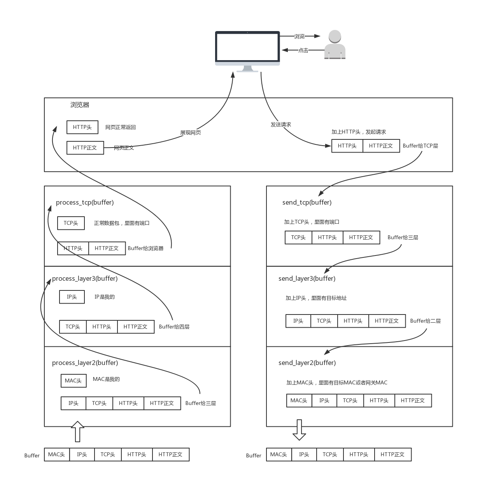
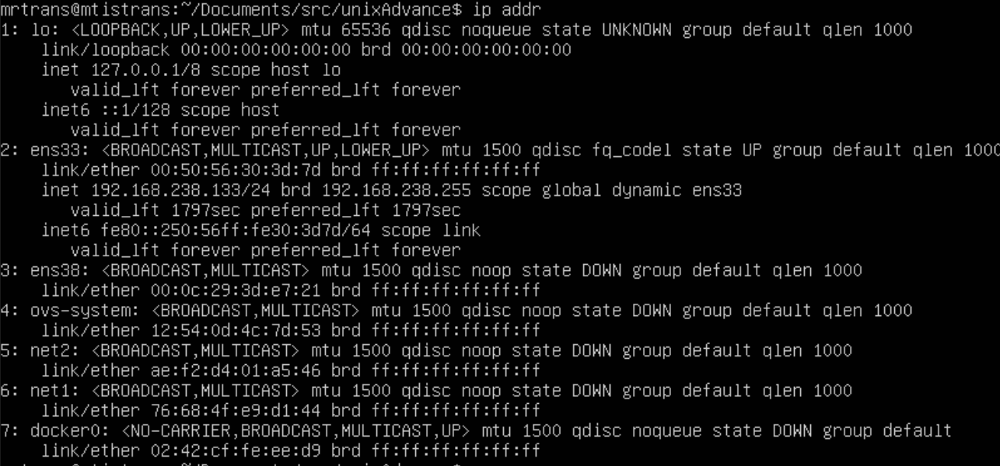

## TCP/IP
根据网课以及阅读tcp详解做的总结。>_<!!!本来不想做了，就是脑袋不争气，老忘记。 
今天来探讨以下网络为什么要分层。 
### 网络为什么要分层？
其实这是一个很好的问题，大多数tcp/ip的书只是说明网络是有层次的，可以分为第一层应用层，第二层传输层，第三层网络层，第四层数据链路层，第五层物理层。但是为什么要分层呢？为什么会分为这几层呢？ 
一个网络数据包，必须是一个健全的数据包，跑起来才能快过刘翔。数据包无论经过那个设备都必须是完整，所以当一个请求从终端发起的时候(应用层)发起的时候，例如http请求，这个请求的正文就会被包上一个http头，然后就会给到下一层传输层，传输层就会给数据包上tcp的头，tcp就会记录下源端口号和目的端口号，紧接着发给ip层（网络层）网络层就会给你包上ip头，记录源ip地址和目标ip地址，紧接着就会发到mac层（数据链路层），mac层就会给数据包包上mac头，记录源mac地址和目的mac地址。(还要看目标mac地址是不是知道的，知道就直接加上去，不知道就吼一下(通过一定的协议处理)。) 
所以通过上面我们知道，每一层都需要工作，而且这是一个复杂的程序，每一层都有不同的处理方式，所以这是一个层层封装的概念，如果没有层层封装，整个数据包我们认为是不完整的。 
 
### 怎么查看ip地址呢？
ifconfig(linux)。ipconfig(windows)。 
还有其他命令吗？有，linux(ip addr)。 
 
ip是地址，有定位功能。因为mac只能在网络号内通信，如果跨子网就需要依靠ip地址的定位功能。
#### CIDR 弥补A,B,C,D,E类地址不够用的问题
* 将ip地址一分为二。网络号和主机号 
10.100.122.2/24计算网络号，广播地址，子网掩码。AND运算(注意这里24) 
10.100.122.2/22计算网络号，广播地址，子网掩码。AND运算(注意这里22) 
D类地址是组播地址，也就是224-239。 
环回接口127.0.0.1，通过查看ip addr可以看到这个回环地址lo->loopback 
MAC地址只是一个电脑的身份证。没有两个重复的身份证。（但是虚拟世界不一样） 
CIDR可以通过计算判断一下是不是同一个网络号的。 
IP分为共有IP和私有IP。 
MTU最大的传输单元（MAX TRANSFER UNIT)，看到ip addr里面是1500的字符，就是不能超过1500个字节传输。 
qdisc就是queueing discipline，排队规则。按照FIFO方式通过队列传送。 
### 那ip怎么来的？又是怎么没的？ DHCP与PXE
ip又叫做网际协议。他是怎么来的呢？我们又是怎样通过ip就可以上网了？ 
先来认识一下这个动态主机配置协议(Dynamic Host Configuration Protocol)->DHCP，靠吼(arp)给你分ip 
DHCP Discover-> DHCP Offer(DHCP Server)->DHCP Request->DHCP ACK(DHCP Server)。 
PXE服务器(客户端)，自己装操作系统。 
### 从物理层到MAC层
原来这两个层次是不一样的。 
物理层，数据链路层，网络层，传输层，应用层。 
第一层，物理层 
水晶头，1-3，2-6交叉接法 
集线器叫做HUB，完全实在物理层工作，会将自己的收到的每一个子节都复制到其他端口上去。 
第二层，数据链路层。 
Hub采取的是广播的模式，所以每一台电脑发出去的包，每个电脑都收到。 
数据链路层，也就是MAC层，全称Medium Access Control，媒体访问控制。控制什么？
* 控制在往媒体上发数据的时候，谁先发、谁后发的问题。
物理地址(链路层地址)。因第二层主要解决媒体接入控制问题，所以常被称为MAC地址。 
* 解决 **多路访问** 这样，多路访问不同的mac地址就可以解决，不用到处广播
1. 多个车道，信道划分
2. 轮流协议 单双号分着出行
3. 随机接入协议 错过高峰出行
以太网，源MAC地址和目标的MAC地址在一个数据包里传输。MAC的网卡发现数据包，是自己的，就会把包收进来，打开ip包，发现ip地址是自己的就打开tcp包(不然就将继续查目标mac地址，然后打包转发出去)，然后打开tcp包，发现端口也是自己的(这里也说明了，整个tcp是通过端口传输数据的)80，就会提交给一个监听这个端口的应用程序，然后应用程序就会把请求的返回数据返给源mac地址的设备，这是源mac地址就改成目标mac，原目标mac就改成源mac地址。 
在以太网，CRC(Cyclic Redundancy Check)是用来做 **循环冗余检测**的。通过XOR异或的算法，来计算整个包是否在发送发的过程中出错。它只能检测数据是否出错，不提供纠正功能。出错了怎么办？丢弃吗？ 
**ARP协议** 已知IP地址求MAC地址。(地址解释协议)，为ip地址到对应的硬件地址之间提供动态映射。(自动完成！) 
靠吼->广播，吼完就缓存，但是arp也会过期，因为ip地址可能会变。 
**二层设备(交换机)**，数据链路层和物理层 
根据策略转发的设备。通过学习，得知每个口的mac，然后形成一张转发表，根据这个转发表就知道在那个口发出去数据。 
### 交换机与VLAN 复杂的交换机，孤独的VLAN ID
一台交换机好说，就都通过他来通信呗，但是要是多台交换机呢？ 
#### 多台交换机形成的拓扑结构
**环路问题** 拓扑结构复杂的形成。 
破除环路->stp最小生成树(Spanning Tree Protocol)。 
Root Bridge->Designated Bridges->BPDU(Bridge Protocol Data Units)->Priority Vector(Root Bridge Id,Root Path Cost,Bridge Id and Port Id) 
[最小生成树](https://www.cnblogs.com/biyeymyhjob/archive/2012/07/30/2615542.html) 
VLAN ID在二层的头加上一个TAG，划分4096个VLAN。根据VLAN ID这个转发。 
### ICMP与ping 投石问路的侦查兵
ping的工作。互联网控制报文协议。 
icmp主动请求为8，主动请求的应答为0. 
差错报文。3，4，11，5 
3->0,1,2,3,4
11超时
5重定向
4 源抑制
ICMP前8个字节 
Traceroute 差错报文类型的使用 
查询报文与差错报文？可以自己设置吗？ 
可以通过tcpdump自己抓包。监听ICMP协议。可以抓取 
### 网关
网关往往是一个路由器，是一个三层转发设备。 
路由器是一台设备，他有五个网口或者网卡，相当于5姑娘，分别连着五个局域网。每只手得IP地址都和局域网得IP地址相同的网段，每只手都是它握住的那个局域网的网关。 
任何想发往其他局域网的包都会到底其中的一只手，被拿进来，拿下mac头和ip头，看看，根据自己的路由算法，选择另一只手，加上ip头和mac头，然后扔出去。 
#### 静态路由是什么？
静态路由就是在路由器上，配置一条一条规则。下一跳是谁就配置下一跳。 
MAC头和IP头变与不变。分为欧洲十国游和玄奘西行型 
IP头不变，mac变，不换护照欧洲十国游，ip变，换护照玄奘西行。 