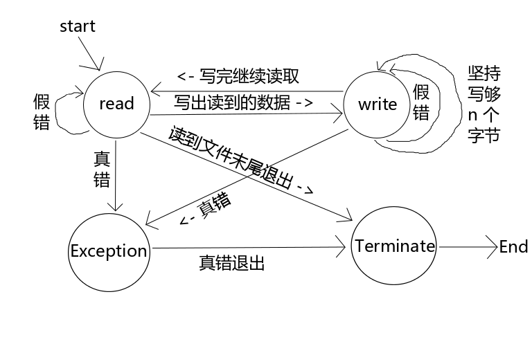
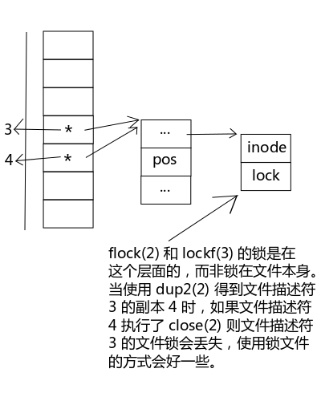

## 高级IO
非阻塞IO、记录锁、IO多路转接(select和poll函数)、异步IO、readv和writev函数以及存储映射IO。<br>
低速系统调用可能会使进程永远阻塞的一类系统调用<br>
* 读操作要是没数据，就会一直阻塞，等待数据
* 写操作也要等到允许才能写
* 打开文件可能发生阻塞，在某种条件下
* 加上强制性记录锁的文件进行读写
* 某些ioctl操作
* 进程间通信函数<br>
这些都是阻塞IO。
### 非阻塞I/O(O_NONBLOCK) 重要的概念 可以发出open、read和write，并不会永远阻塞
如果这种操作不能完成，则调用立即出错返回，表示该操作如继续执行将阻塞。<br>
对于一个给定的描述符，有两种为其指定非阻塞I/O的方法。<br>
* 调用open获得描述符，则可指定O_NONBLOCK标志(就是告诉你别阻塞我)
* 对于已经打开的一个描述符，则调用fcntl，由该函数打开O_NONBLOCK文件

假错现象:

* EINTR:被信号打断，阻塞时会遇到
* EAGAIN:非阻塞形式操作失败<br>

这两种假错现象时出错的时候作为信号发出的，遇到这种假错的现象，我们需要重新再操作一次，例如read以非阻塞方式读数据，如果没读到就会将errno设为EAGAIN，此时并不是设备出问题或读取失败，只是表明采用的是非阻塞方式读取而已，所以打开文件的时候将flags特殊要求指定为O_NONBLOCK就可以了。<br>

```c
#include "../include/apue.h"
#include <fcntl.h>

#define BUFSIZE 1024

int main(){
    int fd;
    char buf[BUFSIZE];
    int size;
    if((fd = open("./advance.txt",O_RDONLY|O_NONBLOCK))<0){
        err_sys("wrong open");
    }
    while(1){
        if((size = read(fd,buf,BUFSIZE))<0){
            if(EAGAIN = errno){
                continue;
            }
            err_sys("read()");
            exit(1);
        }
// dosth
    }
}
```

open使用O_NONBLOCK指定以非阻塞形式打开文件。当read发生错误就要判断是不是假错，发生了假错就再是一次，真错就do sth。<br>

### 有限状态机 如何将🐭放在冰箱
* 打开冰箱门🚪
* 放入🐭
* 关闭冰箱门🚪
这是一个步骤，把一个问题解决步骤摆出来发现是结构化的流程就是简单的流程，若不是简单的流程就是复杂的流程。所有的网络应用和需要与人交互的流程都是复杂流程。<br>
有限状态机被设计出来就是为了解决复杂流程的问题。那有限状态机是什么？
**使用有限状态机首先要把程序的需求分析出来，然后把程序中出现的各种状态抽象出来制作成一张状态机流程图，然后根据这个流程图把程序的框架搭建出来，接下来就是添枝加叶**<br>
举个🌰<br>
从设备a读取输入并输出到b上，同样从b读取输入并输出到a
<br>
描述真错与假错的处理。每个状态画成一个圆形节点，每个节点延伸出来有多少条线就表示有多少种可能性<br>
```c
#include "../include/apue.h"
#include <fcntl.h>
#include <errno.h>

#define BUFSIZE        1024
#define TTY1        "/dev/tty11"
#define TTY2        "/dev/tty12"

/* 状态机的各种状态 */
enum
{
    STATE_R=1,
    STATE_W,
    STATE_Ex,
    STATE_T
};

/* 状态机，根据不同的需求设计不同的成员 */
struct fsm_st
{
    int state; // 状态机当前的状态
    int sfd; // 读取的来源文件描述符
    int dfd; // 写入的目标文件描述符
    char buf[BUFSIZE]; // 缓冲
    int len; // 一次读取到的实际数据量
    int pos; // buf 的偏移量，用于记录坚持写够 n 个字节时每次循环写到了哪里
    char *errstr; // 错误消息
};

/* 状态机驱动 */
static void fsm_driver(struct fsm_st *fsm)
{
    int ret;

    switch(fsm->state)
    {
        case STATE_R: // 读态
            fsm->len = read(fsm->sfd,fsm->buf,BUFSIZE);
            if(fsm->len == 0) // 读到了文件末尾，将状态机推向 T态
                fsm->state = STATE_T;
            else if(fsm->len < 0) // 读取出现异常
            {
                if(errno == EAGAIN) // 如果是假错就推到 读态，重新读一次
                    fsm->state = STATE_R;
                else // 如果是真错就推到 异常态
                {
                    fsm->errstr = "read()";
                    fsm->state = STATE_Ex;
                }
            }
            else // 成功读取到了数据，将状态机推到 写态
            {
                fsm->pos = 0;
                fsm->state = STATE_W;
            }
            break;

        case STATE_W: // 写态
            ret = write(fsm->dfd,fsm->buf+fsm->pos,fsm->len);
            if(ret < 0) // 写入出现异常
            {
                if(errno == EAGAIN) // 如果是假错就再次推到 写态，重新再写入一次
                    fsm->state = STATE_W;
                else // 如果是真错就推到 异常态
                {
                    fsm->errstr = "write()";
                    fsm->state = STATE_Ex;
                }
            }
            else // 成功写入了数据
            {
                fsm->pos += ret;
                fsm->len -= ret;
                if(fsm->len == 0) // 如果将读到的数据完全写出去了就将状态机推向 读态，开始下一轮读取
                    fsm->state = STATE_R;
                else // 如果没有将读到的数据完全写出去，那么状态机依然推到 写态，下次继续写入没写完的数据，实现“坚持写够 n 个字节”
                    fsm->state = STATE_W;
            }

            break;
    
        case STATE_Ex: // 异常态，打印异常并将状态机推到 T态
            perror(fsm->errstr);
            fsm->state = STATE_T;
            break;

        case STATE_T: // 结束态，在这个例子中结束态没有什么需要做的事情，所以空着
            /*do sth */
            break;
        default: // 程序很可能发生了溢出等不可预料的情况，为了避免异常扩大直接自杀
            abort();
    }

}

/* 推动状态机 */
static void relay(int fd1,int fd2)
{
    int fd1_save,fd2_save;    
    // 因为是读 tty1 写 tty2；读 tty2 写 tty1，所以这里的两个状态机直接取名为 fsm12 和 fsm21
    struct fsm_st fsm12,fsm21;

    fd1_save = fcntl(fd1,F_GETFL);
    // 使用状态机操作 IO 一般都采用非阻塞的形式，避免状态机被阻塞
    fcntl(fd1,F_SETFL,fd1_save|O_NONBLOCK);
    fd2_save = fcntl(fd2,F_GETFL);
    fcntl(fd2,F_SETFL,fd2_save|O_NONBLOCK);

    // 在启动状态机之前将状态机推向 读态
    fsm12.state = STATE_R;
    // 设置状态机中读写的来源和目标，这样状态机的读写接口就统一了。在状态机里面不用管到底是 读tty1 写tty2 还是 读tty2 写tty1 了，它只需要知道是 读src 写des 就可以了。
    fsm12.sfd = fd1;
    fsm12.dfd = fd2;

    // 同上
    fsm21.state = STATE_R;
    fsm21.sfd = fd2;
    fsm21.dfd = fd1;


    // 开始推状态机，只要不是 T态 就一直推
    while(fsm12.state != STATE_T || fsm21.state != STATE_T)
    {
        // 调用状态机驱动函数，状态机开始工作
        fsm_driver(&fsm12);
        fsm_driver(&fsm21);
    }

    fcntl(fd1,F_SETFL,fd1_save);
    fcntl(fd2,F_SETFL,fd2_save);
    
}

int main()
{
    int fd1,fd2;

    // 假设这里忘记将设备 tty1 以非阻塞的形式打开也没关系，因为推动状态机之前会重新设定文件描述符为非阻塞形式
    fd1 = open(TTY1,O_RDWR);
    if(fd1 < 0)
    {
        perror("open()");
        exit(1);
    }
    write(fd1,"TTY1\n",5);
    
    fd2 = open(TTY2,O_RDWR|O_NONBLOCK);
    if(fd2 < 0)
    {
        perror("open()");
        exit(1);
    }
    write(fd2,"TTY2\n",5);


    relay(fd1,fd2);


    close(fd1);
    close(fd2);


    exit(0);
}
```
根据状态机来看图，每一组case语句都处理一次状态的变更，转换。使用状态机之前需要使两个待进行数据中继的文件描述符必须是O_NONBLOCK。每个状态机都没有循环读写数据，因为状态机能确保每一种状态都是单一职责原则，出现其他情况只要推到状态机，问题就解决了。<br>

### IO多路转接 实现非忙等
上面的🌰采用了忙等的方式，IO多路转接实现非忙等模式。有时候，需要读取多个文件的时候，不能使用阻塞方式，因为一个阻塞了，其他就没法读了，而采用非阻塞方式如果采用忙等的形式🈶️得不偿失。那可怎么着？<br>
#### select、poll和epoll同时监视多个文件描述符
当文件描述符状态没有变化时阻塞等待，当状态变化的时候，就会给一个通知继续处理任务。<br>
##### select 很老，监视文件描述符集合fd_set
```c
select,  FD_CLR,  FD_ISSET, FD_SET, FD_ZERO - synchronous I/O multiplexing

/* According to POSIX.1-2001 */
#include <sys/select.h>

/* According to earlier standards */
#include <sys/time.h>
#include <sys/types.h>
#include <unistd.h>

int select(int nfds, fd_set *readfds, fd_set *writefds,fd_set *exceptfds, struct timeval *timeout);
/***
 * nfds: 最大的文件描述符+1 所关心的描述符
 * readfds: 需要监视的输入文件描述符集合
 * writefds: 需要监视的输出文件描述符集合
 * exceptfds: 需要监视的会发生异常的文件描述符集合
 * timeout: 等待超时时间，如果超时依然没有文件描述符发生变化就返回，设置0就会立即返回，设置NULL就会一直阻塞等待，不会超时
 * ***/
```
返回的select，是内核告诉我们
* 已准备好的描述符的总数量
* 对于读写或异常这三个条件中的每一个，哪些描述符已准备好<br>
使用这种的返回信息，就可调用相应的IO函数，一般是read或write，并且确知该函数不会阻塞。
```c
void FD_CLR(int fd, fd_set *set);
int  FD_ISSET(int fd, fd_set *set);
void FD_SET(int fd, fd_set *set);
void FD_ZERO(fd_set *set);
```
文件描述符集合是fd_set，添加文件描述符到fd_set中
* 通过带参数宏FD_SET将文件描述符fd添加到set中
* FD_CLR可以删除set中给定的文件描述符
* 通过带参数的宏FD_ZERO的作用清空set中的文件描述符。
* 带参数的宏FD_ISSET的作用是测试文件描述符fd是否在set集合中<br>
重改上面的🌰，改成非忙等。<br>
```c
enum
{
    STATE_R=1,
    STATE_W,
STATE_AUTO, // 添加这个值是为了起到分水岭的作用，小于这个值的时候才需要使用 select(2) 监视
    STATE_Ex,
    STATE_T
};

static int max(int a,int b)
{
    if(a < b)
        return b;
    return a;
}

static void relay(int fd1,int fd2)
{
    int fd1_save,fd2_save;    
    struct fsm_st fsm12,fsm21;
    fd_set rset,wset; // 读写文件描述符集合

    fd1_save = fcntl(fd1,F_GETFL);
    fcntl(fd1,F_SETFL,fd1_save|O_NONBLOCK);
    fd2_save = fcntl(fd2,F_GETFL);
    fcntl(fd2,F_SETFL,fd2_save|O_NONBLOCK);

    fsm12.state = STATE_R;
    fsm12.sfd = fd1;
    fsm12.dfd = fd2;

    fsm21.state = STATE_R;
    fsm21.sfd = fd2;
    fsm21.dfd = fd1;


    while(fsm12.state != STATE_T || fsm21.state != STATE_T)
    {
        //布置监视任务
        FD_ZERO(&rset);
        FD_ZERO(&wset);

        // 读态监视输入文件描述符；写态监视输出文件描述符
        if(fsm12.state == STATE_R)
            FD_SET(fsm12.sfd,&rset); // 塞
        if(fsm12.state == STATE_W)
            FD_SET(fsm12.dfd,&wset); // 塞
        if(fsm21.state == STATE_R)
            FD_SET(fsm21.sfd,&rset);
        if(fsm21.state == STATE_W)
            FD_SET(fsm21.dfd,&wset);

        if(fsm12.state < STATE_AUTO || fsm21.state < STATE_AUTO)
        {
            // 以阻塞形式监视
            if(select(max(fd1,fd2)+1,&rset,&wset,NULL,NULL) < 0)
            { // 监视，一旦改变，马上推动状态机
                if(errno == EINTR)
                    continue;
                perror("select()");
                exit(1);
            }
        }

        //查看监视结果 FD_ISSET
        if( FD_ISSET(fd1,&rset) || FD_ISSET(fd2,&wset) || fsm12.state > STATE_AUTO) 
            fsm_driver(&fsm12);
        if( FD_ISSET(fd2,&rset) || FD_ISSET(fd1,&wset) || fsm21.state > STATE_AUTO)
            fsm_driver(&fsm21);
    }
    // 这里实现每个状态的变化都会检测并推动状态机
    fcntl(fd1,F_SETFL,fd1_save);
    fcntl(fd2,F_SETFL,fd2_save);
    
}
```
select函数对文件描述符进行监视，如果文件描述符状态没有发生改变就阻塞等待；而哪个状态机的文件描述符发生变化就推动哪个状态机，这样就将查询法的实现改为通知法的实现了。<br>

#### poll 监视多个文件描述符
```c
poll - wait for some event on a file descriptor

#include <poll.h>

int poll(struct pollfd *fds, nfds_t nfds, int timeout);

struct pollfd {
    int   fd;         /* 需要监视的文件描述符 */
    short events;     /* 要监视的事件 */
    short revents;    /* 该文件描述符发生了的事件 */
};
```
* fds实际上是一个数组的首地址，因为poll可以帮助我们监视多个文件描述符，而一个文件描述符放到struct pollfd结构中，多个文件描述符就需要一个数组来存储了。
* nfds: fds这个数组的长度。在参数列表中使用数组的首地址+长度的做法
* timeout: 阻塞等待的超时时间。传入-1则始终阻塞，不超时<br>

事件|描述
|--|--|
POLLIN|文件描述符可读
POLLPRI|可以非阻塞的读高优先级的数据
POLLOUT|文件描述符可写
POLLRDHUP|流式套接字连接点关闭，或关闭写半连接
POLLERR|已出错
POLLHUP|已挂断(一般指设备)
POLLNVAL|参数非法

同时监视多个事件可以使用按位或(|)添加<br>
使用步骤
* 首先通过struct pollfd结构体中的events成员布置监视任务
* 然后使用poll函数进行阻塞的监视👓
* 当从poll函数返回时就可以通过struct pollfd结构体中的revents成员与上面的7个宏中被我们选出来监视的宏进行按位与(&)操作，只要结果不为1就认为触发了该事件。<br>
```c
static void relay(int fd1,int fd2)
{
    int fd1_save,fd2_save;    
    struct fsm_st fsm12,fsm21;
    struct pollfd pfd[2]; // 一共监视两个文件描述符


    fd1_save = fcntl(fd1,F_GETFL);
    fcntl(fd1,F_SETFL,fd1_save|O_NONBLOCK);
    fd2_save = fcntl(fd2,F_GETFL);
    fcntl(fd2,F_SETFL,fd2_save|O_NONBLOCK);

    fsm12.state = STATE_R;
    fsm12.sfd = fd1;
    fsm12.dfd = fd2;

    fsm21.state = STATE_R;
    fsm21.sfd = fd2;
    fsm21.dfd = fd1;

    pfd[0].fd = fd1;
    pfd[1].fd = fd2;

    while(fsm12.state != STATE_T || fsm21.state != STATE_T)
    {
        // 布置监视任务
        pfd[0].events = 0;
        if(fsm12.state == STATE_R)
            pfd[0].events |= POLLIN; // 第一个文件描述符可读
        if(fsm21.state == STATE_W)    
            pfd[0].events |= POLLOUT; // 第一个文件描述符可写

        pfd[1].events = 0;
        if(fsm12.state == STATE_W)
            pfd[1].events |= POLLOUT; // 第二个文件描述符可读
        if(fsm21.state == STATE_R)
            pfd[1].events |= POLLIN; // 第二个文件描述符可写

        // 只要是可读写状态就进行监视
        if(fsm12.state < STATE_AUTO || fsm21.state < STATE_AUTO)
        {
            // 阻塞监视
            while(poll(pfd,2,-1) < 0)
            {
                if(errno == EINTR)
                    continue;
                perror("poll()");
                exit(1);
            }
        }

        // 查看监视结果
        if( pfd[0].revents & POLLIN || pfd[1].revents & POLLOUT ||fsm12.state > STATE_AUTO)
            fsm_driver(&fsm12); // 推状态机
        if( pfd[1].revents & POLLIN || pfd[0].revents & POLLOUT || fsm21.state > STATE_AUTO)
            fsm_driver(&fsm21); // 推状态机
    }

    fcntl(fd1,F_SETFL,fd1_save);
    fcntl(fd2,F_SETFL,fd2_save);
    
}
```
#### epoll 不是一个函数，一个加强版的poll
poll需要管理一个struct pollfd结构体或它的结构体数组，epoll则使内核为我们管理这个结构体数组，我们只需要通过epoll_create返回的标识引用这个结构体即可
```c
epoll_create - open an epoll file descriptor

#include <sys/epoll.h>

int epoll_create(int size);
```
size随便传入一个正整数，内核使用hash来管理要监视的文件描述符。返回值就是epfd，失败时返回-1并设置errno。<br>
也就是说，这是创建了文件描述符数组。然后用epoll_ctl函数布置监视任务。<br>
```c
epoll_ctl - control interface for an epoll descriptor
#include <sys/epoll.h>

int epoll_ctl(int epfd,int op,int fd,struct epoll_event *event);

struct epoll_event{
    uint32_t events; 
    // epoll监视事件，这些事件与poll能监视的事件差不多，只是宏名前面加了E
    epoll_data_t data; 
    /***
     * 用户数据，除了能保存文件描述符以外，还能让你保存一些其他有关数据
     * 比如文件描述符嵌在一棵树上，使用它也不知道它是树的哪个节点
     * 可以在布置监视任务的时候将相关的位置都保存下来
     * ***/
}
```
epoll_ctl的作用是要对fd增加或减少op什么行为的监视(event)。成功返回0，失败返回-1，并设置errno，op参数可以使用下面的三个宏来指定操作

宏|描述
|--|:--|
EPOLL_CTL_ADD|增加要监视的文件描述符
EPOLL_CTL_MOD|更改目标文件描述符的事件
EPOLL_CTL_DEL|删除要监视的文件描述符，event参数会被忽略，可以传入NULL

##### 与select和poll一样，布置完监视任务就要取监视结果，epoll策略就是使用epoll_wait函数进行阻塞监视并返回监视结果
```c
epoll_wait - wait for an IO event on an epoll file descriptor
#include <sys/epoll.h>
int epoll_wait(int epfd,struct epoll_event *events,int maxevents,int timeout);
```
* epfd: 要操作的epoll实例
* events+maxevents: 共同指定了一个结构体数组，数组的起始位置和长度。<br>
其实每次使用epoll_ctl函数添加一个文件描述符时相当于向内核为我们管理的数组中添加一个成员，所以当我们使用同一个struct epoll_event变量操作多个文件描述符时，只需传入该变量的地址和操作了多少个文件描述符即可
* timeout: 超时等待事件，设置为-1则始终阻塞监视，不超时
```c
static void relay(int fd1,int fd2)
{
    int fd1_save,fd2_save;    
    struct fsm_st fsm12,fsm21;
    int epfd;
    struct epoll_event ev;

    epfd = epoll_create(10);
    if(epfd < 0)
    {
        perror("epfd()");
        exit(1);
    }

    fd1_save = fcntl(fd1,F_GETFL);
    fcntl(fd1,F_SETFL,fd1_save|O_NONBLOCK);
    fd2_save = fcntl(fd2,F_GETFL);
    fcntl(fd2,F_SETFL,fd2_save|O_NONBLOCK);

    fsm12.state = STATE_R;
    fsm12.sfd = fd1;
    fsm12.dfd = fd2;

    fsm21.state = STATE_R;
    fsm21.sfd = fd2;
    fsm21.dfd = fd1;

    ev.events = 0;
    ev.data.fd = fd1;
    // 增加文件描述符
    epoll_ctl(epfd,EPOLL_CTL_ADD,fd1,&ev);
    
    ev.events = 0;
        ev.data.fd = fd2;
        // 继续增加文件描述符
        epoll_ctl(epfd,EPOLL_CTL_ADD,fd2,&ev);


    while(fsm12.state != STATE_T || fsm21.state != STATE_T)
    {
        // 布置监视任务

        ev.events = 0;
        ev.data.fd = fd1;
        if(fsm12.state == STATE_R)
            ev.events |= EPOLLIN;
        if(fsm21.state == STATE_W)    
            ev.events |= EPOLLOUT;
            // 更改目标文件描述符的事件
        epoll_ctl(epfd,EPOLL_CTL_MOD,fd1,&ev);

        ev.events = 0;
        ev.data.fd = fd2;
        if(fsm12.state == STATE_W)
            ev.events |= EPOLLOUT;
        if(fsm21.state == STATE_R)
            ev.events |= EPOLLIN;
            // 更改目标文件描述符的事件
        epoll_ctl(epfd,EPOLL_CTL_MOD,fd2,&ev);

        // 监视
        if(fsm12.state < STATE_AUTO || fsm21.state < STATE_AUTO)
        {
            while(epoll_wait(epfd,&ev,1,-1) < 0)
            {
                if(errno == EINTR)
                    continue;
                perror("epoll_wait()");
                exit(1);
            }
        }

        // 查看监视结果
        if( ev.data.fd == fd1 && ev.events & EPOLLIN || \
            ev.data.fd == fd2 && ev.events & EPOLLOUT || \
            fsm12.state > STATE_AUTO)
            fsm_driver(&fsm12);
        if( ev.data.fd == fd2 && ev.events & EPOLLIN || \
            ev.data.fd == fd1 && ev.events & EPOLLOUT  || \
            fsm21.state > STATE_AUTO)
            fsm_driver(&fsm21);
    }

    fcntl(fd1,F_SETFL,fd1_save);
    fcntl(fd2,F_SETFL,fd2_save);
    
    close(epfd);

}
```
这就是epoll和poll和select
### 记录锁 当第一个进程正在读或修改文件的某个部分时，使用记录锁可以阻止其他进程修改同一文件📃区
fcntl函数创建一个锁文件。
```c
int fcntl(int fd,int cmd,.../*struct flock *flockptr*/);
// 成功，依赖于cmd，否则返回-1
```
记录📝锁，cmd是F_GETLK,F_SETLK或F_SETLKW。第三个参数(我们将调用flockptr)是一个指向flock结构的指针<br>
```c
struct flock{
    short l_type; // F_RDLCK,F_WRLCK,or F_UNLCK 锁定的状态
    short l_whence; // SEEK_SET, SEEK_CUR,or SEEK_END 决定lstart的位置
    off_t l_start; // offset in bytes, relative to l_whence 锁定区域的开头位置
    off_t l_len; // length,in bytes;0 means lock to EOF 锁定区域大大小
    pid_t l_pid; // returned with F_GETLK 锁定动作的进程
}
```
* F_RDLCK(共享读锁),F_WRLCK(独占性写锁),or F_UNLCK(解锁一个区域)
* 要加锁或解锁的区域的起始字节偏移量l_start和l_whence
* 区域字节长度l_len
* 进程ID(l_pid)持有的锁能阻塞当前进程
<br>
关于加锁或解锁区域的说明还要注意下列几项规则

* 指定区域起始偏移量的两个元素与lseek函数中最后两个参数类似。l_whence可选用的值是SEEK_SET、SEEK_CUR或SEEK_END
* 锁🔒可以在当前文件尾端处开始或者越过尾端处开始，但是不能在文件起始位置之前开始
* 如若l_len为0，则表示锁的防伪可以扩展到最大的可能偏移量。这意味着不管向该文件中追加写了多少数据，它们都可以处于锁🔒的范围内(不必猜测会有多少字节被追加写到了文件之后)，而且起始位置可以是文件中的任意一个位置 **加锁整个文件，通常是将l_start说明为0，l_whence说明为seek_set，l_len说明为0**
* 为了对整个文件加锁🔒，我们设置了l_start和l_whence指向文件的起始位置，并且指定长度(l_len)为0.

任意多个进程在一个给定的字节上可以有一把共享的读锁，但是只能有一个进程有一把 **独占写锁。**<br>
**单进程不适用**，单进程只有一把锁，要么换，要么持续用该锁。<br>
**加读锁，该描述符必须是读打开的。加写锁，该描述符是写打开的。**<br>

cmd是三种命令的参数，以下是这三种命令

命令|描述
|--|:--|
F_GETLK|根据lock的描述，决定是否上文件锁🔒
F_SETLK|设置lock描述的文件锁🔒
F_SETLKW|这个命令是F_SETLK的阻塞版本wait。如果存在其他锁，则调用进程睡眠；如果捕捉到信号则睡眠中断

以上都不是原子操作，因此，F_SETLK或F_SETLKW企图建立那把锁，可能会被另一个进程插入并建立一把相同的锁。因此，要处理F_SETLK返回的可能的出错<br>

举个🌰，关于写入锁文件
```c
#include "../include/apue.h"
#include <fcntl.h>
#include <sys/file.h>

void lock_tst(int fd,int type,off_t offset,int whence,off_t len){
    struct flock lock;
    lock.l_type = type;
    lock.l_start = offset;
    lock.l_whence = whence;
    lock.l_len = len;
    while(1){
        lock.l_type = type;
        if((fcntl(fd,F_SETLK,&lock)) == 0){
            // 根据不同的type值给文件上锁或解锁
            switch (lock.l_type)
            {
                case F_RDLCK:
                    printf("read lock set by %d\n",getpid());
                    break;
                case F_WRLCK:
                    printf("wwwwrite lock set by %d\n",getpid());
                    break;
                case F_UNLCK:
                    printf("release lock set by %d\n",getpid());
                    break;
                default:
                    break;
            }
            return;
        }
        // 判断文件是否能上锁
        fcntl(fd,F_GETLK,&lock);
        // 判断文件不能上锁的原因
        if(lock.l_type != F_UNLCK){
            // 该文件已有写入锁
             switch (lock.l_type)
            {
                case F_RDLCK:
                    printf("read lock set by %d\n",lock.l_pid);
                    break;
                case F_WRLCK:
                    printf("write lock set by %d\n",lock.l_pid);
                    break;
                default:
                    break;
            }
            getchar();
        }
    }
    return;
}

int main(void){
    int fd;
    fd = open("./advance.txt",O_RDWR|O_CREAT,0666);
    if(fd<0){
        err_sys("open()");
    }
    // 给文件上写入锁
    lock_tst(fd,F_WRLCK,0,SEEK_SET,0);
    getchar();
    // 给文件解锁
    lock_tst(fd,F_UNLCK,0,SEEK_SET,0);
    getchar();
    close(fd);
    exit(0);
}
```
终端运行
```c
bogon:advanceIO transcheung$ ./lock_fcntl.t 
wwwwrite lock set by 3528

release lock set by 3528
```
第二个终端运行
```c
write lock set by 3528

write lock set by 3528

wwwwrite lock set by 3540

release lock set by 3540
```
这里就指出，写入锁互斥<br>
那么读取锁呢？
同样运行，lock_tst改为F_RDLCK<br>
```c
transCheungdeMacBook-Pro:advanceIO transcheung$ ./lock_fcntl.t 
read lock set by 3592

release lock set by 3592
```
第二个终端运行
```c
read lock set by 3580

release lock set by 3580
```
没有任何问题，证明，读锁是共享的<br>
那么如果一个进程已经上了写锁，另一个进程上了读锁，会出现什么情况？
```c
int main(void){
    int fd;
    pid_t pid;
    fd = open("./advance.txt",O_RDWR|O_CREAT,0666);
    if(fd<0){
        err_sys("open()");
    }
    // 给文件上写锁
    if((pid = fork())<0)
        err_sys("fork error");
    else if(pid == 0){
        // 子进程上写锁
        lock_tst(fd,F_WRLCK,0,SEEK_SET,0);
        sleep(10);
        lock_tst(fd,F_UNLCK,0,SEEK_SET,0);
        exit(0);
    }
    sleep(5); // 先让子进程先跑
    // 父进程给文件上读取锁
    lock_tst(fd,F_RDLCK,0,SEEK_SET,0);
    getchar();
    // 给文件解锁
    lock_tst(fd,F_UNLCK,0,SEEK_SET,0);
    getchar();
    close(fd);
    exit(0);
}
```
运行结果
```c
wwwwrite lock set by 3931
write already lock set by 3931
release lock set by 3931

read lock set by 3930

release lock set by 3930
```
上了写锁，读锁是不能进行的，释放了写锁，读锁才能继续读。<br>
反过来，上了读锁，写锁是不能进行的，要等读锁读完才能进行写锁。<br>
#### 死锁 如果两个进程互相等待对方持有并且不释放(锁定)的资源时
如果一个进程已经控制了文件中的一个加锁区域，然后它又试图对另一个进程控制的区域加锁，那么它就会休眠。就像上面的🌰，只要两个进程一直不释放锁，一直加锁，又想继续加锁，就会处于死锁状态。<br>

### 异步IO 信号驱动IO，并不是真正意义的异步IO

### readv和write 对多个碎片的读写操作，将所有小碎片写到文件中
readv当没有连续的空间存储从fd读取或写入的数据时，将其存储在iovcnt个iov结构体中。writev的作用相同。iov是结构体数组起始位置。iovcnt是数组长度。<br>
```c
readv,  writev  -  read  or write data into multiple buffers

#include <sys/uio.h>

ssize_t readv(int fd, const struct iovec *iov, int iovcnt);

ssize_t writev(int fd, const struct iovec *iov, int iovcnt);

struct iovec {
        void  *iov_base;    /* 起始地址 */
        size_t iov_len;     /* Number of bytes to transfer */
};
```
### 存储映射IO 将一个文件的一部分或全部映射到内存中
在*nix系统中分配内存的方法有好几种，不一定非得使用free(3)/malloc函数。<br>
映射内存IO说得就是将一个文件的一部分或全部映射到内存中，用户拿到的就是这段内存的起始位置， **访问这个文件就相当于访问一个大字符串一样。**<br>
**通过mmap和munmap函数可以实现一个实时的类似于malloc和free函数的效果** ，前面提及过malloc和free实际上是以打白条的形式实现的，就是在你调用函数时没有立即分配内存给你，而是在你真正使用内存的时候，再重新整合整个内存，内核找够内存分配给你。<br>
```c
mmap,mumap - map or unmap files or devices into memory
#include <sys/mman.h>

void *mmap(void *addr,size_t length,int prot,int flags,int fd,off_t offset);

int munmap(void *addr,size_t length);
```
mmap函数的作用是把fd这个文件从offset偏移位置开始把length字节个长度映射到addr这个内存位置上，如果addr是NULL，则有kernel帮我们选择一块空间并使用返回值返回这段内存的首地址。<br>
prot参数是操作权限，可以使用下表中的宏通过按位或(|)来组合指定<br>

宏|含义
|--|--|
PROT_READ|映射区可读
PROT_WRITE|映射区可写
PROT_EXEC|映射区可执行
PROT_NONE|映射区不可访问

映射区不可访问(PROT_NONE)的含义是如果我映射的内存中有一块已经有某些数据了，绝对不能让我的程序越界覆盖，就可以把这段空间设置为映射区不可访问。<br>

flags参数是特殊要求，二者选其一<br>

宏|含义
|--|--|
MAP_SHARED|对映射区进行存储操作相当于对原来的文件进行写入，会改变原来文件的内容
MAP_PRIVATE|当映射区进行存储操作时会创建一个私有副本，所有后来再对映射区的操作都相当于操作这个副本，而不影响原来的文件

其它常用的选项
* MAP_ANONYMOUS: 不依赖于任何文件，映射出来的内存空间会被清0，并且fd和offset参数会被忽略，通常我们在使用的时候会把fd设置为-1(MAC OS没有这个选项)

用这个参数可以容易做出一个最简单最好用的在具有亲缘关系的进程之间的共享内存。<br>
mmap在成功的时候返回一个指针，会指向映射的内存区域的起始地址。失败时返回MAP_FAILED宏定义，其实是这样定义的(void *)-1<br>

举个🌰<br>
```c
#include "../include/apue.h"
#include <sys/mman.h>
#include <sys/types.h>
#include <sys/stat.h>
#include <unistd.h>
#include <fcntl.h>

#define FNAME "./advance.txt"

int main(void){
    int fd,i;
    char *str;
    struct stat statres;
    int count = 0;

    fd = open(FNAME,O_RDONLY);

    if(fd<0){
        err_sys("open()");
    }

    // 通过stat获得文件大小
    if(fstat(fd,&statres)<0){
        err_sys("fstat()");
    }

    str = mmap(NULL,statres.st_size,PROT_READ,MAP_SHARED,fd,0);
    // 映射区可读
    if(str == MAP_FAILED)
        err_sys("mmap()");

    close(fd);

    for(i = 0;i<statres.st_size;i++){
        // 访问文本文件，所以可以把映射的内存看作是一个大字符串处理
        if(str[i] == 's'){
            count++;
        }
    }

    printf("count = %d\n",count);

    // 解除映射 否则会造成内存泄漏
    munmap(str,statres.st_size);
}
```
mmap的返回值时`void*`类型，百搭。在映射了不同的东西的情况下我们可以使用不同的指针来接收，这样就能用不同的方式访问这段内存空间了。上面这个文件就是文本文件，所以我们可以使用`char*`来接收它的返回值，这就是整个大字符串<br>

### flock和lockf函数 可以实现好用的文件加锁
```c
lockf - apply, test or remove a POSIX lock on an open file

#include <unistd.h>

int lockf(int fd, int cmd, off_t len);

flock - apply or remove an advisory lock on an open file

#include <sys/file.h>

int flock(int fd, int operation);
```
lockf可以给文件仅从局部加锁，简单来说就是从当前位置锁住len个字节。<br>
* fd: 要加锁的文件描述符
* cmd: 具体的命令见下表

宏|说明
|--|:--|
F_LOCK|为文件的一段加锁，如果已经被加锁就阻塞等待，如果两个锁要锁定的部分有交集就会被合并，文件关闭时或进程退出时会自动释放，不会被子进程继承
F_TLOCK|与F_LOCK差不多，不过是尝试加锁，非阻塞
F_ULOCK|解锁🔓，如果是被合并的锁会分裂
F_TEST|测试锁，如果文件被测试的部分没有锁定或者是调用进程持有锁就返回0；如果是其他进程持有锁就返回-1，并且errno设置为EAGAIN或EACCES

* len:要锁定的长度，如果为0表示文件有多长锁多长，从当前位置一直锁到文件结尾

```c
#include "../include/apue.h"
#include <sys/mman.h>
#include <fcntl.h>
#include <string.h>
#include <unistd.h>

#define PROCNUM 20
#define FNAME "./advance.txt"
#define BUFSIZE 1024

static void func_add(){
    FILE *fp;
    int fd;
    char buf[BUFSIZE];

    fp = fopen(FNAME,"r+");
    // 标准输出
    if(fp == NULL){
        err_sys("fopen()");
    }

    fd = fileno(fp);

    if(fd<0)
        err_sys("fd error");
    
    // 使用之前先锁定
    lockf(fd,F_LOCK,0);

    fgets(buf,BUFSIZE,fp);
    // 把文件位置指针定位到文件首
    rewind(fp);
    sleep(1);
    fprintf(fp,"%d\n",atoi(buf)+1);
    // 输出到文件中
    // atoi转ascii 字符串到数字
    fflush(fp);

    // 使用之后释放锁
    lockf(fd,F_ULOCK,0);
    return;
}
// 如果加不上锁就等，等别人释放锁再加，如果加上了锁就读文件的值再+1

int main(void){
    int i;
    pid_t pid;

    for(i = 0;i<PROCNUM;i++){
        pid = fork();
        if(pid<0){
            err_sys("fork()");
        }
        if(pid == 0){
            func_add();
            exit(0);
        }
    }

    for(i = 0;i<PROCNUM;i++)
        wait(NULL);

    exit(0);
}
```
sleep是为了放大竞争，就是一定要出现竞争，我就是占用着资源，你也不敢动。<br>
在调试并发的程序时，如果有些问题很难复现，那么可以 **通过加长每个并发单位的执行时间来强制它们出现竞争的情况。**这样就可以让我们更容易的分析问题。<br>
缺点: 如果dup2，获取文件描述符，然后执行close，文件描述符的文件锁就会丢失。<br>

#### 锁文件📃
文件锁衍生出来的机制，把一个文件当作锁，例如要操作/tmp/out文件，那么服进程可以先创建一个/tmp/lock文件，然后再创建20个子进程同时对/tmp/out文件进行读写，但是子进程必须先锁定/tmp/lock文件才能操作/tmp/out文件，没抢到锁文件就需要等待其他进程解锁再抢🔒，等父进程收尸后，再关闭/tmp/lock文件。这个文件就是锁文件