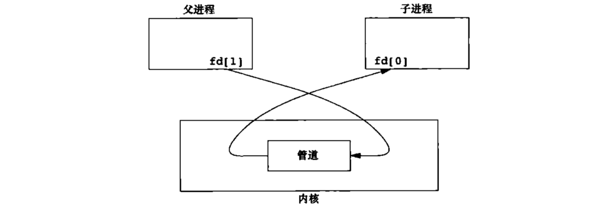

## 进程间通信(IPC) 各个进程通信方式的统称
进程通信(IPC)分为PIPE(管道)、Socket(套接字)和XSI(System_V)。XSI又分为msg(消息队列)、sem(信号量数组)和shm(共享内存)。这些手段都是用于进程间通信的，只有进程间通讯才需要借助第三方机制，线程之间通讯是不需要借助第三方机制，因为线程之间的地址龙剑是共享的。线程之间可以通过互斥量，死锁，唤醒，信号等来进行通讯。<br>
#### 管道(PIPE->FIFO) 内核帮你创建和维护
管道的特点:
* 管道是半双工的，也就是同一时间数据只能从一端流向另一段。就像水一样，两端水同时流入管道，那么数据就会乱
* 管道的两端一端作为读端，一端是写端
* 管道具有自适应的特点， **默认会适应速度比较慢的一方**，管道被写满或读空时速度快的一方会自动阻塞

```c
pipe - create pipe
#include <unistd.h>
int pipe(int pipefd[2]);
// 也就只有两端，一端读，一端写
```
pipe用于创建管道，pipefd是一个数组，表示管道的两端文件描述符，`pipefd[0]`端作为读端，`pipefd[1]`作为写端。<br>
pipe产生的是匿名管道，在磁盘的任何位置上找不到这个管道文件，而且 **匿名管道只能用于具有亲缘关系的进程之间通信**(还要分亲缘关系😨)<br>
一般情况下有亲缘关系的进程之间使用管道进行通信时，会把自己不用的一端文件描述符关闭<br>
举个🌰<br>
```c
#include "../include/apue.h"

#define BUFSIZE 1024

int main(){
    int pd[2];
    char buf[BUFSIZE];
    pid_t pid;
    int len;
    // 创建匿名管道
    if(pipe(pd)<0)
        err_sys("pipe()");

    pid = fork();
    if(pid == 0){ // 子进程 读取管道数据
        // 关闭写端
        close(pd[1]);
        // 从管道中读取数据，如果子进程比父进程先被调度会阻塞等待数据写入
        len = read(pd[0],buf,BUFSIZE);
        puts(buf);
        /***
         * 管道fork之前创建
         * 父子进程都有一份
         * 所有退出之前要确保管道两端都关闭
         * ***/
        close(pd[0]);
        exit(0);
    }else{ // 父进程 向管道写入数据
        // 关闭读端
        close(pd[0]);
        // 写端
        write(pd[1],"Hello,world!",100);
        close(pd[1]);
        wait(NULL);
        exit(0);
    }
}
```
创建了一个匿名的管道，在`pd[2]`数组中凑齐了读写双方，子进程同样继承了具有读写双方的数组`pd[2]`<br>
当关闭之后就是取决于我们需要对管道的数据流方向做准备。要么从子进程流向父进程，要么从父进程流向子进程。<br>
<br>

##### mkfifo函数
```c
mkfifo - make a FIFO special file (a named pipe)
#include  <sys/types.h>
#include <sys/stat.h>

int mkfifo(const char *pathname,mode_t mode);
// pathname: 管道文件的路径和文件名
// mode: 创建管道文件的权限。还是老规矩，传入的mode值要与系统的umask值做运算(mode&~umask)
// 成功返回0，失败返回-1并设置errno
```
mkfifo函数用于创建命名管道，作用与匿名管道相同，不过可以在不同的进程之间使用，相当于对一个普通文件进行写操作就可以了。<br>
这个管道文件是任何有权限的进程都可以使用的，两端都像操作一个普通文件一样对它进行打开、读写、关闭动作就可以了，只要一端写入数据另一端就可以读出来。<br>
命名管道文件
```c
#include "../include/apue.h"
#include <fcntl.h>

#define PATHNAME "./mkfifof.txt"

int main(void){
    pid_t pid;
    int fd = -1;
    char buf[BUFSIZ] = "";

    // 创建一个命名管道，通过ls -l查看这个管道的属性
    if(mkfifo(PATHNAME,0664)<0){
        err_sys("mkfifo");
    }

    fflush(NULL); // 刷新缓冲区
    pid = fork();

    if(pid<0)
        err_sys("fork()");

    if(!pid){
        pid = fork(); // 继续fork 三个进程了
        if(pid<0)err_sys("fork()2");
        if(!pid) exit(0); // 爸爸走了
       // child2
        fd = open(PATHNAME,O_RDWR);
        if(fd<0) err_sys("open()");
        // 阻塞，等待条件满足
        read(fd,buf,BUFSIZ);
        printf("%s\n",buf);
        write(fd," World!",8);
        close(fd);
        exit(0);
    }else{
        fd = open(PATHNAME,O_RDWR);
        if(fd < 0) err_sys("open()");
        // 写
        write(fd,"hello",6);
        sleep(1); // 要是不休眠就没有给另一个进程机会写，最后自娱自乐，第二个进程也打不开文件
        read(fd,buf,BUFSIZ);
        close(fd);
        puts(buf);
        // 这个进程最后退出，所以把管道文件删除，不然下次在创建的时候会报文件已存在的错误
        remove(PATHNAME);
        exit(0);
    }
    return 0;
}
```
看到了下面的创建，不是普通的文件，而是管道文件
```c
prw-r--r--  1 transcheung  staff      0  2 14 11:41 mkfifof.txt
```
#### 协同进程 管道是半双工的 两进程一个只能读，一个只能写
要实现双工通信，必须采用两个管道，一个进程对一个管道只读，对另一个管道只写。<br>
```c
#include "../include/apue.h"

#define BUFSIZE 1024

int main(){
    int pd[2];
    int ipd[2];
    char buf[BUFSIZE];
    char dbuf[BUFSIZE];
    pid_t pid;
    int len;
    // 创建匿名管道
    if(pipe(pd)<0)
        err_sys("pipe()");
    if(pipe(ipd)<0) err_sys("pipe2");
    pid = fork();
    if(pid == 0){ // 子进程 读取管道数据
        // 关闭写端
       // close(pd[1]);
        // 从管道中读取数据，如果子进程比父进程先被调度会阻塞等待数据写入
        //len = read(pd[0],buf,BUFSIZE);
       // puts(buf);
        /***
         * 管道fork之前创建
         * 父子进程都有一份
         * 所有退出之前要确保管道两端都关闭
         * ***/
        close(pd[0]);
        write(pd[1],"hello,child!",15);
        // sleep(10)；
        //sleep(10);
        len = read(ipd[0],dbuf,BUFSIZE);
        puts(dbuf);
        close(pd[1]);
        close(ipd[0]);
        exit(0);
    }else{ // 父进程 向管道写入数据
        // 关闭读端
        //close(pd[0]);
        // 写端
       // write(pd[1],"Hello,world!",15);
        close(pd[1]);
        len = read(pd[0],buf,BUFSIZE);
        puts(buf);
        // 关闭读端
        // sleep(5);
        write(ipd[1],"hello parent!",BUFSIZE);
        close(pd[0]);
        close(ipd[1]);
        wait(NULL);
        exit(0);
    }
}
```
两个管道，实现你来我往，mkfifo同理，两个文件就好了。<br>
#### popen与pclose

#### XSI IPC System V规范的进程间通信手段，而不是POSIX标准
* ipcs命令可以查看CSI IPC的使用情况
* ipcrm 命令可以删除指定的XSI IPC


