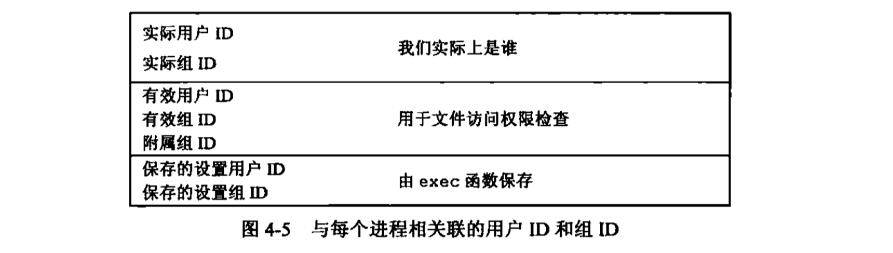
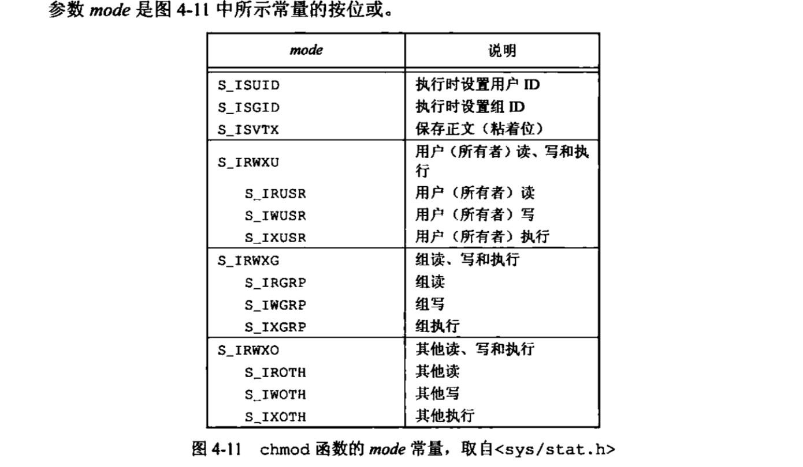
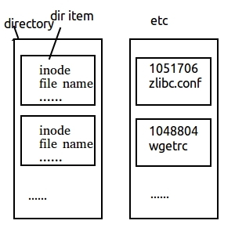
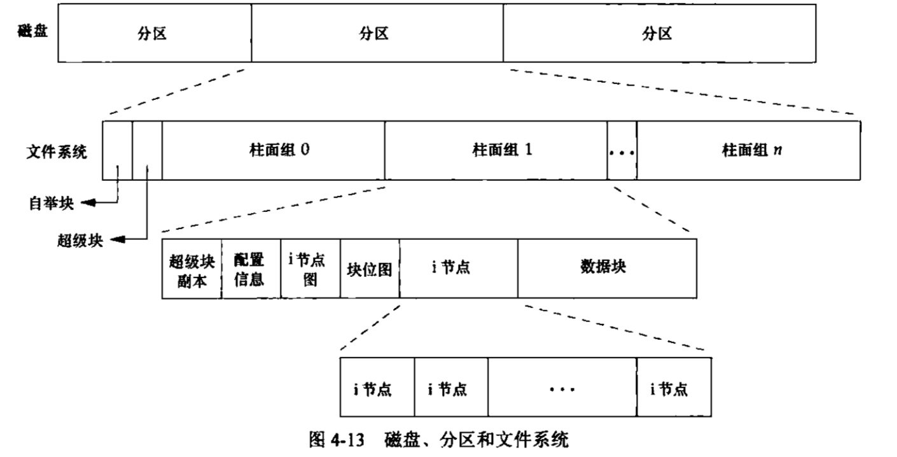

## 文件和目录
上次讲完了标准库io和文件io，这次我们来看看文件io。文件io包括打开文件，读文件，写文件，那么文件系统的权限设置怎么设置呢？文件系统还有其他特性？文件性质又是什么？从函数stat开始，逐个说明一下stat结构的每一个成员以了解文件的所有属性。包括权限管理，组管理，用户管理等。以及unix文件系统的结构和符号链接等。
### stat、fstat、fstatat和lstat
```c
#include <sys/stat.h>
int stat(const char *restrict pathname, struct stat *restrict buf);
int fstat(int fd,struct stat *buf);
int lstat(const char *restrict pathname.,struct stat *restrict buf);
int fstatat(int fd,const char *restrict pathname,struct stat *restrict buf,int flag);
// 成功，返回0，出错，返回-1
```
这段代码稍会会讲解。原文再续就书接上一回。<br>
stat的奥秘。一旦给出了pathname，那么stat函数就会返回与此命名文件相关的信息结构。我们来看看会返回什么结构。<br>
先来一个🌰
```c 
#include "../include/apue.h"

int main(int argc,char *argv[]){
    struct stat buf;
    char *ptr;
    printf("%s\n",argv[1]);
    if(stat(argv[1],&buf)<0)
        printf("stat error");
    if(S_ISREG(buf.st_mode))
            ptr = "regular";
        else if(S_ISDIR(buf.st_mode))
            ptr = "directory";
        else if(S_ISCHR(buf.st_mode))
            ptr = "charactrt special";
        else if(S_ISBLK(buf.st_mode))
            ptr = "block special";
        else if(S_ISFIFO(buf.st_mode))
            ptr = "fifo";
        else if(S_ISLNK(buf.st_mode))
            ptr = "symbolic link";
        else if(S_ISSOCK(buf.st_mode))
            ptr = "socket";
        else
            ptr = "**unknow mode **";
        printf("%s\n",ptr);
    // 所以stat是结合着S_ISDIR这些标志符号来使用的
}
```
这段例子说明什么呢，说明了stat函数是结合着使用st_mode和S_ISxxx系列的标志符号判断来使用的。那我们来看看stat这个struct都有什么<br>
<br>
(引:在linux，一个文件实际占用了多大的磁盘空间要看st_blocks的数量，而不是看st_size的大小，两个的差别可以通过调用这俩来查看。一般情况下，一个文件系统的一个block是4KB，而每个st_block是512B，所以一个有效文件占用的磁盘的空间至少为8个st_blocks。8*512B)<br>
这里面有一个struct timespec st_atime，st_mtime，st_ctime等。分别是最后访问时间，最后修改时间，最后的文件修改状态时间。都是按秒(time_t tv_sec)和纳秒(long tv_nsec)<br>
系统中使用stat函数最多的地方就是ls -l，因为真的会获取一个文件所有的相关信息。<br>
### 文件类型
目录也是一种文件类型，普通文件也是。unix系统大多数文件都是普通文件或目录。然而，还有其他文件类型，包括<br>
* 普通文件
* 目录文件。
<br>包含了其他文件的名字以及指向与这些文件有关信息的指针，对一个目录文件具有读权限的任一进程都可以读该目录的内容。翻只有内核可以直接写目录文件。进程必须使用本章介绍的函数才能更改目录。<br>
* 块特殊文件。这种类型的文件提供对设备（磁盘）带缓冲的访问，每次访问以固定长度为单位进行。(固定长度为单位)<br>
* 字符特殊文件 就是提供对设备不带缓冲的访问。每次访问的长度可以变。 **系统的所有设备要么是字符特殊文件，要么是块特殊文件**<br>
* FIFO 这种类型的文件就是用于进程间通信的，有时也称为命名管道(named pipe)
* 套接字（socket）也是一种文件，用于进程间的网络通信。套接字也可以用于一台宿主机进程之间的非网络通信。
* 符号链接（symbolic link）这种类型的文件指向另一个文件。（指向另一个文件！）<br>
st_mode的成员宏参数 `S_ISREG()`...参考上面的代码。<br>
就是说我可以通过判断是什么文件，进行不一样的文件操作。<br>
POSIX.1允许实现将进程间通信（IPC）对象（如消息队列和信号量等）说明为文件。这些宏可以从stat结构中确定IPC对象的类型。他们的参数并非st_mode，而是指向stat结构的指针。<br>
S_TYPEISMQ() message Queue, S_TYPEISSEM() segement, S_TYPEISSHM() share message<br>
```c
#include "../include/apue.h"

int main(int argc,char *argv[]){
    int i;
    struct stat buf;
    char *ptr;
    for(i = 1;i<argc;i++){
        printf("%s:",argv[i]);
        if(lstat(argv[i],&buf)<0){
            err_ret("lstat error");
            continue;
        }
        if(S_ISREG(buf.st_mode))
            ptr = "regular";
        else if(S_ISDIR(buf.st_mode))
            ptr = "directory";
        else if(S_ISCHR(buf.st_mode))
            ptr = "charactrt special";
        else if(S_ISBLK(buf.st_mode))
            ptr = "block special";
        else if(S_ISFIFO(buf.st_mode))
            ptr = "fifo";
        else if(S_ISLNK(buf.st_mode))
            ptr = "symbolic link";
        else if(S_ISSOCK(buf.st_mode))
            ptr = "socket";
        else
            ptr = "**unknow mode **";
        printf("%s\n",ptr);
    }
    exit(0);
}
```
<br>
`\`就是告诉终端还要继续下一行键入命令，然后`>`会继续提示我们继续输入。<br>
使用lstat来检测符号链接，而stat没有这个功能。<br>
### 设置用户ID和设置组ID
与一个进程相关联的ID有大于等于6个。<br>
<br>
通常，有效用户ID等于实际用户ID，有效组ID等于实际组ID<br>
每个文件有一个所有者和组所有者（own by two），所有者由stat结构中的st_uid指定，组所有者则由st_gid指定。<br>
set-user-ID和set-group-ID<br>
若文件所有者是超级用户，而且设置了该文件的设置用于ID位，那么当该程序文件由一个进程执行时，该进程具有超级用户权限。(这叫我爸是李刚，干啥都刚)<br>
### 文件访问权限
st_mode的值也是包含了对文件的访问权限位。所有文件类型都有访问权限。每个文件有9个反问权限位。<br>
<br>
文件所有者可以用chmod命令修改这9个权限位。u表示用户，g表示组，o表示其他<br>
未完待续。。。2019 1 13
续。<br>
规则：
* 打开任一类型文件，需要对所有的目录以及可能隐藏的目录执行权限。<br>
所以这就是为什么对于木枯其执行权限位常被称为搜索位的原因。<br>
举个🌰。/usr/include/stdio.h，就要对目录/、/usr和/usr/include具有执行权限，然后具有对文件本身的适当权限，取决于以何种模式打开它。<br>
也就是说，这是一个需要一关一关闯的过程。<br>
* 对于一个文件的读权限决定了我们是否能够打开现有文件进行读操作。这与open函数的 **O_RDONLY和O_RDWR**标志相关。<br>
* 对于一个文件的写权限决定了我们能不能写入。与open函数的 **O_WRONLY和O_RDWR**标志相关<br>
* 若要用open函数对一个文件指定O_TRUNC标志，必须对该文件具有 **写**权限。<br>
* 要创建一个新文件，就需要对这个目录有 **写和执行**的权限。<br>
* 删除一个现有的文件，必须有 **写和执行**的权限<br>
* 如果7个(没错就是7个)exec函数中的任何一个执行某个文件，都必须有 **执行**的权限。<br>
其实进程打开、创建或删除一个文件时，内核就进行文件访问权限的测试，而这种测试可能涉及文件的所有者(文件性质) **(st_uid)和(st_gid)**、进程的 **有效ID(uid和gid)以及进程的附属组ID(进程性质)。<br>
内核进行的测试具体如下：<br>
1. 进程有效用户ID是0，超级用户。
2. 进程有效用户ID是文件所有者，有适当的权限位被设置，允许访问，否则拒绝❌。1
3. 进程的有效组ID或进程附属组ID旨意等于文件组ID，那么如果组的适当访问权限被设置，就允许，否则❌。
4. 其他用户也一样。
### 新文件和目录的所有权
1. 新文件的用户ID设置为进程的有效用户ID。
2. 新文件的组ID可以是它所在目录的组ID。
###函数access和faccessat
```c
#include <unistd.h>
int access(const char *pathname,int mode);
int faccessat(int fd,const char *pathname,int mode,int flag);
// 成果返回0，出错返回-1
```
open函数打开一个文件，内核以进程的有效用户ID和有效组ID为基础执行其访问权限测试。但是，有时候，进程也希望按其实际用户ID和实际组ID来测试其访问能力。<br>
所以上述两个函数就是为了测试是不是可以访问的。例如mode的设置 R_OK？W_OK？X_OK?<br>
```c
#include "../include/apue.h"
#include <fcntl.h>

int main(int argc,char *argv[]){
    if(argc!=2)
        err_quit("usage:statfunc.t < pathname>\n");
    if(access(argv[1],R_OK)<0) // 这里就展示了怎么用
        err_ret("access error for %s",argv[1]);
    else
        printf("read access OK\n");
    if(open(argv[1],O_RDONLY)<0) 
    //  虽然能打开，但是通过设置用户ID程序修改能不能正常读。
        err_ret("open error for %s",argv[1]);
    else
        printf("open for reading OK\n");
    exit(0);
}
```
### umask 创建屏蔽字
```c
#include <sys/stat.h>
mode_t umask(mode_t cmask); // 返回之前的文件模式创建屏蔽字
```
cmode是由9个权限位按位或"|"构成。<br>
为什么要创建屏蔽字？<br>
st_mode屏蔽，通过S_IRUSR使用户只读，S_IWUSR 使用户只写...那么每个文件都会有相关联的9个访问权限位，而在此基础上，我们可以说明与每个进程相关联的文件模式创建屏蔽字。<br>
有什么用？<br>
```c
#include "include/apue.h"
#include <fcntl.h>
#define RWRWRW (S_IRUSR|S_IWUSR|S_IRGRP|S_IWGRP|S_IROTH|S_IWOTH)

int main(int argc,char* argv[]){
    umask(0);
    if(creat("foo",RWRWRW)<0)
        err_sys("creat error for foo");
    umask(S_IRGRP|S_IWGRP|S_IROTH|S_IWOTH); // umask禁止所有组和其他用户的访问权限
    if(creat("bar",RWRWRW)<0)
        err_sys("creat error for bar");
    exit(0);
}
/***
 * 所以实际上，umask是用来禁止权限的
 * ***/
```
所以umask是用来屏蔽权限位！按位或计算构成多个模式<br>
在编写创建新文件的程序时，如果我们想确保任何用户都能读文件，则应将umask设置为0.否则，当我们的进程运行时，有效的umask值可能关闭该权限位。<br>
umask的值越大，权限越低。<br>
### 函数chmod、fchmod和fchmodat 更改权限
```c
#include <sys/stat.h>
int chmod(const char *pathname,mode_t mode);
int fchmod(int fd,mode_t mode);
int fchmodat(int fd,const char* pathname,mode_t mode,int flag); // 成功返回0，出错返回-1
```
<br>
```c
struct stat statbuf;
if(stat("foo",&statbuf)<0)
    err_sys("stat error for foo");
if(chmod("foo",(statbuf.st_mode & ~S_IXGRP)|S_ISGID)<0)
    err_sys("chmod error for foo");
    // 这里就是修改了权限位了！ 用组合常量模式修改
 if(chmod("bar",S_IRUSR|S_IWUSR|S_IRGRP|S_IROTH)<0) // 用正常的权限位进行修改权限
     err_sys("chmod error for bar");
exit(0);
```
调用stat获得当前权限，然后修改它。惯例<br>
chmod函数更新的只是i节点最近一次被更改的时间。按系统默认方式，ls -l列出的是最后修改文件内容的时间。<br>
### 来看一下粘着位 S_ISVTX位
什么是粘着位？S_ISVTX位。粘着位是在早期的 Unix 系统中为常用的可执行程序（bin）设置的，这样可以将使用频繁的程序驻留在内存中。现在 Unix 使用了 Page Cache 技术，可以使常用的数据块驻留在内存中了，所以粘着位的作用越来越弱化了。
### 函数chown、fchown、fchownat和lchown 用于更改文件的用户ID和组ID
```c
#include <unistd.h>
int chown(const char* pathname,uid_t owner,gid_t group);
int fchown(int fd,uid_t owner,gid_t group);
int fchownat(int fd,const char* pathname,uid_t owner,gid_t group,int flag);
int lchown(const char *pathname,uid_t owner,gid_t group);
// 0 与 -1 经典
```
可以看出函数的参数类型都有uid_t和gid_t，用户id和组id。<br>
⚠️ 修改文件权限的事只能超级用户可以做，其他普通用户不可以！<br>
有一个🌰，是借鉴过来的，比较通俗易懂<br>
假设系统中有 A 和 B 两个用户，而系统对用户磁盘进行了配额限制。如果 chown(2) 这件事任何人都可以做，那么当 A 用户的磁盘配额不够用的时候，他就可以创建一个具有 0777 权限的文件夹，然后将这个文件夹的所有者修改为 B 用户，这样自己依然可以使用这个文件夹，但是却绕过了磁盘配额的限制，将帐算在了 B 用户的头上。

所以为了安全起见， chown(2) 只能由超级用户来做，普通用户不仅无法修改别人文件的所有者，也无权修改自己文件的所有者。<br>
### 文件长度
**stat结构成员st_size表示以字节为单位的文件长度** 。此字段只对普通文件、目录文件和符号链接有意义。<br>
* 普通文件。长度可以是0
* 目录，长度就是一个数(如16或512)的整数倍。
* 符号链接，文件长度是在文件名中的实际子节数
### 文件中的空洞
提及的普通文件可以包含空洞，就是由所设置的偏移量超过文件尾端，并写入了某些数据后造成这中间的一部分空洞。<br>
就是结合上面就是查到了长度很长，但是大小就不一样，很大的字节块，就表示出，这文件很多空洞。<br>
```
car file > file.copy
ls -l file*  // 可以查看
```
这样file的空洞就被填满，并且都填为0<br>
### 文件截断 truncate和ftruncate
```c
#include <unistd.h>
int truncate(const char *pathname,off_t length);
int ftruncate(int fd,off_t length);
// 0与-1 经典
```
有时候，有时候，我们需要在文件尾端处截取一些数据以缩短文件。这两函数。将一个现有文件长度截断为length。<br>
* 如果 length 参数小于文件之前的长度，则 length 个字节后面的数据将被丢弃。
* 如果 length 参数大于文件之前的长度，则在文件末尾用 '\0' 填充，使文件达到 length 指定的长度，也就是在文件的尾部创建了一个空洞。
### 文件系统 UFS
FAT 是大家所熟悉的 Dos 文件系统，它是顺序存储的单链表结构，所以单链表的缺点就是 FAT 文件系统的缺点。只能从前往后访问，不能反向访问，而且无法管理大文件。<br>
UFS 文件系统是一个与 FAT 同时代的 Unix 文件系统，但是 UFS 文件系统却是与 FAT 完全不同的文件系统，它可以很好的支持大文件，但小文件的管理却是它的弱点。<br>
下面我们介绍一下 UFS 文件系统。<br>
目录也是一个文件， 它存储的内容是一个个的目录项，而每一个目录项记录的是目录中文件的 inode 和文件名等信息（存储的不是文件数据，而是文件的信息）<br>
<br>
UFS是以Berkeley快速文件系统为基础的。<br>
尝试把一个磁盘分成一个或多个分区。每个分区可以包含一个文件系统。i节点是固定长度的记录项，包含有关文件的大部分信息。<br>
<br>
