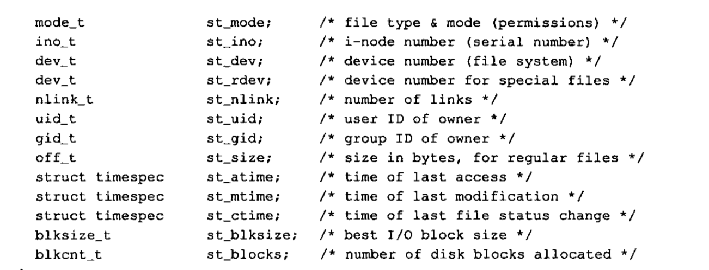
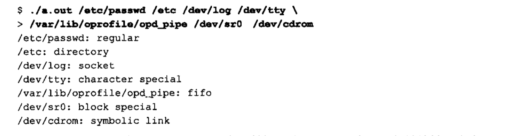
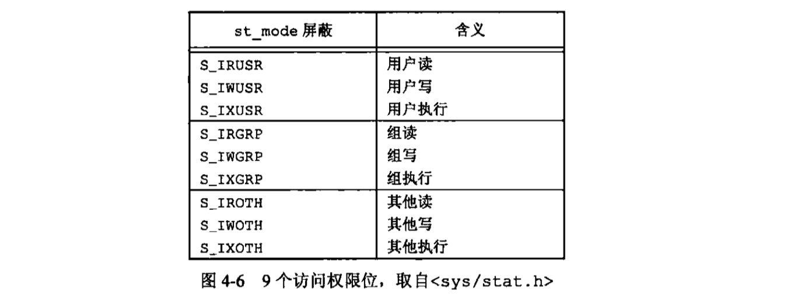

## 文件和目录
上次讲完了标准库io和文件io，这次我们来看看文件io。文件io包括打开文件，读文件，写文件，那么文件系统的权限设置怎么设置呢？文件系统还有其他特性？文件性质又是什么？从函数stat开始，逐个说明一下stat结构的每一个成员以了解文件的所有属性。包括权限管理，组管理，用户管理等。以及unix文件系统的结构和符号链接等。
### stat、fstat、fstatat和lstat
```c
#include <sys/stat.h>
int stat(const char *restrict pathname, struct stat *restrict buf);
int fstat(int fd,struct stat *buf);
int lstat(const char *restrict pathname.,struct stat *restrict buf);
int fstatat(int fd,const char *restrict pathname,struct stat *restrict buf,int flag);
// 成功，返回0，出错，返回-1
```
这段代码稍会会讲解。原文再续就书接上一回。<br>
stat的奥秘。一旦给出了pathname，那么stat函数就会返回与此命名文件相关的信息结构。我们来看看会返回什么结构。<br>
先来一个🌰
```c 
#include "../include/apue.h"

int main(int argc,char *argv[]){
    struct stat buf;
    char *ptr;
    printf("%s\n",argv[1]);
    if(stat(argv[1],&buf)<0)
        printf("stat error");
    if(S_ISREG(buf.st_mode))
            ptr = "regular";
        else if(S_ISDIR(buf.st_mode))
            ptr = "directory";
        else if(S_ISCHR(buf.st_mode))
            ptr = "charactrt special";
        else if(S_ISBLK(buf.st_mode))
            ptr = "block special";
        else if(S_ISFIFO(buf.st_mode))
            ptr = "fifo";
        else if(S_ISLNK(buf.st_mode))
            ptr = "symbolic link";
        else if(S_ISSOCK(buf.st_mode))
            ptr = "socket";
        else
            ptr = "**unknow mode **";
        printf("%s\n",ptr);
    // 所以stat是结合着S_ISDIR这些标志符号来使用的
}
```
这段例子说明什么呢，说明了stat函数是结合着使用st_mode和S_ISxxx系列的标志符号判断来使用的。那我们来看看stat这个struct都有什么<br>
<br>
这里面有一个struct timespec st_atime，st_mtime，st_ctime等。分别是最后访问时间，最后修改时间，最后的文件修改状态时间。都是按秒(time_t tv_sec)和纳秒(long tv_nsec)<br>
系统中使用stat函数最多的地方就是ls -l，因为真的会获取一个文件所有的相关信息。<br>
### 文件类型
目录也是一种文件类型，普通文件也是。unix系统大多数文件都是普通文件或目录。然而，还有其他文件类型，包括<br>
* 普通文件
* 目录文件。
<br>包含了其他文件的名字以及指向与这些文件有关信息的指针，对一个目录文件具有读权限的任一进程都可以读该目录的内容。翻只有内核可以直接写目录文件。进程必须使用本章介绍的函数才能更改目录。<br>
* 块特殊文件。这种类型的文件提供对设备（磁盘）带缓冲的访问，每次访问以固定长度为单位进行。(固定长度为单位)<br>
* 字符特殊文件 就是提供对设备不带缓冲的访问。每次访问的长度可以变。 **系统的所有设备要么是字符特殊文件，要么是块特殊文件**<br>
* FIFO 这种类型的文件就是用于进程间通信的，有时也称为命名管道(named pipe)
* 套接字（socket）也是一种文件，用于进程间的网络通信。套接字也可以用于一台宿主机进程之间的非网络通信。
* 符号链接（symbolic link）这种类型的文件指向另一个文件。（指向另一个文件！）<br>
st_mode的成员宏参数 `S_ISREG()`...参考上面的代码。<br>
就是说我可以通过判断是什么文件，进行不一样的文件操作。<br>
POSIX.1允许实现将进程间通信（IPC）对象（如消息队列和信号量等）说明为文件。这些宏可以从stat结构中确定IPC对象的类型。他们的参数并非st_mode，而是指向stat结构的指针。<br>
S_TYPEISMQ() message Queue, S_TYPEISSEM() segement, S_TYPEISSHM() share message<br>
```c
#include "../include/apue.h"

int main(int argc,char *argv[]){
    int i;
    struct stat buf;
    char *ptr;
    for(i = 1;i<argc;i++){
        printf("%s:",argv[i]);
        if(lstat(argv[i],&buf)<0){
            err_ret("lstat error");
            continue;
        }
        if(S_ISREG(buf.st_mode))
            ptr = "regular";
        else if(S_ISDIR(buf.st_mode))
            ptr = "directory";
        else if(S_ISCHR(buf.st_mode))
            ptr = "charactrt special";
        else if(S_ISBLK(buf.st_mode))
            ptr = "block special";
        else if(S_ISFIFO(buf.st_mode))
            ptr = "fifo";
        else if(S_ISLNK(buf.st_mode))
            ptr = "symbolic link";
        else if(S_ISSOCK(buf.st_mode))
            ptr = "socket";
        else
            ptr = "**unknow mode **";
        printf("%s\n",ptr);
    }
    exit(0);
}
```
<br>
`\`就是告诉终端还要继续下一行键入命令，然后`>`会继续提示我们继续输入。<br>
使用lstat来检测符号链接，而stat没有这个功能。<br>
### 设置用户ID和设置组ID
与一个进程相关联的ID有大于等于6个。<br>
<br>
通常，有效用户ID等于实际用户ID，有效组ID等于实际组ID<br>
每个文件有一个所有者和组所有者（own by two），所有者由stat结构中的st_uid指定，组所有者则由st_gid指定。<br>
set-user-ID和set-group-ID<br>
若文件所有者是超级用户，而且设置了该文件的设置用于ID位，那么当该程序文件由一个进程执行时，该进程具有超级用户权限。(这叫我爸是李刚，干啥都刚)<br>
### 文件访问权限
st_mode的值也是包含了对文件的访问权限位。所有文件类型都有访问权限。每个文件有9个反问权限位。<br>
<br>
文件所有者可以用chmod命令修改这9个权限位。u表示用户，g表示组，o表示其他<br>
未完待续。。。2019 1 13
续。<br>
规则：
* 打开任一类型文件，需要对所有的目录以及可能隐藏的目录执行权限。<br>
所以这就是为什么对于木枯其执行权限位常被称为搜索位的原因。<br>
举个🌰。/usr/include/stdio.h，就要对目录/、/usr和/usr/include具有执行权限，然后具有对文件本身的适当权限，取决于以何种模式打开它。<br>
也就是说，这是一个需要一关一关闯的过程。<br>
* 对于一个文件的读权限决定了我们是否能够打开现有文件进行读操作。这与open函数的 **O_RDONLY和O_RDWR**标志相关。<br>
* 对于一个文件的写权限决定了我们能不能写入。与open函数的 **O_WRONLY和O_RDWR**标志相关<br>
* 若要用open函数对一个文件指定O_TRUNC标志，必须对该文件具有 **写**权限。<br>
* 要创建一个新文件，就需要对这个目录有 **写和执行**的权限。<br>
* 删除一个现有的文件，必须有 **写和执行**的权限<br>
* 如果7个(没错就是7个)exec函数中的任何一个执行某个文件，都必须有 **执行**的权限。<br>
其实进程打开、创建或删除一个文件时，内核就进行文件访问权限的测试，而这种测试可能涉及文件的所有者(文件性质) **(st_uid)和(st_gid)**、进程的 **有效ID(uid和gid)以及进程的附属组ID(进程性质)。<br>
内核进行的测试具体如下：<br>
1. 进程有效用户ID是0，超级用户。
2. 进程有效用户ID是文件所有者，有适当的权限位被设置，允许访问，否则拒绝❌。1
3. 进程的有效组ID或进程附属组ID旨意等于文件组ID，那么如果组的适当访问权限被设置，就允许，否则❌。
4. 其他用户也一样。
### 新文件和目录的所有权
1. 新文件的用户ID设置为进程的有效用户ID。
2. 新文件的组ID可以是它所在目录的组ID。
###函数access和faccessat
```c
#include <unistd.h>
int access(const char *pathname,int mode);
int faccessat(int fd,const char *pathname,int mode,int flag);
// 成果返回0，出错返回-1
```
open函数打开一个文件，内核以进程的有效用户ID和有效组ID为基础执行其访问权限测试。但是，有时候，进程也希望按其实际用户ID和实际组ID来测试其访问能力。<br>
所以上述两个函数就是为了测试是不是可以访问的。例如mode的设置 R_OK？W_OK？X_OK?<br>
```c
#include "../include/apue.h"
#include <fcntl.h>

int main(int argc,char *argv[]){
    if(argc!=2)
        err_quit("usage:statfunc.t < pathname>\n");
    if(access(argv[1],R_OK)<0) // 这里就展示了怎么用
        err_ret("access error for %s",argv[1]);
    else
        printf("read access OK\n");
    if(open(argv[1],O_RDONLY)<0) 
    //  虽然能打开，但是通过设置用户ID程序修改能不能正常读。
        err_ret("open error for %s",argv[1]);
    else
        printf("open for reading OK\n");
    exit(0);
}
```
### umask 创建屏蔽字
```c
#include <sys/stat.h>
mode_t umask(mode_t cmask); // 之前文件模式创建屏蔽字
```
为什么要创建屏蔽字？