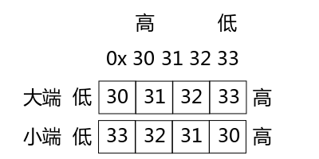

## 网络IPC Socket编程
网络应用程序，比如ftp、svn、甚至QQ、迅雷等等，它们的通讯双方通常都是在不同的机器上的，那么它们的通讯📞就是跨主机的进程间通讯📞了，所以在网络通讯📞了，所以网络通讯就是一种进程间通讯📞的手段。<br>
跨主机的程序在传输数据之前要制定严谨的协议，不然对方可能会看不懂你发送的数据，这就好像进程间通讯📞的消息队列，商量好协议发送，不然甚至可能草成安全类bug，所以跨主机的通讯就不像我们之前学习的在同一台主机上的进程间通讯那么简单了。<br>
怎么制定协议？<br>
* 告诉对方自己的ip和端口<br>

发送和接收数据一般都用同一个端口，特殊情况会使用别的端口或多个端口<br>
* 考虑通信双方应该采用什么数据类型了？<br>

假设通讯双方要传送一个int类型的数据，那么对方机器上int类型的位数与我们机器上的位数是否相同呢？也就是说，在我机器上是32bit，但是在对方的机器上也是32bit吗？假设对方机器上是16bit。那么我发送给它的int值能正确解析吗？因此， **通信双方的数据类型要采用完全一致的约定**。下面会讨论如何让数据类型一致<br>

* 考虑字节序问题，就是大小端的问题
大端地址格式: 低地址存放高位数据，高地址存放低位数据。<br>
小端格式是: 低地址存放低位数据，高地址存放高位数据。<br>

<br>
如图，假设要存放的数据是0x30313233，那么33是低位，30是高位，大端格式，30存低位，33存高位。小端，33存低位，30存高位。<br>
这些东西有什么用呢？其实就是我们使用的网络设备(计算机，平板电脑，智能手机等等)在内存当中存储数据的格式。所以如果通讯双方的设备存储数据的格式不同，那么发送方一端发送数据，接收方也无法正确解析，这可怎么办？这个时候，就会有一组函数可以实现字节序转换。<br>
##### 字节序转换
```c
htonl,  htons,  ntohl,  ntohs - convert values between host and network byte order
// h 代表host，主机，n是network，表示网络
#include <arpa/inet.h>

uint32_t htonl(uint32_t hostlong);
// l代表long，s表示short 从主机序转换为网络序
uint16_t htons(uint16_t hostshort);

uint32_t ntohl(uint32_t netlong);
// 数据从网络序转换为主机序
uint16_t ntohs(uint16_t netshort);
```
网字节序一般都是大端的，而主机字节序则根据硬件平台的不同而不同(x86平台和绝大多数的ARM平台都是小端)。所以为了简化我们编程的复杂度，这些函数的内部会根据当前的结构自动为我们选择是否要转换数据的字节序。我们不用管到底我们自己主机采用的是什么字节序， **只要是从主机发送数据到网络就需要调用hton函数， 从网络接收数据到主机就需要调用ntoh函数**。<br>
* 最后一项约定是结构体成员不对齐，由于数据对其也是与硬件平台相关的，所以不同的主机如果使用不同的对齐方式，就会导致数据无法解析。

如何使数据不对齐呢？只需要在定义结构体的时候在结尾添加__attribute__((packed))就可以了，🌰
```c
struct msg_st{
    uint8_t name[NAMESIZE];
    uint32_t math;
    uint32_t chinese;
}__attribute__((packed));
```
网络传输的结构体中的成员都是紧凑的，所以不能地址对齐，需要在结构体外面增加__attribute__((packed))。<br>

##### 字节对齐 起始地址%sizeof(type) == 0 结构体的地址对齐
结构体的地址对齐是通过起始地址%sizeof(type) == 0这个公式计算的，也就是说存放数据的起始地址位于数据类型本身长度的整倍数。<br>
如果当前成员的起始地址能被sizeof整出，就可以把数据存放在这；否则就得🉐️继续看下一个地址能不能被sizeof整除，直到找到合适的地址为止。不适合作为起始地址的空间将被空(lang)闲(fei)。<br>
<br>

### 网络应用编程 按部就班
从进程间通信开始，我们就是一步一步按部就班写程序，编写网络应用也是一样，网络通信本质上就是一种跨主机的进程间通信(IPC)。<br>

主动端|被动端
|--|--|
取得Socket|取得Socket
给Socket取得地址(可省略，不必与操作系统约定端口，由操作系统制定随机端口)|给Socket取得地址
发/收消息|收/发消息
关闭Socket|关闭Socket

举个🌰<br>
协议商议好
```c
#ifndef PROTO_H__
#define PROTO_H__

#include <stdint.h>

#define RCVPORT "8089"
#define NAMESIZE 13

struct msg_st{
    uint8_t name[NAMESIZE];
    uint32_t math;
    uint32_t chinese;
}__attribute__((packed)); 
// 这里对齐
#endif
```
接收端先启动
```c
#include "../include/apue.h"
#include <arpa/inet.h>
#include <sys/types.h>
#include <sys/socket.h>

#include "proto.h"

#define IPSTRSIZE 64

int main(){
    int sd; // socket的文件描述符
    struct sockaddr_in laddr,raddr;
    socklen_t raddr_len;

    struct msg_st rbuf;
    char ipstr[IPSTRSIZE];

    sd = socket(AF_INET,SOCK_DGRAM,0); // UDP
    if(sd < 0) err_sys("socket()");

    laddr.sin_family = AF_INET;
    // 接收端口
    laddr.sin_port = htons(atoi(RCVPORT));
    // 配置地址
    inet_pton(AF_INET,"0.0.0.0",&laddr.sin_addr.s_addr);

    if(bind(sd,(void*)&laddr,sizeof(laddr))<0) err_sys("bind()");
    raddr_len = sizeof(raddr);

    while(1){
        // 从哪里接收
        if(recvfrom(sd,&rbuf,sizeof(rbuf),0,(void*)&raddr,&raddr_len)<0) err_sys("recvfrom()");

        inet_ntop(AF_INET,&raddr.sin_addr,ipstr,IPSTRSIZE);
        printf("--MESSAGE FROM:%s:%d--\n",ipstr,ntohs(raddr.sin_port));
        printf("Name = %s\n",rbuf.name);
        printf("Math = %d\n",ntohl(rbuf.math));
        printf("Chinese = %d\n",ntohl(rbuf.chinese));
    }
    close(sd);
    exit(0);
}
```
发送端，作为主动端，主动向另一端发送信息。这端可以不用向操作系统绑定端口，发送数据的时候，由操作系统为我们分配可用的端口即可
```c
#include "../include/apue.h"
#include <arpa/inet.h>
#include <sys/types.h>
#include <sys/socket.h>
#include <string.h>

#include "proto.h"

int main(int argc,char **argv){
    int sd;
    struct msg_st sbuf;
    struct sockaddr_in raddr;
    
    if(argc<2) err_sys("Usage ...\n");

    sd = socket(AF_INET,SOCK_DGRAM,0);

    if(sd<0) err_sys("socket()");

    // bind(); 主动端可省略绑定端口的步骤

    memset(&sbuf,'\0',sizeof(sbuf));
    strcpy(sbuf.name,"Trans");
    // 字节序转换
    sbuf.math = htonl(rand()%100);
    sbuf.chinese = htonl(rand()%100);
    // 配置协议
    raddr.sin_family = AF_INET;
    // 发送到指定端口
    raddr.sin_port = htons(atoi(RCVPORT));
    inet_pton(AF_INET,argv[1],&raddr.sin_addr);
    // 发送
    if(sendto(sd,&sbuf,sizeof(sbuf),0,(void*)&raddr,sizeof(raddr))<0) err_sys("sendto");

    puts("ok!");

    close(sd);
    exit(0);
}
```
这三个文件组成的程序就可以进行网络通讯📞了。无论发送端还是接收端都是固定的步骤执行，无论是tcp流协议还是udp包协议。<br>
根据上面的代码中的协议proto.h的定义，msg_st结构体中的name的长度是固定的，所以就修改为变长结构。<br>
修改成变长结构体很简单，只需要把变长的部分放到结构体的最后面，然后通过malloc动态内存管理来为它分配我们需要的大小<br>
```c
struct msg_st{
    uint32_t math;
    uint32_t chinese;
    uint8_t name[1];
}__attribute__((packed));
```

UDP包常规最大尺寸是512字节，去掉包头的8字节，在去掉结构体中除了最后一个成员意外其他成员大小的总和，剩下的就是我们最后一个成员最大能分配的大小。<br>

操作一个文件<br>
* open(获得文件描述符)->read、write读写文件->close关闭文件、释放相关资源。<br>
没错，在Linux的一切皆文件的设计理念中，网络也是文件，网络之间的通讯📞也可以像操作文件一样，对它进行读写。<br>
* socket(获得文件描述符)->send、sendto、recv、recvfrom(读写数据，相当于在网络收发数据)->close函数关闭网络，释放相关资源。

```c
socket - create an endpoint for communication
#include <sys/types.h>
#include <sys/socket.h>
// 用来获取对网络操作的文件描述符，就像open一样
int socket(int domain,int type,int protocol);
```
domain:协议簇；type:链接🔗方式(一般TCP/UDP)；protocol:具体协议。<br>
在domain的协议簇中每一个对应type都有一个或多个协议，使用协议簇中默认的协议可以填写0。<br>
返回值:如果成功，返回的是一个代表当前网络链接的文件📃描述符，你要保存好它，因为后续的网络操作都需要它。如果失败，返回-1，并设置errno<br>

以下就是Linux支持的协议簇，也就是domain参数可以选择的宏，定义在sys/socket.h头文件中<br>

名字|定义
|--|--|
AF_UNIX、AF_LOCAL|本地协议
AF_INET|IPV4协议
AR_INET|IPV6协议
AF_IPX|Novell当年是网络的代名词，是非常古老的操作系统，出现在TCP/IP之前
AF_NETLINK|是用户态与内核态通信的协议
AF_X25|很早协议
AF_APPLETALK|苹果使用的一个局域网协议
AF_PACKET|底层socket所用到的协议，比如抓包器所遵循的协议一定要在网卡驱动层，而不能用在应用层，否则无法见到包封装📦的过程。

type参数

套接字|定义
|--|:--|
SOCK_STREAM|流式套接字，特点是有序、可靠。有序，双工，基于链接的，以字节流为单位的

**可靠** 不是指不丢包，而是流式套接字保证只要你能接收到这个包，包的完整性一定是正确的<br>
**双工** 是指双方都能收发<br>
**基于链接🔗** 是指三次握手，保证链接<br>
**字节流** 指数据没有明显的界限，一端数据可以分为任意多个包发送<br>

套接字|定义
|--|:--|
SOCK_DGRAM|报式套接字，无连接，固定的最大长度，不可靠的消息(不一定收到，反正就在路上跑)
SOCK_SEQPACKET|提供有序、可靠、双向基于链接的数据报通信
SOCK_RAW|原始的套接字，提供的是网络协议层的访问
SOCK_RDM|数据层的访问，不保证传输顺序

#### bind 用于绑定本机端口
```c
bind - bind a name to socket

#include <sys/types.h>
#include <sys/socket.h>

int bind(int sockfd,const struct sockaddr *addr,socklen_t addrlen);
// 用于绑定本机端口，提前跟操作系统约定好，来自xx的端口的数据都要转交给我(当前进程)处理，并且独占这个端口
```
* sockfd: 文件描述符，表示对网络链接绑定端口
* addr: 要绑定到套接字上的地址。根据不同的协议，例如使用domain是AF_INET，通过man ip可以看出来这个结构体的

```c
struct sockaddr_in {
sa_family_t sin_family; /* 指定协议族，一定是 AF_INET，因为既然是 man ip(7)，那么一定是 AF_INET 协议族的 */
in_port_t sin_port; /* 端口，需要使用 htons(3) 转换为网络序 */
struct in_addr sin_addr; /* internet address */
};

/* Internet address. */
struct in_addr {
uint32_t s_addr; /* 无符号32位大整数，可以使用 inet_pton(3) 将便于记忆的点分式 IP 地址表示法转换为便于计算机使用的大整数，inet_ntop(3) 的作用则正好相反。本机地址转换的时候可以使用万能IP：0.0.0.0(称为any address)，函数会自动将 0.0.0.0 解析为真实的本机 IP 地址。 */
};
```
* addrlen:addr传递的地址结构体的长度

struct sockaddr_in与sockaddr，传参的时候直接把实参强转称void*类型。

#### recv和recvfrom函数从网络接收内容，并写入len字节长度的数据到buf中，且将发送端的地址信息填写到src_addr中
```c
recv, recvfrom - receive a message from a socket

#include <sys/types.h>
#include <sys/socket.h>

ssize_t recv(int sockfd, void *buf, size_t len, int flags);
// 用于流式 SOCK_STREAM
ssize_t recvfrom(int sockfd, void *buf, size_t len, int flags,struct sockaddr *src_addr, socklen_t *addrlen);
// 用于报式(SOCK_DGRAM)
```
返回真正能接收的字节数，返回-1表示失败。<br>
recv没有地址相关的参数，而recvfrom函数则会将对方的地址端口等信息回填给调用者。<br>
网络中的数据只有单字节数据不用考虑字节序，从网络接收过来的数据只要设计字节序就需要使用ntoh系列函数进行字节序转换<br>

netstat ant可以查看TCP链接情况，netstat anu可以查看UDP链接情况<br>

#### send和sendto函数 向网络发数据
```c
send, sendto, sendmsg - send a message on a socket

#include <sys/types.h>
#include <sys/socket.h>

ssize_t send(int sockfd, const void *buf, size_t len, int flags);
// 用于流式 SOCK_STREAM
ssize_t sendto(int sockfd, const void *buf, size_t len, int flags,const struct sockaddr *dest_addr, socklen_t addrlen);
// 用于报式(SOCK_DGRAM)
```
* sockfd:通过哪个Socket往外发数据，调用socket函数时取得
* buf:要发送的数据
* len: 要发送的数据的长度
* flags: 特殊要求，没有填0
* src_addr: 目的地址，具体使用什么结构体，通过man手册查
* addrlen: 目的地址长度

返回值时真正发送出去的数据长度，出现错误❌返回-1，并设置errno<br>
上面讲得是单点通讯，多点通信只能用报式套接字(SOCK_DAGRAM)来实现<br>
#### 多点通讯📞 SOCK_DAGRAM
多点通信分为: **广播和多播(组播)两种**<br>
广播分为 **全网广播📢(255.255.255.255)和子网广播** 两种方式<br>
多播: D类地址，以224.开头。244.0.0.1是一个组播中的特殊地址，f发到这个地址的消息会强制所有组播地址中的主机接收，类似全网广播📢<br>
⚠️广播📢和组播仅在局域网内有效<br>

##### getsockopt和setsockopt函数
```c
getsockopt, setsockopt - get and set options on sockets

#include <sys/types.h>
#include <sys/socket.h>

int getsockopt(int sockfd, int level, int optname,void *optval, socklen_t *optlen);
// 读取套接字 特殊要求
int setsockopt(int sockfd, int level, int optname,const void *optval, socklen_t optlen);
// 设置套接字 特殊要求
```
对sockfd这个套接字的level层的optname选项进行设置，值放在optval里，大小是optlen。<br>
**对应关系:一个sock有多个level，每个level有多个选项optname** 需要在man手册查看不同协议的所有选项。<br>

常用optname参数:<br>
* SO_BROADCAST: 设置或获取广播📢。当这个标识被打开的时候才允许接收和发送报式套接字广播📢，所以大家使用广播📢的时候不要忘记设置opt，但是在流式套接字中无效。<br>
* IP_MULTICAST_IF:创建多播组，optval参数应该使用ip_mreqn还是ip_mreq结构体，取决于IP_ADD_MEMBERSHIP选项

```c
struct ip_mreqn {
    struct in_addr imr_multiaddr; 
    /* 多播组 IP 地址，大整数，可以用 inet_pton(3) 将点分式转换为大整数 */
    struct in_addr imr_address; 
    /* 本机 IP 地址，可以用 0.0.0.0 代替，大整数，可以用 inet_pton(3) 将点分式转换为大整数 */
    int imr_ifindex; 
    /* 当前使用的网络设备的索引号，ip ad sh 命令可以查看编号，用 if_nametoindex(3) 函数也可以通过网络设备名字获取编号，名字就是 ifconfig(1) 看到的名字，如 eth0、wlan0 等 */
};
```
IP_ADD_MEMBERSHIP:加入多播组<br>

#### 丢包与校验 丢包的根本原因是拥塞
UDP丢包，很常见，那为什么会丢包呢？这个在我讲过的[深入tcp与udp机制讲过](../tcp_ip/TCP与UDP.md) 不同的请求会选择不同的路径经过不同的路由器，这些包就会在到达路由器的时候会进入路由器的等待队列，当路由器比较繁忙的时候，队列就会满，满了就会在各个路由器根据不同的算法丢弃多余的包，一般是丢弃新来的包或随机丢弃包。所以这就是 **满则溢。**<br>

ping命令TTL是一个数据包能够经过的路由器数量的上限，经过一个路由就减一，这个上限在Linux环境里默认是64，在Windows是128。还有差错报文也可以了解一下tracroute可以检测一个包到另一端要有多少跳。<br>

##### 流量控制 解决丢包的方法
令牌桶就是用来控制流的，流控分为开环式和闭环式。<br>
在这里介绍一种停等式流控: **一种闭环式流控**。它的实现方式很简单，一问一答即可。就是发送方每次发送一个数据包之后要等待接收方的响应，确认接收方收到了自己的数据包后再发送下一个数据包。这种方式的特点就是每次等待的时间是不确定的，因为每次发包走的路径是不同的，所以包到达目的地的时间也是不同的，而且还要受网络等环境因素影响。<br>

停等式缺点(停停等等)<br>
* 浪费时间，多数之间花在了等待响应上
* 双方发送包的数量增加，丢包率高
* 为降低错误率，实现复杂度较高。需要加编号，怕发重

停🤚等式流控虽然上升了丢包率，但是能保证对方一定能收到数据包。<br>
##### web传输通常采用两种校验方案
* 不做硬性校验: 交给用户刷新
* 延迟应答: 下次通讯的时候把上次的ack带过来，表示上次的通讯是完整的

拥塞会带来延迟抖动问题，每一帧延迟没问题，就怕有些帧很慢，其他帧正常，这就乱了。<br>

##### 滑动窗口和拥塞窗口提高速度，做拥塞控制
使用窗口协议的停等式流控。一下子发送协议好的多个包，应答又应答多个包。主要是改变流控的速率，这样就可以平衡丢包率和传输速率之间的杠杆。<br>

#### 可靠的司机🚗，TCP
TCP三次握手，TCP主要是客户端先发起请求，所以客户端可以称为"主动端"，而服务器被动接收请求，所以服务端也可以称为"被动端"。往往服务端要先运行起来，然后客户端再发消息，这样客户端发送的包不会因为找不到目的地址而被丢弃。<br>
##### 半连接池 SYN+ACK链接信息
服务端收到客户端发来的 SYN 报文后，会响应 SYN+ACK 报文给客户端，并将当前链接的一些信息放入一个叫做“半链接池”的缓冲区中，当超过一定时间后该客户端没有返回 ACK 报文，服务端再把这个半链接从半链接池中移除，释放相关资源。<br>

只要出现了“XX池”，那么该池的容量终归是有限的，所以有一种下流的拒绝服务攻击手段就是利用大量的半链接把服务端的半链接池沾满，以实现拒绝服务攻击。例如当很多肉鸡向某台服务器发送第一次握手（FIN）却永远不发送第三次握手（ACK），这样很快就把服务器的半链接池沾满了，有效的用户也就无法请求服务器了，这就是下流的半链接攻击手段的大致原理。<br>

防范半链接的手段就是取消半链接池，然后通过一个算法为每个链接计算出一个独一无二的标识，再把这个标识放入 cookie 中通过 ACK 返回给客户端。cookie 由内核产生，仅保留这一秒和上一秒的 cookie。当用户再次请求时需要带着这个 cookie，用相同的 cookie 计算，只要与用户带来的 cookie 相同就认为是合法用户，如果不相同就用上一秒的cookie再次计算和比较，如果还不相同，就认为用户的cookie 是伪造的或是超时的，所以用户会立即重新建立第一次握手。<br>

**cookie计算公式：本机IP+本机端口+对端IP+对端端口 | Salt**<br>

其实在实践当中也会保留半链接池，里面仅仅存放频繁访问的用户来优化 cookie 方式的链接。<br>

#### TCP握手后，如何用TCP协议实现收发数据
TCP步骤: 
* S端: 取得SOCKET IPPROTO_SCTP(一种新协议，实现流式套接字)->给SOCKET取得地址bind->将SOCKET置为监听模式(listen)backlog参数，写正整数->接收连接(accept)->收/发消息(send)->关闭(close)<br>
以上的接收连接要注意，如果成功就返回接受连接的文件描述符，失败就返回-1并设置errno。⚠️这里不能直接用存放之前的socket返回的文件描述符变量来接收accept的返回值，因为accept可能会遇到假错❌，这样之前变量里保存的文件描述符就丢了，会导致内存泄漏。<br>

* C端: 取得SOCKET->给SOCKET取得地址->发起连接connect->收发消息->close

协议头文件
```c
#ifndef PROTO_H__
#define PROTO_H__
// 服务器端口号
#define SERVERPORT "8086"
#define FMT_STAMP "%lld\r\n"

#endif // !1
```
服务端，先运行起来，监听制定端口，操作系统指定的端口收到数据后就会送到服务端程序这里来。<br>
```c
#include "../include/apue.h"
#include <arpa/inet.h>
#include <sys/types.h>
#include <sys/socket.h>

#include "proto.h"

#define IPSTRSIZE 40

static void server_job(int sd){
    char buf[BUFSIZ];
    int len;

    len = sprintf(buf,FMT_STAMP,(long long)time(NULL));

    if(send(sd,buf,len,0)<0) err_sys("send()");
    return;
} 

int main(){
    int sd,newsd;
    struct sockaddr_in laddr,raddr;
    socklen_t raddr_len;
    char ipstr[IPSTRSIZE];
    // 选择TCP协议
    sd = socket(AF_INET,SOCK_STREAM,0);
    if(sd<0) err_sys("socket()");
    // SO_REUSEADDR用来设置端口被释放后可立即被重新使用
    int val = 1;
    if(setsockopt(sd,SOL_SOCKET,SO_REUSEADDR,&val,sizeof(val))<0) err_sys("setsockopt()");

    laddr.sin_family = AF_INET;
    // 指定服务端使用的端口号
    laddr.sin_port = htons(atoi(SERVERPORT));
    inet_pton(AF_INET,"0.0.0.0",&laddr.sin_addr.s_addr);

    // 绑定端口
    if(bind(sd,(void*)&laddr,sizeof(laddr))<0) err_sys("bind()");
    
    // 开始监听端口

    if(listen(sd,200)<0) err_sys("listen()");
    raddr_len = sizeof(raddr);

    while(1){
        // 阻塞等待新消息传入
        newsd = accept(sd,(void*)&raddr,&raddr_len);
        // 这里就是怕假错，而且文件描述符不能用开始哪个！
        if(newsd<0){
            if(errno == EINTR||errno == EAGAIN)
                continue;
            err_sys("newsd()");
        }
        inet_ntop(AF_INET,&raddr.sin_addr,ipstr,IPSTRSIZE);
        printf("Client:%s:%d\n",ipstr,ntohs(raddr.sin_port));
        server_job(newsd);
        close(newsd);
    }
    close(sd);
    exit(0);
}
```
客户端，主动端，发送端口可以不用手动指定而由操作系统来随机分配一个未被占用的端口
```c
#include "../include/apue.h"
#include <arpa/inet.h>
#include <sys/types.h>
#include <sys/socket.h>

#include "proto.h"

int main(int argc,char **argv){
    int sd;
    FILE *fp;
    struct sockaddr_in raddr;
    long long stamp;
    if(argc<2) err_sys("Usage...\n");

    // TCP协议
    sd = socket(AF_INET,SOCK_STREAM,0);
    if(sd < 0) err_sys("socket()");

    raddr.sin_family = AF_INET;
    // 指定端口号
    raddr.sin_port = htons(atoi(SERVERPORT));
    // 指定ip
    inet_pton(AF_INET,argv[1],&raddr.sin_addr);
    // 发起请求
    if(connect(sd,(void*)&raddr,sizeof(raddr))<0) err_sys("connect()");

    fp = fdopen(sd,"r+");
    if(fp == NULL) err_sys("fdopen()");

    // 读取服务端响应
    if(fscanf(fp,FMT_STAMP,&stamp)<1) fprintf(stderr,"fscanf() failed\n");
    else
    {
        printf("stamp = %lld\n",stamp);
    }
    fclose(fp);
    exit(0);
}
```
一般这个时候，要是终止服务端，端口还会继续占用，被进程占用，一般等会就会这个端口又可以用了，但是一般我们要设置就是再setsockopt函数设置，optname设置为SO_REUSEADDR就可以设置如果当前端口死了，就可以重新使用这个端口。<br>
