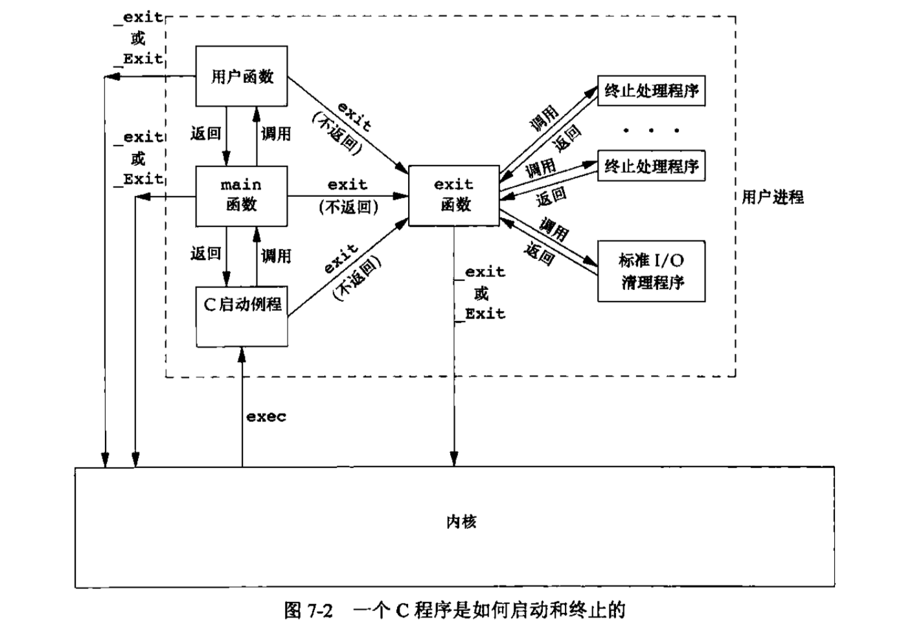
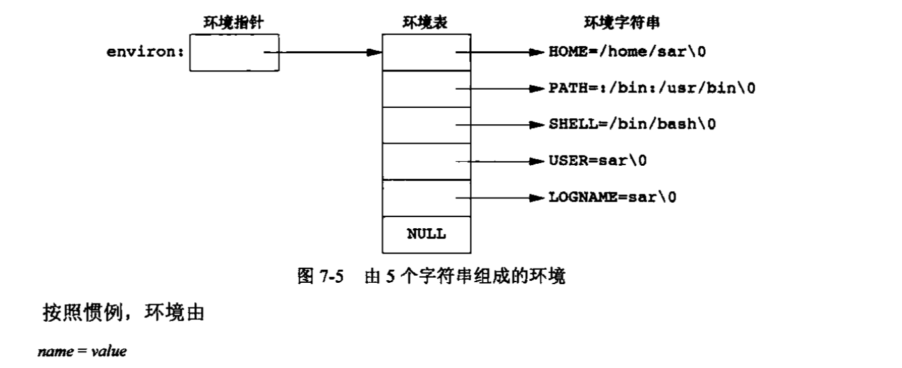
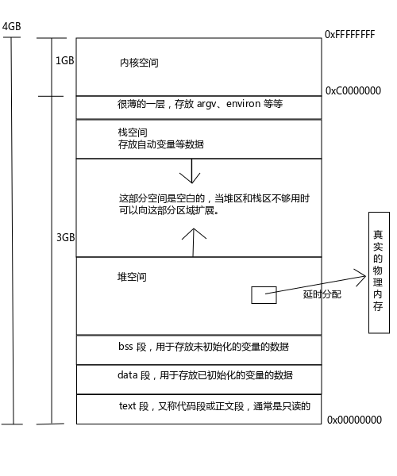

## 进程环境
### main函数
当内核执行C程序时(使用一个exec函数)，在调用main前先调用一个 **特殊的启动例程**。可执行程序文件将此启动例程指定为程序的起始地址--这是由链接编辑器设置的，而 **链接编辑器则由C编译器调用**。启动例程从内核取得命令行参数和环境变量值，然后为按上述方式调用main函数做好安排。<br>
### 进程终止
5种正常终止(termination)。
1. 从main返回 return 0; 只有在main中才能结束进程
2. 调用exit exit(0)专门用来结束进程的 程序任何地方都可以使用，并且退出进程，较于return不行，return是只退出当前函数。
3. 调用_exit或_Exit _exit(0)
4. 最后一个线程从启动例程返回
5. 从最后一个线程调用pthread_exit<br>
3种异常终止
1. 调用abort 出现了不可预知的错误，为了避免异常影响范围扩大，调用abort自杀。实际上越是通过信号完成的
2. 接到一个信号 信号有很多种，有些默认动作是被忽略的，有些默认动作则是杀死进程
3. 最后一个线程对取消请求做出响应<br>
进程是线程的容器，最后一个线程的结束会kill掉一个进程。<br>
#### atexit
```c
#include <stdlib.h>

int atexit(void (*func)(void));// 成功，返回0，出错，返回非0
```
atexit的参数是一个函数地址，当调用此函数时，无需向它传递任何参数，也不期望他会返回一个值。exit调用这些函数的顺序与他们登记时候顺序相反。(栈)<br>
<br>
内核使程序执行的唯一方法是调用一个exec函数。进程自愿终止的唯一方法是显式或隐式地(通过调用exit)调用_exit或_Exit。进程也可非自愿地由一个信号使其终止。<br>
```c
    if(atexit(my_exit2)!=0)
        err_sys("can't re");
    if(atexit(my_exit1)!=0)
        err_sys("can't re");
    if(atexit(my_exit1)!=0)
        err_sys("can't re");
    return 0;
```
**钩子函数:**注册的钩子函数形式必须是这样：void (*function)(void)，因为它不会接收任何参数，也没有任何机会返回什么值，所以是一个无参数无返回值的函数。
```c
    puts("Begin!");
    if(atexit(my_exit2)!=0)
        err_sys("can't re");
    if(atexit(my_exit1)!=0)
        err_sys("can't re");
    if(atexit(my_exit1)!=0)
        err_sys("can't re");
    puts("End!");
```
为什么 "End!" 先输出了，而 "f3" 后输出了呢？因为使用 atexit(3) 函数注册钩子函数的时候并不会调用钩子函数，仅仅是注册而已，只有在程序正常结束的时候钩子函数才会被调用。<br>
还记得我们上面提到的什么情况是正常结束吧？**注意是只有正常结束才会调用钩子哟，异常结束是不会调用钩子函数的。**<br>
可以解决很多问题！！！<br>
可以再看一下_exit
```c
_exit, _Exit - terminate the calling process

#include <unistd.h>

void _exit(int status);

#include <stdlib.h>

void _Exit(int status);
```
在程序的任何地方调用_exit或_Exit函数程序都会立即结束，任何钩子函数都不会被调用。_exit、_Exit与exit区别就是，他两不会调用钩子函数的，也不会做io清理。<br>
当程序出现逻辑问题，或者程序中出现了越界等问题，就不能调用钩子函数执行清理了，为了防止故障扩散，一定要让程序立即结束。<br>
### 环境表
每个程序都会收到一张环境表。与参数表一样，环境表也是一个字符指针数组。其中每个指针包含一个以null结束的C字符串的地址。<br>
```c
extern char **environ;
```
environ为环境指针，指针数组为环境表，其中各指针指向的字符串为环境字符串。
<br>
访问环境变量可以用getenv和putenv函数。<br>
[参考博客，进程环境](http://www.cnblogs.com/0xcafebabe/p/4462181.html)<br>
基本上这个博客很全，很多东西都讲到了，坚持看一下。<br>
结合书一起看，看不懂博客就翻书。<br>
环境表就是将环境变量保存在了一个字符指针数组中，很多Unix系统都支持三个参数的main()函数，第三个参数就是环境表。<br>
环境变量是为了保存常用的数据。举个🌰，terminal，爸terminal当作是一个大的程序来跑，第三个参数就是环境表。<br>
环境表就是一个字符指针数组，所以使用环境变量就相当于`environ[i]->name = value`。
### C程序的存储空间布局 malloc
通常malloc失败有两种情况，一种是内存真的耗尽了；另一种就是不断地申请小的内存，即使堆上全部存放指针也有放满的情况。<br>
linux环境中的内存是延时分配的。也就是说，当malloc分配内存时并没有真正的分配物理内存给你，只是给你一个非空指针，当你真正使用内存的时候，通过引发一个缺页异常，内核才真正分配内存给你。（缺页异常？将在操作系统详解）<br>
内核会采用，当他发现内存不足够它承诺给你的容量时，它会结束某些不常用的后台进程，再将释放出来的内存分配给你。(抢够了钱就给你)<br>
32位系统 C 程序典型存储空间布局<br>
<br>
### 共享库
类似插件，当一个模块失败时不会影响其他模块。<br>
内核采用插件的这种形式是有好处的，比如系统启动的时候，如果某个服务启动未成功，就会继续启动其他服务，并不会立即关机，或者有影响<br>
内核中任何一个模块的加载都要以插件的形式运行，也就是尝试加载，即使加载失败也不会影响其他模块。<br>
```c
dlopen programming interface to dynamic linking loader
#include <dlfcn.h>
void *dlopen(const char *filename,int flag);// filenema 加载的共享库文件路径 flag文件的打开方式
```
也可以使用不同的方法编译程序，例如使用不是用共享库
```c
gcc -static hello.c
这样就阻止了使用共享库，但是可执行文件的正文和数据段的长度都显著减少。
```
### 存储空间分配 malloc calloc realloc
1. malloc分配指定字节数的存储区。此存储区中的初始值不确定。<br>
2. calloc为制定数量指定长度的对象分配存储空间。该空间中的每一位(bit)都初始化为0<br>
3. realloc 增加或减少以前分配区的长度。当增加长度时，可能需将以前分配区的内容移到另一个足够大的区域，以便在尾端提供增加的存储区，而新增区域内的初始值则不确定。<br>
```c
#include <stdlib.h>

void *malloc(size_t size);
void *calloc(size_t nobj,size_t size);
void *realloc(void *ptr,size_t newsize);
// 成功返回一个指针，出错，null
void *free(void *ptr);
```
这三个分配函数所返回的指针一定是适当对齐的，使其可用于任何数据对象。可以看到这三个函数都返回通用指针void*。<br>
free释放ptr指向的存储空间。被释放的空间通常被送入可用存储区池，以后，可在调用上述三个分配函数时再分配。<br>
realloc函数可增减以前分配的存储区的长度。<br>
* 若空间不够，可以扩充，若存储区空间足够，可以向高地址方向扩充，无需易懂任何原先的内容，并返回与传给他相同的指针值。<br>
* 若存储区空间不够，则会再分配一个更大的空间，将原来的数据赋值到新分配的存储区。然后释放原存储区，返回新分配的指针。<br>
realloc最后的一个参数是存储区的新长度，而不是新旧存储区长度之差。若ptr是一个空指针，那么realloc于malloc功能相同，用于分配一个指定长度为newsize的存储区。<br>
总之，要成对使用malloc与free。<br>
### 环境变量 操作环境变量的两个函数
环境变量其实就是一个字符串而已，由key-value组成，通过key读value<br>
环境变量就是环境表，也是由多个环境变量组成的字符指针数组，他的存在也就是为了方便我们在程序中获得一些经常使用的变量数据。<br>
```c
#include <stdlib.h>
char *getenv(const char *name); // 通过name->key 获得value
```
**程序获取当前的工作路径有，1. 通过环境变量 2. 通过专门的函数**
```c
puts(getenv("PWD")); // 通过环境变量获得当前路径，也可以使用getcwd函数获得当前路径
```
也可以赋予key，value
```c
setenv change or add en environment variable
#include <stdlib.h>
int setenv(const char* name,const char *value,int overwrite); // 若overwrite为真，就覆盖，否则，保留原来的值
putenv change or add an environment variable
int putenv(char *string);
// name=value的形式改变它的值，如果name存在就覆盖
```
大家思考一个问题：环境表是存放在堆与内核空间之间的薄层中的，如果新字符串比原字符串长怎么办，会不会出现越界的情况呢？<br>

其实不用担心这个问题，因为无论新的值与原来的值谁长谁短，都会先将原来的空间释放，在堆上新申请一块空间来存放新的值。<br>
### setjmp和longjmp 跨函数跳转
当利用递归在一个树状结构中查找一个数据时，查找到最深的层次发现没有找到想要的数据，这时候没有必要再一层一层的返回了，可以直接跳转回递归点。goto是做不到的，需要用 setjmp(3)或longjmp(3)函数安全的返回。<br>
```c
setjmp save stack context for no local goto
#include <setjmp.h>
int setjmp(jmp_buf env); // set一个跳转点，谈后通过longjmp跳到set的位置
longjmp siglongjmp nonlocal jump to a saved stack context
void longjmp(jmp_buf env,int val);
```
```c
#include <stdio.h>
#include <stdlib.h>
#include <setjmp.h>

static jmp_buf save;

void d(void)
{
    printf("%s():Begin.\n",__FUNCTION__);
    printf("%s():Jump now.\n",__FUNCTION__);
    longjmp(save,8); // 跳
    printf("%s():End.\n",__FUNCTION__);
}

void c(void)
{
    printf("%s():Begin.\n",__FUNCTION__);
    printf("%s():Call d().\n",__FUNCTION__);
    d();
    printf("%s():d() returned.\n",__FUNCTION__);
    printf("%s():End.\n",__FUNCTION__);
}
 
void b(void)
{
    printf("%s():Begin.\n",__FUNCTION__);
    printf("%s():Call c().\n",__FUNCTION__);
    c();
    printf("%s():c() returned.\n",__FUNCTION__);
    printf("%s():End.\n",__FUNCTION__);
}

void a(void)
{
    int ret;

    printf("%s():Begin.\n",__FUNCTION__);
    
    ret = setjmp(save);
    if(ret == 0) // 设置跳转点
    {
        printf("%s():Call b().\n",__FUNCTION__);
        b();
        printf("%s():b() returned.\n",__FUNCTION__);
    }
    else // 跳回到这
    {
        printf("%s():Jumped back here with code %d\n",__FUNCTION__,ret);
    }
    printf("%s():End.\n",__FUNCTION__);
}

int main()
{
    printf("%s():Begin.\n",__FUNCTION__);
    printf("%s():Call a().\n",__FUNCTION__);
    a();
    printf("%s():a() returned.\n",__FUNCTION__);
    printf("%s():End.\n",__FUNCTION__);

    return 0;
}
```
ret会是8。longjmp会返回val值给setjmp。<br>
### getrlimit和setrlimit ulimit的由来
```c
getrlimit,setrlimit-get/set resource limits
#include <sys/time.h>
#include <sys/resource.h>

int getrlimit(int resource,struct rlimit *rlim); // 获取resource资源，并把读取结果回填到rlim
int setrlimit(int resource,const struct rlimit *rlim); // 设置resource，填到rlim
```
rlimit 结构体的内容也很简单，当然这些资源上限也不是随便可以修改的，下面的规则同样适用于 ulimit(P) 命令。<br>
```c
struct rlimit {
rlim_t rlim_cur; /* 软限制。普通用户能提高和降低软限制，但是不能高过硬限制。超级用户也一样。 */
rlim_t rlim_max; /* 硬限制。普通用户只能降低自己的硬限制，不能提高硬限制。超级用户能提高硬限制也能降低硬限制。 */
};
```
