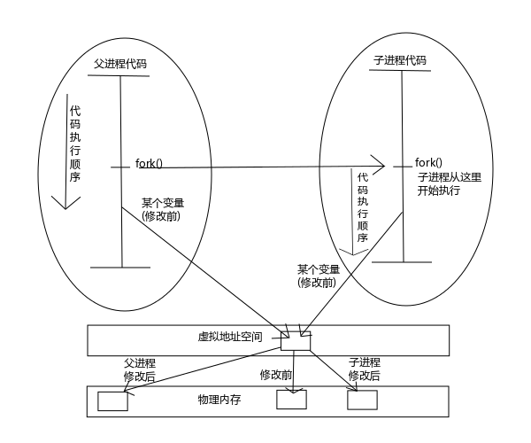

## 进程控制
上一篇文章，我讲述了整个进程的环境，包括环境变量，工作路径，申请空间，进程跑的退出函数，跳转函数以及ulimit限制用户。这次，我们围绕fork,exec,wait这三个函数进行讨论，unix系统是如何管理进程的。<br>
一般查看进程，unix用的是ps命令。而ps命令又有很多参数，主要还是查看man手册，终端💻输入man ps就可以查看详细的命令参数。
* ps -axf 主要查看当前系统进程中的PID以及执行终端的tty和状态信息，更重要是，它能显示出进程的父子关系
* ps -axj 主要用于查看当前系统中进程的PPID、PID、PGID、SID、TTY等信息
* ps -axm 显示进程的详细信息，PID列下面的减号(-)是显示这个进程中的线程
* ps ax -L以Linux的形式显示当前系统中的进程列表
PID是系统中进程的唯一标志，在系统中使用pid_t的类型表示，它是一个非负整型。<br>
#### 1号init进程
所有进程的祖先进程(但不一定是父进程)，内核启动后会启动init进程，然后内核就会像一个库一样守在后台等待出现异常情况的时候再出来处理一下，其他的事情都由init进程创建子进程来完成。(嗯，😄很像一个长者，只有有问题才出来说一下，没问题就守在后台，闭关修炼，像马爸爸一样)<br>
Unix系统使用延迟复用的算法，使得赋予新建进程的ID不同于最近终止进程所使用的ID，说白了，就是不断地往后申请新ID，到了最后再回来往前申请，一个循环队列咯。<br>
#### getpid、getppid、getuid、geteuid、getgid、getegid
```c
#include <sys/types.h>
#include <unistd.h>

pid_t getpid(void); // 获取当前进程ID
pid_t getppid(void); // 调用进程的父进程ID
uid_t getuid(void); // 调用进程的实际用户ID
uid_t geteuid(void); // 调用进程的有效用户ID
gid_t getgid(void); // 调用进程的实际组ID
git_t getegid(void); // 调用进程的有效组ID
```
### fork,you are neo!
```c
fork - create a child process
#include <unistd.h>
pid_t fork(void);
```
fork函数的作用，就是创建子进程。返回两个ID，子进程里返回0，父进程返回新建子进程ID。<br>
调用fork，创建子进程的时候，刚开始父子进程是一摸一样的，就连代码执行到的位置都是一毛一样的，这就是将父进程的资源，以及执行的位置都赋值一遍给了子进程。<br>
子进程要想获得父进程的PID就需要调用getppid函数，getpp。<br>
一般来说，调用fork后会执行if(依赖fork的返回值)分支语句，用来区分下面的代码，哪些代码由父进程执行，哪些代码由子进程执行。<br>
<br>
vfork实现父子进程共享一块数据空间，解决，创建子进程的时候不必担心赋值数据耗费的资源较高的问题。可是，这个函数已经过时了，没人用了，聪明是很聪明，但是对不起，系统不需要<br>
fork技术的改良，写时拷贝技术。
#### 写时拷贝技术(Copy_On_Write COW)
fork函数刚刚创建子进程的时候，父子进程的数据 **指向同一块物理内存！** 指向同一块物理内存！指向同一块物理内存！重要的事情说三遍！但是，内核将这些内核的访问变为 **只读的**了，当父子进程中的任何一个想要修改数据的时候，内核就会为修改区域的那块内存制作一个副本，并将自己的 **虚拟地址映射到物理地址的指向** 修改为副本的地址，从此父子进程自己完自己的，谁也不影响谁，效率就提高了。新分配的副本大小通常是虚拟存储系统中的一页。<br>
当然，COW技术中所谓的副本，是在物理地址中制作的，并非我们在程序中拿到的那个指针所指向的地址，我们的指针所指向的地址其实是虚拟地址，所以这些动作对于用户态的程序员是透明的，不需要我们自己进行管理，内核会自动为我们打点好一切。<br>
看个🌰吧
```c
#include "../include/apue.h"
/***
 * 子进程对变量所做的改变并不影响父进程中该变量
 * 0 调度进程 交换进程 新进程创建ID不可能是0 所以可以返回 0
 * 1 init进程
 * 2 页守护进程
 * pid_t fork(void); // fork新进程 子进程返回 0，父进程返回子进程🆔
 * 子进程是父进程的副本，子进程获得父进程数据空间、堆和栈的副本。子进程所拥有的副本！父进程和子进程并不共享这些存储空间部分。
 * 父进程和子进程共享正文段
 * fork后跟着exec
 * ***/
int globvar = 6;
char buf[] = "a write to stdout;\n"; // buf改变变量
int subProcess(int a){
    a+=a;
    return a;
}
int main(void){
    int var;
    pid_t pid; // 进程pid

    var = 88;
    if(write(STDOUT_FILENO,buf,sizeof(buf)-1)!=sizeof(buf)-1) // 输出
        err_sys("write error!");
    printf("before fork\n"); // before fork
    //printf("pid=%ld,glob=%d,vr=%d\n",(long)geteuid(),globvar,var); 
    pid = fork(); // fork之后，将会有两个进程在跑，一个是父进程在跑，一个是子进程在跑 fork之后就是两个程序在跑了！
    if(pid<0) // 0 调度进程 交换进程
        err_sys("fork error");
    else if(pid==0){
        printf("i am subProcess and i will add globvar 1\n");
        //printf("pid=%ld,glob=%d,vr=%d\n",(long)getppid(),globvar,var);
        printf("a=%d\n",subProcess(10));
        globvar++;
        var++;
    }else{
        sleep(2);
        //printf("a=%d\n",subProcess(420)); // 可以等待其他请求
        //printf("i am Process and i sleep\n");
    }
    int i = printf("pid=%ld,glob=%d,vr=%d\n",(long)getpid(),globvar,var); 
    printf("i=%d\n",i);
    //printf("pid=%ld,glob=%d,vr=%d\n",(long)getppid(),globvar,var); 
    exit(0);
}
```
上面这个🌰就说明了，其实，父子进程修改变量，子进程修改变量其实不修改父进程的变量，没有关系的。而且，父子进程，谁先运行不确定的，是由进程调度器决定的。<br>
但是vfork会保证子进程先执行。进程调度器不是一个工具，是在内核中的一块代码。<br>
也可以输出到文件<br>
`a.out>result.txt`,但是cat result.txt的时候就会出现
```
a write to stdout;
before fork
i am subProcess and i will add globvar 1
a=20
pid=1452,glob=7,vr=89
i=22
before fork
pid=1451,glob=6,vr=88
i=22
```
输出了两次beforefork，OMG，其实这是因为行缓冲变成了全缓冲导致的。标准输出是行缓冲，而系统默认的是全缓冲模式。所以当我们将它输出到控制台的时候可以的到预期的结果的，但是一旦重定向到文件的时候就由行缓冲变成全缓冲模式，而子进程产生的时候是会复制父进程的缓冲区的数据的，所以子进程刷新缓冲区的时候子进程也会将从父进程缓冲区中复制到的内容刷新出来。因此， **在使用 fork(2) 产生子进程之前一定要使用 fflush(NULL) 刷新所有缓冲区！**<br>
[全缓冲与行缓冲的定义](https://github.com/Vitomy/RegularNotes/blob/master/unixAdvance/APUE-STDIO.md#%E5%85%A8%E7%BC%93%E5%86%B2)<br>
那如果我fflush了呢？会怎么样<br>
```
a write to stdout;
before fork
before fork
i am subProcess and i will add globvar 1
a=20
pid=1521,glob=7,vr=89
i=22
pid=1520,glob=6,vr=88
i=22
```
同理，将会即时冲到缓冲区，然后输出，这时候，这时候就不会影响到子进程的输出了。<br>
咦❓这是一个特别有意思的问题，为什么，程序运行时，子程序输出的结果是在当前的shell而不是新打开一个shell呢？<br>
因为复制父进程的所有东西嘛。其实包括了文件描述符，就像执行了dup函数一样，父子进程每个相同的打开文件描述符共享一个文件表项。既然是复制了父进程的文件描述符，若父进程在创建子进程之前关闭了三个标准的文件描述符，那么子进程也就没有这三个文件描述符可以使用了，也就不会输出到shell了。<br>
```c
#include <stdio.h>
#include <stdlib.h>
#include <unistd.h>
#include <sys/types.h>

int main(void){
    pid_t pid;
    int i = 0;
    for(i = 0;i<10;i++){
        fflush(NULL);
        pid = fork();
        if(pid<0){
            perror("fork() error");
            exit(1);
        }else if(0==pid){
            printf("pid = %d\n",getpid());
            exit(0);
        }
    }
    sleep(100);
    return 0;
}
```
这里的子进程先结束，变成了僵尸进程，要等父进程“收尸”。白头人送黑头人。而父进程正在睡觉😪<br>
如果父进程先死了，子进程成为孤儿进程就会找马爸爸做爸爸，也就是1号的init进程，当这些子进程运行结束时，就会变成僵尸进程，然后1👌init进程就会及时收尸☠️<br>
##### 其实🧟‍♀️僵尸进程不会占用大量的资源
他们在内核中仅仅保留一个结构体，也就是自身的状态信息，其他的资源都会释放。但是会占用一个重要的系统资源就是PID，因为系统中的PID的数量是有限的，所以需要及时收尸☠️<br>
### wait 阻塞等待子进程资源的释放，相当于收尸☠️
当一个进程正常或异常种植时，内核就向其父进程发送 **SIGCHLD信号**。因为 **子进程终止是个异步事件(这可以在父进程运行的任何时候发生)**，所以这种信号也是内核向父进程发的异步通知。父进程可以选择忽略该信号或提供一个该信号发生时即被调用执行的函数(信号处理程序)。对于这种信号的 **系统默认动作是忽略它**。
```c
wait,waitpid,waitid - wait for process to change state
#include <sys/types.h>
#include <sys/wait.h>

pid_t wait(int *status); // 如果子进程已经终止，处于🧟‍♀️僵尸进程，则立即返回并取得该子进程的状态，否则使其调用者阻塞，直到一个子进程终止
// 返回终止子进程ID
pid_t waitpid(pid_t pid, int *status,int options);
// 返回值，成功返回进程ID，失败返回0或-1
// 区别
/***
 * 在一个子进程终止前，wait使其调用者阻塞，而waitpid有一选项，可使调用者不阻塞
 * waitpid 并不等待在其调用之后的第一个终止子进程，它有若干个选项，可控制它所等待的进程
 * 所以options是这个函数设计的精髓，通过WNOHANG宏要求waitpid以非阻塞的形式为子进程收尸
 * ***/
```
调用wait和waitpid
* 如果其所有子进程都还在运行，则阻塞。
* 如果一个子进程已终止，正等待父进程获取其终止状态，则取得该子进程的终止状态立即返回。
* 如果它没有任何子进程，则立即出错返回<br>
如果进程由于接收到SIGCHLD信号而调用wait，我们期望wait会立即返回。但是如果在随机时间点调用wait，则进程可能会阻塞。<br>
每次调用wait函数会为一个子进程收尸☠️，而wait函数并没有让我们指定是哪个特定的子进程。如果想要为特定的子进程收尸☠️，需要调用waitpid<br>
**收尸🧟‍♀️这件事只能是父进程对子进程做，而且只能对自己的子进程做。子进程是不能为父进程收尸☠️，父进程也不能为别人的子进程收尸☠️(自家人收自家尸，不是自家人不收自家尸)**<br>
我们看到wait有一个status，是一个整型指针。<br>
对于是否关心终止状态，可以将该参数设定为指向终止状态所存放的单元内或指定为空指针<br>
看一个简单的🌰
```c
#include <sys/wait.h>
int main(){
    pid_t pid; // 子进程id获取
    int i;
    for(i=0;i<10;i++){
        fflush(NULL);
        if((pid=fork())<0){
            err_sys("fork error");
            exit(0);
        }else if(0==pid){
            printf("get child id=%d\n",getpid());
            sleep(2);
            exit(0);
        }
    }
    for(i=0;i<10;i++){
       pid =  wait(NULL); // 父进程为所有的子进程收尸 表示回收资源，这样每个父进程都能回收资源后退出，使得子进程再也不会成为孤儿进程
       printf("collect id=%d\n",pid);
    }
    return 0;
}
```
如果我让所有的子进程睡眠2秒，但是每个进程的回收顺序是不确定的<br>
```
transCheungdeMacBook-Pro:processcollect transcheung$ ./processcol.t
get child id=1104
get child id=1105
get child id=1106
get child id=1107
get child id=1108
get child id=1109
get child id=1110
get child id=1111
get child id=1112
get child id=1113
collect id=1108
collect id=1107
collect id=1106
collect id=1105
collect id=1104
collect id=1109
collect id=1110
collect id=1112
collect id=1111
collect id=1113
```
也就是说，进程的运行速度是不确定的。<br>
4个人互斥的宏，在`<sys/wait.h>`，用来取得进程终止的原因WIF开头。基于这4个宏中哪一个值为真，就可选用其他宏来取得退出状态、信号编号等。<br>
status: 由函数回填，表示子进程的退出状态。如果填NULL，表示回收资源，并不关心子进程的退出状态。<br>
再来看看4个状态的宏<br>

宏|描述
--|--|
WIFEXITED(status)|返回真表示子进程正常终止，返回假表示子进程异常终止(8种方式)(if exited)
WEXITSTATUS(status)|返回子进程的退出码。只有上一个宏返回正常终止时才能使用，异常终止是不会有返回值的。(exitstatus)
WTERMSIG(status)|可以获得子进程具体被哪个信号杀死(term signal)
WIFSTOPPED(status)|子进程是否被信号stop了。stop和杀死是不同的，stop的进程可以被恢复(resumed)(stopped)
WSTOPSIG(status)|子进程若是被信号stop了，可以查看具体是被哪个信号stop了(stop signal)
WIFCONTINUED(status)|子进程若被stop了，可以查看它是否被resumed了(恢复)(if continued)
<br>
pid分为四种情况<br>

pid参数|解释
---|:--|
`<-1` |为归属于进程组ID为pid参数的绝对值的进程组中的任何一个子进程收尸(懑💩)
`==-1`|为任意一个子进程收尸
`==0` |为与父进程同一个进程组中的任意一个子进程收尸
`>0`  |为一个PID等于参数pid的子进程收尸
<br>
看一个waitpid的🌰<br>
```c
    pid_t pid;

    if((pid=fork())<0){
        err_sys("fork error");
    }else if(pid == 0){
        printf("first child,child pid = %ld\n",(long)getpid());
        sleep(2);
        if((pid=fork())<0) // 子进程又fork一次
            err_sys("fork error");
        else if(pid>0){ // 可以看出pid是两个值，一个是父进程ID
            printf(">0 pid = %ld\n",(long)getpid());
            // exit(0);
        }
        else if(pid == 0){ // 一个是子进程环境的执行
            printf("=0 pid = %ld\n",(long)getpid()); // 子进程的ID
            exit(0);
        }
        // 父进程退出了，init回收孤儿子进程
        printf("second child,parent pid = %ld\n",(long)getpid());
        sleep(4);
        exit(0);
    }
    printf("parent pid = %ld\n",(long)getpid());
    printf("pid = %d\n",pid);
    if(waitpid(pid,NULL,0)!=pid) // 非阻塞的方式回收资源子进程资源
        err_sys("waitpid error");
    exit(0);
```
运行后的输出
```c
parent pid = 2487
pid = 2488
first child,child pid = 2488
>0 pid = 2488
second child,parent pid = 2488
=0 pid = 2492
```
waitpid就等着2488结束然后回收资源，这样是一种非阻塞的方式回收，就是父进程退出后，waitpid就等着回收资源，这样就避免了长时间占用资源，成为僵尸<br>
#### 讲了那么多收尸，为什么要收尸？
为什么不让子进程结束后自动释放所有资源？如果不收尸会发生什么？<br>
假设父进程需要创建一个子进程并且要让它做3秒钟的事情，很不巧，紫禁城刚启动就出现了一个异常挂了，并且直接释放了自己的资源(没有收尸的情况)，而此时系统的PID资源紧脏，很已死掉的子进程PID就分配给了其他进程，而父进程此时并不知道手里的子进程PID已经不属于它的了。如果，父进程不想执行这个子进程了，kill掉，那么，这个PID又在进行别的操作...OMG😱<br>
有了收尸技术，wait和waitpid，子进程状态改变时会给父进程发送一个SIGCHLD信号，wait函数其实就是阻塞等待被这个信号打断，来收尸。<br>
系统通过收尸机制，来保证父进程未执行收尸动作之前，手里拿到子进程PID一定有效，自家人收自家尸。<br>
### 竞争条件
当多个进程都企图对共享数据进行某种处理，而 **最后的结果又取决于进程运行的顺序时**，我们认为发生了 **竞争条件**，不知道是哪个进程先执行，就产生了竞争条件<br>
如果在fork之后的某种逻辑显式或隐式地依赖于在fork之后的父进程先运行还是子进程线运行，那么fork函数就会是竞争条件活跃的滋生地。进程开始运行后所发生的事情也依赖于系统负载以及内核的调度算法。<br>
例如上面这个🌰，我们其实也看到一个潜在的竞争条件。
* 如果第二个子进程在第一个子进程之前运行，则其父进程将会是第一个子进程。
* 如果第一个子进程先执行，并有足够的时间到底并执行exit，则在第二个子进程的父进程是init
* sleep不能保证顺序执行。<br>
* 如果一个进程希望等待一个子进程终止，则它必须调用wait函数中的一个。
* 如果一个进程要等待其父进程终止，也可以这样玩<br>
```c
while(getppid() != 1) // 等待init来回收，浪费cpu时间
    sleep(1);
```
#### 避免竞争条件和轮询 我们需要通信
这种轮询是需要避免的，为了避免竞争条件还有轮询，多个进程之间就需要通信，需要某种形式的 **信号发送和接收方法**。互相沟通，让进程环境更和谐。<br>
```c
/***
 * 输出字符串，一个由子进程输出，另一个由父进程输出
 * 输出依赖于内核，使两个进程运行的顺醋以及每个进程运行的时间长度
 * ***/

static void charatatime(char *);// static 让其作为程序的唯一函数
int main(void){
    pid_t pid;

    if((pid=fork())<0){
        err_sys("fork error");
    }else if(pid == 0){ // 从这里开始产生竞争条件
        charatatime("out put by child\n");
    }else{
        charatatime("out put by paren\n");
    }
    exit(0);
}

static void charatatime(char *str){
    char *ptr;
    int c;
    setbuf(stdout,NULL);
    for(ptr = str;(c=*ptr++)!=0;){
        putc(c,stdout);
    }
}
```
### exec函数，每次fork后，子进程调用一种exec来调用执行另一个程序
当进程调用一种exec函数时，该进程执行的程序完全替换为新程序，而新程序则从其main函数开始执行。因为调用exec并不创建新进程，所以前后的进程ID并未改变。exec只是用磁盘上的一个新程序 **替换了当前进程的正文段、数据段、堆段和栈段。**<br>
```c
#include <unistd.h>
int execl(const char *pathname,const char *arg0,.../*(char *)0*/);
int execv(const char *pathname,char *const argv[]);
int execle(const char *pathname,const char *arg0,.../*(char* )0,char *const envp[] */);
int execve(const char *pathname,char *const argv[],char *const envp[]); // 只有这个是内核系统调用，其他是库函数
// 上面四个函数取路径名为参数
int execlp(const char *filename,const char *arg0,.../*(char*)0*/);
// ...省略号形参，最后一个参数要是NULL，表示表示变长参数列表的结束
int execvp(const char *filename, char *const argv[]);
// 上面两个函数取文件名为参数，若filename中包含/，则就将其视为路径名
int fexecve(int fd,char *const argv[],char *const envp[]);// 去文件描述符作为参数
// 7个函数返回，出错返回-1，成功，不返回
```
先来看看fork的一个🌰执行时，父子进程依赖关系通过ps -axf查看
```c
1 >$ ps axf
2  3565 pts/1    Ss     0:00  \_ bash
3  3713 pts/1    S+     0:00  |   \_ ./1fork
4  3714 pts/1    S+     0:00  |       \_ ./1fork
5 >$
```
fork创建子进程是通过复制父进程的形式来实现的，但是我们的父进程又是bash的子进程，那为什么bash没有创建出来一个与自己一模一样的子进程呢？mm_struct，提一下，这是linux虚拟构建线程的存储，让每个进程就像操作了自己的主存，拥有自己的地盘。<br>
为什么呢？因为exec函数族的功劳。<br>
##### 换药不换汤
它可以 **使调用的它进程“外壳”不变，“内容物”改变为新的东西。**“外壳”就是父子关系，PID等东西，“内容物”其实是指一个新的可执行程序。也就是exec函数会将调用它的进程完全(整个4GB虚拟内存空间，代码段，数据段，堆栈等等)变成另一个可执行程序，但父子关系、PID等东西不会改变。<br>
在执行了exec函数族的函数后， **整个进程的地址空间会立即被替换掉**，所以exec下面的代码全部都不会再执行了，  **替代的是新程序的代码段。**<br>
##### 缓冲区 让数据先到达该去的地方
缓冲区也会被新的程序所替换，所以在 **执行exec之前要使用fflush(NULL)刷新所有的缓冲区**，这样父进程才会让它缓冲区中的数据到达他们该去的地方，而不是在数据到达目的地之前缓冲区就被覆盖掉。<br>
```c
/***
 * processwaitpid.t是一个执行文件
 * ***/
#include "../include/apue.h"
/***
 * 创建子进程processwaitpid，无参数
 * */
int main(){
    pid_t pid;

    puts("Begin!");

    fflush(NULL);

    pid = fork();

    if(pid<0){
        err_sys("fork error");
        exit(1);
    }
    if(pid == 0){
        execl("./processwaitpid.t",NULL);
        // 无参数传入
        //execl("/bin/date","date","+%s",NULL); 后面的参数基本就是传参给data
        err_sys("execl()");
        exit(1);
    }
    wait(NULL);
    puts("END");
    exit(0);
}
```
fork,exec,wait函数可以让我们创建任何进程来执行任何命令，就这么看，其实整个*nix世界都是由fork，exec，wait这三个函数搭建起来的。也可以用三个函数来编写一些shell程序。<br>
### shell的内部命令(cd、exit、|、>等)和外部命令(which)
像cd、exit、|、>牵涉到环境变量改变等动作这样的命令就做内部命令，而使用which命令能查到在磁盘上存在的命令就是外部命令。<br>
可以用fork，exec，wait函数来编写shell，基本可以执行所有的外部命令。但是shell也支持内部命令，内部命令才是shell的 **难点**。<br>
### 更改用户ID和更改组ID 更改是需要特权和访问控制的
在*nix系统中，特权和访问控制是基于用户ID和用户组ID的，所以当我们需要使用特权或访问无权访问的文件时，需要切换用户ID或用户组ID<br>

