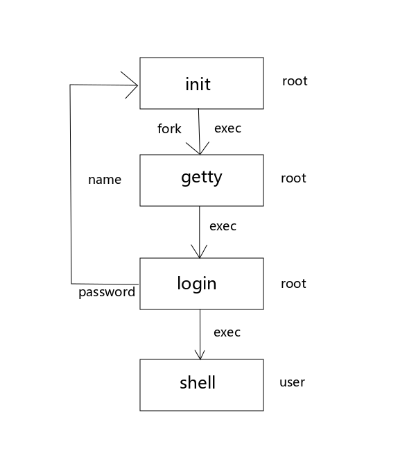
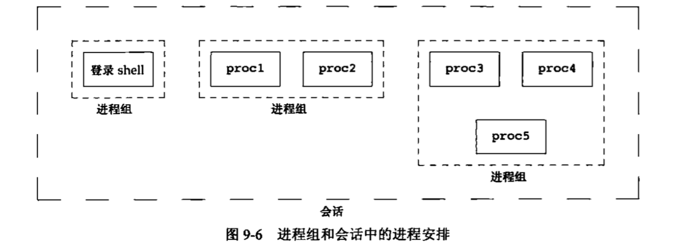

## 进程关系 & 守护进程
每个进程都有一个父进程，当子进程结束时，会通知父进程，父进程取得子进程的退出状态，然后让子进程等待收尸。<br>
那么进程除了有父子关系外，还有哪些关系呢？先来看看一个笨设备<br>
### 终端(我只会接收命令并返回结果)
一台计算机可以有多个终端，多个终端，可以让多个人使用同一台电脑。那么Linux是如何让多个用户登陆呢？<br>
<br>
内核自举时创建1号init进程，init对每一个终端执行fork+exec+getty命令。getty命令的作用就是要求用户输入用户名。<br>
登陆过程:<br>
等待用户输入完成用户名后，getty会exec+login<br>
login->getpwnam()(得到用户的口令文件登录项)->getpass()(以屏蔽回显的形式获得用户的密码)->crypt()(将加密的用户口令与阴影口令文件用户登录项中的pw_passwd比较)->失败？重新init:启动shell并用chown()更改当前登陆终端的所有权。<br>
登陆之前的步骤都是root身份，所以真正用户权限被降下来就是在登陆之后发生。<br>
### 会话(相当于进程组的容器，承载一个或多个进程组)
一次成功的终端登陆就是一个会话，现在一次shell的成功登录，相当于那时候终端的成功登录。会话相当于进程组的容器，他能承载一个或多个进程组。
<br>
进程调用setsid函数建立一个新会话<br>
```c
#include <unistd.h>
pid_t setsid(void);
// 成功但会进程组ID，出错返回-1
pid_t getsid(pid_t pid);
// 成功返回会话首进程的进程组ID，出错返回-1
```
如果调用此函数的进程不是一个进程组的组长，则此函数创建一个新会话。<br>
* 该进程变成新会话的会话首进程(session leader，会话首进程是创建该会话的进程)。此时，该进程是新会话的唯一进程。
* 该进程成为一个新进程组的组长进程。新进程组ID是该调用进程的进程ID
* 该进程美誉控制终端。如果调用setsid之前该进程有一个控制终端，那么这种联系也被切断。<br>
如果是，返回出错，一般都是先用父进程fork，然后等父进程死亡，子进程继续，这样子进程就不是一个进程组组长。子进程继续调用setsid，将自己成为守护进程。(这就是为什么，PID,PGID,SID是相同的)
### 进程组(承载进程)
一个进程组中有一个或多个进程，它是一个或多个进程的集合(也可以看作是容器)。一个进程不但拥有唯一的PID，同时也属于一个进程组。<br>
进程组是在统一作业中结合起来的。同一个进程组中的个进程接收来自同一终端的各种信号。每个进程组有一个唯一的进程组ID。进程组ID类似于进程ID(一个正整数)，并存放在pid_t数据类型中。
```c
#include <unistd.h>
pid_t getpgrp(void)；
// 调用进程的进程组ID
```
实例
```c
#include "../include/apue.h"
#include <unistd.h>

int main(){
    pid_t pid;
    pid = getpgrp();
    printf("gid = %d\n",pid);
    return 0;
}
```
每个进程组有一个组长进程。组长进程的进程组ID等于其进程ID<br>
进程组组长可以创建一个进程组、创建该组中的进程，然后终止。只要在某个进程组中有一个进程存在，则该进程组就存在，这与其组长进程是否终止无关。从进程组创建开始到其中最后一个进程离开为止的时间区间成为进程组的生命期。 **某个进程组中的最后一个进程可以终止，也可以转移到另一个进程组。**<br>
进程调用setpgid可以加入一个现有的进程组或者创建一个新进程组<br>
```c
#include <unistd.h>
int setpgid(pid_t pid, pid_t pgid);
// 成功，返回0，出错，返回-1
```
setpgid函数将pid进程的额进程组ID设置为pgid。如果这两个参数相等，则由pid指定的进程变成进程组组长。如果pid是0，则使用调用者的进程ID。另外， **如果pgid是0，则由pid指定的进程ID用作进程组ID。**<br>
一个进程只能为它自己或它的子进程设置进程组ID。在它的子进程调用了exec后，他就不能再更改该子进程的进程组ID。<br>
大多数作业控制shell中，在fork之后调用此函数，使父进程设置其子进程的进程组ID，并且也使子进程设置其自己的进程组ID。因这样也 **保证了执行的先后顺序问题，这样保证了不会发生竞争条件**<br>
waitpid函数可被用来等待一个进程或者指定进程组中的一个进程终止。<br>
进程组分为前台进程和后台进程，一个会话只能有一个前台进程组，也可以没有。<br>
终端不能与后台进程通信。后台进程+`&`。<br>
#### 会话用来承载进程组，进程组用来承载进程，进程用来承载线程
### 守护进程(daemon) 生存期长的一种进程
它们常常在系统引导装入时启动，仅在系统关闭时才终止。因为它们 **没有控制终端**，脱离终端是为了避免进程在执行过程中的信息在任何终端上显示并且不会被任何终端所产生的终端信息所终止，所以说它们是在后台运行的。<br>
#### 守护进程的特征 (脱离于控制终端并且在后台周期性地执行某种任务或等待处理某些事件的进程)
* 脱离控制终端 ps -axj tty为❓❓
* 是进程组的leader，也就是PID和PGID相同
* 通常没有父进程，由1号init接管
* 创建了一个新会话，是session的leader，所以PID和SID相同<br>
使用ps -axj查看，PID、PGID、SID相同的进程就是守护进程<br>
守护进程会关闭或重定向标准输入输出流(初步理解，守护进程就是运行在后台的，没有终端输入输出，仅有自己运行)<br>
写守护进程的时候，我们会切换工作路径，把它切换到一个一定会存在的路径。比如`/`。因为假设你的守护进程是在一个可卸载设备(如U盘)上被启动，如果不修改工作路径，该设备无法被卸载<br>
#### 编程规则 daemonize
* 调用umask将文件模式创建屏蔽字设置为一个已知值(通常是0)。因为通过继承得来的掩码可能会被设置为拒绝某些权限，如果守护进程中需要这些权限则要设置它。<br>
* **(创建子进程，退出父进程)** 调用fork，然后使父进程exit。(为了脱离控制终端需要退出父进程，之后的工作都由子进程完成。子进程成为孤儿进程，被1号收养)1. 如果该守护进程作为一条简单的shell命令启动，那么父进程终止会让shell认为这条命令已经执行完毕 2. 虽然子进程继承了父进程的进程组ID，但获得了一个新的进程ID，这就保证了子进程不是一个进程组的组长进程。这是下面将要进行的setsid调用的先决条件。
* **(在子进程中创建新会话，独立)** 调用setsid创建一个新会话。然后执行 a. 成为新会话的首进程 **(让进程摆脱原会话的控制)** b.成为一个新进程组的组长进程 **(让进程摆脱原进程组的控制)** c.没有控制终端 **(让进程摆脱原控制终端的控制)** (也即PID，PGID、SID是相同的)<br>
* 当前工作目录更改为根目录`/`。(反正这个工作目录一定要存在)<br>
* 关闭不再需要的文件描述符，守护进程不再持有从其父进程继承而来的任何文件描述符。可以使用open_max函数或getrlimit函数来判定最高文件描述符值，并关闭直到该值的所有文件描述符。(要是没有特殊要求，仅关闭0,1,2就好了)
* 某些守护进程打开/dev/null使其具有文件描述符0,1,2，其实是没用的。<br>
看一个🌰<br>
```c
#include "../include/apue.h"
#include <syslog.h>
#include <fcntl.h>
#include <signal.h>
#include <sys/resource.h>

void daemonize(const char *cmd){
    int i,fd0,fd1,fd2;
    pid_t pid;
    struct rlimit r1;
    struct sigaction sa;

    // 更改文件权限屏蔽字 => 不屏蔽
    umask(0);
    // 获得最大的文件描述符的数目
    if(getrlimit(RLIMIT_NOFILE,&r1)<0)
        err_quit("%s:can't get file limit",cmd);
    // session leader to lose controlling tty
    if((pid=fork())<0)
        err_quit("%s:can't fork",cmd);
    else if(pid!=0)
        exit(0); // 父进程退出 留下孤儿进程
    // 脱离控制终端 PID
    // 成为组长进程 PGID
    // 成为会话组首个进程 SID
    setsid();
    // 忽略sighup信号
    // 当终端退出，会发送该信号给会话组长，默认处理方式退出
    sa.sa_handler = SIG_IGN;
    sigemptyset(&sa.sa_mask);
    sa.sa_flags = 0;
    if(sigaction(SIGHUP,&sa,NULL)<0){
        err_quit("sigaction");
        exit(-1);
    }
    // 再次fork 让守护进程不再担当会话组长，防止他打开终端
    if((pid = fork())<0)
    {
        perror("fork");
        exit(-1);
    }
    if(pid!=0){
        // 父进程退出
        printf("%d\n",pid);
        exit(0);
    }
    // 改变文件目录 改变工作目录
    if(chdir("/")<0){
        err_quit("chdir");
        exit(-1);
    }
    // 关闭文件描述符 所有
    if(r1.rlim_max == RLIM_INFINITY)
        r1.rlim_max = 1024;
    for(i = 0;i<r1.rlim_max;++i)
        close(i);
    // 重定向标准输入、标准输出、错误 到/dev/null
    fd0 = open("/dev/null",O_RDWR);
    fd1 = dup(0);
    fd2 = dup(0);

    openlog(cmd,LOG_CONS,LOG_DAEMON);
    if(fd0!=0||fd1!=1||fd2!=2){
        syslog(LOG_ERR,"unexpected file descriptors %d %d %d",fd0,fd1,fd2);
        exit(-1);
    }
    while(1){
        printf("hello world");
    }
}

int main(int argc,char *argv[]){
    daemonize(argv[0]);
    exit(0);
}
```
deamonize函数由main程序调用，然后main程序进入休眠状态。<br>
PPID是1，init，可以看出该守护进程是一个孤儿进程，不是会话的首进程，这一结果是在fork第二次造成的。可以看出守护进程已经被正确地初始化了。(代码详细解释了)<br>
#### 系统日志
守护进程不应使用标准输出，那么守护进程出错或者需要记录一些事件怎么办？那就用系统日志。<br>
`/var/log`保存着系统日志，但是该目录下的日志文件只有root有权限，普通用户需要使用系统日志函数写日志<br>
syslogd服务，专门写日志
```c
closelog,openlog,syslog - send message to system logger
#include <syslog.h>

void openlog(const char *ident,int option,int facility);
void syslog(int priority, const char *format, ...);
void closelog(void);
int setlogmask(int maskpri);
// 返回，前日志记录优先级屏蔽字值
```
openlog与syslogd建立连接，表示当前进程要写日志。<br>
🆔ident: 表明自己的身份<br>
✅option: 要在日志附加什么内容，多个选项用按位或或链接。LOG_PID是附加PID<br>
✉️facility: 消息来源。一般只能指定一个<br>

消息来源|含义
|--|:--|
LOG_CRON|消息来自定时任务
LOG_DAEMON|消息来自守护进程
LOG_FTP|消息来自FTP服务
LOG_KERN|消息来自内核
LOG_USER|默认，常规用户级别消息

syslog用于提交日子内容<br>
priority优先级<br>

级别|含义
|--|:--|
LOG_EMERG|严重 导致系统不可用的问题
LOG_ALERT|严重 必须立即处理的情况
LOG_CRIT|严重 临界条件
LOG_ERR|严重 错误❌
LOG_WARNING|警告⚠️
LOG_NOTICE|正常
LOG_INFO|信息
LOG_DEBUG|调试

日志太多对磁盘空间的要求就比较高，而且无用的日志太多会影响日志审计。日志文件会记录哪些级别的日志是在配置文件中配置的。默认情况下，LOG_DEBUG以上级别的日志都会被记录。<br>
format: 类似printf格式化字符串。但不要使用换行符`\n`。<br>
...: format 中占位符的参数<br>

#### 单实例守护进程 (有些进程在任一时刻只运行一个实例)
启动的时候会在/var/run下面创建一个进程锁🔒文件，守护进程启动的时候会先判断这个🔒锁文件是否存在，如果已经存在就报错并退出，如果不存在就继续运行并创建一个锁文件，退出的时候再删除。(这就保证了一次只能有一个实例在运行)。<br>
守护进程如果想开机自动启动，可以配置到自动启动脚本中/etc/rc.d/rc.local
