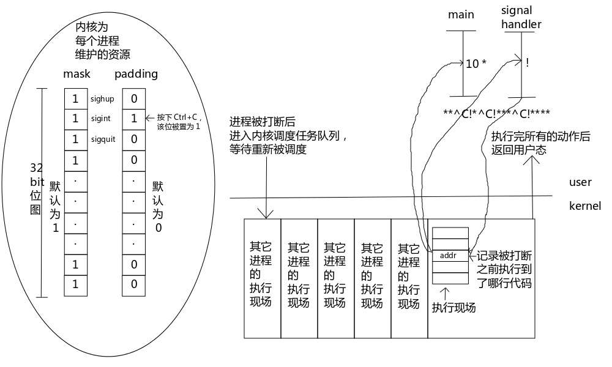

## 信号 初级异步
Linux环境的并发可以分为多进程+信号和多线程两种，信号属于初级异步，多线程属于强烈异步。<br>
信号与信号量不是一回事，信号量是指在同一个资源下，信号量通过P/V原子操作，使得线程之间能够按顺序执行，也就是同步，信号量是用计数的整数和一个队列来完成<br>
实际项目中，信号和多线程基本不会一块使用，要么使用多进程+信号，要么采用多线程的形式。<br>
**同步程序**的特点就是程序的执行流程、分支都是很明确，但是 **异步事件**就是事件到来的时间无法确定，到来之后的结果也是不确定的。比如俄罗斯方块游戏中，需要异步接收用户的方向控制输入。这就需要信号的支持。<br>
异步事件的获取方式通常有两种，一种是查询法，一种是通知法。<br>
异步事件到来的频率比较高的情况考虑用 **查询法**，因为撞到异步事件到来的概率比较高。<br>
异步事件到来的频率比较稀疏的情况考虑通知法，因为经济实惠。<br>
**所有的通知法都需要配合一个监听机制❕** 例如🎣钓鱼，放一个鱼竿就你就走了，就算🐟上钓你也不知道。<br>
#### 时间片调度
时间片调度就是通过中断打断程序的执行，把事件片耗尽的进程移动到队列中等待。所以任何进程在执行的过程中都是磕磕绊绊的不断被打断的，程序在任何地方都有可能被打断，唯独一条机器指令是无法被打断(原子操作)。<br>
### 信号概述
**信号不是中断**，中断只能由硬件产生， **信号是模拟硬件中断⏸️的原理**，在软件层面上进行的。<br>
`kill -l`，向其他进程查看或发送信号
```c
 1) SIGHUP       2) SIGINT       3) SIGQUIT      4) SIGILL
 5) SIGTRAP      6) SIGABRT      7) SIGEMT       8) SIGFPE
 9) SIGKILL     10) SIGBUS      11) SIGSEGV     12) SIGSYS
13) SIGPIPE     14) SIGALRM     15) SIGTERM     16) SIGURG
17) SIGSTOP     18) SIGTSTP     19) SIGCONT     20) SIGCHLD
21) SIGTTIN     22) SIGTTOU     23) SIGIO       24) SIGXCPU
25) SIGXFSZ     26) SIGVTALRM   27) SIGPROF     28) SIGWINCH
29) SIGINFO     30) SIGUSR1     31) SIGUSR2
```
1-31标准信号，这里都是标准信号，其实下面讨论的内容没有特殊标记出来就是针对标准信号的。信号名都被定义为正整数常量<br>
信号有五种不同的默认行为:  **终止，终止+core，忽略，停止进程🤚，继续🏃。**<br>
core文件就是程序在崩溃时由操作系统为它生成的内存现场映像📷和调试信息，只要用来调试程序的，可以使用ulimit命令设置允许生成core文件的最大大小。<br>
* 终止🔚：使程序异常结束🔚。被信号杀死就是异常终止
* 终止+core：杀死进程，并为其产生一个core dump文件，可以使用这个core dump文件获得程序被🔪杀死的原因。
* 忽略：程序会忽略该信号，不作出任何响应。
* 停止🛑进程：将运行中的程序中断。被停止的进程就像被下了一个断点一样，停止运行并不会再被调度，直到收到继续运行的信号。当按下Ctrl+Z时就会将一个正在运行的前台进程停止，其实就是向这个进程发送了一个SIGTSTP信号(STOP🛑)。
* 继续🏃：使被停止的进程继续运行▶️。只有SIGCONT(continue)具有这个功能。
<br>
以下介绍几种常用的标准信号<br>

信号|默认动作|说明
|--|--|:--|
SIGABRT|终止+core|调用abort函数会向自己发送该信号使程序异常终止，通常在程序自杀或夭折时使用
SIGALRM|终止|调用alarm或setitimer定时器超时时⌚️向自身发送信号。setitimere设置which参数的值为ITMER_REAL时，超时后会发送此信号
SIGCHLD|忽略|当子进程状态改变系统会将该信号发送给其父进程。状态改变是🈯️由运行▶️状态改变为⏸️暂停状态、由暂停状态⏸️改变为运行▶️状态、由运行状态▶️改变为终止🛑状态等等
SIGHUP|终止|如果终端💻接口检测到链接断开则将此信号发送给该终端的控制进程，通常会话首进程就是该终端的控制进程
SIGINT|终止|当用户按下中断键➖(Ctrl+C)时，终端驱动程序产生此信号并发送给前台进程组中的每一个进程。
SIGPROF|终止|setitimer设置which参数的值为ITIMER_PROF时，超时后会发送此信号
SIGCONT|继续/忽略|接收信号的进程处于停止🤚信号则继续执行，否则忽略
SIGQUIT|终止+core|当用户在终端按下退出键➖`(Ctrl+\)`时，终端驱动程序产生此信号并发送给前台进程组中的所有进程，该信号与SIGINT的区别时，在终止进程的同时为它生成core dump文件
SIGTERM|终止|使用kill发送信号，若不置顶具体信号，则默认发送该信号
SIGUSR1|终止|用户自定义的信号。系统不赋予特殊意义，想拿来干嘛就干嘛
SIGUSR2|终止|同上
SIGVTALRM|终止|setitimer设置which参数的值为ITIMER_VIRTUAL时，超时后发送该信号

<br>

### 函数signal
```c
// signal - ANSI C signal handling
// 查了一下man手册，signal函数如下
#include <signal.h>
void (*signal(int sig, void (*func)(int)))(int);
// 参数时整型sig和指向参数类型时int，返回类型是void的函数，signal是一个函数指针，指向的函数具有以上两个参数并返回一个指针，指向参数是int型的函数。
// or in the equivalent but easier to read typedef'd version:
typedef void (*sig_t) (int);
sig_t signal(int sig, sig_t func);
```
sig是1-31标准信号，func是收到信号时的处理行为，也就是信号处理函数；也可以使用SIG_DEF和SIG_IGN两个宏来替代。SIG_DEF表示使用信号的默认处理行为。SIG_IGN(ignore)。<br>
返回值，返回原来的信号处理函数。有时候我们在定义自己的信号📶处理函数之前会把原来的信号处理函数保存下来，这样当我们的库使用完之后需要还原原来注册的信号处理函数，避免因为我调用了我们的库而导致别人的库失效的问题。
```c
#include <stdio.h>
#include <signal.h>
#include <unistd.h>

static void handler(int s){
    write(1,"!",1);
}

int main(){
    int i = 0;
    signal(SIGINT,handler);
    for(i = 0;i<10;i++){
        write(1,"*",1);
        sleep(1);
    }
    return 0;
}
```
接下来每秒钟会打印一个(*)，当按下Ctrl+C就打印一个❕。
```c
transcheung$ time ./a.out
******^C!***^C!*
real    0m8.246s
user    0m0.002s
sys     0m0.003s
```
这就改变了传送信号的行为。通过time命令可以测试到，程序并没有持续10秒钟才结束，这是因为信号打断阻塞的系统调用，也就是说，SIGINT打断了sleep。所以这里的信号是随时接收信息的，也不会改变i的值，所以每次打断之后就会重新再跑一遍for循环。<br>

### 竞争
当学习了信号之后，我们的程序中就出现异步的情况了，只要是异步的程序就可能会出现竞争。那什么是竞争呢？<br>
竞争：一个十字路口没有红绿灯🚥，两辆来自不同方向的驶来的车🚗都可能发生碰撞💥，而且碰撞可能严重也可能轻微。当安装上红绿灯🚥之后，就相当于增加了一个协议，如果没有这个下一的限制，大家就可以随意地使用公共资源了，你在十字路口中间打飞机✈️都可以。所以为了避免竞争带来的后果，我们可以使用一些协议来避免竞争的发生。<br>

### 不可靠的信号 行为不可靠
不可靠信号的行为有可能会丢失，所以在编写信号处理时，应该将信号到来时，在程序里确定该信号已经接收过，这样就不会使信号可能被丢失。<br>
信号的处理就好比我正在玩王者，突然一个电话☎️来了，于是打断了玩游戏，先挂机去接电话。<br>
信号处理函数的执行现场不是程序员布置的，而是 **内核布置的**，因为程序中不会有调用信号处理函数的地方。<br>
同一个信号处理函数的执行线程会被布置在同一个地方，所以当一次信号处理函数未执行完成时再次出发了相同的信号，信号处理函数发生了第二次调用就会覆盖第一次调用的执行现场。<br>
### 可重入函数
函数重入一看有点像是递归，但是，递归调用是程序猿布置的，而 **重入是在一个函数执行未结束时再次发生了调用并且进入了同一个函数现场。**<br>
重入时函数会发生错误的函数称为“不可🙅重入函数”，重入不会出现错误的函数叫做“可👌重入函数”。<br>
所有的系统调用都是可重入函数，所以信号处理函数中可以放心的使用系统调用。但并不是说所有的非系统调用都是不可重入的。<br>
man手册中所有函数如果有一个同名的带_r后缀的函数，是可重入函数，而不带_r后缀的函数是不可重入的函数。
```c
strerror,strerror_r - return string decribing error number
#include <string.h>
char *strerror(int errnum);

int strerror_r(int errnum,char *buf,size_t buflen);
char *strerror_t(int errnum,char *buf, size_t buflen);
```
可重入函数上面讲了一个大概，接下来具体讲讲这个概念。<br>
#### 不可重入函数，使任务调度改变了其他任务调度
如果多个任务调用同一个函数的情况，如果一个函数设计成，不同任务调度这个函数时，都有可能修改其他任务调度这个函数的数据，从而导致不可预料的后果。这就使线程不安全了。因为线程是共用资源的。<br>
因为也导致了不可重入函数在调用的时候不可以被中断，因为一旦中断了，可能资源改变了，就会出现不可预料的问题，因而，它也不能运行在多任务的环境下<br>
#### 可重入函数 一个安全的函数，不担心数据会出错
可重入函数是指一个可以被多个任务调度的过程中，任务在调度的时候不必担心数据是否会出错。简单来说，就是一个 **可以被中断的函数**。<br>
所以说，可重入函数使可以重复进入的，这也是为什么不能在一个函数中随意申请堆内存，这样使得堆内存可能又被重复申请造成资源的浪费，堆栈溢出。一个函数可以被中断意味着它除了使用自己栈上的变量以外，不依赖任何环境(包括static，当然要是预料之内要改变static除外)，这样就允许了该函数可以拥有多个副本，由于使用分离的栈，所以不会互相干扰。如果确实需要访问全局变量，那么就要实施互斥手段，就是锁🔒资源mutex。可重入函数在并行环境中很重要，但是一般要为访问全局变量付出一点性能上的代价。<br>
总结一下，编写可重入函数时，若使用全局变量，则应通过关中断，信号量(P/V操作)等手段加以保护。<br>
来看一个简单的函数
```c
int Exam = 0;
unsigned int noinagain(int para){
    unsigned int temp;
    Exam = para;
    temp = ...;
    return temp;
}
```
这个就是不可重入了，因为使用了全局变量Exam。如果使多进程就会变得不可知Exam的状态。那么加锁呢？<br>
```c
int Exam = 0;
unsigned int noinagain(int para){
    unsigned int temp;
    // down(&mutex)
    Exam = para;
    temp = ...;
    // up(&mutex);
    return temp;
}
```
加锁就会使得该函数可以重入也没问题，这样资源就不会因为会被改变而变得不可知。<br>
因为保证可重入性可以使用以下方法。
* 函数设计精良使用局部变量(寄存器和堆栈)
* 对使用的全局变量加以保护，关中断，信号量，互斥锁等<br>

不可重入就是
* 使用了static
* 申请了堆内存malloc或free
* 调用了标准IO函数<br>
改写就按可重入的规则改写咯。<br>
忠告，保证线程安全，多写可重入函数。<br>

### 可靠信号属于和语义
<br>
mask和padding位图是一一对应的，它们用于反映当前进程信号的状态。每一位代表了一个标准信号，例如SIGINT打断。<br>
mask位图用于记录📝哪些信号可以响应。1表示该信号📶可以响应，0表示该信号不可响应(会被忽略)。<br>
padding位图用于记录收到了哪些信号。1表示收到了该信号，0表示没有收到该信号。<br>
程序在执行的过程中会被打断无数次，也就是说程序被打断吼要停止手头的工作，进入一个队列排队等待再次被调度才能继续工作。<br>
当 **进程获得调度机会后** ，从内核态返回到用户态之前要做很多事情，其中一件事就是 **将mask位图和padding位图进行&运算**，当 **计算结果不为0时** 就需要调用相应的信号处理函数或执行信号的默认动作。<br>
这就是Linux的信号处理机制，从这个机制中，可以总结出几个信号的特点。
* 如果想要屏蔽某个信号，只需要将对应的mask位置为0即可。这样当程序从内核态返回用户态进行mask&padding时，该信号位的计算结果一定为0.
* 信号📶从收到到响应是存在延迟的，一般最长的延迟时间10ms。因为 **只有程序被打断并且重新被调度的时候才有机会发现收到了信号** ，所以当我们向一个程序按下Ctrl+C时，程序并没有立即挂掉，只不过这个时间非常短暂我们一般情况下感觉不到而已，我们自己会以为程序是立即挂掉。写一个死循环就能验证
* 当一个信号没有被处理时，无论再次接受到多少个相同的信号都只能保留一个，因为padding是一个位图，位图的特点就是只能保留最后一次的状态。这一点说得就是标准信号会丢失的特点，如果想要不丢失信号就只能使用 **实时信号**。
* 信号处理函数不允许使用longjmp进行跨过函数跳转。因为处理信号之前系统会把mask对应的位图设置为0来避免信号处理函数重入，当信号📶处理完成之后系统会把对应的mask位设置为1恢复进程对该信号的响应能力。 **(所以其实内核在处理函数的时候，信号一旦收到了就会就mask设置为0，避免其他信号的干扰，等处理完这个信号再置为1)。** 如果进行了长跳转系统就不会恢复mask位图了，也就再也无法收到该信号了。 实际上，信号是县城级别的，即使mask位图在处理前被置为0，依然有可能出现重入的现象，因为其他兄弟线程其实也有可能mask值没改变。<br>
* 信号处理函数的执行时间越短越好，因为信号处理函数是在用户态执行的，在它的执行过程中也会不停的被内核打断，所以如果信号处理函数执行的时间过长会使情况变得复杂。<br>
* 信号的响应是嵌套执行的。就是说假设进行先收到了SIGINT信号，当它的信号处理函数还没有执行完毕时又收到了另一个信号SIGQUIT，那么当进程从内核态返回到用户态时会优先执行SIGQUIT的信号处理函数，SIGQUIT处理好->SIGINT继续处理(回到上次被打断的地方继续执行)，这就给人一种错觉，像是在SIGINT的信号处理函数中调用了SIGQUIT的信号处理函数一样。但其实是执行了SIGQUIT，再从SIGINT打断的地方继续执行。<br>
* 如果同时到来多个优先级差不多的信号，无法保证优先响应哪个信号，它们的响应没有严格意义上的顺序(没有队列的概念)。除非是收到了优先级较高的信号，系统会保证高优先级的先被处理。<br>
### kill 🔪杀死一个进程?不不不，作为一个杀手，我还有很多信号📶
```c
kill - send a signal to a process or a group of process
#include <signal.h>
int kill(pid_t pid,int sig);
// 成功 0， 失败-1 并设置errno
```
kill函数的作用就是将指定的信号sig发送给指定的进程pid<br>
kill其实负责给进程发送各种信号。<br>

值|说明
|--|:--|
`>0`|接收信号的进程ID
`==0`|发送信号给当前进程所在进程组的所有进程
`==-1`|发送信号给当前进程有权向它们发送信号的所有进程，1号init进程除外。相当于📢广播信号，发送这种信号只有1号init会做，比如关机📴，1号就会广播信号📢大家，结束了。
`<-1`|将pid的绝对值作为组ID，给这个组中所有的进程发送信号

<br>
sig:要发送的信号，可以使用`kill -l`列出可以发送的信号。这里要说一下0这个信号，0会执行所有的错误检查，并不发送信号，0只是检查一下这个进程是不是依然存在，如果该进程不存在则返回-1并将errno设置为ESRCH。⚠️，这种检查不是原子，当kill返回测试结果的时候，也许被测试的进程也就终止了。当然也可以测试当前进程是否对目标进程有权限发送信号，如果errno为EPERM表示被测试的进程存在但当前进程无权限访问。<br>

#### pause
```c
pause - suspend the thread until a signal is received
#include <unistd.h>
int pause(void);
// 专门用于阻塞当前进程，等待一个信号来打断
```
#### alarm
```c
alarm - schedule an alarm signal

#include <unistd.h>

unsigned alarm(unsigned seconds);
```
指定seconds秒，发送一个SIGALARM给自己。为0时，表示取消这个定时器， **并且新设置的值会覆盖上次设置的值**。所以当程序中出现了多个对alarm的调用，⌛️计时是不准确的。<br>
SIGALARM默认动作时杀死进程
```c
#include "../include/apue.h"
#include <pwd.h>

static void my_alarm(int sig){
    struct passwd *rootptr;
    printf("in signal handler\n");
    if((rootptr = getpwnam("root"))==NULL)
        err_sys("getpwnam(root) error");
    alarm(1); // 重新设置alarm 不断重入
}

int main(void){
    struct passwd *ptr;
    signal(SIGALRM,my_alarm);// 等待信号
    alarm(1); // 发出信号 执行my_alarm
    for(;;){
        if((ptr = getpwnam("transcheung"))==NULL)
            err_sys("getpwnam error");
        if(strcmp(ptr->pw_name,"transcheung")!=0)
            printf("return value corrupted!,pw_name=%s\n",ptr->pw_name);
    }
}
```
上面就打到了不断重入的效果，搞笑的...<br>
来看看alarm与time的执行效率对比
```c
#include "../include/apue.h"
#include <signal.h>

long long count = 0;
static volatile int flag = 1;

void alarm_handler(int a){
    flag = 0;
}

int main(void){
    signal(SIGALRM,alarm_handler);
    alarm(5);
    flag = 1;
    while(flag){
        count++;
    }
    printf("%lld\n",count);
    return 0;
}
```
time
```c
#include <stdio.h>
#include <time.h>

int main(void){
    long long count = 0;
    time_t t;
    t = time(NULL)+5; // 延迟5秒
    while(time(NULL)<t){
        count++;
    }
    printf("%lld\n",count);
    return 0;
}
```
执行效率相差1000多倍！！！。<br>
volatile关键字，表示这个变量是随时变化的，所以告诉编译器不用优化。<br>
### 流量控制
播放音乐和电影的时候都要按照播放速率读取文件，而不能像cat命令一样，直接将交给它的文件用最快的速度读取出来，否则你听到的音乐就转瞬即逝了。<br>
