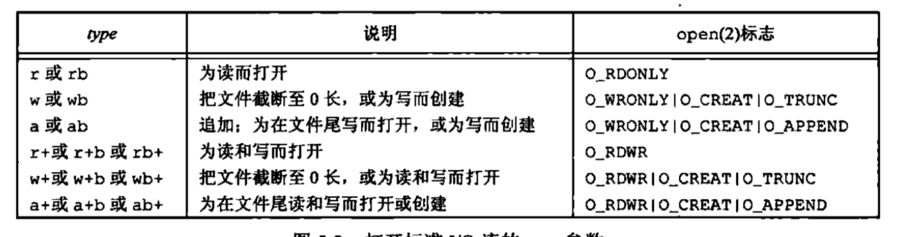
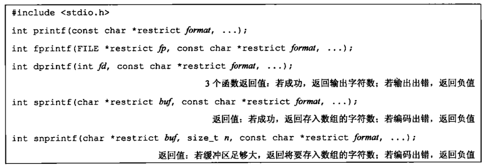
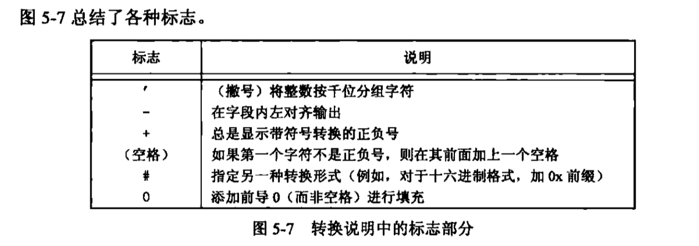
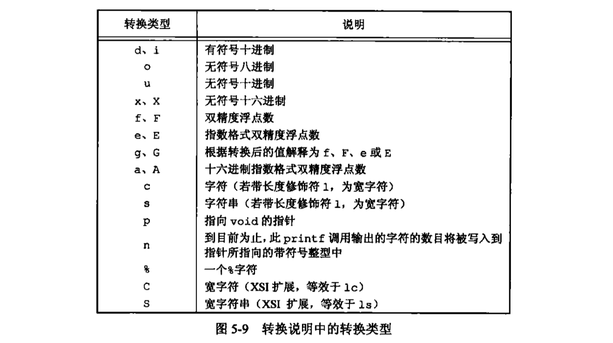
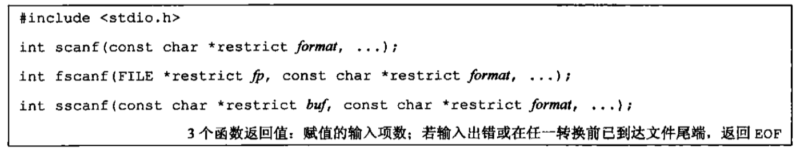
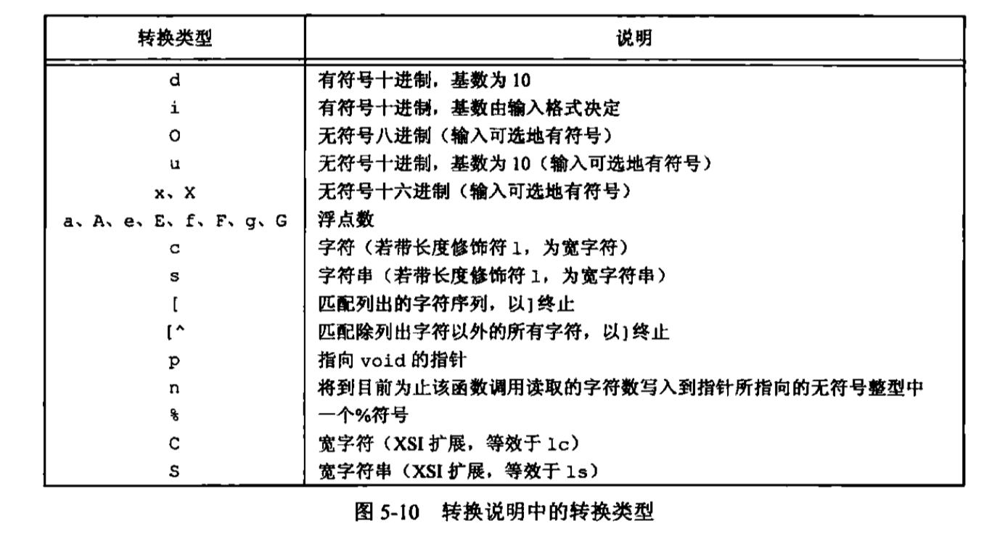
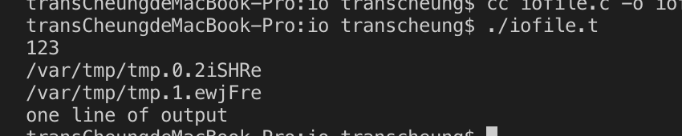

## 标准IO库
不仅仅是UNIX，很多其他操作系统都实现了标准IO库，所以这个库可以说是可移植性比较强的！深刻理解标准io库比较关键。<br>
### 流和FILE对象
unix，一切皆文件。在系统I/O中，所有的I/O函数都是围绕着文件描述符的。当打开一个文件时，即返回一个文件描述符。然后后续该文件描述符就用于后续的I/O操作。<br>
================华丽丽的分割线=================<br>
标准IO库，围绕着流进行（stream），当使用标准I/O库打开或创建一个文件时，我们已 **使一个流与一个文件相关联**。<br>
标准io文件流可以用于单字节或多字节（“宽”）字符集。流的定向决定了所读、写的字符是单字节还是多字节的。
**当一个流最初被创建时，没有定向**
* 未定向的流使用一个多字节io函数`（<wchar.h>)`，则将该流设置为宽定向
* 若使用一个单子节io函数，则将该流的定向设为字节定向<br>
两个函数，改变定向
```c
#include <stdio.h>
#include <wchar.h>
int fwide(FILE *fp,int mode);
// above可以用于设置流的定向。宽定向 返回正，字节定向，返回负，未定向返回0.
// mode 为负 将流指定为字节定向 正 宽定向 0 不设置 返回标识该流定向的值
int freopen();
```
### 标准输入、标准输出和标准错误
STDIN_FILENO、STDOUT_FILENO和STDERR_FILENO<br>
这三个流可以自动地被进程使用。<br>
预定义文件指针 stdin,stdout和stderr加以引用。这里需要注意一下⚠️ 文件指针，就是指向了文件的指针，只是对指针所指对象进行操作
<br>
### 缓冲
标准io库提供缓冲的目的是尽可能减少使用read和write调用的次数。<br>
它也对每个io流自动地进行缓冲管理，从而避免了应用程序需要考虑这一点所带来的麻烦。
#### 全缓冲
填满了io缓冲区后才进行io操作。对于驻留在磁盘上的文件通常是由标准io库实施全缓冲的。在一个流上执行第一次io操作时，相关标准io函数常调用malloc获得需使用的缓冲区（原来malloc用来获取需使用的缓冲区）<br>
flush冲一冲，说明标准io缓冲区的些操作。可调用一个fflush，冲一冲一个流。冲一冲，就是冲一冲，将数据冲到磁盘上。
#### 行缓冲
遇到换行符，标准ℹ️😯执行io操作。允许我们一次输出一个字符，但是只有写了一行之后才输出。终端常用行缓冲。<br>
**限制** 1. 收集每一行的缓冲区的长度是固定的，填满缓冲区，即使没有一个换行符，也会操作，冲一冲。<br>
2. 任何时候只要通过标准io库要求 A->一个不带缓冲的流 B->一个行缓冲的流（需要从内核请求需要数据）得到输入数据，那么就会冲洗所有行缓冲输出流。<br>
一个不带缓冲的流中输入，需要从内核获得数据。换句话说，不带缓冲输入？就要从内核获得数据。
#### 不带缓冲
标准io库不对字符进行缓冲存储。例如write()函数<br>
标准错误流是不带缓冲的stderr。<br>
不交互：全缓冲。<br>
标准错误：不能全缓冲（不带缓冲或行缓冲）常不带缓冲<br>
指向终端，行缓冲，否则全缓冲<br>
不喜欢默认？下面函数帮助你。<br>
```c
void setbuf(FILE *restrict fp,char *restrict buf);
int setbuf(FILE *restrict fp,char *restrict buf,int mode,size_t size);
```
这些函数一定要在流已被打开后调用。这里的每一个函数都要求有一个有效文件指针。有效文件指针！！！mode参数_IOFBF、_IOLBF、_IONBF<br>
```c
fflush(FILE *fp);//  此函数使该流所有未写的数据都传送至内核。NULL就表示所有输出流都被冲洗 成功返回0 出错 EOF
```
### 打开流
```c
#include <stdio.h>
FILE *fopen(const char *restrict pathname,const char *restrict type);
FILE *freopen(const char *restrict pathname,const char *restrict type,FILE *restrict fp);
FILE *fdopen(int fd,const char *type);
// 成功。返回文件指针。出错，返回null
```
一共三个函数打开一个标准I/O流。<br>
* fopen函数打开路径名为pathname的一个指定的文件。<br>
* freopen函数在一个指定的流上打开一个指定的文件，如若该流已经打开，则先关闭该流，然后再打开。若该流已经定向，则使用freopen清除该定向。（定向是指字节定向和宽定向。此函数一般用于将一个指定的文件打开为一个预定义的流；标准输入和标准输出或标准错误。
* fdpeon函数就是取一个已有的文件描述符（可能从open，dup，dup2，fcntl，pipe，socket、socketpair或accept函数得到此文件描述符。并使一个标准的io流与该描述符相结合。此函数常用于由创建管道和网络通信通道函数返回的描述符。因为这些特殊类型的文件不能用标准io函数fopen打开，所以用文件描述符打开。<br>
type有十五种类型 ISO C标准，十五种。<br>
<br>
b，就是用来区分文本文件和二进制文件。unix不区分这个！所有要和不要，没啥区别。在unix环境里。<br>
追加a不能用于创建该文件。<br>
追加肯定写到文件尾端处。多进程也能正确写到文件中。<br>
指定w或a类型创建一个新文件，无法说明该文件的访问权限位。（open，creat可以做到）。<br>
POSIX.1 要求使用如下权限位集来创建文件。<br>
S_IRUSR|S_IWUSR|S_IRGRP|S_IWGRP|S_IROTH|S_IWOTH<br>
```c
int fclose(FILE *fp);// 成功返回0.出错返回EOF
```
除非流引用终端设备，否则按系统默认，流被打开使全缓冲的。setbuf和setvbuf可以改。<br>
当文件被关闭，就会冲洗缓冲中的输出数据。缓冲区中的任何输入数据被丢弃。如果标准io库已经为该流自动分配一个缓冲区，则释放此缓冲区。<br>
当一个进程正常终止时🛑，直接调用exit函数，或从main函数返回，则所有带未写缓冲数据的标准io流都被冲洗，所有打开的标注io流都会被关闭。<br>
### 读写流
三种不同类型的非格式化io进行操作。
* 每次一个字符io。一次读或写一个字符，如果流是带缓冲的，则标准io函数处理所有缓冲。
* 每次一行io，如果想要一次读或写一行，用fgets和fputs。换行符🤚
* 直接io。fread和fwrite。每次io操作或写某种数量的对象，而每个对象具有指定的长度。这两个函数常用于从二进制文件中每次读或写一个结构。
```c
#include <stdio.h>
int getc(FILE *fp);
int fgetc(FILE *fp);
int getchar(void);
// 三个函数返回值，若成功，返回下一个字符；到达文件尾端或出错，返回EOF
```
所以，很聪明地加了两个函数来出来是否出错还是到达文件尾端<br>
```c
#include <stdio.h>
int ferror(FILE *fp);
int feof(FILE *fp);
// 真，返回非0，否，返回0；
void clearerr(FILE *fp);
```
从流读出数据以后，可以调用ungetc将字符再压回流中。<br>
```c
int ungetc(int c,FILE *fp); // 成功返回c，出错返回EOF
```
这个只是将它们写回标准io库的流缓冲区。并没有真正写入文件。<br>
输出函数
```c
#include <stdio.h>
int putc(int c,FILE *fp);
int fputc(int c,FILE *fp);
int putchar(int c); // 成功返回c，出错返回EOF
```
### 每次一行io
输出一行
```c
#include <stdio.h>
char *fgets(char *restrict buf,int n,FILE *restrict fp);
char *gets(char *buf); //  成功，返回buf，尾端或出错，返回NULL
```
输入一行
```c
#include <stdio.h>
char *fputs(constr char *restrict buf,FILE *restrict fp);
char *puts(const char *buf); //  成功，返回非负值，尾端或出错，返回EOF
```
原文再续就书接上一回。<br>
这次讲一下二进制i/o<br>
### 二进制io
一次一个字符 putc和getc，一次一行字puts和gets，这两个函数记住了，那么今天来看一下fread和fwrite这两个函数，都是对二进制操作进行一次读或者一次写的完整结构，没必要一次读个1或者0吧😄。<br>
```c
#include <stdio.h>
size_t fread(void *restrict ptr,size_t size,size_t nobj, FILE *restrict fp);
size_t fwrite(const void *restrict ptr,size_t size,size_t nobj,FILE *restrict fp);
// 返回值，读或写的对象数
```
怎么用呢？<br>
惊奇的发现，原来标准io处理的都是文件指针指向的内容，而系统io处理的都是文件描述符指向的内容。<br>
对于读的情况，判断是否到达文件末尾或文件错误，要调用ferror和feof两函数。对于写，返回少于nobj就会出错咯
<br>
在套接字一届会讲到相关的这个系统写，另一个系统读的情况，不同的系统有不同的系统对齐情况。所以需要分析准确对齐。<br>
### 定位流
就像定位系统io的文件偏移量一样（lseek），需要定位标准io流
* ftell和fseek函数。
* ftello和fseeko函数。SUS引入这两个函数，是文件偏移量用off_t数据类型代替长整型。<br>
* fgetpos和fsetpos。使用一个抽象数据类型fpos_t记录文件位置。这种数据类型可以根据需要定义为一个足够大的数，用以记录文件位置。<br>
需要移植到非unix系统上运行的应用程序应当使用fgetpos和fsetpos。<br>
```c
#include <stdio.h>
long ftell(FILE *fp); // 成功，返回当前文件位置指示，出错返回 -1L
int fseek(FILE *fp,long offset,int whence);// 成功返回0，出错，返回-1
void rewind(FILE *fp);
```
这里的fseek竟然返回的不是文件的尾端，而是返回0，那我们怎么知道是文件的尾端呢？fseek只是显式地为一个打开的文件设置偏移量。whence就是文件起始，当前文件位置，文件尾端（那种意思咯）。<br>
offset可以用ftell返回的，也可以用0；使用rewind可以将一个流设置到文件的起始位置<br>
ftello和ftell相同，fseeko和fseek相同。<br>
```c
#include <stdio.h>
int fgetpos(FILE* restrict fp,fpos_t *restrict pos);
int fsetpos(FILE *fp,const fpos_t *pos);
// 成功返回0，出错，返回非0
```
fgetpos将文件位置指示器的当前值存入由pos指向的对象中。(很明显，这里的pos要自己定义一下，然后跑了这函数，pos就知道文件指示器的当前值了)在以后调用fsetpos时，可以使用此值将流重新定位至该位置。<br>
### 格式化io
输出<br>
<br>
printf写到标准输出上，fprint写到指定流上，dprintf写至指定文件描述符，sprintf将格式化的字符送入数组buf中。<br>
注意一下，sprintf在该数组的尾端自动加一个null字节，但该字符不包括在返回值中。（容易溢出，又安全隐患），用哪个snprintf就不一样，返回小于缓冲区长度n的正值，就没有截断输出。返回编码出错，就是负值。<br>
2019 1 10🎂
虽然dprintf不处理文件指针，但我们仍然把它包括在处理格式化输出的函数中。使用dprintf不需要调用fdopen将文件描述符转换成文件指针？fdopen函数的转换，将文件描述符转换成文件指针！（fprintf需要）怎么说，都是对文件的指针操作，操作指针指向的文件<br>
格式说明控制其余参数如何编写，以后又如何显示。每个参数按照转换说明编写，转换说明 **以%开始。** <br>
一个转换说明有4个可选择的部分`%[flags][fldwidth][precision][lenmodifier]convtype`<br>
<br>
fldwidth说明最小字段宽度。（一个非负十进制数）<br>
precision说明整型转换后最少输出数字位数、浮点数转换后小数点的最小位数、字符串转换后的最大字节数。（.10|*）<br>
hh,h,l,ll,j,z,t,L=>(lenmodifier说明参数长度)<br>
转换说明中的转换类型<br>
<br>
输入<br>
<br>
若有一个字符不匹配，则停止后续处理<br>
`%[*][fildwidth][m][lenmodifier]convtype`<br>
可选择的星号（*）用于抑制转换。
<br>
### 实现细节
unix中，标准io库最终都要调用第三章的io例程。每个io流都有一个与其相关联的文件描述符，可以对一个流调用fileno以获得其描述符。<br>
```c
#include <stdio.h>
int fileno(FILE *fp);// 获得与该流相关的文件描述符
```
终端输出是行缓冲，定向到文件是全缓冲，标准错误是不带缓冲直接输出。<br>
```c
#include "../include/apue.h"
// 为3个标准流
// 以及一个与普通文件相关联的流
// 打印有关缓冲的状态信息
void pr_stdio(const char*,FILE *);
int is_unbuffered(FILE *);
int is_linebuffered(FILE*);
int buffer_size(FILE*);

int main(void){
    FILE *fp; // 定义一个文件指针
    fputs("enter any c\n",stdout); // 绑定到输出流
    if(getchar()==EOF) // 读取输入流
        err_sys("getchar error");
    fputs("on line to standard error\n",stderr);

    pr_stdio("stdin",stdin);
    pr_stdio("stdout",stdout);
    pr_stdio("stderr",stderr);

    if((fp = fopen("./file.txt","r"))==NULL) // 只读方式打开一个文件
        err_sys("fopen error");
    if(getc(fp) == EOF) // 读取文件，一直读到末尾
        err_sys("getc error");
    pr_stdio("./file.txt",fp);
    exit(0);
}

// 接下来看一下pr_stdio
void pr_stdio(const char *name,FILE *fp){
    printf("stream = %s,",name);
    if(is_unbuffered(fp)) // 请往下看is_unbuffered函数
        printf("unbuffered"); // 不带缓冲
    else if(is_linebuffered(fp))
        printf("line buffered"); // 行缓冲
    else
        printf("fully buffered"); // 全缓冲
    printf(",buffer size = %d\n",buffer_size(fp));
}

int is_unbuffered(FILE *fp){
    return (fp->_flags & __SNBF);
}
int is_linebuffered(FILE *fp){
    return (fp->_flags & __SLBF);
}
int buffer_size(FILE *fp){
    return (fp->_bf._size);
}
```
### 临时文件
创建临时文件<br>
```c
#include <stdio.h>
char *tmpnam(char *ptr);
// 返回指向唯一路径名的指针
FILE *tempfile(void);
// 成功，返回文件指针，出错，返回NULL
```
tmpnam，产生一个与现有文件名不同的一个有效路径名字符串。调用都会产生不同的路径名。(TMP_MAX次)<br>
注意，若ptr是null，则所产生的路径名存放在一个静态区中，指向该静态区的指针作为函数值返回。后续调用tmpnam，会重写该静态区。（意味着什么呢？调用函数多次，而且想保存路径名，则我们应该保存该路径名的副本，而不是指针的副本， **因为指针指向的静态区会被重写！！！**）<br>
若非null，则认为它应该是指向长度至少是L_tmpnam个字符的数组，所产生的路径名存放在该数组中，ptr也作为函数值返回。<br>
tmpfile创建一个临时二进制文件(wb+),关闭该文件或程序结束就会自动(auto)删除。<br>
```c
#include "../include/apue.h"


int main(void){
    // if(lseek(STDIN_FILENO,0,SEEK_CUR)==-1)  //   测试为-1而不是0
    //     printf("can't seek");
    // else
    //     printf("seek ok!");
    char *str = "123abc456";
    int i = 0;
    i = atoi(str);
    printf("%d\n",i);
    char name[L_tmpnam],line[MAXLINE];
    FILE *fp;
    printf("%s\n",tmpnam(NULL));
    tmpnam(name);
    printf("%s\n",name);

    if((fp=tmpfile())==NULL) // 创建一个临时文件
        err_sys("tmpfile error");
    fputs("one line of output\n",fp); // 写到临时文件
    rewind(fp); // read it back
    if(fgets(line,sizeof(line),fp)==NULL)
        err_sys("fgets error");
    fputs(line,stdout);
    exit(0);
}
```
效果
