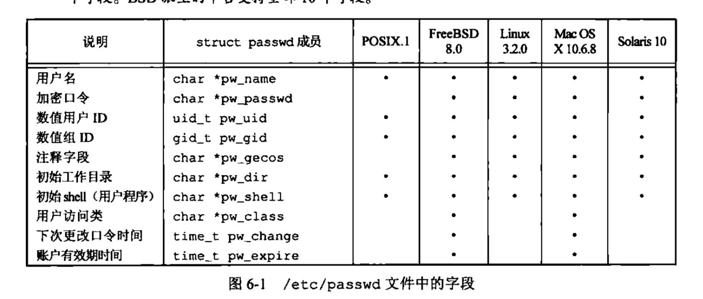
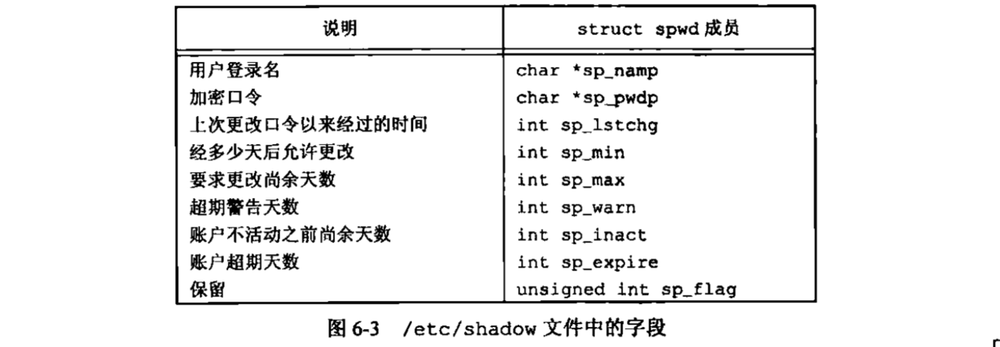
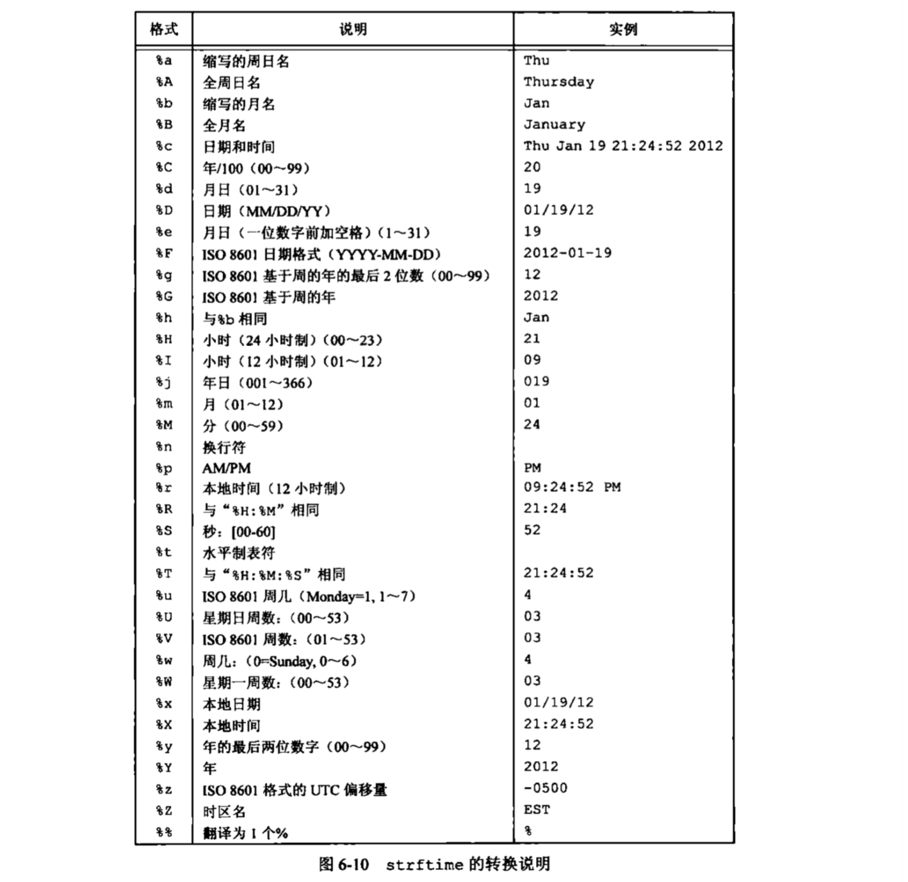

## 系统数据文件和信息
unix系统得正常运作需要使用大量与系统有关的数据文件，例如口令文件/etc/passwd和组文件/etc/group就是经常被多个程序频繁使用的两个文件。用户每次登陆unix系统，以及每次执行ls -l命令时都要使用口令文件。<br>
着重在于数据文件的可移植接口。<br>
系统标识函数、时间与日期函数。<br>
### 口令文件(用户数据库)
passwd结构<br>
<br>
`finger -p trans`可以的得到登陆的相关信息。<br>
获取口令文件项的函数，在给出用户登录名或数值用户ID(?)，这两个函数就能查看相关项<br>
```c
#include <pwd.h>

struct passwd *getpwuid(uid_t uid);
struct passwd *getpwnam(const char *name);
// 返回指针，出错，返回null
```
查看整个口令文件
```c
#include <pwd.h>

struct passwd *getpwent(void); // 返回口令文件中的下一个记录项
// 返回指针 null
void setpwent(void); // 反绕它所使用的文件 定位到文件开始处
void endpwent(void); // 使用getpwent查看完口令文件就要用这个关闭
```
```c
#include <grp.h>

struct group *getgrgid(gid_t gid);
struct group *getgrnam(const char *name);
// 返回指针，出错，返回null
```
```c
#include <grp.h>

struct group *getgrent(void); // 返回口令文件中的下一个记录项
// 返回指针 null
void setgrent(void); // 反绕它所使用的文件 定位到文件开始处
void endgrent(void); // 使用getpwent查看完口令文件就要用这个关闭
```


### 阴影口令
加密口令是经单向加密算法处理过的用户口令副本。<br>
/etc/shadow<br>
<br>
```c
#include <shadow.h>

struct spwd *getspnam(const char *name);
struct spwd *getspent(void);

void setspent(void);
void endspent(void);
```
OS没有阴影口令结构。<br>
```c
/***
 * 模拟一个shell用户登陆程序
 * ***/
#include <stdio.h>
#include <shadow.h>
#include <unistd.h>
#include <string.h>

int main(int argc, char **argv){
    char name[32] = "",*pwd;
    struct spwd *p;
    size_t namelen = 0;

    printf("enter username: ");
    fgets(name,32,stdin);
    pwd = getpass("enter pass:"); // 获得密码的输入key

    namelen = strlen(name);
    name[namelen-1] = 0;
    p = getspnam(name); // 访问shadow文件，获得加密的密文
    if(!p){
        fprintf(srderr,"error user or pass");
        return -1;
    }

    if(!strcmp(crypt(pwd,p->sp_pwdp),p->sp_pwdp)){
        printf("pass correct");
    }else{
        fprintf(stderr,"err user or pass");
    }
    return 0;
}
```
OS没有shadow文件<br>
### 日期与时间
```c
#include <time.h>
time_t time(time_t *t); 
```
从内核中获取一个日历时间(time_t，大整数)，参数传入null则可获取从1970-现在的秒数<br>
```c
struct tm *localtime(const time_t *timep);
```
将大整数转换为tm结构体
```c
struct tm {
    int tm_sec;         /* 秒，支持润秒 [0 - 60] */
    int tm_min;         /* 分钟 [0 - 59] */
    int tm_hour;        /* 小时 [0 - 23] */
    int tm_mday;        /* 一个月中的第几天 [1 - 31] */
    int tm_mon;         /* 月份 [0 - 11] */
    int tm_year;        /* 年，从 1900 开始 */
    int tm_wday;        /* 一星期中的第几天 [0 - 6] */
    int tm_yday;        /* 一年中的第几天 [0 - 365] */
    int tm_isdst;       /* 夏令时调整，基本不用，如果怕有影响可以设置为 0 */
};
```
便于程序员处理<br>
```c
struct tm *gmtime(const time_t *timep);
```
同localtime相同，转换成tm，但是将日历时间转换为UTC时间而不是本地时间<br>
```c
time_t mktime(struct tm *tm);
```
将tm转换成time_t
```c
size_t strftime(char *s,size_t max,const char *format,const struct tm *tm);
```
这个就是将tm转换成人类喜欢的时间格式。使用起来根printf(3)一样，可以通过格式化字符串来控制返回的字符串格式。<br>
参数列表：
* s：转换完成后的字符串保存在s所指向的空间；
* max：s 的最大长度
* format：格式化字符串；用法跟 printf(3) 的 format 是一样的，但是具体格式化参数是不同的，详细的内容请查阅 man 手册。
* tm：转换的数据来源；
strftime的format的转换说明符号<br>
<br>