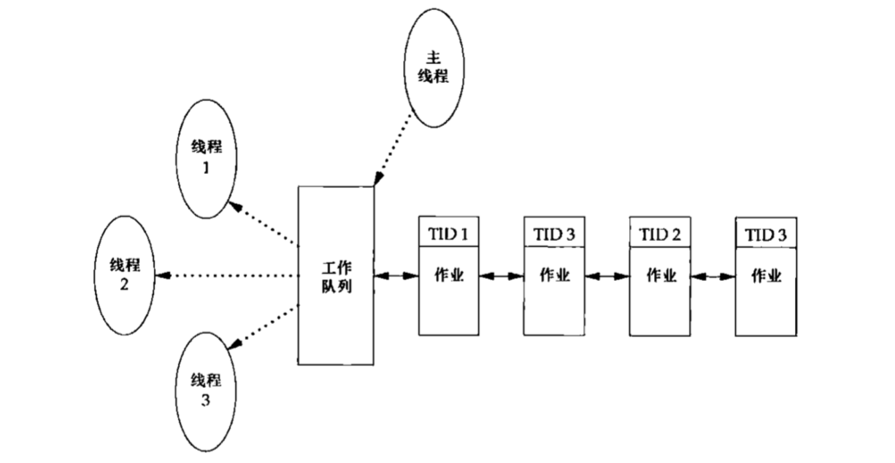

## 线程(终于到了线程)
本章节主要讲述线程的创建、取消、终止、同步等。后面的操作系统会主要讲线程死锁，调度等关系<br>
实际项目中多线程会用得比较多，因为多线程是 **先有标准后有实现的**，所以不会像多进程那样在不同的平台上有许多不同的情况<br>
#### pthread_t 线程就是一个正在运行的函数
C语言线程有很多标准，POSIX就是其中的一种，POSIX是一套标准，而不是一种实现。<br>
正因为POSIX是一套标准而不是实现，所以POSIX只是规定了 **pthread_t作为线程标识符**，并没有规定它必须是由什么类型组成的。所以在有的平台上他可能是int，有些平台他可能是struct(例如linux)，还有些平台可能是union，所以不要直接操作这个类型，而是要 **使用POSIX规定的各种线程函数来操作它。**<br>
###### 标准的风格
标准制定出来的很多东西都是一种风格，它为你提供一个数据类型，但是不会让你直接对这个类型进行操作，要通过它定义的一系列函数来实现对这个类型的操作，这样就在各个平台上实现统一的接口了，所以这样做才能让标准制定出来的东西具有比较好的可移植性。**玩游戏🎮就要遵循游戏规则，大家都一个标准才有玩的意思**<br>
##### ps ax -l 查看线程的情况 方便调试程序
```c
$ ps ax -L
PID   LWP TTY      STAT   TIME COMMAND
877   877 ?      Ss     0:06 dbus-daemon --system --fork
```
LWP是在linux可以查看得到的线程标识。在mac就不能用这个命令查看了。<br>
PID是进程号，而LWP是线程ID。PID相同，LWP不同，代表PID有不同的几个线程。<br>
线程ID只有在他所属的进程才有意义。<br>
### pthread_equal 比较线程标识符是否相同 pthread_self获取当前线程ID
```c
pthread_equal - compare thread IDs

#include <pthread.h>

int pthread_equal(pthread_t t1, pthread_t t2);

Compile and link with -pthread.

pthread_self - obtain ID of the calling thread

#include <pthread.h>

pthread_t pthread_self(void); // 获取当前线程ID

Compile and link with -pthread.
```
这两个函数一起使用的🌰，主线程可能把工作任务放在一个队列中，用线程ID来控制每个工作线程处理哪些作业。主线程把新的作业放到一个工作队列中，由3个工作线程组成的线程池从队列中移出作业。主线程不允许每个线程任意处理从队列顶端取出的作业，而是由主线程控制作业的分配，主线程会在每个待处理作业的结构中放置处理该作业的线程ID，每个工作线程只能移出标有自己线程ID的作业。<br>
<br>
### pthread_create 线程的创建
```c
pthread_create - create a new thread

#include <pthread.h>

int pthread_create(pthread_t *thread,const pthread_attr_t *attr,void*(*start_routine)(void*),void *arg);
Compile and link with -pthread
```
* thread: 由函数回填的线程标识符，它来唯一的标识产生的新线程，后面我们只要需要操作新线程就需要用到它
* attr: 线程属性，所有的属性都是使用NULL，也就是使用默认属性
* start_routine: 线程的执行函数；参数是void*，返回值是void*。座椅可以使用任何类型
* arg: 传递给start_routine的void*参数<br>
返回，成功返回0，失败返回errno。为什么会返回errno？因为一些平台error是全局变量，如果大家都使用同一个全局变量，那么多线程下就会出现竞争的可能，所以POSIX的线程函数一般在失败的时候都是直接返回errno的，这样就避免了某些平台errno的缺陷。<br>
**新线程和当前线程是两个兄弟线程，平等的，没有父子关系**<br>
新线程被创建后，两个线程的执行顺序是不确定的，由调度器决定。如果你希望哪个线程一定先执行，那么就在其他线程中使用类似sleep的函数，让它们等等。<br>
### pthread_exit 退出当前线程
```c
pthread_exit - terminate calling thread

#include <pthread.h>

void pthread_exit(void *retval);

Compile and link with -pthread.
```
在线程执行函数中调用，作用是退出当前线程，并将返回值通过retval参数返回给调用pthread_join函数(为线程收尸的函数)的地方，如果不需要返回值可以传入NULL<br>
看一个上面函数一起使用的🌰，其实好像并没有体现多线程的使用，而只是体现一个函数的调用<br>
```c
#include <stdio.h>
#include <stdlib.h>
#include <pthread.h>
#include <string.h>
#include <unistd.h>

static void *func(void *p){
    puts("Thread is working.");
    sleep(10);
    pthread_exit(NULL); // 返回
}

int main(){
    pthread_t tid;
    int err;
    puts("Begin!");

    err =  pthread_create(&tid,NULL,func,NULL);
    // 失败就设置errno
    err =  pthread_create(&tid,NULL,func,NULL);
    if(err){
        fprintf(stderr,"pthread create():%s\n",strerror(err));
        exit(1);
    }

    pthread_join(tid,NULL); // 最后要为线程收尸
    puts("End!");
    exit(0);
}
```
那么我们再来看一个🌰，这个🌰比较清晰的表现了主线程和新线程。
```c
#include <pthread.h>
#include <string.h>
#include "../include/apue.h"


pthread_t ntid;

void printids(const char *s){
    pid_t pid;
    pthread_t tid;

    pid = getpid(); // 获得当前进程id
    tid = pthread_self();
    printf("%s pid %lu tid %lu(0x%lx)\n",s,(unsigned long)pid,
    (unsigned long)tid,(unsigned long)tid);
}

void* thr_fn(void *arg){
    printids("new thread:"); // 这里打印新线程
    return((void *)0);
}

int main(void){
    int err;
    err = pthread_create(&ntid,NULL,thr_fn,NULL);
    if(err!=0)
        err_exit(err,"can't create thread");
    printids("main thread:");// 这里打印主线程
    sleep(1); // 不知道哪个先调用，就让主线程先睡觉
    exit(0);
}
```
新线程通过调用pthread_self函数获取自己的线程ID的，而不是从共享内存中读出的，或者从线程的启动例程以参数的形式接收到的。<br>
```c
main thread: pid 1328 tid 4474140096(0x10aadf5c0)
new thread: pid 1328 tid 123145419599872(0x700006fdb000)
```
返回的是16进制，像是一个地址，像是使用指向线程的数据结构的指针作为它的线程ID。<br>
### 线程终止pthread_exit pthread_join(线程之间谁都可以为别人收尸)
如果进程中的任意线程调用了exit、_Exit或者_exit，那么整个进程就睡终止。如果默认动作是终止进程，那么发送到线程的信号就会终止整个进程<br>
单个线程可以通过三种方式退出，因此可以在不终止整个进程的情况下，停止它的控制流
* 线程可以简单地从启动例程中返回，返回值是线程的退出码
* 线程可以被同一进程中的其他线程取消
* 线程可以屌用pthread_exit
```c
#include <pthread.h>
void pthread_exit(void *rval_ptr);
// rval_ptr参数是一个无类型指针，与传给启动例程的单个参数类似。进程中的其他线程也可以通过屌用pthread_join函数访问这个指针
int pthread_join(pthread_t thread,void **rval_ptr);
// 自动把线程置于分离状态，如果已分离，调用就会失败，返回EINVAL
```
调用线程将一直阻塞，直到指定的线程调用pthread_exit、从启动例程中返回或者被取消。如果线程简单地从它的启动例程返回，rval_ptr就包含返回码。如果线程被取消，由rval_ptr指定的内存单元就设置为PTHREAD_CANCELED。<br>
如果不感兴趣返回值，就设置为NULL。**pthread_join等待指定线程终止，但并不获取线程的终止状态**<br>
```c
#include "../include/apue.h"
#include <pthread.h>

void* thr_fn1(void *arg){
    printf("thread 1 returning\n");
    return ((void*)1);
}

void* thr_fn2(void *arg){
    printf("thread 2 exiting\n");
    pthread_exit((void *)2);
}

int main(void){
    int err;
    pthread_t tid1,tid2; // 创建两个线程
    void *tret;

    err = pthread_create(&tid1,NULL,thr_fn1,NULL);
    if(err!=0)
        err_exit(err,"can't create thread 1");
    err = pthread_create(&tid2,NULL,thr_fn2,NULL);
    if(err!=0)
        err_exit(err,"can't create thread 2");
    err = pthread_join(tid1,&tret);
    if(err != 0)
        err_exit(err,"can't join with thread 1");
    printf("thread 1 exit code %ld\n",(long)tret);
    // 线程结束返回码
    err = pthread_join(tid2,&tret);
    if(err != 0)
        err_exit(err,"can't join with thread 2");
    printf("thread 2 exit code %ld\n",(long)tret);
    exit(0);
}
```
获取线程终止返回码。无类型单数，可以传递包含复杂信息的结构的地址。这个复杂的信息结构所使用的内存在调用者完成调用后必须保持有效的。<br>
### pthread_cancel 取消同一个进程中的其他线程的线程
为什么要取消线程？当一个线程没有必要继续执行下去，又没法收尸，所以就需要先取消这个线程，然后再为它收尸。<br>
```c
pthread_cancel - send a cancellation request to a thread

#include <pthread.h>

int pthread_cancel(pthread_t thread);
Compile and link with -pthread
```
例如要用多线程遍历一棵很大的二叉树查找一个数据，其中某一个线程找到了要查找的数据，那么其他线程就没必要继续了，可以取消它们了。<br>
**⚠️pthread_cancel并不等待线程终止，它仅仅提出请求**，而线程收到这个请求也不会立即终止，而是要执行到 **取消点**才被取消。<br>
### 线程清理处理程序 pthread_cleanup_push and pthread_cleanup_pop
```c
pthread_cleanup_push,pthread_cleanup_pop - push and pop thread cancellation clean-up handlers

#include <pthread.h>

void pthread_cleanup_push(void (*routine)(void *),void *arg);
// routine是钩子函数 arg传递给钩子函数的参数
void pthread_cleanup_pop(int execute);
// execute 0不调用该钩子函数，1调用钩子函数
Compile and link with -pthread
```
就像在进程级别使用atexit函数挂钩子函数一样，线程可能也需要在结束时执行一些清理工作，这时候就需要派生线程处理程序上场了。钩子函数的调用顺序也是逆序的，也就是执行顺序与注册顺序相反。(类似入栈)<br>
⚠️这两个是带参的宏而不是函数，所以必须成对使用，而且必须先使用pthread_cleanup_push再使用pop。<br>
使用的🌰
```c
#include "../include/apue.h"
#include <pthread.h>

void cleanup(void *arg){
    printf("clean up:%s\n",(char *)arg);
}

void* thr_fn1(void *arg){
    printf("thread 1 returning\n");
    pthread_cleanup_push(cleanup,"thread 1 first handler");
    pthread_cleanup_push(cleanup,"thread 1 second handler");
    printf("thread 1 push complete");
    if(arg)
        return((void*)1);
    pthread_cleanup_pop(1);// 成对出现
    pthread_cleanup_pop(1);
    return ((void*)1);
}

void* thr_fn2(void *arg){
    printf("thread 2 start\n");
    pthread_cleanup_push(cleanup,"thread 2 first handler");
    pthread_cleanup_push(cleanup,"thread 2 second handler")
    printf("thread 2 push complete\n");
    if(arg)
        pthread_exit((void *)2);
    pthread_cleanup_pop(0);
    pthread_cleanup_pop(0);
    pthread_exit((void *)2);
}

int main(void){
    int err;
    pthread_t tid1,tid2; // 创建两个线程
    void *tret;

    err = pthread_create(&tid1,NULL,thr_fn1,NULL);
    if(err!=0)
        err_exit(err,"can't create thread 1");
    err = pthread_create(&tid2,NULL,thr_fn2,NULL);
    if(err!=0)
        err_exit(err,"can't create thread 2");
    err = pthread_join(tid1,&tret);
    if(err != 0)
        err_exit(err,"can't join with thread 1");
    printf("thread 1 exit code %ld\n",(long)tret);
    // 线程结束返回码
    err = pthread_join(tid2,&tret);
    if(err != 0)
        err_exit(err,"can't join with thread 2");
    printf("thread 2 exit code %ld\n",(long)tret);
    exit(0);
}
```
线程在退出时调用该退出函数。<br>

### pthread_detach分离线程，被分离的线程是不能被收尸的
```c
pthread_detach - detach a thread

#include <pthread.h>

int pthread_detach(pthread_t thread);

Compile and link with -pthread.
```

### 互斥量(pthread_mutex_t) 解决竞争
多线程就是为了充分利用硬件资源，使程序可以并发的运行，但是只要是并发就会遇到竞争问题。互斥量就是为了解决竞争的多种手段之一。<br>
💭考虑一个问题，如何让20个线程同时从一个文件中读取数字。累加1，然后再写入回去，并保证程序运行后，文件中的数值比运行程序之前大20.<br>
c文件
```c
#include "../include/apue.h"
#include <fcntl.h>
#include <pthread.h>
#include <string.h>

#define BUFSIZE 32

static pthread_mutex_t mutex = PTHREAD_MUTEX_INITIALIZER;
// 互斥量

static void *fun(void *p){
    int fd = -1;
    long long n = 0;
    char buf[BUFSIZE] = "";
    fd = open(p,O_RDWR|O_CREAT,0664);
    pthread_mutex_lock(&mutex); // 锁住互斥量
    printf("only one thread work!\n");
    read(fd,buf,BUFSIZE); // 读取
    lseek(fd,0,SEEK_SET); // 设置偏移量
    n = atoll(buf);
    snprintf(buf,BUFSIZE,"%lld\n",++n);// ➕1操作
    write(fd,buf,strlen(buf));

    close(fd);

    pthread_mutex_unlock(&mutex); // 解锁🔓资源
    pthread_exit(NULL); // 线程读完退出
}

int main(int argc,char **argv){
    int err;
    pthread_t tids[20];
    int i = 0;
    if(argc < 2){
        fprintf(stderr,"Usage %s<filename>\n",argv[0]);
        return -1;
    }
    for(i = 0;i<20;i++){
        err = pthread_create(&tids[i],NULL,fun,argv[1]);
        printf("pthread %d\n",i);
        if(err)
            err_exit(err,"create() error");
    }
    for(i = 0;i<20;i++){
        pthread_join(tids[i],NULL);
    }

    pthread_mutex_destroy(&mutex); //毁掉互斥量
    return 0;
}
```
运行结果，每次线程的执行顺序是不固定的，但是线程是必须执行的，除非调用的函数自动退出。每次读取临界区，也就是发生竞争的区域，每次读取都会将资源锁住，而锁住了，后面的线程也就等待前面的资源释放了再继续运行。只有等待前面的线程结束了，后面的线程才可以继续解锁资源继续执行。<br>
##### pthread_mutex_init初始化互斥量 phtread_mutex_t
初始化后必然要销毁，pthread_mutex_destory，否则会导致内存泄漏。<br>
#### 锁🔒mutex
```c
pthread_mutex_lock, pthread_mutex_trylock, pthread_mutex_unlock -  lock and unlock a mutex

#include <pthread.h>

int pthread_mutex_lock(pthread_mutex_t *mutex);
// 阻塞加锁，抢不到锁就等，死等，直到别人通过unlock再抢
int pthread_mutex_trylock(pthread_mutex_t *mutex);
// 尝试加锁，无论能否抢到锁都返回
int pthread_mutex_unlock(pthread_mutex_t *mutex);
```
**临界区是每个线程都要单独执行的，所以临界区的代码执行时间越短越好**<br>
📝 4个线程疯狂打印abcd持续五秒钟，但是要按照顺序打印，不能是乱序。<br>
```c
#include "../include/apue.h"
#include <pthread.h>
#include <string.h>

#define THRNUM 4
static pthread_mutex_t mut[THRNUM]; // 定义四个互斥量

static int next(int a){
    if(a+1 == THRNUM) // 0，1，2，3
        return 0;
    return a+1;
}

static void *thr_func(void *p){
    int n = (int)p;
    int ch = n+'a';
    while(1){
        pthread_mutex_lock(mut+n);// 锁住自己的互斥量
        write(1,&ch,1);
        pthread_mutex_unlock(mut+next(n));// 🔓解锁下一线程对应的互斥量
    }
    pthread_exit(NULL);
}

int main(){
    int i,err;
    pthread_t tid[THRNUM];
    for(i = 0;i<THRNUM;i++){
        pthread_mutex_init(mut+i,NULL);
        pthread_mutex_lock(mut+i);
        err = pthread_create(tid+i,NULL,thr_func,(void*)i);
        if(err){
            fprintf(stderr,"pthread_create():%s\n",strerror(err));
            exit(1);
        }
    }
    pthread_mutex_unlock(mut+1); // 解锁其中一个
    alarm(5);
    for(i = 0;i<THRNUM;i++){
        pthread_join(tid[i],NULL);
    }

    exit(0);
}
```
每个线程都在等待互斥量解锁，一旦解锁就执行，每个线程负责打印一个字母，每个字母都在ch的基础上➕1。<br>
**互斥量限制一段代码能否执行，而不是一个变量或一个资源。**<br>
### 条件变量 pthread_cond_t
令牌桶，通用多线程并发版令牌桶<br>
```c
#include "../include/apue.h"
#include <fcntl.h>
#include <pthread.h>

#include "mytbf.h"

// 每个令牌桶
struct mytbf_st{
    int cps; // 速率
    int burst; // 令牌上限
    int token; // 可用令牌数量
    int pos; // 当前令牌桶在job 数组中的下标
    pthread_mutex_t mut; // 用来保护令牌竞争的互斥量
    //下面时为了用于在令牌互斥量状态改变时发送通知而添加的
    pthread_cond_t cond;
};

// 所有的令牌桶
static struct mytbf_st *job[MYTBF_MAX];
// 用来保护令牌桶数组竞争的互斥量
static pthread_mutex_t mut_job = PTHREAD_MUTEX_INITIALIZER;
// 添加令牌的线程ID
static pthread_t tid;
// 初始化添加令牌的线程
static pthread_once_t init_once = PTHREAD_ONCE_INIT;

// 线程处理函数：负责定时向令牌桶中添加令牌
static void *thr_alrm(void *p){
    int i;
    while(1){
        pthread_mutex_lock(&mut_job);
        // 遍历所有桶
        for(i = 0;i<MYTBF_MAX;i++){
            // 为可用的桶添加令牌
            if(job[i]!=NULL){
                pthread_mutex_lock(&job[i]->mut);
                job[i]->token += job[i]->cps;
                // 控制桶中可用的令牌不能超过上限
                if(job[i]->token > job[i]->burst)
                    job[i]->token = job[i]->burst;
                // 令牌添加完毕之后，通知多有等待使用令牌的线程准备抢🔒
                pthread_cond_broadcast(&job[i] ->cond);
                // 广播📢通知
                pthread_mutex_unlock(&job[i]->mut);
            }
        }
        pthread_mutex_unlock(&mut_job);// 解锁互斥量
        sleep(1);// 等待一秒钟后继续添加令牌
    }
    pthread_exit(NULL);
}
static void module_unload(void){
    int i;
    pthread_cancel(tid);
    // 终止某线程
    pthread_join(tid,NULL);
    // 等待线程终止
    pthread_mutex_lock(&mut_job);
    // 锁住互斥量
    for(i = 0;i<MYTBF_MAX;i++){// 遍历所有的桶
        if(job[i]!=NULL){
            // 销毁所有的桶
            pthread_mutex_destroy(&job[i]->mut);
            // 通知销毁
            pthread_cond_destory(&job[i]->cond);
            free(job[i]);
        }
    }
    pthread_mutex_unlock(&mut_job);
    pthread_mutex_destroy(&mut_job);
}

static void module_load(void){
    int err;
    // 创建线程
    err = pthread_create(&tid,NULL,thr_alrm,NULL);
    if(err){
        fprintf(stderr,"pthread_create():%s\n",strerror(err));
        exit(1);
    }
    atexit(module_unload);
}
/***
 * 为了不破坏调用者对令牌桶操作的原子性
 * 在该函数内加锁可能导致死锁
 * 所以该函数内部无法加锁
 * 必须在调用该函数之前先加锁
 * ***/
static int get_free_pos_unlocked(void){
    int i;
    for(i = 0;i<MYTBF_MAX;i++){
        if(job[i]==NULL)
            return i;
    }
    return -1;
}

mytbf_t *mytbf_init(int cps,int burst){
    struct mytbf_st *me;
    int pos;

    pthread_once(&init_once,module_load);
// 保证module_load只调用一次 向令牌桶添加令牌的线程只需要启动一次
    me = malloc(sizeof(*me));
    if(NULL == me)
        return NULL;
    
    me->cps = cps;
    me->burst = burst;
    me->token = 0;

    pthread_mutex_init(&me->mut,NULL);
    // 初始化conditation
    pthread_cond_init(&me->cond,NULL);

    pthread_mutex_lock(&mut_job);
// 先加锁🔒
    pos = get_free_pos_unlocked();
    if(pos<0){
        // 带锁跳转，先解锁再跳转
        pthread_mutex_unlock(&mut_job);
        free(me);
        return NULL;
    }

    me->pos = pos;

    job[pos] = me;

    pthread_mutex_unlock(&mut_job);

    return me;
}

static inline int min(int a,int b){
    return (a<b)?a:b;
}

int mytbf_fetchtoken(mytbf_t *ptr,int size){
    int n;
    struct mytbf_st *me = ptr;

    if(size < 0)
        return -EINVAL;
    pthread_mutex_lock(&me->mut);
    // 令牌数量不足，就等待令牌被添加进来
    // 这里出现了忙等 所以可以更改一个使用条件变量的方式
    // 
    while(me->token <= 0){
        /***
         * 原子化的解锁，出让调度器再抢🔒以便工作或等待
         * 他会等待其他线程发送通知再唤醒
         * 放在循环中是因为可能同时有多个线程再使用同一个桶
         * 被唤醒时未必就能拿得到令牌，所以直到拿到令牌再跳出去
         * ***/
        // pthread_cond_wait(&me->cond,&me->mut); ⬅️改用了这个就变成上面说得原子操作
        pthread_mutex_unlock(&me->mut);
        sched_yield();// 作用是出让调度器
        pthread_mutex_lock(&me->mut);
    }

    n = min(me->token,size);
    me->token -= n;

    pthread_mutex_unlock(&me->mut);

    return n;
}

// 令牌用不完就归还，不能浪费
int mytbf_returntoken(mytbf_t *ptr,int size){
    struct mytbf_st *me = ptr;
    if(size < 0)
        return -EINVAL;
    pthread_mutex_lock(&me->mut);

    me->token += size;
    if(me->token > me->burst)
        me->token = me->burst;
    /***
     * 令牌归还完毕，通知其他正在等待令牌的线程📢，准备抢🔒
     * 先广播📢再解锁，收到通知的线程就会等锁释放就去抢
     * 先解锁，就会有线程先抢到锁，再广播说抢到了锁
     * ***/
    pthread_cond_broadcast(&me->cond);
    pthread_mutex_unlock(&me->mut);

    return size;
}

void mytbf_destory(mytbf_t *ptr){
    struct mytbf_st *me = ptr;

    pthread_mutex_lock(&mut_job);
    job[me->pos] = NULL;
    pthread_mutex_unlock(&mut_job);

    pthread_mutex_destroy(&me->mut);
    pthread_cond_destory(&me->cond);
    free(ptr);
}
```
头文件
```c
#ifndef MYTBF_H_
#define MYTBF_H_

#define MYTBF_MAX 1024
typedef void mytbf_t;

mytbf_t *mytbf_init(int cps,int burst);

int mytbf_fetchtoken(mytbf_t *,int);

int mytbf_returntoken(mytbf_t *,int);

void mytbf_destory(mytbf_t*);

#endif
```
支持1024个令牌桶，多线程可以同时操作1024个桶来获得不同的速率，每个桶的速率是固定的。<br>
1024个桶保存在一个数组中，所以每次访问桶的时候都需要对它进行加锁，避免多个线程同时访问发生竞争。同样每个桶也允许使用多个线程同时访问，所以每个桶中也需要一个互斥量来保证处理令牌的时候不会发生竞争。<br>
⚠️临界区的跳转，通常在跳转之前需要解锁🔓，不然容易发生死锁。常见的跳转有continue，break，return，goto，longjmp等等以及函数调用。反正就是变了个地方跑，就是跳转<br>
##### 当某个函数包含临界区，也就是需要加锁再进入临界区 _unlocked作为后缀
从程序布局来看该函数无法加锁，根据POSIX标准约定，这种函数的命名规则是必须以_unlocked作为后缀，所以，在这样的函数时在调用之前一定要先加锁。**有_unlocked，需要加锁没加锁，所以需要先加锁在调用。**<br>
#### sched_yield 和 pthread_once
```c
sched_yield - yield the processor
#include <sched.h>
int sched_yield(void);
```
出让调度器，在用户态无法模拟实现，会让当前线程所占用的调度器给其他线程使用，而不必等待时间片耗尽才切换调度器，暂时可以 **理解成一个很短暂的sleep**。一般用于在使用一个资源时需要同时获得多把锁但是却没法一次性获得全部的锁的场景下，只要有任何一把锁没抢到，就立即释放自己已抢到的锁，并让出自己的调度器让其他线程有机会获得被自己释放的锁🔒。当再次调度到自己时再重新抢🔒锁，直到能一次性抢到所有的锁时再进入临界区。**避免了死锁**<br>
```c
pthread_once - dynamic package initialization

#include <pthread.h>

int pthread_once(pthread_once_t *once_control,void(*init_routine)(void));

pthread_once_t once_control = PTHREAD_ONCE_INIT;
```
**pthread_once函数一般用于动态单次初始化，它能保证init_routine函数仅被调用一次**<br>
**pthread_once_t 只能使用PTHREAD_ONCE_INIT宏初始化**，没有提供其他初始化方式。
向令牌桶添加令牌的线程只需要启动一次，而初始化令牌桶的函数却在开启每个令牌桶的时候都需要调用。为了初始化令牌桶的函数中仅启动一次添加令牌的线程，采用pthread_once函数来创建线程就可以了。 **这样之后在第一次调用mytbf_init()函数的时候会启动新线程添加令牌，而后续再调用mytbf_init()的时候就不会启动添加令牌的线程了。**<br>
##### 通知法和查询法
后面加上了pthread_cond就是通知法，通知线程，有资源了，来抢来抢。<br>
也即是条件变量pthread_cond
### pthread_cond 让线程以无竞争的形式等待某个条件的发生
当条件发生时通知等待的线程醒来去做某件事情。<br>
两种方式
* 仅通知一个线程醒来，如果有多个线程等待，也不一定谁会被唤醒
* 所有都唤醒，来抢就好
```c
pthread_cond_destroy, pthread_cond_init - destroy and initialize condition variables

#include <pthread.h>

int pthread_cond_destroy(pthread_cond_t *cond);
int pthread_cond_init(pthread_cond_t *restrict cond,const pthread_condattr_t *restrict attr);
pthread_cond_t cond = PTHREAD_COND_INITIALIZER;
```
与互斥量，这样条件变量也会有初始化。一种是使用pthread_cond_init()一种时使用PTHREAD_COND_INITIALIZER宏。
**条件变量使用完是要销毁的，否则内存泄漏**
```c
pthread_cond_broadcast,pthread_cond_signal - broadcast or signal a condition

#include <pthread.h>
int pthread_cond_broadcast(pthread_cond_t *cond);
int pthread_cond_signal(pthread_cond_t *cond);
```
这两个函数就是条件变量的关键操作，pthread_cond_signal函数用于唤醒当前多个等待线程中的任何一个。跟signal没有任何关系<br>
broadcast就是广播📢，惊死人不知道一样，唤醒所有等待的线程。<br>
但是上面唤醒的是什么线程呢？
```c
pthread_cond_timedwait,pthread_cond_wait - wait on a condition
#include <pthread.h>
int pthread_cond_timewait(pthread_cond_t *restrict cond,pthread_mutex_t *restrict mutex, const struct timespec *restrict abstime);
// 增加超时功能，超时之后，无论能否拿到锁都返回，就是尝试等
int pthread_cond_wait(pthread_cond_t *restrict cond,pthread_mutex_t *restirct mutex);
// 再临界区外阻塞等待某一个条件发生变化，直到有一个通知到来打断它的等待。死等
```
唤醒的是_wait()的等待条件满足的线程。当一个线程做某件事情之前发现条件不满足就会用这两函数进入等待状态，如果满足了，就会用上面的唤醒来唤醒线程继续工作。<br>
等待⌛️常常放在一个循环里，就像令牌桶的🌰，因为可能有多个线程都在等待条件满足，当前的线程被唤醒时，不一定执行条件满足，可能先被唤醒的线程发现条件满足就去工作了，等轮到当前线程调度的时候，条件可能又不满足了，所以条件不满足就继续等。<br>
互斥量与条件变量实现疯狂打印abcd，5秒钟。<br>
```c
#include "../include/apue.h"
#include <pthread.h>
#include <string.h>

#define THRNUM 4
static pthread_mutex_t mut = PTHREAD_MUTEX_INITIALIZER;
static pthread_cond_t cond_num = PTHREAD_COND_INITIALIZER;
static int num = 0;
static int next(int a){
    if(a+1 == THRNUM) // 0，1，2，3
        return 0;
    return a+1;
}

static void *thr_func(void *p){
    int n = (int)p;
    int ch = n+'a';
    while(1){
        pthread_mutex_lock(&mut);// 先抢🔒锁住自己的互斥量
        while(num!=n){ // 抢到锁，发现不是自己执行，就释放锁，等，出让调度器
            pthread_cond_wait(&cond_num,&mut);
        }
        write(1,&ch,1);
        num = next(num);
        // 打印完就送锁
        pthread_cond_broadcast(&cond_num);
        pthread_mutex_unlock(&mut);// 🔓解锁下一线程对应的互斥量
    }
    pthread_exit(NULL);
}

int main(){
    int i,err;
    pthread_t tid[THRNUM];
    for(i = 0;i<THRNUM;i++){
        // 直接执行四个线程，不需要先锁住
        err = pthread_create(tid+i,NULL,thr_func,(void*)i);
        if(err){
            fprintf(stderr,"pthread_create():%s\n",strerror(err));
            exit(1);
        }
    }
    alarm(5);
    for(i = 0;i<THRNUM;i++){
        pthread_join(tid[i],NULL);
    }
    pthread_cond_destroy(&cond_num);

    exit(0);
}
```
### 一个进程最多能创建多少个线程？ulimit 查看栈空间大小 阴影区剩余空间的大小/栈空间的大小 == 线程数量
* PID耗尽，内核最小的执行单元其实是线程，实际上线程消耗的也是PID
* C程序地址空间布局时的阴影区域被栈空间占满了。<br>
