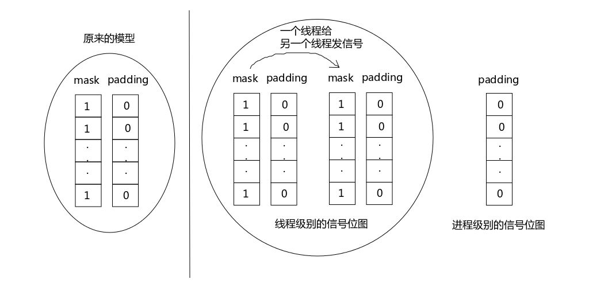

## 线程控制
同一个进程中，如何保持线程之间数据的私有性。线程之间如何交互。是这一章讨论的重点。<br>
#### 线程属性使用pthread_attr_t表示
```c
#include "../include/apue.h"
#include <pthread.h>
#include <string.h>

static void *func(void *p){
    puts("Thread is working.\n");
    pthread_exit(NULL);
}

int main(){
    pthread_t tid;
    int err,i;
    pthread_attr_t attr;

    pthread_attr_init(&attr);
    // 修改每个线程的栈大小
    pthread_attr_setstacksize(&attr,1024*1024);

    for(i = 0;;i++){
        err = pthread_create(&tid,&attr,func,NULL); // attr就是修改后的线程属性
        if(err){
            err_sys("pthread_create()");
            break;
        }
    }
    printf("i = %d\n",i);
    pthread_attr_destroy(&attr);
    exit(0);
}
```
通过修改线程的属性修改了为每个线程分配的栈空间大小，这样创建出来的线程数量与默认的不一样。 **pthread_attr_init**函数初始化，用完之后， **pthread_attr_destory**函数销毁。<br>
线程的属性不仅可以设定线程的栈空间大小，还可以创建分离的线程等等。<br>

#### 互斥量属性 pthread_mutexattr_t
与线程属性一样，使用之前要初始化(pthread_mutexattr_init)，使用完毕要销毁。<br>
```c
pthread_mutexattr_getpshared,pthread_mutexattr_setpshared - get and set the process - shared attribute

#include <pthread.h>

int pthread_mutexattr_getpshared(const pthread_mutexattr_t * restrict attr, int *restrict pshared);

int pthread_mutexattr_setpshared(pthread_mutexattr_t *attr,int pshared);
```
p是指process，这两个函数的作用就是设定线程的属性是否可以跨进程使用。跨进程使用？
```c
clone,__clone2 - create a child process
#define __GNU_SOURCE
#include <sched.h>
int clone(int(*fn)(void *),void *child_stack,int flags,void *arg,.../* pid_t *ptid, struct user_desc *tls, pid_t *ctid */);
```
clone进程的flags如果设置了CLONE_FILES则父子进程共享文件描述符表，正常情况文件描述符表是线程之间共享的，因为多线程是运行在同一个进程的地址空间之内的。<br>
虽然clone函数描述的是创建子进程，但是实际上，如果将flags属性设置得极端分离(各种资源都独享)，相当于创建了一个独立的子进程。<br>
如果flags属性设置得极端近似(各种资源都共享)，则相当于创建了兄弟线程。所以 **对于内核来讲并没有进程这个概念，只有线程的概念**。你创建出来的到底是进程还是线程，并不影响内核进行调度。<br>
> 如果需要创建一个"东西"与当前的线程既共享一部分资源，又独占一部分资源，就可以使用clone函数创建一个既不是线程也不是进程的东西。就是什么鬼东西，就是一个能让内核调度起来，按照程序调度的东西。<br>
因而进程其实也就只是一个基本的调度资源的概念。能调度多少资源，不能调度多少资源，也是程序说了算。<br>
四种互斥量，不同的互斥量在会遇到不同的情况时效果是不同的。<br>

互斥量类型|没有解锁时重新加锁🔒|不占用时解锁🔓|在已解锁时解锁🔓
|--|--|--|--|
PTHREAD_MUTEX_NORMAL(常规)|死锁🔒|未定义|未定义
PTHREAD_MUTEX_ERRORCHECK(检错❌)|返回错误🙅|返回错误🙅‍♂️|返回错误🙅
PTHREAD_MUTEX|RECURSIVE(递归)|允许✅|返回错误❌|返回错误❌
PTHREAD_MUTEX_DEFAULT(默认，我们平时使用的就是这个)|未定义|未定义|未定义

* 没有解锁时重新加锁🔒:当前mutex已lock，再次lock
* 不占用时:他人锁定🔒由你解锁的情况
* 在已解锁时解锁:当前mutex已unlock，再次unlcok的情况

#### 线程特定数据(线程私有数据) 支持多线程并发做的改进
是存储和查询某个特定线程相关数据的一种机制。每个线程可以访问它自己单独的数据副本，而不需要担心与其他线程的同步访问问题。其实为了保存自己的数据，用key来保存，防止线程访问<br>
errno最初时全局，现在变成宏定义了。<br>
#### 线程的取消 pthread_cancel只是提出取消请求，并不能强制取消线程
允许取消两种
* 异步cancel: 内核的操作方式
* 推迟cancel: 推迟到取消点再响应取消操作。取消点就是一个函数，收到取消请求时取消点的代码不会执行<br>
所以在POSIX定义中是存在取消点的。当请求遇到了取消点就可以取消线程<br>
* pthread_setcancelstate，修改线程的可取消状态，可以将线程设置为可取消的或不可取消的
* pthread_setcanceltype，用来修改取消类型，可以选择异步还是推迟
* pthread_textcancel，人为方式取消点。

#### 线程和信号📶
每个线程都持有一个mask位图和一个padding位图。每个进程都持有一个padding位图而没有mask位图
<br>
从内核态回到用户态之前，当前线程先用自己的mask位图与进程级别的padding按位与&运算，如果有信号就处理；然后再用自己的mask位图与自己的padding位图按位与运算，再处理相应的信号。<br>
所以其实是哪个线程被调度，就由哪个线程相应进程级别的信号。<br>
所以进程之间可以相互发信号<br>
```c
pthread_kill - send a signal to a thread

#include <signal.h>

int pthread_kill(pthread_t thread, int sig);

Compile and link with -pthread.
```
pthread_kill就是在线程阶段发信号，thread表示给哪个线程发信号，sig发送哪个信号<br>
sigwait设置等待信号出现。<br>
```c
#include <signal.h>
int sigwait(const sigset_t *restrict set,int *restrict signop);
```
以下是主线程进行，其他线程在等待信号的例子。<br>
```c
#include "../include/apue.h"
#include <pthread.h>

int quitflag;
sigset_t mask;

pthread_mutex_t lock = PTHREAD_MUTEX_INITIALIZER;
pthread_cond_t waitloc = PTHREAD_COND_INITIALIZER;
// 初始化互斥量的条件

void *thr_fn(void *arg){
    int err,sig;
    for(;;){
        err = sigwait(&mask,&sig); // 等待一个或多个信号的到来 并初始化sig
        if(err!=0)
            err_exit(err,"sigwait failed");
            switch (sig)// 判断信号的类型
            {
                case SIGINT:
                    printf("\ninterrupt\n");
                    /* code */
                    break;
                case SIGQUIT:
                    pthread_mutex_lock(&lock);
                    quitflag = 1;
                    pthread_mutex_unlock(&lock);
                    pthread_cond_signal(&waitloc);
                    // 发布得到信号的条件，通知其他线程
                    return (0);
                default:
                    printf("unexpected signal %d\n",sig);
                    exit(1);
            }
    }
}

int main(void){
    int err;
    sigset_t oldmask;
    pthread_t tid;

    sigemptyset(&mask); // 添加信号集
    sigaddset(&mask,SIGINT);
    sigaddset(&mask,SIGQUIT);

    if((err = pthread_sigmask(SIG_BLOCK,&mask,&oldmask))!=0) // 修改mask
        err_exit(err,"SIG_BLOCK error");
    
    err = pthread_create(&tid,NULL,thr_fn,0);

    if(err!=0)
        err_exit(err,"can't create thread");

    pthread_mutex_lock(&lock);
    while(quitflag == 0)
        pthread_cond_wait(&waitloc,&lock); // 线程等待条件变量
    pthread_mutex_unlock(&lock);

    quitflag = 0;

    if(sigprocmask(SIG_SETMASK,&oldmask,NULL)<0) // sigpromask 重置mask位图q
        err_sys("SIG_SETMASK error");
    exit(0);
}
```
pthread_sigmask人为干预线程级别的mask位图。类似sigsetmask函数<br>

#### 线程和fork
写时拷贝

#### 线程和IO
pread和pwrite。


