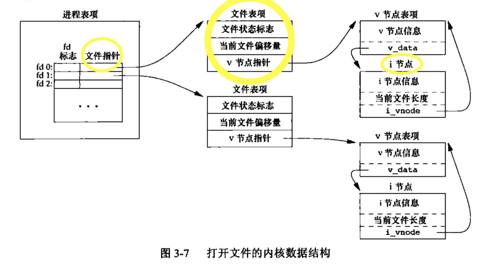
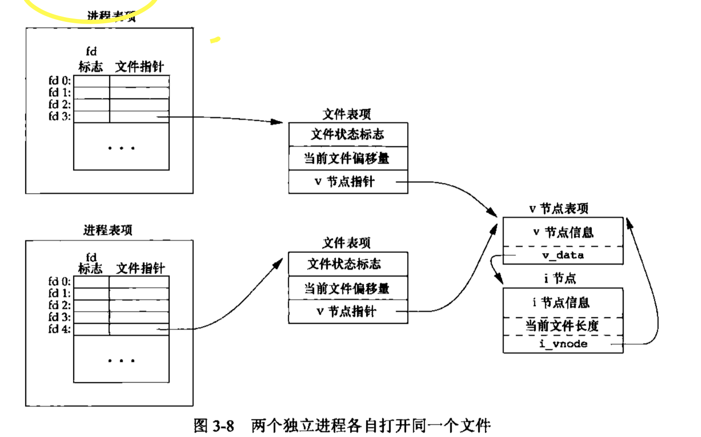

## UNIX标准及实现
UNIX编程环境的标准化已经取得了很大进展。主要标准ISO C、POSIX和Single UNIX Specification。

## 文件IO
可用的文件I/O函数--打开文件、读文件、写文件等。五个函数`open,read,write,lseek`以及`close`。此章节描述的函数经常被称为 **不带缓冲的I/O(unbuffered I/O)** 与第五章说明的标准I/O函数相对照。<br>
不带缓冲啥意思❓<br>
指的是每个read和write都调用内核中的一个系统调用。他们不是ISO C的组成部分，但是是POSIX.1和Single UNIX Specification的组成部分。<br>
涉及多个进程间共享资源， **原子操作**的概念就变得非常重要。<br>
多个进程共享文件将成为本章进一步讨论的细节。<br>
`dup,fcntl,sync,fsync和ioctl函数`<br>
### 文件描述符
对于内核而言，所有打开的文件都通过文件描述符引用。文件描述符是一个非负整数。<br>
**过程:** <br>
1.打开一个现有的文件或创建一个新文件时--->内核向进程返回一个文件描述符。<br>
2. 读写一个文件--->使用open或creat返回的文件描述符标识该文件--->将其作为参数传送给read或write。<br>
文件描述符 0<=>进程的标准输入关联   1<=>标准输出关联  2<=>标准错误关联<br>
POSIX.1替换成 STDIN_FILENO  STDOUT_FILENO  STDERR_FILENO 定义在`<unistd.h>`。<br>
文件描述符的变化范围是0～OPEN_MAX-1。OPEN_MAX进程打开文件的最大数目。<br>
### open和opent
打开或创建一个文件
```c
/**
 * 返回文件描述符，否则-1
*/
#include <fcntl.h>
int open(const char * path,int oflag,.../* mode_t mode */);
int open_t(int fd,const char *path,int oflag,.../*mode_t*/);
```
...代表余下的参数的数量及其类型是可变的。<br>
path是要打开或创建文件的名字。oflag参数可用来说明词函数的多个选项。用下列一个或多个常量进行“|”运算构成oflag参数
`O_RONLY O_WRONLY O_RDWR O_EXEC O_SEARCH O_APPEND O_CLOEXEC O_CREAT O_DIRECTORY O_EXCL O_NOCTTY O_NOFOLLOW O_NONBLOCK O_SYNC O_TRUNC O_TTY_INIT O_DSYNC O_RSYNC`<br>
fd参数把open和openat函数区分开：<br>
* a. 绝对路径，fd被忽略，openat相当于open函数。<br>
* b. 相对路径，fd指出了相对路径名在文件系统中的开始地址。fd参数是通过打开相对路径所在的目录来获取的。<br>
* c. 相对路径，fd参数具有特殊值AT_FDCWD。这种情况下，路径名在当前工作目录中获取，openat函数在操作上与open函数类似。<br>
#### 文件名和路径名截断
太长了，就被截断。fpathconf或pathconf来查询目录具体支持何种行为，到底是截断过长的文件名还是返回出错。<br>

### 函数creat
```c
#include <fcntl.h>
int creat(const char *path,mode_t mode);
// 返回值，成功则返回只写打开的文件描述符。出错，返回-1
```
=> `open（path,O_WRONLY|O_CREAT|O_TRUNC,mode)`
### 函数close
关闭一个文件
```c
#include <unistd.h>
int close(int fd); // 成功返回0 否则返回-1
```
关闭一个文件时还会释放该进程加在该文件上的所有记录锁。<br>
当一个进程终止时，内核自动关闭它所有的打开文件。<br>
### 函数lseek
每个打开文件都有一个与其相关联的 **”当前文件偏移量 offset“**。通常是一个非负整数，用以度量从文件开始处计算的字节数。从文件开始处计算的字节数！<br>
通常，读和写操作都从当前文件偏移量处开始，并使偏移量增加所读写的字节数。除非制定`O_APPEND`选项，否则该偏移量设置为0。<br>
调用一个lseek显式地为一个打开文件设置偏移量。
```c
#include <unistd.h>
off_t lseek(int fd,off_t offset,int whence);// 返回值：若成功，返回新的文件偏移量，出错，返回-1；
```
whence->SEEK_SET 将该文件的偏移量设置为距文件开始处offset个字节。<br>
whence->SEEK_CUR 将该文件的偏移量设置为其当前值➕offset，offset可为正或负。<br>
whence->SEEK_END 将该文件的偏移量设置为文件长度➕offset，offset可正可负。<br>
如果文件描述符指向的是一个管道、FIFO或网络套接字，则lseek返回-1，并将errono设置为ESPIPE。<br>
**与-1比较。**<br>
lseek仅将当前的文件偏移量记录在内核中，并不引起任何I/O操作。-> 该偏移量用于下一个读或写操作。<br>
文件空洞并不要求在磁盘上占用存储区（未写过的字节都被读为0）。当定位超出文件尾端之后写时，对于新写的数据需要分配磁盘块。所以这里会 **有一个空隙**，源文件尾端和新开始写的位置之间部分不需要分配磁盘块。<br>
creat之后就会有一个fd的文件描述符，然后可以在这个文件描述符进行write操作->lseek进行文件偏移量尾端的查找->最后往文件偏移量offset之后继续写文件。<br>
`ls -l file.hole`检查其大小。 `od -c file.hole` 观察实际内容。<br>
```c
#include "../include/apue.h"
#include <fcntl.h>
/***
 * od -c file.txt
 * 用来观察实际内容
 * ls -l file.txt 检查其大小
 * read 当从管道或FIFO读时，如若管道包含的字节少于所需的数量，那么read将只返回实际可用的字节数
 * 当一信号造成中断，而已经读了部分数据量时。
 * ***/
char buf1[] = "abcdefghij";
char buf2[] = "ABCDEFGHIJ";
int main(void){
    int fd;
    int n;
    char buf[4096];
    if((fd = creat("file.hole",FILE_MODE))<0)
        err_sys("creat error");
    if(write(fd,buf1,10)!=10)
        err_sys("buf1 write error");
    
    if(lseek(fd,1010,SEEK_SET)==-1)
        err_sys("lseek error");
    
    if(write(fd,buf2,10)!=10)
        err_sys("buf2 write error");
    printf("%d",fd);
    exit(0);
}
```
### 函数read
```c
#include <unistd.h>
ssize_t read(int fd,void *buf,size_t nbytes);
// 读到的字节数，若已到文件尾返回0；出错返回-1
```
* 读普通文件，到了文件尾端，100？只有30 就返回30，下一次调用到0
* 读终端设备，一次最多读一行
* 网络读，网络中的缓冲机制可能造成返回值小于所要求读的字节数
* 管道或FIFO，管道字节少于所需数量，返回实际可用的。
* 信号造成中断，读了部分数据，重新从文件的当前偏移量出开始读，返回，偏移量增加实际读到的字节数。
### 函数write
```c
#include <unistd.h>
ssize_t write(int fd,const void* buf,size_t nbytes); // 返回已写的字节数，错就-1
```
出错原因，磁盘写满或超过给定进程的文件长度限制<br>
每次写都在文件偏移量结尾处写。写完返回增加的实际字节数。<br>
### 文件共享
unix系统支持在不同的进程件共享打开文件<br>
3中数据结构表示打开文件<br>
1. 每个进程在进程表都有一个记录项，记录项中包含一张打开文件描述符表，可将其视为一个矢量，每个描述符占用一项。<br>
* 文件描述符标志(close_on_exec)
* 指向一个文件表项的指针。
2. 内核为所有打开文件维持一张文件表。每个文件表项包含
* 文件状态标志（读写添加同步和非阻塞等）
* 当前文件偏移量
* 指向该文件v节点表项的指针
3. 每个打开文件（或设备）都有一个v节点(v-node)结构。v节点包含了文件类型和对此文件进行各种操作函数的指针。<br>
对于大多数文件，v结点还包含了该文件的i节点(i-node，索引节点)。i节点包含文件所有者，文件长度，指向文件实际数据块在磁盘上的所在位置的指针等。<br>
⚠️ 打开文件描述符表可存放在用户空间（作为一个独立的对应于每个进程的结构，可以换出），而非进程表中（<---这里还有一个进程表)<br>
<br>
write->返回当前文件偏移量->lseek定位到尾端，文件偏移量与i节点同步。
若是两个独立进程各自打开了同一文件<br>
<br>
每个进程都获得自己的文件表项，可以使每个进程都有它自己的对该文件的当前偏移量。<br>
fork后父子进程各自的每个打开文件描述符共享同一个文件表项。<br>
**文件描述符标志** 只用于一个进程的一个描述符<br>
**文件状态标志** 应用于指向该给定文件表项的任何进程中的所有描述符<br>
### 原子操作
多个进程写同一个文件时，可能产生预想不到的结果。因此需要理解原子操作。<br>
#### 追加
open O_APPEND选项<br>
两个进程切换读写会产生冲突，因为未及时改变偏移量。❓ 问题出现在 **先定位文件尾端，然后写**❕ 所以解决就是将其作为一个原子操作，一个函数来写。因此，出现了 **O_APPEND** 标志，这样做使得内核在每次写操作之前，都将进程的当前偏移量设置到该文件的尾端处。于是就不掉用lseek<br>
#### 函数pread和pwrite
原子性地定位并执行I/O。
```c
ssize_t pread(int fd,void *buf,size_t nbytes,off_t offset);
// 读到字节数，若已到文件尾返回0，出错返回-1
ssize_t pwrite(int fd,const void *buf,size_t nbytes,off_t offset);
// 返回已写字节数，出错返回-1
```
#### 创建一个文件
检查文件是否存在和创建文件这两个操作是作为一个原子操作执行的。<br>
open与creat<br>
一步执行所有步骤--->原子操作。<br>
### 函数dup和dup2
用来复制一个现有的文件描述符
```c
#include <unistd.h>
int dup(int fd);
int dup2(int fd,int fd2);
// 返回新的文件描述符，出错返回-1
```
对于dup2。可以用fd2参数指定新描述符的值。如果fd2已经打开就将其关闭。如若fd等于fd2，则dup2返回fd2，而不关闭它。否则，也就是说，fd2未打开，fd2的FD_CLOEXEC文件描述符标志就被清除。fd2在进程中的调用exec时是打开的状态<br>
每个文件描述符都有它自己的一套文件描述符标志。<br>
dup2是一个原子操作，包括close和fcntl两函数<br>
### 函数sync，fsync和fdatasync 返回0 或 -1
内核先把数据复制到缓冲区，然后排入队列，晚些时候写入磁盘(延迟写).<br>
所以需要这三个函数
```c
#include <unistd.h>
int fsync(int fd); // 对指定的fd起作用，并且等待写擦盘操作结束 会更新文件的属性
int fdatasync(int fd); // 类似fsync，🥚只影响文件的数据部分。
void sync(void); // 不等待写操作结束，只是将所有修改过的块缓冲区排入写队列
```
### 函数fcntl
该函数可以改变已经打开文件的属性<br>
```c
#include <fcntl.h>
int fcntl(int fd,int cmd,.../*int arg*/);
// 返回值 依赖cmd 出错 -1
```
记录锁时，第三个参数则是指向一个结构的指针。<br>
返回的cmd很多！可以一一对照。<br>
fcntl五种功能：<br>
* 复制一个已有的描述符(cmd=F_DUPFD / F_DUPFD_CLOEXEC)
* 获取/设置文件描述符标志(cmd = F_GETFD / F_SETFD)
* 获取/设置文件状态标志(cmd=F_GETFL / F_SETFL)
* 获取/设置异步I/O所有权(cmd=F_GETOWN / F_SETOWN)
* 获取/设置记录锁(cmd=F_GETLK、F_SETLK/F_SETLKW)
O_SYNC等待写完成（数据和属性）
在修改文件描述符或文件状态标志时必须谨慎。先要获得现在的标志值->然后按照期望修改它->设置新标志值。不能只执行F_SETFD / F_SETFL命令，这样会关闭以前设置的标志位。<br>
unix系统中，write只是将数据排入队列，实际些操作可能在以后某个时刻进行。数据库系统需要使用O_SYNC。

### 函数ioctl
ioctl一直是I/O操作的杂物箱（已被替代）
```c
#include <unistd.h>
#include <sys/ioctl.h>

int ioctl(int fd,int request,...); // ❌-1 成功，返回其他值
```

### /dev/fd
系统都会由/dev/fd的命令，目录项是0，1，2等文件。打开文件/dev/fd/n等效于复制描述符n。
```c
int fd = open("dev/fd/0",mode);
// 等价 dup(0)
```
```
filter file2 | cat file1 /dev/fd/0 file3 | lpr
```
0-> 标准输入
#### 课后习题
1. 是的。不带缓冲区I/O：read,write,open...
带缓冲区：fgets,fread,fwrite...
```c
ssize_t write(int filedes, const void *buff, size_t nbytes)
size_t fwrite(const void *ptr, size_t size, size_t nobj, FILE *fp)
```
这里的buff和ptr都是指应用程序自己使用的buffer，实际上当需要堆文件进行写操作时，都会先写到内核所设的缓冲存储器。 **如果缓存未满，则并不将其排入输出队列，直到写满** 延迟写！！！
不带缓冲，直接对内核读写，会很麻烦。而带缓存就会处理了很多问题。<br>
2. 写一个正确的dup2，不调用fcntl，处理出错
```c
int dup2(int fd,int fd2){
    
}
```